# [](https://github.com/AndyObtiva/glimmer) Glimmer DSL for LibUI 0.5.18
## Prerequisite-Free Ruby Desktop Development GUI Library
[](http://badge.fury.io/rb/glimmer-dsl-libui)
[](https://gitter.im/AndyObtiva/glimmer?utm_source=badge&utm_medium=badge&utm_campaign=pr-badge&utm_content=badge)

[**(Fukuoka Ruby Award Competition 2022 Special Award Winner)**](http://www.digitalfukuoka.jp/topics/187?locale=ja)

[Glimmer](https://github.com/AndyObtiva/glimmer) DSL for [LibUI](https://github.com/kojix2/LibUI) is a prerequisite-free [MRI Ruby](https://www.ruby-lang.org) desktop development GUI (Graphical User Interface) library. No need to pre-install any prerequisites. Just install the [gem](https://rubygems.org/gems/glimmer-dsl-libui) and have platform-independent native GUI that just works!

Mac | Windows | Linux
----|---------|------
 |  | 

[LibUI](https://github.com/kojix2/LibUI) is a thin [Ruby](https://www.ruby-lang.org/en/) wrapper around [libui](https://github.com/andlabs/libui), a relatively new C GUI library that renders native controls on every platform (similar to [SWT](https://www.eclipse.org/swt/), but without the heavy weight of the [Java Virtual Machine](https://www.java.com/en/)).

The main trade-off in using [Glimmer DSL for LibUI](https://rubygems.org/gems/glimmer-dsl-libui) as opposed to [Glimmer DSL for SWT](https://github.com/AndyObtiva/glimmer-dsl-swt) or [Glimmer DSL for Tk](https://github.com/AndyObtiva/glimmer-dsl-tk) is the fact that [SWT](https://www.eclipse.org/swt/) and [Tk](https://www.tcl.tk/) are more mature than mid-alpha [libui](https://github.com/andlabs/libui) as GUI toolkits. Still, if there is only a need to build a small simple application, [Glimmer DSL for LibUI](https://rubygems.org/gems/glimmer-dsl-libui) could be a good convenient choice due to having zero prerequisites beyond the dependencies included in the [Ruby gem](https://rubygems.org/gems/glimmer-dsl-libui). Also, just like [Glimmer DSL for Tk](https://github.com/AndyObtiva/glimmer-dsl-tk), its apps start instantly and have a small memory footprint. [LibUI](https://github.com/kojix2/LibUI) is a promising new GUI toolkit that might prove quite worthy in the future.

[Glimmer DSL for LibUI](https://rubygems.org/gems/glimmer-dsl-libui) aims to provide a DSL similar to the [Glimmer DSL for SWT](https://github.com/AndyObtiva/glimmer-dsl-swt) to enable more productive desktop development in Ruby with:
- [Declarative DSL syntax](#glimmer-gui-dsl-concepts) that visually maps to the GUI control hierarchy
- [Convention over configuration](#smart-defaults-and-conventions) via smart defaults and automation of low-level details
- Requiring the [least amount of syntax](#glimmer-gui-dsl-concepts) possible to build GUI
- [Custom Control](#custom-keywords) support
- [Bidirectional/Unidirectional Data-Binding](#data-binding) to declaratively wire and automatically synchronize GUI Views with Models
- [Far Future Plan] Scaffolding for new custom controls, apps, and gems
- [Far Future Plan] Native-Executable packaging on Mac, Windows, and Linux.

Hello, World!

```ruby
require 'glimmer-dsl-libui'

include Glimmer

window('hello world').show
```

Mac | Windows | Linux
----|---------|------
 |  | 

Basic Table Progress Bar

```ruby
require 'glimmer-dsl-libui'

include Glimmer

data = [
  ['task 1', 0],
  ['task 2', 15],
  ['task 3', 100],
  ['task 4', 75],
  ['task 5', -1],
]

window('Task Progress', 300, 200) {
  vertical_box {
    table {
      text_column('Task')
      progress_bar_column('Progress')

      cell_rows data # implicit data-binding
    }
    
    button('Mark All As Done') {
      stretchy false
      
      on_clicked do
        data.each_with_index do |row_data, row|
          data[row][1] = 100 # automatically updates table due to implicit data-binding
        end
      end
    }
  }
}.show
```

Mac | Windows | Linux
----|---------|------
 |  | 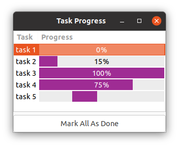

Form Table

```ruby
require 'glimmer-dsl-libui'

class FormTable
  Contact = Struct.new(:name, :email, :phone, :city, :state)
  
  include Glimmer
  
  attr_accessor :contacts, :name, :email, :phone, :city, :state, :filter_value
  
  def initialize
    @contacts = [
      Contact.new('Lisa Sky', 'lisa@sky.com', '720-523-4329', 'Denver', 'CO'),
      Contact.new('Jordan Biggins', 'jordan@biggins.com', '617-528-5399', 'Boston', 'MA'),
      Contact.new('Mary Glass', 'mary@glass.com', '847-589-8788', 'Elk Grove Village', 'IL'),
      Contact.new('Darren McGrath', 'darren@mcgrath.com', '206-539-9283', 'Seattle', 'WA'),
      Contact.new('Melody Hanheimer', 'melody@hanheimer.com', '213-493-8274', 'Los Angeles', 'CA'),
    ]
  end
  
  def launch
    window('Contacts', 600, 600) {
      margined true
      
      vertical_box {
        form {
          stretchy false
          
          entry {
            label 'Name'
            text <=> [self, :name] # bidirectional data-binding between entry text and self.name
          }
          
          entry {
            label 'Email'
            text <=> [self, :email]
          }
          
          entry {
            label 'Phone'
            text <=> [self, :phone]
          }
          
          entry {
            label 'City'
            text <=> [self, :city]
          }
          
          entry {
            label 'State'
            text <=> [self, :state]
          }
        }
        
        button('Save Contact') {
          stretchy false
          
          on_clicked do
            new_row = [name, email, phone, city, state]
            if new_row.map(&:to_s).include?('')
              msg_box_error('Validation Error!', 'All fields are required! Please make sure to enter a value for all fields.')
            else
              @contacts << Contact.new(*new_row) # automatically inserts a row into the table due to explicit data-binding
              @unfiltered_contacts = @contacts.dup
              self.name = '' # automatically clears name entry through explicit data-binding
              self.email = ''
              self.phone = ''
              self.city = ''
              self.state = ''
            end
          end
        }
        
        search_entry {
          stretchy false
          # bidirectional data-binding of text to self.filter_value with after_write option
          text <=> [self, :filter_value,
            after_write: ->(filter_value) { # execute after write to self.filter_value
              @unfiltered_contacts ||= @contacts.dup
              # Unfilter first to remove any previous filters
              self.contacts = @unfiltered_contacts.dup # affects table indirectly through explicit data-binding
              # Now, apply filter if entered
              unless filter_value.empty?
                self.contacts = @contacts.filter do |contact| # affects table indirectly through explicit data-binding
                  contact.members.any? do |attribute|
                    contact[attribute].to_s.downcase.include?(filter_value.downcase)
                  end
                end
              end
            }
          ]
        }
        
        table {
          text_column('Name')
          text_column('Email')
          text_column('Phone')
          text_column('City')
          text_column('State')
    
          editable true
          cell_rows <=> [self, :contacts] # explicit data-binding to self.contacts Modal Array, auto-inferring model attribute names from underscored table column names by convention
          
          on_changed do |row, type, row_data|
            puts "Row #{row} #{type}: #{row_data}"
            $stdout.flush # for Windows
          end
          
          on_edited do |row, row_data| # only fires on direct table editing
            puts "Row #{row} edited: #{row_data}"
            $stdout.flush # for Windows
          end
        }
      }
    }.show
  end
end

FormTable.new.launch
```

Mac | Windows | Linux
----|---------|------
 |  | 

Area Gallery

```ruby
require 'glimmer-dsl-libui'

include Glimmer

window('Area Gallery', 400, 400) {
  area {
    path { # declarative stable path (explicit path syntax for multiple shapes sharing attributes)
      square(0, 0, 100)
      square(100, 100, 400)
      
      fill r: 102, g: 102, b: 204
    }
    
    path { # declarative stable path (explicit path syntax for multiple shapes sharing attributes)
      rectangle(0, 100, 100, 400)
      rectangle(100, 0, 400, 100)
      
      # linear gradient (has x0, y0, x1, y1, and stops)
      fill x0: 10, y0: 10, x1: 350, y1: 350, stops: [{pos: 0.25, r: 204, g: 102, b: 204}, {pos: 0.75, r: 102, g: 102, b: 204}]
    }
    
    polygon(100, 100, 100, 400, 400, 100, 400, 400) { # declarative stable path (implicit path syntax for a single shape nested directly under area)
      fill r: 202, g: 102, b: 104, a: 0.5
      stroke r: 0, g: 0, b: 0
    }
    
    polybezier(0, 0,
               200, 100, 100, 200, 400, 100,
               300, 100, 100, 300, 100, 400,
               100, 300, 300, 100, 400, 400) { # declarative stable path (implicit path syntax for a single shape nested directly under area)
      fill r: 202, g: 102, b: 204, a: 0.5
      stroke r: 0, g: 0, b: 0, thickness: 2, dashes: [50, 10, 10, 10], dash_phase: -50.0
    }
    
    polyline(100, 100, 400, 100, 100, 400, 400, 400, 0, 0) { # declarative stable path (implicit path syntax for a single shape nested directly under area)
      stroke r: 0, g: 0, b: 0, thickness: 2
    }
    
    arc(404, 216, 190, 90, 90, false) { # declarative stable path (implicit path syntax for a single shape nested directly under area)
      # radial gradient (has an outer_radius in addition to x0, y0, x1, y1, and stops)
      fill outer_radius: 90, x0: 0, y0: 0, x1: 500, y1: 500, stops: [{pos: 0.25, r: 102, g: 102, b: 204, a: 0.5}, {pos: 0.75, r: 204, g: 102, b: 204}]
      stroke r: 0, g: 0, b: 0, thickness: 2, dashes: [50, 10, 10, 10], dash_phase: -50.0
    }
    
    circle(200, 200, 90) { # declarative stable path (implicit path syntax for a single shape nested directly under area)
      fill r: 202, g: 102, b: 204, a: 0.5
      stroke r: 0, g: 0, b: 0, thickness: 2
    }
    
    text(161, 40, 100) { # declarative stable text
      string('Area Gallery') {
        font family: 'Arial', size: (OS.mac? ? 14 : 11)
        color :black
      }
    }
    
    on_mouse_event do |area_mouse_event|
      p area_mouse_event
    end
    
    on_mouse_moved do |area_mouse_event|
      puts 'moved'
    end
    
    on_mouse_down do |area_mouse_event|
      puts 'mouse down'
    end
    
    on_mouse_up do |area_mouse_event|
      puts 'mouse up'
    end
    
    on_mouse_drag_started do |area_mouse_event|
      puts 'drag started'
    end
    
    on_mouse_dragged do |area_mouse_event|
      puts 'dragged'
    end
    
    on_mouse_dropped do |area_mouse_event|
      puts 'dropped'
    end
    
    on_mouse_entered do
      puts 'entered'
    end
    
    on_mouse_exited do
      puts 'exited'
    end
    
    on_key_event do |area_key_event|
      p area_key_event
    end
    
    on_key_up do |area_key_event|
      puts 'key up'
    end
    
    on_key_down do |area_key_event|
      puts 'key down'
    end
  }
}.show
```

Mac | Windows | Linux
----|---------|------
 | 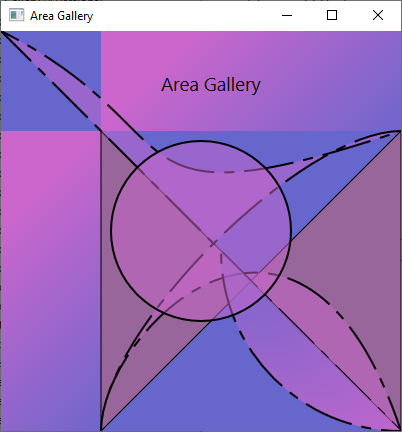 | 

[Check Out Many More Examples Over Here!](#examples)

[](https://github.com/AndyObtiva/glimmer-dsl-libui#snake)

[](https://github.com/AndyObtiva/glimmer-dsl-libui#color-the-circles)

[](https://github.com/AndyObtiva/glimmer-dsl-libui#tetris)

NOTE: [Glimmer DSL for LibUI](https://rubygems.org/gems/glimmer-dsl-libui) is 100% feature-complete with regards to covering the C [libui](https://github.com/andlabs/libui) library API and in beta mode (though the C [libui](https://github.com/andlabs/libui) is still mid-alpha, which is why [Glimmer DSL for LibUI](https://rubygems.org/gems/glimmer-dsl-libui) cannot be declared v1.0.0 yet). Please help make better by contributing, adopting for small or low risk projects, and providing feedback. The more feedback and issues you report the better.

**[Glimmer](https://rubygems.org/gems/glimmer) DSL Comparison Table:**
DSL | Platforms | Native? | Vector Graphics? | Pros | Cons | Prereqs
----|-----------|---------|------------------|------|------|--------
[Glimmer DSL for SWT (JRuby Desktop Development GUI Framework)](https://github.com/AndyObtiva/glimmer-dsl-swt) | Mac / Windows / Linux | Yes | Yes (Canvas Shape DSL) | Very Mature / Scaffolding / Native Executable Packaging / Custom Widgets | Slow JRuby Startup Time / Heavy Memory Footprint | Java / JRuby
[Glimmer DSL for Opal (Pure Ruby Web GUI and Auto-Webifier of Desktop Apps)](https://github.com/AndyObtiva/glimmer-dsl-opal) | All Web Browsers | No | Yes (Canvas Shape DSL) | Simpler than All JavaScript Technologies / Auto-Webify Desktop Apps | Setup Process / Only Rails 5 Support for Now | Rails
[Glimmer DSL for LibUI (Prerequisite-Free Ruby Desktop Development GUI Library)](https://github.com/AndyObtiva/glimmer-dsl-libui) | Mac / Windows / Linux | Yes | Yes (Area API) | Fast Startup Time / Light Memory Footprint | LibUI is an Incomplete Mid-Alpha Only | None Other Than MRI Ruby
[Glimmer DSL for Tk (Ruby Tk Desktop Development GUI Library)](https://github.com/AndyObtiva/glimmer-dsl-tk) | Mac / Windows / Linux | Some Native-Themed Widgets (Not Truly Native) | Yes (Canvas) | Fast Startup Time / Light Memory Footprint | Complicated Setup / Widgets Do Not Look Truly Native, Espcially on Linux | ActiveTcl / MRI Ruby
[Glimmer DSL for GTK (Ruby-GNOME Desktop Development GUI Library)](https://github.com/AndyObtiva/glimmer-dsl-gtk) | Mac / Windows / Linux | Only on Linux | Yes (Cairo) | Complete Access to GNOME Features on Linux (Forte) | Not Native on Mac and Windows | None Other Than MRI Ruby on Linux / Brew Packages on Mac / MSYS & MING Toolchains on Windows / MRI Ruby
[Glimmer DSL for FX (FOX Toolkit Ruby Desktop Development GUI Library)](https://github.com/AndyObtiva/glimmer-dsl-fx) | Mac (requires XQuartz) / Windows / Linux | No | Yes (Canvas) | No Prerequisites on Windows (Forte Since Binaries Are Included Out of The Box) | Widgets Do Not Look Native / Mac Usage Obtrusively Starts XQuartz | None Other Than MRI Ruby on Windows / XQuarts on Mac / MRI Ruby
[Glimmer DSL for JFX (JRuby JavaFX Desktop Development GUI Library)](https://github.com/AndyObtiva/glimmer-dsl-jfx) | Mac / Windows / Linux | No | Yes (javafx.scene.shape and javafx.scene.canvas) | Rich in Custom Widgets | Slow JRuby Startup Time / Heavy Memory Footprint / Widgets Do Not Look Native | Java / JRuby / JavaFX SDK
[Glimmer DSL for Swing (JRuby Swing Desktop Development GUI Library)](https://github.com/AndyObtiva/glimmer-dsl-swing) | Mac / Windows / Linux | No | Yes (Java2D) | Very Mature | Slow JRuby Startup Time / Heavy Memory Footprint / Widgets Do Not Look Native | Java / JRuby
[Glimmer DSL for XML (& HTML)](https://github.com/AndyObtiva/glimmer-dsl-xml) | All Web Browsers | No | Yes (SVG) | Programmable / Lighter-weight Than Actual XML | XML Elements Are Sometimes Not Well-Named (Many Types of Input) | None
[Glimmer DSL for CSS](https://github.com/AndyObtiva/glimmer-dsl-css) | All Web Browsers | No | Yes | Programmable | CSS Is Over-Engineered / Too Many Features To Learn | None

## Table of Contents

- [Glimmer DSL for LibUI](#)
  - [Glimmer GUI DSL Concepts](#glimmer-gui-dsl-concepts)
  - [Usage](#usage)
  - [Girb (Glimmer IRB)](#girb-glimmer-irb)
  - [API](#api)
    - [Supported Keywords](#supported-keywords)
    - [Common Control Properties](#common-control-properties)
    - [Common Control Operations](#common-control-operations)
    - [LibUI Operations](#libui-operations)
    - [Extra Dialogs](#extra-dialogs)
    - [Extra Operations](#extra-operations)
    - [Table API](#table-api)
    - [Area API](#area-api)
      - [Scrolling Area](#scrolling-area)
      - [Area Path Shapes](#area-path-shapes)
      - [Area Text](#area-text)
      - [Area Image](#area-image)
      - [Colors](#colors)
      - [Area Draw Params](#area-draw-params)
      - [Area Listeners](#area-listeners)
      - [Area Methods/Attributes](#area-methods-attributes)
      - [Area Transform Matrix](#area-transform-matrix)
      - [Area Animation](#area-animation)
    - [Smart Defaults and Conventions](#smart-defaults-and-conventions)
    - [Custom Keywords](#custom-keywords)
    - [Observer Pattern](#observer-pattern)
    - [Data-Binding](#data-binding)
      - [Bidirectional (Two-Way) Data-Binding](#bidirectional-two-way-data-binding)
        - [Table Data-Binding](#table-data-binding)
      - [Unidirectional (One-Way) Data-Binding](#unidirectional-one-way-data-binding)
      - [Data-Binding API](#data-binding-api)
      - [Data-Binding Gotchas](#data-binding-gotchas)
    - [API Gotchas](#api-gotchas)
    - [Original API](#original-api)
  - [Packaging](#packaging)
  - [Glimmer Style Guide](#glimmer-style-guide)
  - [Examples](#examples)
    - [Basic Examples](#basic-examples)
      - [Basic Window](#basic-window)
      - [Basic Child Window](#basic-child-window)
      - [Basic Button](#basic-button)
      - [Basic Entry](#basic-entry)
      - [Simple Notepad](#simple-notepad)
      - [Font Button](#font-button)
      - [Color Button](#color-button)
      - [Date Time Picker](#date-time-picker)
      - [Form](#form)
      - [Basic Table](#basic-table)
      - [Basic Table Image](#basic-table-image)
      - [Basic Table Image Text](#basic-table-image-text)
      - [Basic Table Button](#basic-table-button)
      - [Basic Table Checkbox](#basic-table-checkbox)
      - [Basic Table Checkbox Text](#basic-table-checkbox-text)
      - [Basic Table Progress Bar](#basic-table-progress-bar)
      - [Basic Table Color](#basic-table-color)
      - [Basic Area](#basic-area)
      - [Basic Scrolling Area](#basic-scrolling-area)
      - [Basic Image](#basic-image)
      - [Basic Transform](#basic-transform)
      - [Basic Draw Text](#basic-draw-text)
      - [Basic Code Area](#basic-code-area)
    - [Advanced Examples](#advanced-examples)
      - [Area Gallery](#area-gallery)
      - [Button Counter](#button-counter)
      - [Color The Circles](#color-the-circles)
      - [Control Gallery](#control-gallery)
      - [CPU Percentage](#cpu-percentage)
      - [Custom Draw Text](#custom-draw-text)
      - [Dynamic Area](#dynamic-area)
      - [Editable Column Table](#editable-column-table)
      - [Editable Table](#editable-table)
      - [Form Table](#form-table)
      - [Paginated Refined Table](#paginated-refined-table)
      - [Grid](#grid)
      - [Histogram](#histogram)
      - [Login](#login)
      - [Method-Based Custom Controls](#method-based-custom-controls)
      - [Class-Based Custom Controls](#class-based-custom-controls)
      - [Area-Based Custom Controls](#area-based-custom-controls)
      - [Midi Player](#midi-player)
      - [Snake](#snake)
      - [Tetris](#tetris)
      - [Tic Tac Toe](#tic-tac-toe)
      - [Timer](#timer)
      - [Shape Coloring](#shape-coloring)
  - [Applications](#applications)
    - [Manga2PDF](#manga2pdf)
    - [Befunge98 GUI](#befunge98-gui)
    - [i3off Gtk Ruby](#i3off-gtk-ruby)
    - [Chess](#chess)
    - [RubyCrumbler](#rubycrumbler)
    - [Rubio-Radio](#rubio-radio)
  - [Process](#process)
  - [Resources](#resources)
  - [Help](#help)
    - [Issues](#issues)
    - [Chat](#chat)
  - [Planned Features and Feature Suggestions](#planned-features-and-feature-suggestions)
  - [Change Log](#change-log)
  - [Contributing](#contributing)
  - [Contributors](#contributors)
  - [License](#license)

## Glimmer GUI DSL Concepts

The Glimmer GUI DSL provides object-oriented declarative hierarchical syntax for [LibUI](https://github.com/kojix2/LibUI) that:
- Supports smart defaults (e.g. automatic `on_closing` listener that quits `window`)
- Automates wiring of controls (e.g. `button` is automatically set as child of `window`)
- Hides lower-level details (e.g. `LibUI.main` loop is started automatically when triggering `show` on `window`)
- Nests controls according to their visual hierarchy
- Requires the minimum amount of syntax needed to describe an app's GUI

The Glimmer GUI DSL follows these simple concepts in mapping from [LibUI](https://github.com/kojix2/LibUI) syntax:

**Keyword(args)**: [LibUI](https://github.com/kojix2/LibUI) controls may be declared by lower-case underscored name (aka keyword from list of [supported keywords](#supported-keywords)) (e.g. `window` or `button`). Behind the scenes, they are represented by keyword methods that map to corresponding `LibUI.new_keyword` methods receiving args (e.g. `window('hello world', 300, 200, true)`).

**Content Block** (Properties/Listeners/Controls): Any keyword may be optionally followed by a Ruby curly-brace multi-line content block containing properties (attributes), listeners, and/or nested controls.

Example:

```ruby
window {
  title 'hello world' # property
  
  on_closing do # listener (always has a do; end block to signify logic)
    puts 'Bye'
  end
  
  button('greet') { # nested control
    on_clicked do
      puts 'hello world'
    end
  }
}
```

Content block optionally receives one arg representing the controll

Example:

```ruby
button('greet') { |b|
  on_clicked do
    puts b.text
  end
}
```

**Property**: Control properties may be declared inside keyword blocks with lower-case underscored name followed by property value args (e.g. `title "hello world"` inside `group`). Behind the scenes, properties correspond to `LibUI.control_set_property` methods.

**Listener**: Control listeners may be declared inside keyword blocks with listener lower-case underscored name beginning with `on_` and receiving required block handler (always followed by a `do; end` style block to signify logic).

Example:

```ruby
button('click') {
  on_clicked do
    puts 'clicked'
  end
}
```

Optionally, the listener block can receive an arg representing the control.

```ruby
button('click') {
  on_clicked do |btn|
    puts btn.text
  end
}
```

Behind the scenes, listeners correspond to `LibUI.control_on_event` methods.

**Method**: Controls have methods that invoke certain operations on them. For example, `window` has a `#show` method that shows the window GUI. More methods are mentioned under [API](#api)

Example of an app written in [LibUI](https://github.com/kojix2/LibUI)'s procedural imperative syntax:

```ruby
require 'libui'

UI = LibUI

UI.init

main_window = UI.new_window('hello world', 300, 200, 1)

button = UI.new_button('Button')

UI.button_on_clicked(button) do
  UI.msg_box(main_window, 'Information', 'You clicked the button')
end

UI.window_on_closing(main_window) do
  puts 'Bye Bye'
  UI.control_destroy(main_window)
  UI.quit
  0
end

UI.window_set_child(main_window, button)
UI.control_show(main_window)

UI.main
UI.quit
```

Example of the same app written in [Glimmer](https://github.com/AndyObtiva/glimmer) object-oriented declarative hierarchical syntax:

```ruby
require 'glimmer-dsl-libui'

include Glimmer

window('hello world', 300, 200) {
  button('Button') {
    on_clicked do
      msg_box('Information', 'You clicked the button')
    end
  }
  
  on_closing do
    puts 'Bye Bye'
  end
}.show
```

## Usage

Install [glimmer-dsl-libui](https://rubygems.org/gems/glimmer-dsl-libui) gem directly into a [maintained Ruby version](https://www.ruby-lang.org/en/downloads/):

```
gem install glimmer-dsl-libui
```
 
Or install via Bundler `Gemfile`:

```ruby
gem 'glimmer-dsl-libui', '~> 0.5.18'
```

Test that installation worked by running the [Meta-Example](#examples):

```
ruby -r glimmer-dsl-libui -e "require 'examples/meta_example'"
```

Mac | Windows | Linux
----|---------|------
 |  | 

Now to use [glimmer-dsl-libui](https://rubygems.org/gems/glimmer-dsl-libui), add `require 'glimmer-dsl-libui'` at the top.

Afterwards, `include Glimmer` into the top-level main object for testing or into an actual class for serious usage.

Alternatively, `include Glimmer::LibUI::Application` to conveniently declare the GUI `body` and run via the `::launch` method (`Glimmer::LibUI::Application` is an alias for `Glimmer::LibUI::CustomWindow` since that is what it represents).

Example including `Glimmer::LibUI::Application` (you may copy/paste in [`girb`](#girb-glimmer-irb)):

```ruby
require 'glimmer-dsl-libui'

class SomeGlimmerApp
  include Glimmer::LibUI::Application
  
  body {
    window('hello world', 300, 200) {
      button('Button') {
        on_clicked do
          puts 'Button Clicked'
        end
      }
    }
  }
end

SomeGlimmerApp.launch
```

Example including `Glimmer` and manually implementing the `#launch` method (you may copy/paste in [`girb`](#girb-glimmer-irb)):

```ruby
require 'glimmer-dsl-libui'

class SomeGlimmerApp
  include Glimmer
  
  def launch
    window('hello world', 300, 200) {
      button('Button') {
        on_clicked do
          puts 'Button Clicked'
        end
      }
    }.show
  end
end

SomeGlimmerApp.new.launch
```

Example including `Glimmer` at the top-level scope just for some prototyping/demoing/testing (you may copy/paste in [`girb`](#girb-glimmer-irb)):

```ruby
require 'glimmer-dsl-libui'

include Glimmer
  
window('hello world', 300, 200) {
  button('Button') {
    on_clicked do
      puts 'Button Clicked'
    end
  }
}.show
```

If you are new to [Glimmer DSL for LibUI](https://rubygems.org/gems/glimmer-dsl-libui), check out [Girb](#girb-glimmer-irb) and [Examples](#examples) to quickly learn through copy/paste. You may refer to the [API](#api) later on once you have gotten your feet wet with [Glimmer DSL for LibUI](https://rubygems.org/gems/glimmer-dsl-libui) and need more detailed reference information.

## Girb (Glimmer IRB)

You can run the `girb` command (`bin/girb` if you cloned the project locally) to do some quick and dirty experimentation and learning:

```
girb
```

This gives you `irb` with the `glimmer-dsl-libui` gem loaded and the `Glimmer` module mixed into the main object for easy experimentation with GUI.


For a more advanced code editing tool, check out the [Meta-Example (The Example of Examples)](#examples).

Gotcha: On the Mac, when you close a window opened in `girb`, it remains open until you enter `exit` or open another GUI window.

## API

Any control returned by a [Glimmer GUI DSL](#glimmer-gui-dsl-concepts) keyword declaration can be introspected for its properties and updated via object-oriented attributes (standard Ruby `attr`/`attr=` or `set_attr`).

Example (you may copy/paste in [`girb`](#girb-glimmer-irb)):

```ruby
w = window('hello world')
puts w.title # => hello world
w.title = 'howdy'
puts w.title # => howdy
w.set_title 'aloha'
puts w.title # => aloha
```

Controls are wrapped as Ruby proxy objects, having a `#libui` method to obtain the wrapped [LibUI](https://github.com/kojix2/LibUI) Fiddle pointer object. Ruby proxy objects rely on composition (via [Proxy Design Pattern](https://en.wikipedia.org/wiki/Proxy_pattern)) instead of inheritance to shield consumers from having to deal with lower-level details unless absolutely needed. That said, you can invoke any [LibUI operation](#libui-operations) on the Glimmer proxy object directly and it gets proxied automatically to the wrapped Fiddle pointer object (e.g. `window_proxy.title` gets proxied to `LibUI.window_title(window_proxy.libui).to_s` automatically), so you rarely have to refer to the wrapped `#libui` Fiddle pointer object directly.

Example (you may copy/paste in [`girb`](#girb-glimmer-irb)):

```ruby
w = window('hello world') # => #<Glimmer::LibUI::WindowProxy:0x00007fde4ea39fb0
w.libui # => #<Fiddle::Pointer:0x00007fde53997980 ptr=0x00007fde51352a60 size=0 free=0x0000000000000000>
w.title == LibUI.window_title(w.libui).to_s # => true
```

### Supported Keywords

These are all the supported keywords. Note that some keywords do not represent controls. For example, some keywords produce objects that are used as the property values of controls (e.g. `image` can be used as a control under `area` or alternatively build objects to use in `cell_rows` for a `table` with an `image_column`)

Keyword(Args) | Properties | Listeners
------------- | ---------- | ---------
`about_menu_item` | None | `on_clicked`
`area` | `auto_draw_enabled` | `on_draw(area_draw_params)`, `on_mouse_event(area_mouse_event)`, `on_mouse_down(area_mouse_event)`, `on_mouse_up(area_mouse_event)`, `on_mouse_drag_started(area_mouse_event)`, `on_mouse_dragged(area_mouse_event)`, `on_mouse_dropped(area_mouse_event)`, `on_mouse_entered`, `on_mouse_exited`, `on_key_event(area_key_event)`, `on_key_down(area_key_event)`, `on_key_up(area_key_event)`
`arc(x_center as Numeric, y_center as Numeric, radius as Numeric, start_angle as Numeric, sweep as Numeric, is_negative as Boolean)` | `x_center` (`Numeric`), `y_center` (`Numeric`), `radius` (`Numeric`), `start_angle` (`Numeric`), `sweep` (`Numeric`), `is_negative` (Boolean) | None
`background_color_column` | None | None
`bezier(x = nil as Numeric, y = nil as Numeric, c1_x as Numeric, c1_y as Numeric, c2_x as Numeric, c2_y as Numeric, end_x as Numeric, end_y as Numeric)` | `x` (`Numeric`), `y` (`Numeric`), `c1_x` (`Numeric`), `c1_y` (`Numeric`), `c2_x` (`Numeric`), `c2_y` (`Numeric`), `end_x` (`Numeric`), `end_y` (`Numeric`) | None
`button(text as String)` | `text` (`String`) | `on_clicked`
`button_column(name as String)` | `enabled` (Boolean) | None
`checkbox(text as String)` | `checked` (Boolean), `text` (`String`) | `on_toggled`
`checkbox_column(name as String)` | `editable` (Boolean) | None
`checkbox_text_column(name as String)` | `editable` (Boolean), `editable_checkbox` (Boolean), `editable_text` (Boolean) | None
`checkbox_text_color_column(name as String)` | `editable` (Boolean), `editable_checkbox` (Boolean), `editable_text` (Boolean) | None
`check_menu_item(text as String)` | `checked` (Boolean) | `on_clicked`
`code_area` | `language` (String) (default: `'ruby'`), `theme` (String) (default: `'glimmer'`), `code` (String) | None
`combobox` | `items` (`Array` of `String`), `selected` (`Integer`), `selected_item` (`String`) | `on_selected`
`color_button` | `color` (Array of `red` as `Float`, `green` as `Float`, `blue` as `Float`, `alpha` as `Float`), `red` as `Float`, `green` as `Float`, `blue` as `Float`, `alpha` as `Float` | `on_changed`
`date_picker` | `time` (`Hash` of keys: `sec` as `Integer`, `min` as `Integer`, `hour` as `Integer`, `mday` as `Integer`, `mon` as `Integer`, `year` as `Integer`, `wday` as `Integer`, `yday` as `Integer`, `dst` as Boolean) | `on_changed`
`date_time_picker` | `time` (`Hash` of keys: `sec` as `Integer`, `min` as `Integer`, `hour` as `Integer`, `mday` as `Integer`, `mon` as `Integer`, `year` as `Integer`, `wday` as `Integer`, `yday` as `Integer`, `dst` as Boolean) | `on_changed`
`editable_combobox` | `items` (`Array` of `String`), `text` (`String`) | `on_changed`
`entry` | `read_only` (Boolean), `text` (`String`) | `on_changed`
`figure(x=nil as Numeric, y=nil as Numeric)` | `x` (`Numeric`), `y` (`Numeric`), `closed` (Boolean) | None
`font_button` | `font` [read-only] (`Hash` of keys: `:family`, `:size`, `:weight`, `:italic`, `:stretch`), `family` as `String`, `size` as `Float`, `weight` as `Integer`, `italic` as `Integer`, `stretch` as `Integer` | `on_changed`
`form` | `padded` (Boolean) | None
`grid` | `padded` (Boolean) | None
`group(text as String)` | `margined` (Boolean), `title` (`String`) | None
`horizontal_box` | `padded` (Boolean) | None
`horizontal_separator` | None | None
`image(file as String = nil, width as Numeric = nil, height as Numeric = nil)` | `file` (`String` path or URL), `width`, `height` | None
`image_part(pixels as String [encoded image rgba byte array], width as Numeric, height as Numeric, byte_stride as Numeric [usually width*4])` | None | None
`image_column(name as String)` | None | None
`image_text_column(name as String)` | None | None
`image_text_color_column(name as String)` | None | None
`label(text as String)` | `text` (`String`) | None
`line(x as Numeric, y as Numeric, end_x = nil as Numeric, end_y = nil as Numeric)` | `x` (`Numeric`), `y` (`Numeric`), `end_x` (`Numeric`), `end_y` (`Numeric`) | None
`matrix(m11 = nil as Numeric, m12 = nil as Numeric, m21 = nil as Numeric, m22 = nil as Numeric, m31 = nil as Numeric, m32 = nil as Numeric)` | `m11` (`Numeric`), `m12` (`Numeric`), `m21` (`Numeric`), `m22` (`Numeric`), `m31` (`Numeric`), `m32` (`Numeric`) | None
`menu(text as String)` | None | None
`menu_item(text as String)` | None | `on_clicked`
`message_box` (alias for `msg_box`; see for arguments) | None | None
`message_box_error` (alias for `msg_box_error`; see for arguments) | None | None
`multiline_entry` | `read_only` (Boolean), `text` (`String`) | `on_changed`
`msg_box(window = main_window as Glimmer::LibUI::WindowProxy, title as String, description as String)` | None | None
`msg_box_error(window = main_window as Glimmer::LibUI::WindowProxy, title as String, description as String)` | None | None
`non_wrapping_multiline_entry` | `read_only` (Boolean), `text` (`String`) | `on_changed`
`observe(model, property = nil)` | None | None
`password_entry` | `read_only` (Boolean), `text` (`String`) | `on_changed`
`path(draw_fill_mode = :winding)` | `fill` (`Hash` of `:r` as `0`-`255`, `:g` as `0`-`255`, `:b` as `0`-`255`, `:a` as `0.0`-`1.0`, hex, or [X11](https://en.wikipedia.org/wiki/X11_color_names) color), `stroke` (`Hash` of `:r` as `0`-`255`, `:g` as `0`-`255`, `:b` as `0`-`255`, `:a` as `0.0`-`1.0`, hex, or [X11](https://en.wikipedia.org/wiki/X11_color_names) color), `:cap` as (`:round`, `:square`, `:flat`), `:join` as (`:miter`, `:round`, `:bevel`), `:thickness` as `Numeric`, `:miter_limit` as `Numeric`, `:dashes` as `Array` of `Numeric` ) | None
`polygon(point_array as Array of Arrays of Numeric or Array of Numeric)` | `point_array` (`Array of Arrays of Numeric or Array of Numeric`) | None
`polyline(point_array as Array of Arrays of Numeric or Array of Numeric)` | `point_array` (`Array of Arrays of Numeric or Array of Numeric`) | None
`polybezier(point_array as Array of Arrays of Numeric or Array of Numeric)` | `point_array` (`Array of Arrays of Numeric or Array of Numeric`) | None
`preferences_menu_item` | None | `on_clicked`
`progress_bar` | `value` (`Numeric`) | None
`progress_bar_column(name as String)` | None | None
`quit_menu_item` | None | `on_clicked`
`radio_buttons` | `selected` (`Integer`) | `on_selected`
`rectangle(x as Numeric, y as Numeric, width as Numeric, height as Numeric)` |  `x` (`Numeric`), `y` (`Numeric`), `width` (`Numeric`), `height` (`Numeric`) | None
`refined_table` | `model_array` (`Array`), `table_columns` (`Hash`), `table_editable` (Boolean), `per_page` (`Integer`), `page` (`Integer`), `visible_page_count` (Boolean) | (EARLY ALPHA UNSTABLE API / CHECK SOURCE CODE FOR DETAILS)
`scrolling_area(width = main_window.width, height = main_window.height)` | `auto_draw_enabled` (Boolean), `size` (`Array` of `width` (`Numeric`) and `height` (`Numeric`)), `width` (`Numeric`), `height` (`Numeric`) | `on_draw(area_draw_params)`, `on_mouse_event(area_mouse_event)`, `on_mouse_down(area_mouse_event)`, `on_mouse_up(area_mouse_event)`, `on_mouse_drag_started(area_mouse_event)`, `on_mouse_dragged(area_mouse_event)`, `on_mouse_dropped(area_mouse_event)`, `on_mouse_entered`, `on_mouse_exited`, `on_key_event(area_key_event)`, `on_key_down(area_key_event)`, `on_key_up(area_key_event)`
`search_entry` | `read_only` (Boolean), `text` (`String`) | `on_changed`
`separator_menu_item` | None | None
`slider(min as Numeric, max as Numeric)` | `value` (`Numeric`) | `on_changed`
`spinbox(min as Numeric, max as Numeric)` | `value` (`Numeric`) | `on_changed`
`square(x as Numeric, y as Numeric, length as Numeric)` | `x` (`Numeric`), `y` (`Numeric`), `length` (`Numeric`) | None
`string(string = '')` | `font`, `color` (`Hash` of `:r` as `0`-`255`, `:g` as `0`-`255`, `:b` as `0`-`255`, `:a` as `0.0`-`1.0`, hex, or [X11](https://en.wikipedia.org/wiki/X11_color_names) color), `background` (`Hash` of `:r` as `0`-`255`, `:g` as `0`-`255`, `:b` as `0`-`255`, `:a` as `0.0`-`1.0`, hex, or [X11](https://en.wikipedia.org/wiki/X11_color_names) color), `underline`, `underline_color` (`Hash` of `:r` as `0`-`255`, `:g` as `0`-`255`, `:b` as `0`-`255`, `:a` as `0.0`-`1.0`, hex, or [X11](https://en.wikipedia.org/wiki/X11_color_names) color), `open_type_features`, `string` (`String`) | None
`tab` | `margined` (Boolean), `num_pages` (`Integer`) | None
`tab_item(name as String)` | `index` [read-only] (`Integer`), `margined` (Boolean), `name` [read-only] (`String`) | None
`table` | `cell_rows` (`Array` (rows) of `Arrays` (row columns) of cell values (e.g. `String` values for `text_column` cells or `Array` of `image`/`String` for `image_text_column`)), `editable` as Boolean | `on_changed {|row, type, row_data| ...}`, `on_edited {|row, row_data| ...}`
`text(x = 0 as Numeric, y = 0 as Numeric, width = area_width as Numeric)` | `align`, `default_font` | None
`text_column(name as String)` | `editable` (Boolean) | None
`text_color_column(name as String)` | `editable` (Boolean) | None
`time_picker` | `time` (`Hash` of keys: `sec` as `Integer`, `min` as `Integer`, `hour` as `Integer`) | `on_changed`
`vertical_box` | `padded` (Boolean) | None
`vertical_separator` | None | None
`window(title as String, width as Integer, height as Integer, has_menubar as Boolean)` | `borderless` (Boolean), `content_size` (width `Numeric`, height `Numeric`), `width` (`Numeric`), `height` (`Numeric`), `fullscreen` (Boolean), `margined` (Boolean), `title` (`String`), `resizable` (Boolean) | `on_closing`, `on_content_size_changed`, `on_destroy`

### Common Control Properties
- `enabled` (Boolean)
- `libui` (`Fiddle::Pointer`): returns wrapped [LibUI](https://github.com/kojix2/LibUI) object
- `parent_proxy` (`Glimmer::LibUI::ControlProxy` or subclass)
- `parent` (`Fiddle::Pointer`)
- `toplevel` [read-only] (Boolean)
- `visible` (Boolean)
- `stretchy` [dsl-only] (Boolean) [default=`true`]: available in [Glimmer GUI DSL](#glimmer-gui-dsl-concepts) when nested under `horizontal_box`, `vertical_box`, or `form`
- `left` [dsl-only] (`Integer`) [default=`0`]: available in [Glimmer GUI DSL](#glimmer-gui-dsl-concepts) when nested under `grid`
- `top` [dsl-only] (`Integer`) [default=`0`]: available in [Glimmer GUI DSL](#glimmer-gui-dsl-concepts) when nested under `grid`
- `xspan` [dsl-only] (`Integer`) [default=`1`]: available in [Glimmer GUI DSL](#glimmer-gui-dsl-concepts) when nested under `grid`
- `yspan` [dsl-only] (`Integer`) [default=`1`]: available in [Glimmer GUI DSL](#glimmer-gui-dsl-concepts) when nested under `grid`
- `hexpand` [dsl-only] (Boolean) [default=`false`]: available in [Glimmer GUI DSL](#glimmer-gui-dsl-concepts) when nested under `grid`
- `halign` [dsl-only] (`:fill`, `:start`, `:center`, or `:end`) [default=`:fill`]: available in [Glimmer GUI DSL](#glimmer-gui-dsl-concepts) when nested under `grid`
- `vexpand` [dsl-only] (Boolean) [default=`false`]: available in [Glimmer GUI DSL](#glimmer-gui-dsl-concepts) when nested under `grid`
- `valign` [dsl-only] (`:fill`, `:start`, `:center`, or `:end`) [default=`:fill`]: available in [Glimmer GUI DSL](#glimmer-gui-dsl-concepts) when nested under `grid`

### Common Control Operations
- `destroy`
- `disable`
- `enable`
- `hide`
- `show`

### LibUI Operations

All operations that could normally be called on `LibUI` can also be called on `Glimmer::LibUI`, but some have enhancements as detailed below.

- `Glimmer::LibUI::queue_main(&block)`: queues an operation to be run on the main event loop at the earliest opportunity possible
- `Glimmer::LibUI::timer(time_in_seconds=0.1, repeat: true, &block)`: calls block after time_in_seconds has elapsed, repeating indefinitely unless repeat is `false` or an `Integer` for finite number of repeats. Block can return `false` or `true` to override next repetition.

There are additional useful `Glimmer::LibUI` operations that are not found in `LibUI`, which mostly help if you would like to do advanced lower level [LibUI](https://github.com/kojix2/LibUI) programming:
- `Glimmer::LibUI::integer_to_boolean(int, allow_nil: true)`
- `Glimmer::LibUI::boolean_to_integer(int, allow_nil: true)`
- `Glimmer::LibUI::degrees_to_radians(degrees)`
- `Glimmer::LibUI::interpret_color(value)`: interprets a color in any form like `String`, `Symbol`, or hex into an rgb `Hash` (including `0x1f3b5d`, `'0x1f3b5d'`, `'#1f3b5d'`, and 3-char hex-shorthand variations)
- `Glimmer::LibUI::hex_to_rgb(value)`: converts a hex color to an rgb `Hash` (including `0x1f3b5d`, `'0x1f3b5d'`, `'#1f3b5d'`, and 3-char hex-shorthand variations)
- `Glimmer::LibUI::enum_names`: provides all possible enum names to use with `Glimmer::LibUI::enum_symbols(enum_name)`
- `Glimmer::LibUI::enum_symbols(enum_name)`: returns all possible values for an enum. `enum_name` can be:
  - `:draw_brush_type`: `[:solid, :linear_gradient, :radial_gradient, :image]`
  - `:draw_line_cap`: `[:flat, :round, :square]`
  - `:draw_line_join`: `[:miter, :round, :bevel]`
  - `:draw_fill_mode`: `[:winding, :alternate]`
  - `:attribute_type`: attributes for attributed `string`s: `[:family, :size, weight, :italic, :stretch, :color, :background, :underline, :underline_color, :features]`
  - `:text_weight`: `[:minimum, :thin, :ultra_light, :light, :book, :normal, :medium, :semi_bold, :bold, :ultra_bold, :heavy, :ultra_heavy, :maximum]`
  - `:text_italic`: `[:normal, :oblique, :italic]`
  - `:text_stretch`: `[:ultra_condensed, :extra_condensed, :condensed, :semi_condensed, :normal, :semi_expanded, :expanded, :extra_expanded, :ultra_expanded]`
  - `:underline`: `[:none, :single, :double, :suggestion, :color_custom, :color_spelling, :color_grammar, :color_auxiliary]`
  - `:underline_color`: `[:custom, :spelling, :grammar, :auxiliary]`
  - `:draw_text_align`: `[:left, :center, :right]`
  - `:modifier`: `[:ctrl, :alt, :shift, :super]`
  - `:ext_key`: `[:escape, :insert, :delete, :home, :end, :page_up, :page_down, :up, :down, :left, :right, :f1, :f2, :f3, :f4, :f5, :f6, :f7, :f8, :f9, :f10, :f11, :f12, :n0, :n1, :n2, :n3, :n4, :n5, :n6, :n7, :n8, :n9, :n_dot, :n_enter, :n_add, :n_subtract, :n_multiply, :n_divide]`
  - `:at`: for inserting `grid` controls: `[:leading, :top, :trailing, :bottom]`
  - `:align`: `[:fill, :start, :center, :end]`
  - `:table_value_type`: `[:string, :image, :int, :color]`
  - `:table_model_column`: `[:never_editable, :always_editable]`
- `Glimmer::LibUI::enum_symbol_to_value(enum_name, enum_symbol, default_symbol: nil, default_index: 0)`
- `Glimmer::LibUI::enum_value_to_symbol(enum_name, enum_value)`
- `Glimmer::LibUI::x11_colors`: returns all [X11 colors](https://en.wikipedia.org/wiki/X11_color_names): `[:alice_blue, :antique_white, :aqua, :aquamarine, :azure, :beige, :bisque, :rebecca_purple, :becca_purple, :blanched_almond, :blue, :blue_violet, :brown, :burly_wood, :burlywood, :cadet_blue, :carnation, :cayenne, :chartreuse, :chocolate, :coral, :cornflower_blue, :cornsilk, :crimson, :cyan, :dark_blue, :dark_cyan, :dark_golden_rod, :dark_goldenrod, :dark_gray, :dark_grey, :dark_green, :dark_khaki, :dark_magenta, :dark_olive_green, :darkolive_green, :dark_orange, :dark_orchid, :dark_red, :dark_salmon, :darksalmon, :dark_sea_green, :dark_slate_blue, :dark_slate_gray, :dark_slate_grey, :dark_turquoise, :dark_violet, :darkorange, :deep_pink, :deep_sky_blue, :dim_gray, :dim_grey, :dodger_blue, :feldspar, :fire_brick, :firebrick, :floral_white, :forest_green, :fuchsia, :gainsboro, :ghost_white, :gold, :golden_rod, :goldenrod, :gray, :grey, :gray10, :grey10, :gray20, :grey20, :gray30, :grey30, :gray40, :grey40, :gray50, :grey50, :gray60, :grey60, :gray70, :grey70, :gray80, :grey80, :gray90, :grey90, :green, :green_yellow, :honey_dew, :honeydew, :hot_pink, :indian_red, :indigo, :ivory, :khaki, :lavender, :lavender_blush, :lawn_green, :lemon_chiffon, :light_blue, :light_coral, :light_cyan, :light_golden_rod_yellow, :light_goldenrod_yellow, :light_gray, :light_grey, :light_green, :light_pink, :light_salmon, :lightsalmon, :light_sea_green, :light_sky_blue, :light_slate_blue, :light_slate_gray, :light_slate_grey, :light_steel_blue, :lightsteel_blue, :light_yellow, :lime, :lime_green, :linen, :magenta, :maroon, :medium_aqua_marine, :medium_aquamarine, :medium_blue, :medium_orchid, :medium_purple, :medium_sea_green, :medium_slate_blue, :medium_spring_green, :medium_turquoise, :medium_violet_red, :midnight_blue, :mint_cream, :misty_rose, :moccasin, :navajo_white, :navy, :old_lace, :olive, :olive_drab, :olivedrab, :orange, :orange_red, :orchid, :pale_golden_rod, :pale_goldenrod, :pale_green, :pale_turquoise, :pale_violet_red, :papaya_whip, :peach_puff, :peachpuff, :peru, :pink, :plum, :powder_blue, :purple, :red, :rosy_brown, :royal_blue, :saddle_brown, :salmon, :sandy_brown, :sea_green, :sea_shell, :seashell, :sienna, :silver, :sky_blue, :slate_blue, :slate_gray, :slate_grey, :snow, :spring_green, :steel_blue, :tan, :teal, :thistle, :tomato, :turquoise, :violet, :violet_red, :wheat, :white_smoke, :yellow, :yellow_green, :metallic, :white, :black, :gray_scale, :grey_scale]`

### Extra Dialogs

- `open_file(window as Glimmer::LibUI::WindowProxy = ControlProxy::main_window_proxy)`: returns selected file (`String`) or `nil` if cancelled
- `save_file(window as Glimmer::LibUI::WindowProxy = ControlProxy::main_window_proxy)`: returns selected file (`String`) or `nil` if cancelled

### Extra Operations

- `ControlProxy::control_proxies`: returns all instantiated control proxies in the application
- `ControlProxy::menu_proxies`: returns all instantiated `menu` proxies in the application
- `ControlProxy::image_proxies`: returns all instantiated `image` proxies in the application
- `ControlProxy::main_window_proxy`: returns the first window proxy instantiated in the application
- `ControlProxy#window_proxy`: returns the window proxy parent for a control
- `ControlProxy#content {...}`: re-opens control's content to add more nested controls or properties

### Table API

The `table` control must first declare its columns via one of these column keywords (mentioned in [Supported Keywords](#supported-keywords)):
  - `background_color_column`: expects color cell values
  - `button_column`: expects `String` cell values
  - `checkbox_column`: expects Boolean cell values
  - `checkbox_text_column`: expects dual-element `Array` of Boolean and `String` cell values
  - `checkbox_text_color_column`: expects triple-element `Array` of Boolean, `String`, and color cell values
  - `image_column`: expects `image` cell values (produced by `image` and `image_part` keywords as per [Supported Keywords](#supported-keywords))
  - `image_text_column`: expects dual-element `Array` of `image` and `String` cell values
  - `image_text_color_column`: expects triple-element `Array` of `image`, `String`, and color cell values
  - `text_column`: expects `String` cell values
  - `text_color_column`: expects dual-element `Array` of `String` and color cell values
  - `progress_bar_column`: expects `Integer` cell values
  
Afterwards, it must declare its `cell_rows` array (`Array` of `Array`s of column cell values) and whether it is `editable` (Boolean) for all its columns.

Note that the `cell_rows` property declaration results in "implicit data-binding" between the `table` control and `Array` of `Arrays` (a new innovation) to provide convenience automatic support for:
- Deleting cell rows: Calling `Array#delete`, `Array#delete_at`, `Array#delete_if`, or any filtering/deletion `Array` method automatically deletes rows in actual `table` control
- Inserting cell rows: Calling `Array#<<`, `Array#push`, `Array#prepend`, or any insertion/addition `Array` method automatically inserts rows in actual `table` control
- Changing cell rows: Calling `Array#[]=`, `Array#map!`, or any update `Array` method automatically updates rows in actual `table` control

([explicit data-binding](#data-binding) supports everything available with implicit data-binding too)

Example (you may copy/paste in [`girb`](#girb-glimmer-irb)):

```ruby
require 'glimmer-dsl-libui'

include Glimmer

data = [
  ['Lisa Sky', 'lisa@sky.com', '720-523-4329', 'Denver', 'CO'],
  ['Jordan Biggins', 'jordan@biggins.com', '617-528-5399', 'Boston', 'MA'],
  ['Mary Glass', 'mary@glass.com', '847-589-8788', 'Elk Grove Village', 'IL'],
  ['Darren McGrath', 'darren@mcgrath.com', '206-539-9283', 'Seattle', 'WA'],
  ['Melody Hanheimer', 'melody@hanheimer.com', '213-493-8274', 'Los Angeles', 'CA'],
]

window('Contacts', 600, 600) {
  margined true
  
  vertical_box {
    form {
      stretchy false
      
      @name_entry = entry {
        label 'Name'
      }
      
      @email_entry = entry {
        label 'Email'
      }
      
      @phone_entry = entry {
        label 'Phone'
      }
      
      @city_entry = entry {
        label 'City'
      }
      
      @state_entry = entry {
        label 'State'
      }
    }
    
    button('Save Contact') {
      stretchy false
      
      on_clicked do
        new_row = [@name_entry.text, @email_entry.text, @phone_entry.text, @city_entry.text, @state_entry.text]
        if new_row.map(&:to_s).include?('')
          msg_box_error('Validation Error!', 'All fields are required! Please make sure to enter a value for all fields.')
        else
          data << new_row # automatically inserts a row into the table due to implicit data-binding
          @unfiltered_data = data.dup
          @name_entry.text = ''
          @email_entry.text = ''
          @phone_entry.text = ''
          @city_entry.text = ''
          @state_entry.text = ''
        end
      end
    }
    
    search_entry { |se|
      stretchy false
      
      on_changed do
        filter_value = se.text
        @unfiltered_data ||= data.dup
        # Unfilter first to remove any previous filters
        data.replace(@unfiltered_data) # affects table indirectly through implicit data-binding
        # Now, apply filter if entered
        unless filter_value.empty?
          data.filter! do |row_data| # affects table indirectly through implicit data-binding
            row_data.any? do |cell|
              cell.to_s.downcase.include?(filter_value.downcase)
            end
          end
        end
      end
    }
    
    table {
      text_column('Name')
      text_column('Email')
      text_column('Phone')
      text_column('City')
      text_column('State')

      editable true
      cell_rows data # implicit data-binding to raw data Array of Arrays
      
      on_changed do |row, type, row_data|
        puts "Row #{row} #{type}: #{row_data}"
        $stdout.flush # for Windows
      end
      
      on_edited do |row, row_data| # only fires on direct table editing
        puts "Row #{row} edited: #{row_data}"
        $stdout.flush # for Windows
      end
    }
  }
}.show
```

Mac | Windows | Linux
----|---------|------
 |  | 

Learn more by checking out [examples](#examples).

#### Refined Table

[EARLY ALPHA FEATURE]

`refined_table` is a custom control provided exclusively by [Glimmer DSL for LibUI](https://rubygems.org/gems/glimmer-dsl-libui)
that includes filtering and pagination support out of the box and can handle very large amounts of data (e.g. 50,000 rows).

It is currently an early alpha feature, so please test-drive and report issues if you encounter any.
And, please keep in mind that the API might undergo big changes.

Options (passed as kwargs hash):

- `model_array` (`Array`): array of models for which attributes map to table columns
- `table_columns` (`Hash`): this maps column types to symbols (e.g. `text_column` becomes `:text`) with hash options per column
- `table_editable` (Boolean) [default: `false`]: this indicates if all table columns are editable or not.
- `per_page` (`Integer`)
- `page` (`Integer`)
- `visible_page_count` (Boolean) [default: `false`]: shows "of PAGE_COUNT pages" after page `entry` field

If the initial `model_array` has no more than a single page of data, then pagination buttons are hidden (but, the filter field remains).

Example code:

```ruby
refined_table(
  model_array: contacts,
  table_columns: {
    'Name'  => {button: {on_clicked: ->(row) {puts row}}},
    'Colored Email' => :text_color,
    'Phone' => {text: {editable: true}},
    'City'  => :text,
    'State' => :text,
  },
  table_editable: true, # default value is false
  per_page: 20, # row count per page
  # page: 1, # initial page is 1
  # visible_page_count: true, # page count can be shown if preferred
)
```

Mac | Windows | Linux
----|---------|------
| | 

Learn more in the [Paginated Refined Table](#paginated-refined-table) example.

### Area API

The `area` control is a canvas-like control for drawing paths that can be used in one of two ways:
- Declaratively via stable paths: useful for stable paths that will not change often later on. Simply nest `path` and figures like `rectangle` and all drawing logic is generated automatically. Path proxy objects are preserved across redraws assuming there would be relatively few stable paths (mostly for decorative reasons).
- Semi-declaratively via on_draw listener dynamic paths: useful for more dynamic paths that will definitely change very often. Open an `on_draw` listener block that receives an [`area_draw_params`](#area-draw-params) argument and nest `path` and figures like `rectangle` and all drawing logic is generated automatically. Path proxy objects are destroyed (thrown-away) at the end of drawing, thus having less memory overhead for drawing thousands of dynamic paths.

Note that when nesting an `area` directly underneath `window` (without a layout control like `vertical_box`), it is automatically reparented with `vertical_box` in between the `window` and `area` since it would not show up on Linux otherwise.

Here is an example of a declarative `area` with a stable path (you may copy/paste in [`girb`](#girb-glimmer-irb)):

```ruby
require 'glimmer-dsl-libui'

include Glimmer

window('Basic Area', 400, 400) {
  margined true
  
  vertical_box {
    area {
      path { # a stable path is added declaratively
        rectangle(0, 0, 400, 400)
        
        fill r: 102, g: 102, b: 204, a: 1.0
      }
    }
  }
}.show
```

Mac | Windows | Linux
----|---------|------
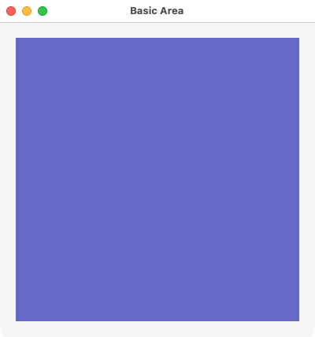 |  | 

Here is the same example using a semi-declarative `area` with `on_draw` listener that receives a [`area_draw_params`](#area-draw-params) argument and a dynamic path (you may copy/paste in [`girb`](#girb-glimmer-irb)):

```ruby
require 'glimmer-dsl-libui'

include Glimmer

window('Basic Area', 400, 400) {
  margined true
  
  vertical_box {
    area {
      on_draw do |area_draw_params|
        path { # a dynamic path is added semi-declaratively inside on_draw block
          rectangle(0, 0, 400, 400)
          
          fill r: 102, g: 102, b: 204, a: 1.0
        }
      end
    }
  }
}.show
```

Check [examples/dynamic_area.rb](#dynamic-area) for a more detailed semi-declarative example.

#### Scrolling Area

`scrolling_area(width as Numeric = main_window.width, height as Numeric = main_window.height)` is similar to `area`, but has the following additional methods:
- `scroll_to(x as Numeric, y as Numeric, width as Numeric = main_window.width, height as Numeric = main_window.height)`: scrolls to `x`/`y` location with `width` and `height` viewport size.
- `set_size(width as Numeric, height as Numeric)`: set size of scrolling area, which must must exceed that of visible viewport in order for scrolling to be enabled.

Mac | Windows | Linux
----|---------|------
  |   |  

Check [examples/basic_scrolling_area.rb](#basic-scrolling-area) for a more detailed example.

#### Area Path Shapes

`area` can have geometric shapes drawn by adding `path` elements.

To add `path` shapes under an `area`, you can do so:
- Explicitly: by adding `path` under `area` and nesting shapes (e.g. `rectangle`) underneath that share the same `fill`/`stroke`/`transform` properties
- Implicitly: by adding shapes directly under `area` when the shapes have unique `fill`/`stroke`/`transform` properties ([Glimmer DSL for LibUI](https://rubygems.org/gems/glimmer-dsl-libui) automatically constructs `path`s as intermediary parents for shapes directly added under `area`)

`path` can receive a `draw_fill_mode` argument that can accept values `:winding` or `:alternate` and defaults to `:winding`.

Available `path` shapes (that can be nested explicitly under `path` or implicitly under `area` directly):
- `rectangle(x as Numeric, y as Numeric, width as Numeric, height as Numeric)`
- `square(x as Numeric, y as Numeric, length as Numeric)`
- `arc(x_center as Numeric, y_center as Numeric, radius as Numeric, start_angle as Numeric, sweep as Numeric, is_negative as Boolean)`
- `circle(x_center as Numeric, y_center as Numeric, radius as Numeric)`
- `line(x as Numeric, y as Numeric, end_x = nil as Numeric, end_y = nil as Numeric)`: must be placed in a `figure` if only `x`/`y` are specified or have `end_x`/`end_y` otherwise if outside of `figure` (check `polyline`/`polygon` alternatives that do not require a `figure`)
- `bezier(x = nil as Numeric, y = nil as Numeric, c1_x as Numeric, c1_y as Numeric, c2_x as Numeric, c2_y as Numeric, end_x as Numeric, end_y as Numeric)`: must be placed in a `figure` if `x`/`y` are not specified or have `x`/`y` as start point otherwise if outside of `figure` (check `polybezier` alternative that does not require a `figure`)
- `polygon(point_array as Array of Arrays of Numeric or Array of Numeric)`: shortcut for a closed figure of lines; can receive points as [[x1, y1], [x2, y2], ...] or [x1, y1, x2, y2, ...]
- `polyline(point_array as Array of Arrays of Numeric or Array of Numeric)`: shortcut for an open figure of lines; can receive points as [[x1, y1], [x2, y2], ...] or [x1, y1, x2, y2, ...]
- `polybezier(point_array as Array of Arrays of Numeric or Array of Numeric)`: shortcut for an open figure of beziers; can receive points as [[start_x1, start_y1], [c1_x2, c1_y2, c2_x2, c2_y2, end_x2, end_y2], [c1_x3, c1_y3, c2_x3, c2_y3, end_x3, end_y3], ...] or [start_x1, start_y1, c1_x2, c1_y2, c2_x2, c2_y2, end_x2, end_y2, c1_x3, c1_y3, c2_x3, c2_y3, end_x3, end_y3, ...]
- `figure(x=nil as Numeric, y=nil as Numeric)` (composite that can contain other shapes) (can set `closed true` to connect last point to first point automatically)

Check [examples/area_gallery.rb](#area-gallery) for an overiew of all `path` shapes.

Mac | Windows | Linux
----|---------|------
 |  | 

##### Area Path Shape Methods

- `::parameters`: returns parameters of a shape class
- `#bounding_box`: returns `Array` containing `[min_x, min_y, width, height]`
- `#contain?(*point, outline: false, distance_tolerance: 0)`: Returns if point (`[x, y]` `Array` or args) is inside the shape when `outline` is `false` or on the outline when `outline` is `true`. `distance_tolerance` is used when `outline` is `true` as a fuzz factor for declaring a point on the outline of the shape (e.g. helps users select a shape from its outline more easily).
- `#include?(*point)`: Returns if point (`[x, y]` `Array` or args) is inside the shape when filled (having `fill` value) or on the outline when stroked (not having `fill` value yet `stroke` value only)
- `#perfect_shape`: returns [PerfectShape](https://github.com/AndyObtiva/perfect-shape) object matching the [libui](https://github.com/andlabs/libui) shape.
- `#move_by(x_delta, y_delta)` (alias: `translate`): moves (translates) shape by x,y delta
- `#move(x, y)`: moves (translates) shape to x,y coordinates (in the top-left x,y corner of the shape)
- `#min_x`: minimum x coordinate of shape (of top-left corner)
- `#min_y`: minimum y coordinate of shape (of top-left corner)
- `#max_x`: maximum x coordinate of shape (of bottom-right corner)
- `#max_y`: maximum y coordinate of shape (of bottom-right corner)
- `#center_point` (`Array` of x,y): center point of shape
- `#center_x`: center x coordinate of shape
- `#center_y`: center y coordinate of shape

#### Area Text

To draw `text` in an `area`, you simply nest a `text(x, y, width)` control directly under `area` or inside a `on_draw` listener, and then nest attributed `string {[attributes]; string_value}` controls underneath it returning an actual `String` (think of them as the `<span>` or `<p>` element in html, which contains a string of text). Alternatively, you can nest attributed `string(string_value) {[attributes]}` if `string_value` is a short single-line string. An attributed `string` value can be changed dynamically via its `string` property.

`text` has the following properties:
- `default_font`:
- `align`: `:left` (default), `:center`, or `:right` (`align` currently seems not to work on the Mac)
- `x`: x coordinate in relation to parent `area` top-left corner
- `y`: y coordinate in relation to parent `area` top-left corner
- `width` (default: area width - x*2): width of text to display

`string` has the following properties:
- `font`: font descriptor hash consisting of `:family`, `:size`, `:weight` (`[:minimum, :thin, :ultra_light, :light, :book, :normal, :medium, :semi_bold, :bold, :ultra_bold, :heavy, :ultra_heavy, :maximum]`), `:italic` (`[:normal, :oblique, :italic]`), and `:stretch` (`[:ultra_condensed, :extra_condensed, :condensed, :semi_condensed, :normal, :semi_expanded, :expanded, :extra_expanded, :ultra_expanded]`) key values
- `color`: rgba, hex, or [X11](https://en.wikipedia.org/wiki/X11_color_names) color
- `background`: rgba, hex, or [X11](https://en.wikipedia.org/wiki/X11_color_names) color
- `underline`: one of `:none`, `:single`, `:double`, `:suggestion`, `:color_custom`, `:color_spelling`, `:color_grammar`, `:color_auxiliary`
- `underline_color`: one of `:spelling`, `:grammar`, `:auxiliary`, rgba, hex, or [X11](https://en.wikipedia.org/wiki/X11_color_names) color
- `open_type_features`: Open Type Features (https://www.microsoft.com/typography/otspec/featuretags.htm) consist of `open_type_tag`s nested in content block, which accept (`a`, `b`, `c`, `d`, `Integer`) arguments.
- `string`: string value (`String`)

Example (you may copy/paste in [`girb`](#girb-glimmer-irb)):

```ruby
require 'glimmer-dsl-libui'

include Glimmer

window('area text drawing') {
  area {
    text {
      default_font family: 'Helvetica', size: 12, weight: :normal, italic: :normal, stretch: :normal
        
      string('This ') {
        font size: 20, weight: :bold, italic: :normal, stretch: :normal
        color r: 128, g: 0, b: 0, a: 1
      }
        
      string('is ') {
        font size: 20, weight: :bold, italic: :normal, stretch: :normal
        color r: 0, g: 128, b: 0, a: 1
      }
        
      string('a ') {
        font size: 20, weight: :bold, italic: :normal, stretch: :normal
        color r: 0, g: 0, b: 128, a: 1
      }
        
      string('short ') {
        font size: 20, weight: :bold, italic: :italic, stretch: :normal
        color r: 128, g: 128, b: 0, a: 1
      }
        
      string('attributed ') {
        font size: 20, weight: :bold, italic: :normal, stretch: :normal
        color r: 0, g: 128, b: 128, a: 1
      }
        
      string("string \n\n") {
        font size: 20, weight: :bold, italic: :normal, stretch: :normal
        color r: 128, g: 0, b: 128, a: 1
      }
        
      string {
        font family: 'Georgia', size: 13, weight: :medium, italic: :normal, stretch: :normal
        color r: 0, g: 128, b: 255, a: 1
        background r: 255, g: 255, b: 0, a: 0.5
        underline :single
        underline_color :spelling
        open_type_features {
          open_type_tag 'l', 'i', 'g', 'a', 0
          open_type_tag 'l', 'i', 'g', 'a', 1
        }
        
        "This is a demonstration\n" \
        "of a very long\n" \
        "attributed string\n" \
        "spanning multiple lines\n\n"
      }
    }
  }
}.show
```


You may checkout [examples/basic_draw_text.rb](#basic-draw-text) and [examples/custom_draw_text.rb](#custom-draw-text) for examples of using `text` inside `area`.

Mac | Windows | Linux
----|---------|------
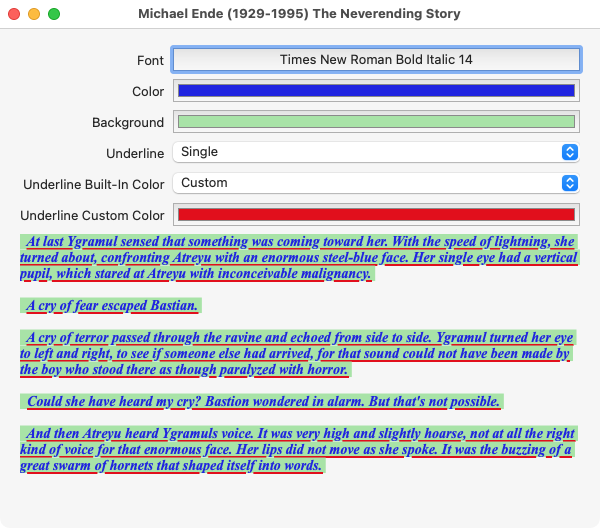 |  | 

#### Area Image

**(ALPHA FEATURE)**

[libui](https://github.com/andlabs/libui) does not support `image` rendering outside of `table` yet.
However, [Glimmer DSL for LibUI](https://rubygems.org/gems/glimmer-dsl-libui) adds a special `image(file as String path or web URL, width as Numeric, height as Numeric)` custom control that renders an image unto an `area` pixel by pixel (and when possible to optimize, line by line).

Given that it is very new and is not a [libui](https://github.com/andlabs/libui)-native control, please keep these notes in mind:
- It only supports the `.png` file format.
- [libui](https://github.com/andlabs/libui) pixel-by-pixel rendering performance is slow.
- Including an `image` inside an `area` `on_draw` listener improves performance due to not retaining pixel/line data in memory.
- Supplying `width` and `height` options greatly improves performance when shrinking image (e.g. `image('somefile.png', width: 24, height: 24)`). You can also supply one of the two dimensions, and the other one gets calculated automatically while preserving original aspect ratio (e.g. `image('somefile.png', height: 24)`)
- [Glimmer DSL for LibUI](https://rubygems.org/gems/glimmer-dsl-libui) lets you optionally specify `x` and `y` in addition to `file`, `width` and `height` (5 arguments total) to offset image location.

Currently, it is recommended to use `image` with very small `width` and `height` values only (e.g. 24x24).

Setting a [`transform` `matrix`](#area-transform-matrix) is supported under `image` just like it is under `path` and `text` inside `area`.

Example of using `image` declaratively (you may copy/paste in [`girb`](#girb-glimmer-irb)):

Mac | Windows | Linux
----|---------|------
 |  | 

```ruby
require 'glimmer-dsl-libui'

include Glimmer

window('Basic Image', 96, 96) {
  area {
    image(File.expand_path('icons/glimmer.png', __dir__), height: 96) # width is automatically calculated from height while preserving original aspect ratio
#     image(File.expand_path('icons/glimmer.png', __dir__), width: 96, height: 96) # you can specify both width and height options
#     image(File.expand_path('icons/glimmer.png', __dir__), 96, 96) # you can specify width, height as args
#     image(File.expand_path('../icons/glimmer.png', __dir__), 0, 0, 96, 96) # you can specify x, y, width, height args as alternative
#     image(File.expand_path('../icons/glimmer.png', __dir__), x: 0, y: 0, width: 96, height: 96) # you can specify x, y, width, height options as alternative
  }
}.show
```

Example of better performance via `on_draw` (you may copy/paste in [`girb`](#girb-glimmer-irb)):

```ruby
require 'glimmer-dsl-libui'

include Glimmer

window('Basic Image', 96, 96) {
  area {
    on_draw do |area_draw_params|
      image(File.expand_path('icons/glimmer.png', __dir__), 96, 96)
    end
  }
}.show
```

Example of using `image` declaratively with explicit properties (you may copy/paste in [`girb`](#girb-glimmer-irb)):

```ruby
require 'glimmer-dsl-libui'

include Glimmer

window('Basic Image', 96, 96) {
  area {
    image {
      file File.expand_path('icons/glimmer.png', __dir__)
#       x 0 # default
#       y 0 # default
      width 96
      height 96
    }
  }
}.show
```

Example of better performance via `on_draw` with explicit properties (you may copy/paste in [`girb`](#girb-glimmer-irb)):

```ruby
require 'glimmer-dsl-libui'

include Glimmer

window('Basic Image', 96, 96) {
  area {
    on_draw do |area_draw_params|
      image {
        file File.expand_path('icons/glimmer.png', __dir__)
        width 96
        height 96
      }
    end
  }
}.show
```

If you need to render an image pixel by pixel (e.g. to support a format other than `.png`) for very exceptional scenarios, you may use this example as a guide, including a line-merge optimization for neighboring horizontal pixels with the same color:

```ruby
# This is the manual way of rendering an image unto an area control.
# It could come in handy in special situations.
# Otherwise, it is recommended to simply utilize the `image` control that
# can be nested under area or area on_draw listener to automate all this work.

require 'glimmer-dsl-libui'
require 'chunky_png'

include Glimmer

puts 'Parsing image...'; $stdout.flush

f = File.open(File.expand_path('icons/glimmer.png', __dir__))
canvas = ChunkyPNG::Canvas.from_io(f)
f.close
canvas.resample_nearest_neighbor!(96, 96)
data = canvas.to_rgba_stream
width = canvas.width
height = canvas.height
puts "Image width: #{width}"
puts "Image height: #{height}"

puts 'Parsing colors...'; $stdout.flush

color_maps = height.times.map do |y|
  width.times.map do |x|
    r = data[(y*width + x)*4].ord
    g = data[(y*width + x)*4 + 1].ord
    b = data[(y*width + x)*4 + 2].ord
    a = data[(y*width + x)*4 + 3].ord
    {x: x, y: y, color: {r: r, g: g, b: b, a: a}}
  end
end.flatten
puts "#{color_maps.size} pixels to render..."; $stdout.flush

puts 'Parsing shapes...'; $stdout.flush

shape_maps = []
original_color_maps = color_maps.dup
indexed_original_color_maps = Hash[original_color_maps.each_with_index.to_a]
color_maps.each do |color_map|
  index = indexed_original_color_maps[color_map]
  @rectangle_start_x ||= color_map[:x]
  @rectangle_width ||= 1
  if color_map[:x] < width - 1 && color_map[:color] == original_color_maps[index + 1][:color]
    @rectangle_width += 1
  else
    if color_map[:x] > 0 && color_map[:color] == original_color_maps[index - 1][:color]
      shape_maps << {x: @rectangle_start_x, y: color_map[:y], width: @rectangle_width, height: 1, color: color_map[:color]}
    else
      shape_maps << {x: color_map[:x], y: color_map[:y], width: 1, height: 1, color: color_map[:color]}
    end
    @rectangle_width = 1
    @rectangle_start_x = color_map[:x] == width - 1 ? 0 : color_map[:x] + 1
  end
end
puts "#{shape_maps.size} shapes to render..."; $stdout.flush

puts 'Rendering image...'; $stdout.flush

window('Basic Image', 96, 96) {
  area {
    on_draw do |area_draw_params|
      shape_maps.each do |shape_map|
        path {
          rectangle(shape_map[:x], shape_map[:y], shape_map[:width], shape_map[:height])

          fill shape_map[:color]
        }
      end
    end
  }
}.show
```

One final note is that in Linux, table images grow and shrink with the image size unlike on the Mac where table row heights are constant regardless of image sizes. As such, you may be able to repurpose a table with a single image column and a single row as an image control with more native libui rendering if you are only targeting Linux with your app.


Check out [examples/basic_image.rb](#basic-image) (all versions) for examples of using `image` Glimmer custom control.

#### Colors

`fill` and `stroke` accept [X11](https://en.wikipedia.org/wiki/X11_color_names) color `Symbol`s/`String`s like `:skyblue` and `'sandybrown'` or 6-char hex or 3-char hex-shorthand (as `Integer` or `String` with or without `0x` prefix)

Available [X11 colors](https://en.wikipedia.org/wiki/X11_color_names) can be obtained through `Glimmer::LibUI.x11_colors` method.

Check [Basic Transform](#basic-transform) example for use of [X11](https://en.wikipedia.org/wiki/X11_color_names) colors.

Check [Histogram](#histogram) example for use of hex colors.

#### Area Draw Params

The `area_draw_params` `Hash` argument for `on_draw` block is a hash consisting of the following keys:
- `:context`: the drawing context object
- `:area_width`: area width
- `:area_height`: area height
- `:clip_x`: clip region top-left x coordinate
- `:clip_y`: clip region top-left y coordinate
- `:clip_width`: clip region width
- `:clip_height`: clip region height

In general, it is recommended to use declarative stable paths whenever feasible since they require less code and simpler maintenance. But, in more advanced cases, semi-declarative dynamic paths could be used instead, especially if there are thousands of dynamic paths that need maximum performance and low memory footprint.

#### Area Listeners

`area` supports a number of keyboard and mouse listeners to enable observing the control for user interaction to execute some logic.

The same listeners can be nested directly under `area` shapes like `rectangle` and `circle`, and [Glimmer DSL for LibUI](https://rubygems.org/gems/glimmer-dsl-libui) will automatically detect when the mouse lands within those shapes to constrain triggering the listeners by the shape regions.

`area` supported listeners are:
- `on_key_event {|area_key_event| ...}`: general catch-all key event (recommend using fine-grained key events below instead)
- `on_key_down {|area_key_event| ...}`
- `on_key_up {|area_key_event| ...}`
- `on_mouse_event {|area_mouse_event| ...}`: general catch-all mouse event (recommend using fine-grained mouse events below instead)
- `on_mouse_down {|area_mouse_event| ...}`
- `on_mouse_up {|area_mouse_event| ...}`
- `on_mouse_drag_started {|area_mouse_event| ...}`
- `on_mouse_dragged {|area_mouse_event| ...}`
- `on_mouse_dropped {|area_mouse_event| ...}`
- `on_mouse_entered {...}`
- `on_mouse_exited {...}`
- `on_mouse_crossed {|left| ...}` (NOT RECOMMENDED; it does what `on_mouse_entered` and `on_mouse_exited` do by returning a `left` argument indicating if mouse left `area`)
- `on_drag_broken {...}` (NOT RECOMMENDED; varies per platforms; use `on_mouse_dropped` instead)

The `area_mouse_event` `Hash` argument for mouse events that receive it (e.g. `on_mouse_up`, `on_mouse_dragged`) consist of the following hash keys:
- `:x`: mouse x location in relation to area's top-left-corner
- `:y`: mouse y location in relation to area's top-left-corner
- `:area_width`: area current width
- `:area_height`: area current height
- `:down`: mouse pressed button (e.g. `1` is left button, `3` is right button)
- `:up`: mouse depressed button (e.g. `1` is left button, `3` is right button)
- `:count`: count of mouse clicks (e.g. `2` for double-click, `1` for single-click)
- `:modifers`: `Array` of `Symbol`s from one of the following: `[:command, :shift, :alt, :control]`
- `:held`: mouse held button during dragging (e.g. `1` is left button, `4` is right button)

The `area_key_event` `Hash` argument for keyboard events that receive it (e.g. `on_key_up`, `on_key_down`) consist of the following hash keys:
- `:key`: key character (`String`)
- `:key_value` (alias: `:key_code`): key code value (`Integer`). Useful in rare cases for numeric processing of keys instead of dealing with as `:key` character `String`
- `:ext_key`: non-character extra key (`Symbol`) from `Glimmer::LibUI.enum_symbols(:ext_key)` such as `:left`, `:right`, `:escape`, `:insert`
- `:ext_key_value`: non-character extra key value (`Integer`). Useful in rare cases for numeric processing of extra keys instead of dealing with as `:ext_key` `Symbol`
- `:modifier`: modifier key pressed alone (e.g. `:shift` or `:control`)
- `:modifiers`: modifier keys pressed simultaneously with `:key`, `:ext_key`, or `:modifier`
- `:up`: indicates if key has been released or not (Boolean)

#### Area Methods/Attributes

To redraw an `area`, you may call the `#queue_redraw_all` method, or simply `#redraw`.

`area` has the following Glimmer-added API methods/attributes:
- `request_auto_redraw`: requests auto redraw upon changes to nested stable `path` or shapes
- `pause_auto_redraw`: pause auto redraw upon changes to nested stable `path` or shapes (useful to avoid too many micro-change redraws, to group all redraws as one after many micro-changes)
- `resume_auto_redraw`: resume auto redraw upon changes to nested stable `path` or shapes
- `auto_redraw_enabled`/`auto_redraw_enabled?`/`auto_redraw_enabled=`: an attribute to disable/enable auto redraw on an `area` upon changes to nested stable `path` or shapes

#### Area Transform Matrix

A transform `matrix` can be set on a path by building a `matrix(m11 = nil, m12 = nil, m21 = nil, m22 = nil, m31 = nil, m32 = nil) {operations}` proxy object and then setting via `transform` property, or alternatively by building and setting the matrix in one call to `transform(m11 = nil, m12 = nil, m21 = nil, m22 = nil, m31 = nil, m32 = nil) {operations}` passing it the matrix arguments and/or content operations.

When instantiating a `matrix` object, it always starts with identity matrix.

Here are the following operations that can be performed in a `matrix` body:
- `identity` [alias: `set_identity`]: resets matrix to identity matrix
- `translate(x as Numeric, y as Numeric)`
- `scale(x_center = 0 as Numeric, y_center = 0 as Numeric, x as Numeric, y as Numeric)`
- `skew(x = 0 as Numeric, y = 0 as Numeric, x_amount as Numeric, y_amount as Numeric)`
- `rotate(x = 0 as Numeric, y = 0 as Numeric, degrees as Numeric)`

Example of using transform matrix (you may copy/paste in [`girb`](#girb-glimmer-irb)):

```ruby
require 'glimmer-dsl-libui'

include Glimmer

window('Basic Transform', 350, 350) {
  area {
    path {
      square(0, 0, 350)
      
      fill r: 255, g: 255, b: 0
    }
    40.times do |n|
      path {
        square(0, 0, 100)
        
        fill r: [255 - n*5, 0].max, g: [n*5, 255].min, b: 0, a: 0.5
        stroke :black, thickness: 2
        transform {
          skew 0.15, 0.15
          translate 50, 50
          rotate 100, 100, -9 * n
          scale 1.1, 1.1
        }
      }
    end
  }
}.show
```

Keep in mind that this part could be written differently when there is a need to reuse the matrix:

```ruby
transform {
  translate 100, 100
  rotate 100, 100, -9 * n
}
```

Alternatively:

```ruby
m1 = matrix {
  translate 100, 100
  rotate 100, 100, -9 * n
}
transform m1
# and then reuse m1 elsewhere too
```

You can set a `matrix`/`transform` on `area` directly to conveniently apply to all nested `path`s too.

Note that `area`, `path`, and nested shapes are all truly declarative, meaning they do not care about the ordering of calls to `fill`, `stroke`, and `transform`. Furthermore, any transform that is applied is reversed at the end of the block, so you never have to worry about the ordering of `transform` calls among different paths. You simply set a transform on the `path`s that need it and it is guaranteed to be called before all its content is drawn, and then undone afterwards to avoid affecting later paths. Matrix `transform` can be set on an entire `area` too, applying to all nested `path`s.

#### Area Animation

If you need to animate `area` vector graphics, you just have to use the [`Glimmer::LibUI::timer`](#libui-operations) method along with making changes to shape attributes.

Spinner example that has a fully customizable method-based custom control called `spinner`, which is destroyed if you click on it (you may copy/paste in [`girb`](#girb-glimmer-irb)):

```ruby
require 'glimmer-dsl-libui'

class SpinnerExample
  include Glimmer
  
  SIZE = 120
  
  def initialize
    create_gui
  end
  
  def launch
    @main_window.show
  end
  
  def create_gui
    @main_window = window {
      title 'Spinner'
      content_size SIZE*2, SIZE*2
      
      horizontal_box {
        padded false
        
        vertical_box {
          padded false
          
          spinner(size: SIZE)
          spinner(size: SIZE, fill_color: [42, 153, 214])
        }
        
        vertical_box {
          padded false
          
          spinner(size: SIZE/2.0, fill_color: :orange)
          spinner(size: SIZE/2.0, fill_color: {x0: 0, y0: 0, x1: SIZE/2.0, y1: SIZE/2.0, stops: [{pos: 0.25, r: 204, g: 102, b: 204}, {pos: 1, r: 2, g: 2, b: 254}]})
          spinner(size: SIZE/2.0, fill_color: :green, unfilled_color: :yellow)
          spinner(size: SIZE/2.0, fill_color: :white, unfilled_color: :gray, background_color: :black)
        }
      }
    }
  end
  
  def spinner(size: 40.0, fill_color: :gray, background_color: :white, unfilled_color: {r: 243, g: 243, b: 243}, donut_percentage: 0.25)
    arc1 = arc2 = nil
    area { |the_area|
      rectangle(0, 0, size, size) {
        fill background_color
      }
      circle(size/2.0, size/2.0, size/2.0) {
        fill fill_color
      }
      arc1 = arc(size/2.0, size/2.0, size/2.0, 0, 180) {
        fill unfilled_color
      }
      arc2 = arc(size/2.0, size/2.0, size/2.0, 90, 180) {
        fill unfilled_color
      }
      circle(size/2.0, size/2.0, (size/2.0)*(1.0 - donut_percentage)) {
        fill background_color
      }
      
      on_mouse_up do
        the_area.destroy
      end
    }.tap do
      Glimmer::LibUI.timer(0.05) do
        delta = 10
        arc1.start_angle += delta
        arc2.start_angle += delta
      end
    end
  end
end

SpinnerExample.new.launch
```


### Smart Defaults and Conventions

- `horizontal_box`, `vertical_box`, `grid`, and `form` controls have `padded` as `true` upon instantiation to ensure more user-friendly GUI by default
- `group` controls have `margined` as `true` upon instantiation to ensure more user-friendly GUI by default
- All controls nested under a `horizontal_box`, `vertical_box`, and `form` have `stretchy` property (fill maximum space) as `true` by default (passed to `box_append`/`form_append` method)
- If an event listener is repeated under a control (e.g. two `on_clicked {}` listeners under `button`), it does not overwrite the previous listener, yet it is added to an `Array` of listeners for the event. [Glimmer DSL for LibUI](https://rubygems.org/gems/glimmer-dsl-libui) provides multiple-event-listener support unlike [LibUI](https://github.com/kojix2/LibUI)
- `window` instatiation args can be left off, having the following defaults when unspecified: `title` as `''`, `width` as `190`, `height` as `150`, and `has_menubar` as `true`)
- `window` has an `on_closing` listener by default that quits application upon hitting close button if window is the main window, not a child window (the behavior can be overridden with a manual `on_closing` implementation that returns integer `1`/`true` for closing and `0`/`false` for remaining open).
- `group` has `title` property default to `''` if not specified in instantiation args, so it can be instantiated without args with `title` property specified in nested block (e.g. `group {title 'Address'; ...}`)
- `button`, `checkbox`, and `label` have `text` default to `''` if not specified in instantiation args, so they can be instantiated without args with `text` property specified in nested block (e.g. `button {text 'Greet'; on_clicked {puts 'Hello'}}`)
- `quit_menu_item` has an `on_clicked` listener by default that quits application upon selecting the quit menu item (can be overridden with a manual `on_clicked` implementation that returns integer `0` for success)
- If an `on_closing` listener was defined on `window` and it does not return an integer, default exit behavior is assumed (`window.destroy` is called followed by `LibUI.quit`, returning `0`).
- If multiple `on_closing` listeners were added for `window`, and none return an integer, they are all executed. On the other hand, if one of them returns an integer, it is counted as the final return value and stops the chain of listener execution.
- If an `on_clicked` listener was defined on `quit_menu_item` and it does not return an integer, default exit behavior is assumed (`quit_menu_item.destroy` and `main_window.destroy` are called followed by `LibUI.quit`, returning `0`).
- If multiple `on_clicked` listeners were added for `quit_menu_item`, and none return an integer, they are all executed. On the other hand, if one of them returns an integer, it is counted as the final return value and stops the chain of listener execution.
- All boolean property readers return `true` or `false` in Ruby instead of the [libui](https://github.com/andlabs/libui) original `0` or `1` in C.
- All boolean property writers accept `true`/`false` in addition to `1`/`0` in Ruby
- All string property readers return a `String` object in Ruby instead of the [libui](https://github.com/andlabs/libui) Fiddle pointer object.
- Automatically allocate font descriptors upon instantiating `font_button` controls and free them when destroying `font_button` controls
- Automatically allocate color value pointers upon instantiating `color_button` controls and free them when destroying `color_button` controls
- On the Mac, if no `menu` items were added, an automatic `quit_menu_item` is added to enable quitting with CTRL+Q
- When destroying a control nested under a `horizontal_box` or `vertical_box`, it is automatically deleted from the box's children
- When destroying a control nested under a `form`, it is automatically deleted from the form's children
- When destroying a control nested under a `window` or `group`, it is automatically unset as their child to allow successful destruction
- When destroying a control that has a data-binding to a model attribute, the data-binding observer registration is automatically deregistered
- For `date_time_picker`, `date_picker`, and `time_picker`, make sure `time` hash values for `mon`, `wday`, and `yday` are 1-based instead of [libui](https://github.com/andlabs/libui) original 0-based values, and return `dst` as Boolean instead of `isdst` as `1`/`0`
- Smart defaults for `grid` child properties are `left` (`0`), `top` (`0`), `xspan` (`1`), `yspan` (`1`), `hexpand` (`false`), `halign` (`:fill`), `vexpand` (`false`), and `valign` (`:fill`)
- The `table` control automatically constructs required `TableModelHandler`, `TableModel`, and `TableParams`, calculating all their arguments from `cell_rows` and `editable` properties (e.g. `NumRows`) as well as nested columns (e.g. `text_column`)
- Table model instances are automatically freed from memory after `window` is destroyed.
- Table `cell_rows` data has implicit data-binding to table cell values for deletion, insertion, and change (done by diffing `cell_rows` value before and after change and auto-informing `table` of deletions [`LibUI.table_model_row_deleted`], insertions [`LibUI.table_model_row_deleted`], and changes [`LibUI.table_model_row_changed`]). When deleting data rows from `cell_rows` array, then actual rows from the `table` are automatically deleted. When inserting data rows into `cell_rows` array, then actual `table` rows are automatically inserted. When updating data rows in `cell_rows` array, then actual `table` rows are automatically updated.
- `image` instances are automatically freed from memory after `window` is destroyed.
- `image` `width` and `height` can be left off if it has one `image_part` only as they default to the same `width` and `height` of the `image_part`
- Automatically provide shifted `:key` characters in `area_key_event` provided in `area` key listeners `on_key_event`, `on_key_down`, and `on_key_up`
- `scrolling_area` `width` and `height` default to main window width and height if not specified.
- `scrolling_area` `#scroll_to` 3rd and 4th arguments (`width` and `height`) default to main window width and height if not specified.
- `area` paths are specified declaratively with shapes/figures underneath (e.g. `rectangle`), and `area` draw listener is automatically generated
- `area` path shapes can be added directly under `area` without declaring `path` explicitly as a convenient shorthand
- `line` and `bezier` automatically start a new figure if placed outside of `figure`
- Observe figure properties (e.g. `rectangle` `width`) for changes and automatically redraw containing area accordingly
- Observe `path` `fill` and `stroke` hashes for changes and automatically redraw containing area accordingly
- Observe `text` and `string` properties for changes and automatically redraw containing area accordingly
- All controls are protected from garbage collection until no longer needed (explicitly destroyed), so there is no need to worry about surprises.
- All resources are freed automatically once no longer needed or left to garbage collection.
- When nesting an `area` directly underneath `window` (without a layout control like `vertical_box`), it is automatically reparented with `vertical_box` in between the `window` and `area` since it would not show up on Linux otherwise.
- Colors may be passed in as a hash of `:r`, `:g`, `:b`, `:a`, or `:red`, `:green`, `:blue`, `:alpha`, or [X11](https://en.wikipedia.org/wiki/X11_color_names) color like `:skyblue`, or 6-char hex or 3-char hex (as `Integer` or `String` with or without `0x` prefix)
- Color alpha value defaults to `1.0` when not specified.

### Custom Keywords

Custom keywords can be defined to represent custom controls (components) that provide new features or act as composites of [existing controls](#supported-keywords) that need to be reused multiple times in an application or across multiple applications. Custom keywords save a lot of development time, improving productivity and maintainability immensely.

For example, you can define a custom `address_view` control as an aggregate of multiple `label` controls to reuse multiple times as a standard address View, displaying street, city, state, and zip code.

There are two ways to define custom keywords:
- Method-Based: simply define a method representing the custom control you want (e.g. `address_view`) with any arguments needed (e.g. `address(address_model)`).
- Class-Based: define a class matching the camelcased name of the custom control by convention (e.g. the `address_view` custom control keyword would have a class called `AddressView`) and `include Glimmer::LibUI::CustomControl`. Classes add the benefit of being able to distribute the custom controls into separate files and reuse externally from multiple places or share via Ruby gems.

It is OK to use the terms "custom keyword" and "custom control" synonymously though "custom keyword" is a broader term that covers things other than controls too like custom shapes (e.g. `cylinder`), custom attributed strings (e.g. `alternating_color_string`), and custom transforms (`isometric_transform`).

Example that defines `form_field`, `address_form`, `label_pair`, and `address_view` keywords (you may copy/paste in [`girb`](#girb-glimmer-irb)):

```ruby
require 'glimmer-dsl-libui'
require 'facets'

include Glimmer

Address = Struct.new(:street, :p_o_box, :city, :state, :zip_code)

def form_field(model, attribute)
  attribute = attribute.to_s
  entry { |e|
    label attribute.underscore.split('_').map(&:capitalize).join(' ')
    text <=> [model, attribute]
  }
end

def address_form(address_model)
  form {
    form_field(address_model, :street)
    form_field(address_model, :p_o_box)
    form_field(address_model, :city)
    form_field(address_model, :state)
    form_field(address_model, :zip_code)
  }
end

def label_pair(model, attribute, value)
  horizontal_box {
    label(attribute.to_s.underscore.split('_').map(&:capitalize).join(' '))
    label(value.to_s) {
      text <= [model, attribute]
    }
  }
end

def address_view(address_model)
  vertical_box {
    address_model.each_pair do |attribute, value|
      label_pair(address_model, attribute, value)
    end
  }
end

address1 = Address.new('123 Main St', '23923', 'Denver', 'Colorado', '80014')
address2 = Address.new('2038 Park Ave', '83272', 'Boston', 'Massachusetts', '02101')

window('Method-Based Custom Keyword') {
  margined true
  
  horizontal_box {
    vertical_box {
      label('Address 1') {
        stretchy false
      }
      
      address_form(address1)
      
      horizontal_separator {
        stretchy false
      }
      
      label('Address 1 (Saved)') {
        stretchy false
      }
      
      address_view(address1)
    }
    
    vertical_separator {
      stretchy false
    }
    
    vertical_box {
      label('Address 2') {
        stretchy false
      }
      
      address_form(address2)
      
      horizontal_separator {
        stretchy false
      }
      
      label('Address 2 (Saved)') {
        stretchy false
      }
      
      address_view(address2)
    }
  }
}.show
```


You can also define Custom Window keywords, that is custom controls with `window` being the body root. These are also known as Applications. To define a Custom Window, you `include Glimmer::LibUI::CustomWindow` or `include Glimmer:LibUI::Application` and then you can invoke the `::launch` method on the class.

Example (you may copy/paste in [`girb`](#girb-glimmer-irb)):

```ruby
require 'glimmer-dsl-libui'
require 'facets'

Address = Struct.new(:street, :p_o_box, :city, :state, :zip_code)

class FormField
  include Glimmer::LibUI::CustomControl
  
  options :model, :attribute
  
  body {
    entry { |e|
      label attribute.to_s.underscore.split('_').map(&:capitalize).join(' ')
      text <=> [model, attribute]
    }
  }
end

class AddressForm
  include Glimmer::LibUI::CustomControl
  
  options :address
  
  body {
    form {
      form_field(model: address, attribute: :street)
      form_field(model: address, attribute: :p_o_box)
      form_field(model: address, attribute: :city)
      form_field(model: address, attribute: :state)
      form_field(model: address, attribute: :zip_code)
    }
  }
end

class LabelPair
  include Glimmer::LibUI::CustomControl
  
  options :model, :attribute, :value
  
  body {
    horizontal_box {
      label(attribute.to_s.underscore.split('_').map(&:capitalize).join(' '))
      label(value.to_s) {
        text <= [model, attribute]
      }
    }
  }
end

class AddressView
  include Glimmer::LibUI::CustomControl
  
  options :address
  
  body {
    vertical_box {
      address.each_pair do |attribute, value|
        label_pair(model: address, attribute: attribute, value: value)
      end
    }
  }
end

class ClassBasedCustomControls
  include Glimmer::LibUI::Application # alias: Glimmer::LibUI::CustomWindow
  
  before_body do
    @address1 = Address.new('123 Main St', '23923', 'Denver', 'Colorado', '80014')
    @address2 = Address.new('2038 Park Ave', '83272', 'Boston', 'Massachusetts', '02101')
  end
  
  body {
    window('Class-Based Custom Keyword') {
      margined true
      
      horizontal_box {
        vertical_box {
          label('Address 1') {
            stretchy false
          }
          
          address_form(address: @address1)
          
          horizontal_separator {
            stretchy false
          }
          
          label('Address 1 (Saved)') {
            stretchy false
          }
          
          address_view(address: @address1)
        }
        
        vertical_separator {
          stretchy false
        }
        
        vertical_box {
          label('Address 2') {
            stretchy false
          }
          
          address_form(address: @address2)
          
          horizontal_separator {
            stretchy false
          }
          
          label('Address 2 (Saved)') {
            stretchy false
          }
          
          address_view(address: @address2)
        }
      }
    }
  }
end

ClassBasedCustomControls.launch
```


The [`area`](#area-api) control can be utilized to build non-native custom controls from scratch by leveraging vector graphics, formattable text, keyboard events, and mouse events. This is demonstrated in the [Area-Based Custom Controls](#area-based-custom-controls) example.

Defining custom keywords enables unlimited extension of the [Glimmer GUI DSL](#glimmer-gui-dsl). The sky is the limit on what can be done with custom keywords as a result. You can compose new visual vocabulary to build applications in any domain from higher concepts rather than [mere standard controls](#supported-keywords). For example, in a traffic signaling app, you could define `street`, `light_signal`, `traffic_sign`, and `car` as custom keywords and build your application from these concepts directly, saving enormous time and achieving much higher productivity.

Learn more from custom keyword usage in [Method-Based Custom Keyword](#method-based-custom-keyword), [Area-Based Custom Controls](#area-based-custom-controls), [Basic Scrolling Area](#basic-scrolling-area), [Histogram](#histogram), and [Tetris](#tetris) examples.

### Observer Pattern

The [Observer Design Pattern](https://en.wikipedia.org/wiki/Observer_pattern) (a.k.a. Observer Pattern) is fundamental to building GUIs (Graphical User Interfaces) following the [MVC (Model View Controller) Architectural Pattern](https://en.wikipedia.org/wiki/Model%E2%80%93view%E2%80%93controller) or any of its variations like [MVP (Model View Presenter)](https://en.wikipedia.org/wiki/Model%E2%80%93view%E2%80%93presenter). In the original Smalltalk-MVC, the View observes the Model for changes and updates itself accordingly.


[Glimmer DSL for LibUI](https://rubygems.org/gems/glimmer-dsl-libui) supports the [Observer Design Pattern](https://en.wikipedia.org/wiki/Observer_pattern) via the `observe(model, attribute_or_key=nil)` keyword, which can observe `Object` models with attributes, `Hash`es with keys, and `Array`s. It automatically enhances objects as needed to support automatically notifying observers of changes via `observable#notify_observers(attribute_or_key = nil)` method:
- `Object` becomes `Glimmer::DataBinding::ObservableModel`, which supports observing specified `Object` model attributes.
- `Hash` becomes `Glimmer::DataBinding::ObservableHash`, which supports observing all `Hash` keys or a specific `Hash` key
- `Array` becomes `Glimmer::DataBinding::ObservableArray`, which supports observing `Array` changes like those done with `push`, `<<`, `delete`, and `map!` methods (all mutation methods).

Example:

```ruby
  observe(person, :name) do |new_name|
    @name_label.text = new_name
  end
```

That observes a person's name attribute for changes and updates the name `label` `text` property accordingly.

[Learn about Glimmer's Observer Pattern capabilities and options in more detail at the Glimmer project page.](https://github.com/AndyObtiva/glimmer#data-binding-library)

See examples of the `observe` keyword at [Color The Circles](#color-the-circles), [Method-Based Custom Keyword](#method-based-custom-keyword), [Snake](#snake), and [Tetris](#tetris).

### Data-Binding

[Glimmer DSL for LibUI](https://rubygems.org/gems/glimmer-dsl-libui) supports both bidirectional (two-way) data-binding and unidirectional (one-way) data-binding.

Data-binding enables writing very expressive, terse, and declarative code to synchronize View properties with Model attributes without writing many lines or pages of imperative code doing the same thing, increasing productivity immensely.

Data-binding automatically takes advantage of the [Observer Pattern](#observer-pattern) behind the scenes and is very well suited to declaring View property data sources piecemeal. On the other hand, explicit use of the [Observer Pattern](#observer-pattern) is sometimes more suitable when needing to make multiple View updates upon a single Model attribute change.

Data-binding supports utilizing the [MVP (Model View Presenter)](https://en.wikipedia.org/wiki/Model%E2%80%93view%E2%80%93presenter) flavor of [MVC](https://en.wikipedia.org/wiki/Model%E2%80%93view%E2%80%93controller) by observing both the View and a Presenter for changes and updating the opposite side upon encountering them. This enables writing more decoupled cleaner code that keeps View code and Model code disentangled and highly maintainable. For example, check out the Snake game presenters for [Grid](/examples/snake/presenter/grid.rb) and [Cell](/examples/snake/presenter/cell.rb), which act as proxies for the actual Snake game models [Snake](/examples/snake/model/snake.rb) and [Apple](/examples/snake/model/apple.rb), mediating synchronization of data between them and the [Snake View GUI](/examples/snake.rb).


#### Bidirectional (Two-Way) Data-Binding

[Glimmer DSL for LibUI](https://rubygems.org/gems/glimmer-dsl-libui) supports bidirectional (two-way) data-binding of the following controls/properties via the `<=>` operator (indicating data is moving in both directions between View and Model):
- `checkbox`: `checked`
- `check_menu_item`: `checked`
- `color_button`: `color`
- `combobox`: `selected`, `selected_item`
- `date_picker`: `time`
- `date_time_picker`: `time`
- `editable_combobox`: `text`
- `entry`: `text`
- `font_button`: `font`
- `multiline_entry`: `text`
- `non_wrapping_multiline_entry`: `text`
- `radio_buttons`: `selected`
- `radio_menu_item`: `checked`
- `search_entry`: `text`
- `slider`: `value`
- `spinbox`: `value`
- `table`: `cell_rows` (explicit data-binding by using `<=>` and [implicit data-binding](#table-api) by assigning value directly)
- `time_picker`: `time`

Example of bidirectional data-binding:

```ruby
entry {
  text <=> [contract, :legal_text]
}
```

That is data-binding a contract's legal text to an `entry` `text` property.

Another example of bidirectional data-binding with an option:

```ruby
entry {
  text <=> [self, :entered_text, after_write: ->(text) {puts text}]
}
```

That is data-binding `entered_text` attribute on `self` to `entry` `text` property and printing text after write to the model.

##### Table Data-Binding

One note about `table` `cell_rows` data-binding is that it works with either:
- Raw data `Array` (rows) of `Array`s (column cells)
- Model `Array` (rows) of objects having attributes (column cells) matching the underscored names of `table` columns by convention. Model attribute names can be overridden when needed by passing an `Array` enumerating all mapped model attributes in the order of `table` columns or alternatively a `Hash` mapping only the column names that have model attribute names different from their table column underscored version.

Example of `table` implicit data-binding of `cell_rows` to raw data `Array` of `Array`s (you may copy/paste in [`girb`](#girb-glimmer-irb)):

```ruby
require 'glimmer-dsl-libui'

include Glimmer

data = [
  ['Lisa Sky', 'lisa@sky.com', '720-523-4329', 'Denver', 'CO'],
  ['Jordan Biggins', 'jordan@biggins.com', '617-528-5399', 'Boston', 'MA'],
  ['Mary Glass', 'mary@glass.com', '847-589-8788', 'Elk Grove Village', 'IL'],
  ['Darren McGrath', 'darren@mcgrath.com', '206-539-9283', 'Seattle', 'WA'],
  ['Melody Hanheimer', 'melody@hanheimer.com', '213-493-8274', 'Los Angeles', 'CA'],
]

window('Contacts', 600, 600) {
  table {
    text_column('Name')
    text_column('Email')
    text_column('Phone')
    text_column('City')
    text_column('State')
  
    cell_rows data
  }
}.show
```

Example of `table` explicit data-binding of `cell_rows` to Model `Array` (you may copy/paste in [`girb`](#girb-glimmer-irb)):

```ruby
require 'glimmer-dsl-libui'

class SomeTable
  Contact = Struct.new(:name, :email, :phone, :city, :state)
  
  include Glimmer
  
  attr_accessor :contacts
  
  def initialize
    @contacts = [
      Contact.new('Lisa Sky', 'lisa@sky.com', '720-523-4329', 'Denver', 'CO'),
      Contact.new('Jordan Biggins', 'jordan@biggins.com', '617-528-5399', 'Boston', 'MA'),
      Contact.new('Mary Glass', 'mary@glass.com', '847-589-8788', 'Elk Grove Village', 'IL'),
      Contact.new('Darren McGrath', 'darren@mcgrath.com', '206-539-9283', 'Seattle', 'WA'),
      Contact.new('Melody Hanheimer', 'melody@hanheimer.com', '213-493-8274', 'Los Angeles', 'CA'),
    ]
  end
  
  def launch
    window('Contacts', 600, 200) {
      table {
        text_column('Name')
        text_column('Email')
        text_column('Phone')
        text_column('City')
        text_column('State')
  
        cell_rows <=> [self, :contacts] # explicit data-binding to self.contacts Model Array, auto-inferring model attribute names from underscored table column names by convention
      }
    }.show
  end
end

SomeTable.new.launch
```

Example of `table` explicit data-binding of `cell_rows` to Model `Array` with `column_attributes` `Hash` mapping for custom column names (you may copy/paste in [`girb`](#girb-glimmer-irb)):

```ruby
require 'glimmer-dsl-libui'

class SomeTable
  Contact = Struct.new(:name, :email, :phone, :city, :state)
  
  include Glimmer
  
  attr_accessor :contacts
  
  def initialize
    @contacts = [
      Contact.new('Lisa Sky', 'lisa@sky.com', '720-523-4329', 'Denver', 'CO'),
      Contact.new('Jordan Biggins', 'jordan@biggins.com', '617-528-5399', 'Boston', 'MA'),
      Contact.new('Mary Glass', 'mary@glass.com', '847-589-8788', 'Elk Grove Village', 'IL'),
      Contact.new('Darren McGrath', 'darren@mcgrath.com', '206-539-9283', 'Seattle', 'WA'),
      Contact.new('Melody Hanheimer', 'melody@hanheimer.com', '213-493-8274', 'Los Angeles', 'CA'),
    ]
  end
  
  def launch
    window('Contacts', 600, 200) {
      table {
        text_column('Name')
        text_column('Email')
        text_column('Phone')
        text_column('City/Town')
        text_column('State/Province')
  
        cell_rows <=> [self, :contacts, column_attributes: {'City/Town' => :city, 'State/Province' => :state}]
      }
    }.show
  end
end

SomeTable.new.launch
```

Example of `table` explicit data-binding of `cell_rows` to Model `Array` with complete `column_attributes` `Array` mapping (you may copy/paste in [`girb`](#girb-glimmer-irb)):

```ruby
require 'glimmer-dsl-libui'

class SomeTable
  Contact = Struct.new(:name, :email, :phone, :city, :state)
  
  include Glimmer
  
  attr_accessor :contacts
  
  def initialize
    @contacts = [
      Contact.new('Lisa Sky', 'lisa@sky.com', '720-523-4329', 'Denver', 'CO'),
      Contact.new('Jordan Biggins', 'jordan@biggins.com', '617-528-5399', 'Boston', 'MA'),
      Contact.new('Mary Glass', 'mary@glass.com', '847-589-8788', 'Elk Grove Village', 'IL'),
      Contact.new('Darren McGrath', 'darren@mcgrath.com', '206-539-9283', 'Seattle', 'WA'),
      Contact.new('Melody Hanheimer', 'melody@hanheimer.com', '213-493-8274', 'Los Angeles', 'CA'),
    ]
  end
  
  def launch
    window('Contacts', 600, 200) {
      table {
        text_column('Full Name')
        text_column('Email Address')
        text_column('Phone Number')
        text_column('City or Town')
        text_column('State or Province')
  
        cell_rows <=> [self, :contacts, column_attributes: [:name, :email, :phone, :city, :state]]
      }
    }.show
  end
end

SomeTable.new.launch
```

#### Unidirectional (One-Way) Data-Binding

[Glimmer DSL for LibUI](https://rubygems.org/gems/glimmer-dsl-libui) supports unidirectional (one-way) data-binding of any control/shape/attributed-string property via the `<=` operator (indicating data is moving from the right side, which is the Model, to the left side, which is the GUI View object).

Example of unidirectional data-binding:

```ruby
square(0, 0, CELL_SIZE) {
  fill <= [@grid.cells[row][column], :color]
}
```

That is data-binding a grid cell color to a `square` shape's `fill` property. That means if the `color` attribute of the grid cell is updated, the `fill` property of the `square` shape is automatically updated accordingly.

Another Example of unidirectional data-binding with an option:

```ruby
window {
  title <= [@game, :score, on_read: -> (score) {"Glimmer Snake (Score: #{@game.score})"}]
}
```

That is data-binding the `window` `title` property to the `score` attribute of a `@game`, but converting on read from the Model to a `String`.

#### Data-Binding API

To summarize the data-binding API:
- `view_property <=> [model, attribute, *read_or_write_options]`: Bidirectional (two-way) data-binding to Model attribute accessor
- `view_property <= [model, attribute, *read_only_options]`: Unidirectional (one-way) data-binding to Model attribute reader

This is also known as the [Glimmer Shine](https://github.com/AndyObtiva/glimmer-dsl-swt/blob/master/docs/reference/GLIMMER_GUI_DSL_SYNTAX.md#shine) syntax for data-binding, a [Glimmer](https://github.com/AndyObtiva/glimmer)-only unique innovation that takes advantage of [Ruby](https://www.ruby-lang.org/en/)'s highly expressive syntax and malleable DSL support.

Data-bound model attribute can be:
- **Direct:** `Symbol` representing attribute reader/writer (e.g. `[person, :name`])
- **Nested:** `String` representing nested attribute path (e.g. `[company, 'address.street']`). That results in "nested data-binding"
- **Indexed:** `String` containing array attribute index (e.g. `[customer, 'addresses[0].street']`). That results in "indexed data-binding"
- **Keyed:** `String` containing hash attribute key (e.g. `[customer, 'addresses[:main].street']`). That results in "keyed data-binding"

Data-binding options include:
- `before_read {|value| ...}`: performs an operation before reading data from Model to update View.
- `on_read {|value| ...}`: converts value read from Model to update the View.
- `after_read {|converted_value| ...}`: performs an operation after read from Model to update View.
- `before_write {|value| ...}`: performs an operation before writing data to Model from View.
- `on_write {|value| ...}`: converts value read from View to update the Model.
- `after_write {|converted_value| ...}`: performs an operation after writing to Model from View.
- `computed_by attribute` or `computed_by [attribute1, attribute2, ...]`: indicates model attribute is computed from specified attribute(s), thus updated when they are updated (see in [Login example version 2](/examples/login2.rb)). That is known as "computed data-binding".

Note that with both `on_read` and `on_write` converters, you could pass a `Symbol` representing the name of a method on the value object to invoke.

Example:

```ruby
entry {
  text <=> [product, :price, on_read: :to_s, on_write: :to_i]
}
```

Learn more from data-binding usage in [Login](#login) (4 data-binding versions), [Basic Entry](#basic-entry), [Form](#form), [Form Table](#form-table) (5 data-binding versions), [Method-Based Custom Keyword](#method-based-custom-keyword), [Snake](#snake) and [Tic Tac Toe](#tic_tac_toe) examples.

#### Data-Binding Gotchas

- Never data-bind a control property to an attribute on the same view object with the same exact name (e.g. binding `entry` `text` property to `self` `text` attribute) as it would conflict with it. Instead, data-bind view property to an attribute with a different name on the view object or with the same name, but on a presenter or model object (e.g. data-bind `entry` `text` to `self` `legal_text` attribute or to `contract` model `text` attribute)
- Data-binding a property utilizes the control's listener associated with the property (e.g. `on_changed` for `entry` `text`), so although you can add another listener if you want ([Glimmer DSL for LibUI](https://rubygems.org/gems/glimmer-dsl-libui) will happily add your listener to the list of listeners that will get notified by a certain event), sometimes it is recommended that you add an `after_read: ->(val) {}` or `after_write: ->(val) {}` block instead to perform something after data-binding reads from or writes to the Model attribute.
- Data-binding a View control to another View control directly is not a good practice as it causes tight-coupling. Instead, data-bind both View controls to the same Presenter/Model attribute, and that keeps them in sync while keeping the code decoupled.

### API Gotchas

- There is no proper way to destroy `grid` children due to [libui](https://github.com/andlabs/libui) not offering any API for deleting them from `grid` (no `grid_delete` similar to `box_delete` for `horizontal_box` and `vertical_box`).
- `table` `checkbox_column` checkbox editing only works on Linux and Windows (not Mac) due to a current limitation in [libui](https://github.com/andlabs/ui/issues/357).
- `table` `checkbox_text_column` checkbox editing only works on Linux (not Mac or Windows) due to a current limitation in [libui](https://github.com/andlabs/ui/issues/357).
- `text` `align` property seems not to work on the Mac ([libui](https://github.com/andlabs/libui) has an [issue](https://github.com/andlabs/libui/pull/407) about it)
- `text` `string` `background` does not work on Windows due to an [issue in libui](https://github.com/andlabs/libui/issues/347).
- `table` `progress_bar` column on Windows cannot be updated with a positive value if it started initially with `-1` (it ignores update to avoid crashing due to an issue in [libui](https://github.com/andlabs/libui) on Windows.
- `radio_buttons` on Linux has an issue where it always selects the first item even if you did not set its `selected` value or set it to `-1` (meaning unselected). It works correctly on Mac and Windows.
- It seems that [libui](https://github.com/andlabs/libui) does not support nesting multiple `area` controls under a `grid` as only the first one shows up in that scenario. To workaround that limitation, use a `vertical_box` with nested `horizontal_box`s instead to include multiple `area`s in a GUI.
- As per the code of [examples/basic_transform.rb](#basic-transform), Windows requires different ordering of transforms than Mac and Linux.
- `scrolling_area#scroll_to` does not seem to work on Windows and Linux, but works fine on Mac

### Original API

Here are all the lower-level [LibUI](https://github.com/kojix2/LibUI) API methods utilized by [Glimmer DSL for LibUI](https://rubygems.org/gems/glimmer-dsl-libui):
`alloc_control`, `append_features`, `area_begin_user_window_move`, `area_begin_user_window_resize`, `area_queue_redraw_all`, `area_scroll_to`, `area_set_size`, `attribute_color`, `attribute_family`, `attribute_features`, `attribute_get_type`, `attribute_italic`, `attribute_size`, `attribute_stretch`, `attribute_underline`, `attribute_underline_color`, `attribute_weight`, `attributed_string_append_unattributed`, `attributed_string_byte_index_to_grapheme`, `attributed_string_delete`, `attributed_string_for_each_attribute`, `attributed_string_grapheme_to_byte_index`, `attributed_string_insert_at_unattributed`, `attributed_string_len`, `attributed_string_num_graphemes`, `attributed_string_set_attribute`, `attributed_string_string`, `box_append`, `box_delete`, `box_padded`, `box_set_padded`, `button_on_clicked`, `button_set_text`, `button_text`, `checkbox_checked`, `checkbox_on_toggled`, `checkbox_set_checked`, `checkbox_set_text`, `checkbox_text`, `color_button_color`, `color_button_on_changed`, `color_button_set_color`, `combobox_append`, `combobox_on_selected`, `combobox_selected`, `combobox_set_selected`, `control_destroy`, `control_disable`, `control_enable`, `control_enabled`, `control_enabled_to_user`, `control_handle`, `control_hide`, `control_parent`, `control_set_parent`, `control_show`, `control_toplevel`, `control_verify_set_parent`, `control_visible`, `date_time_picker_on_changed`, `date_time_picker_set_time`, `date_time_picker_time`, `draw_clip`, `draw_fill`, `draw_free_path`, `draw_free_text_layout`, `draw_matrix_invert`, `draw_matrix_invertible`, `draw_matrix_multiply`, `draw_matrix_rotate`, `draw_matrix_scale`, `draw_matrix_set_identity`, `draw_matrix_skew`, `draw_matrix_transform_point`, `draw_matrix_transform_size`, `draw_matrix_translate`, `draw_new_path`, `draw_new_text_layout`, `draw_path_add_rectangle`, `draw_path_arc_to`, `draw_path_bezier_to`, `draw_path_close_figure`, `draw_path_end`, `draw_path_line_to`, `draw_path_new_figure`, `draw_path_new_figure_with_arc`, `draw_restore`, `draw_save`, `draw_stroke`, `draw_text`, `draw_text_layout_extents`, `draw_transform`, `editable_combobox_append`, `editable_combobox_on_changed`, `editable_combobox_set_text`, `editable_combobox_text`, `entry_on_changed`, `entry_read_only`, `entry_set_read_only`, `entry_set_text`, `entry_text`, `ffi_lib`, `ffi_lib=`, `font_button_font`, `font_button_on_changed`, `form_append`, `form_delete`, `form_padded`, `form_set_padded`, `free_attribute`, `free_attributed_string`, `free_control`, `free_font_button_font`, `free_image`, `free_init_error`, `free_open_type_features`, `free_table_model`, `free_table_value`, `free_text`, `grid_append`, `grid_insert_at`, `grid_padded`, `grid_set_padded`, `group_margined`, `group_set_child`, `group_set_margined`, `group_set_title`, `group_title`, `image_append`, `init`, `label_set_text`, `label_text`, `main`, `main_step`, `main_steps`, `menu_append_about_item`, `menu_append_check_item`, `menu_append_item`, `menu_append_preferences_item`, `menu_append_quit_item`, `menu_append_separator`, `menu_item_checked`, `menu_item_disable`, `menu_item_enable`, `menu_item_on_clicked`, `menu_item_set_checked`, `msg_box`, `msg_box_error`, `multiline_entry_append`, `multiline_entry_on_changed`, `multiline_entry_read_only`, `multiline_entry_set_read_only`, `multiline_entry_set_text`, `multiline_entry_text`, `new_area`, `new_attributed_string`, `new_background_attribute`, `new_button`, `new_checkbox`, `new_color_attribute`, `new_color_button`, `new_combobox`, `new_date_picker`, `new_date_time_picker`, `new_editable_combobox`, `new_entry`, `new_family_attribute`, `new_features_attribute`, `new_font_button`, `new_form`, `new_grid`, `new_group`, `new_horizontal_box`, `new_horizontal_separator`, `new_image`, `new_italic_attribute`, `new_label`, `new_menu`, `new_multiline_entry`, `new_non_wrapping_multiline_entry`, `new_open_type_features`, `new_password_entry`, `new_progress_bar`, `new_radio_buttons`, `new_scrolling_area`, `new_search_entry`, `new_size_attribute`, `new_slider`, `new_spinbox`, `new_stretch_attribute`, `new_tab`, `new_table`, `new_table_model`, `new_table_value_color`, `new_table_value_image`, `new_table_value_int`, `new_table_value_string`, `new_time_picker`, `new_underline_attribute`, `new_underline_color_attribute`, `new_vertical_box`, `new_vertical_separator`, `new_weight_attribute`, `new_window`, `on_should_quit`, `open_file`, `open_type_features_add`, `open_type_features_clone`, `open_type_features_for_each`, `open_type_features_get`, `open_type_features_remove`, `progress_bar_set_value`, `progress_bar_value`, `queue_main`, `quit`, `radio_buttons_append`, `radio_buttons_on_selected`, `radio_buttons_selected`, `radio_buttons_set_selected`, `save_file`, `slider_on_changed`, `slider_set_value`, `slider_value`, `spinbox_on_changed`, `spinbox_set_value`, `spinbox_value`, `tab_append`, `tab_delete`, `tab_insert_at`, `tab_margined`, `tab_num_pages`, `tab_set_margined`, `table_append_button_column`, `table_append_checkbox_column`, `table_append_checkbox_text_column`, `table_append_image_column`, `table_append_image_text_column`, `table_append_progress_bar_column`, `table_append_text_column`, `table_model_row_changed`, `table_model_row_deleted`, `table_model_row_inserted`, `table_value_color`, `table_value_get_type`, `table_value_image`, `table_value_int`, `table_value_string`, `timer`, `uninit`, `user_bug_cannot_set_parent_on_toplevel`, `window_borderless`, `window_content_size`, `window_fullscreen`, `window_margined`, `window_on_closing`, `window_on_content_size_changed`, `window_set_borderless`, `window_set_child`, `window_set_content_size`, `window_set_fullscreen`, `window_set_margined`, `window_set_title`, `window_title`

To learn more about the [LibUI](https://github.com/kojix2/LibUI) API exposed through [Glimmer DSL for LibUI](https://rubygems.org/gems/glimmer-dsl-libui):
- Check out [LibUI ffi.rb](https://github.com/kojix2/LibUI/blob/main/lib/libui/ffi.rb)
- Check out the [libui C Headers](https://github.com/andlabs/libui/blob/master/ui.h)
- Check out the [Go UI (Golang LibUI) API Documentation](https://pkg.go.dev/github.com/andlabs/ui) for an alternative well-documented [libui](https://github.com/andlabs/libui) reference.

## Packaging

I am documenting options for packaging, which I have not tried myself, but figured they would still be useful to add to the README.md until I can expand further effort into supporting packaging.

For Windows, the [LibUI](https://github.com/kojix2/LibUI) project recommends [OCRA](https://github.com/larsch/ocra) (One-Click Ruby Application), which builds Windows executables from Ruby source.

For Mac, consider [Platypus](https://github.com/sveinbjornt/Platypus) (builds a native Mac app from a Ruby script)

For Linux, simply package your app as a [Ruby Gem](https://guides.rubygems.org/what-is-a-gem/) and [build rpm package from Ruby Gem](https://www.redpill-linpro.com/sysadvent/2015/12/07/building-rpms-from-gems.html) or [build deb package from Ruby Gem](https://openpreservation.org/blogs/building-debian-package-ruby-program/).

Also, there is a promising project called [ruby-packer](https://github.com/pmq20/ruby-packer) that supports all platforms.

## Glimmer Style Guide

**1 - Control arguments are always wrapped by parentheses.**

Example:

```ruby
label('Name')
```

**2 - Control blocks are always declared with curly braces to clearly visualize hierarchical view code and separate from logic code.**

Example:

```ruby
  group('Basic Controls') {
    vertical_box {
      button('Button') {
      }
    }
  }
```

**3 - Control property declarations always have arguments that are not wrapped inside parentheses and typically do not take a block.**

Example:

```ruby
  stretchy false
  value 42
```

**4 - Control listeners are always declared starting with on_ prefix and affixing listener event method name afterwards in underscored lowercase form. Their multi-line blocks have a `do; end` style.**

Example:

```ruby
  button('Click') {
    on_clicked do
      msg_box('Information', 'You clicked the button')
    end
  }
```

**5 - Iterator multi-line blocks always have `do; end` style to clearly separate logic code from view code.**

Example:

```ruby
  @field_hash.keys.each do |field|
    label(field) {
      stretchy false
    }
    
    entry {
      on_changed do |control|
        @field_hash[field] = control.text
      end
    }
  end
```

**6 - In a widget's content block, attributes are declared first, with layout management attributes on top (e.g. `stretchy false`); an empty line separates attributes from nested widgets and listeners following afterwards.**

Example:

```ruby
  group('Numbers') {
    stretchy false

    vertical_box {
      spinbox(0, 100) {
        stretchy false
        value 42

        on_changed do |s|
          puts "New Spinbox value: #{s.value}"
          $stdout.flush # for Windows
        end
      }
    }
  }
```

**7 - Unlike attributes, nested widgets with a content block and listeners are always separated from each other by an empty line to make readability easier except where it helps to group two widgets together (e.g. label and described entry).**

Example:

```ruby
  area {
    path { # needs an empty line afterwards
      square(0, 0, 100) # does not have a content block, so no empty line is needed
      square(100, 100, 400) # does not have a content block, so no empty line is needed
      
      fill r: 102, g: 102, b: 204
    }
    
    path { # needs an empty line afterwards
      rectangle(0, 100, 100, 400) # does not have a content block, so no empty line is needed
      rectangle(100, 0, 400, 100) # does not have a content block, so no empty line is needed
      
      fill x0: 10, y0: 10, x1: 350, y1: 350, stops: [{pos: 0.25, r: 204, g: 102, b: 204}, {pos: 0.75, r: 102, g: 102, b: 204}]
    }
    
    polygon(100, 100, 100, 400, 400, 100, 400, 400) { # needs an empty line afterwards
      fill r: 202, g: 102, b: 104, a: 0.5 # attributes do not need an empty line separator
      stroke r: 0, g: 0, b: 0 # attributes do not need an empty line separator
    }
    
    on_mouse_up do |area_mouse_event| # needs an empty line afterwards
      puts 'mouse up'
    end

    on_key_up do |area_key_event| # needs an empty line afterwards
      puts 'key up'
    end
  }
```

## Examples

The following examples include reimplementions of the examples in the [LibUI](https://github.com/kojix2/LibUI) project utilizing the [Glimmer GUI DSL](#glimmer-gui-dsl-concepts) (with and without [data-binding](#data-binding)) as well as brand new examples.

To browse all examples, simply launch the [Meta-Example](examples/meta_example.rb), which lists all examples and displays each example's code when selected. It also enables code editing to facilitate experimentation and learning.

[examples/meta_example.rb](examples/meta_example.rb)

Run with this command from the root of the project if you cloned the project:

```
ruby -r './lib/glimmer-dsl-libui' examples/meta_example.rb
```

Run with this command if you installed the [Ruby gem](https://rubygems.org/gems/glimmer-dsl-libui):

```
ruby -r glimmer-dsl-libui -e "require 'examples/meta_example'"
```

Mac | Windows | Linux
----|---------|------
 |  | 

New [Glimmer DSL for LibUI](https://rubygems.org/gems/glimmer-dsl-libui) Version:

```ruby
require 'glimmer-dsl-libui'
require 'facets'
require 'fileutils'

class MetaExample
  include Glimmer
  
  ADDITIONAL_BASIC_EXAMPLES = ['Color Button', 'Font Button', 'Form', 'Date Time Picker', 'Simple Notepad']
  
  attr_accessor :code_text
  
  def initialize
    @selected_example_index = examples_with_versions.index(basic_examples_with_versions.first)
    @code_text = File.read(file_path_for(selected_example))
  end
  
  def examples
    if @examples.nil?
      example_files = Dir.glob(File.join(File.expand_path('.', __dir__), '*.rb'))
      example_file_names = example_files.map { |f| File.basename(f, '.rb') }
      example_file_names = example_file_names.reject { |f| f == 'meta_example' || f.match(/\d$/) }
      @examples = example_file_names.map { |f| f.underscore.titlecase }
    end
    @examples
  end
  
  def examples_with_versions
    examples.map do |example|
      version_count_for(example) > 1 ? "#{example} (#{version_count_for(example)} versions)" : example
    end
  end
  
  def basic_examples_with_versions
    examples_with_versions.select {|example| example.start_with?('Basic') || ADDITIONAL_BASIC_EXAMPLES.include?(example) }
  end
  
  def advanced_examples_with_versions
    examples_with_versions - basic_examples_with_versions
  end
  
  def file_path_for(example)
    File.join(File.expand_path('.', __dir__), "#{example.underscore}.rb")
  end
  
  def version_count_for(example)
    Dir.glob(File.join(File.expand_path('.', __dir__), "#{example.underscore}*.rb")).select {|file| file.match(/#{example.underscore}\d\.rb$/)}.count + 1
  end
  
  def glimmer_dsl_libui_file
    File.expand_path('../lib/glimmer-dsl-libui', __dir__)
  end
  
  def selected_example
    examples[@selected_example_index]
  end
  
  def run_example(example)
    Thread.new do
      command = "#{RbConfig.ruby} -r #{glimmer_dsl_libui_file} #{example} 2>&1"
      result = ''
      IO.popen(command) do |f|
        sleep(0.0001) # yield to main thread
        f.each_line do |line|
          result << line
          puts line
          $stdout.flush # for Windows
          sleep(0.0001) # yield to main thread
        end
      end
      Glimmer::LibUI.queue_main { msg_box('Error Running Example', result) } if result.downcase.include?('error')
    end
  end
  
  def launch
    window('Meta-Example', 700, 500) {
      margined true
      
      horizontal_box {
        vertical_box {
          stretchy false
          
          tab {
            stretchy false
            
            tab_item('Basic') {
              vertical_box {
                @basic_example_radio_buttons = radio_buttons {
                  stretchy false
                  items basic_examples_with_versions
                  selected basic_examples_with_versions.index(examples_with_versions[@selected_example_index])
                  
                  on_selected do
                    @selected_example_index = examples_with_versions.index(basic_examples_with_versions[@basic_example_radio_buttons.selected])
                    example = selected_example
                    self.code_text = File.read(file_path_for(example))
                    @version_spinbox.value = 1
                  end
                }
                
                label # filler
                label # filler
              }
            }
            
            tab_item('Advanced') {
              vertical_box {
                @advanced_example_radio_buttons = radio_buttons {
                  stretchy false
                  items advanced_examples_with_versions
                  
                  on_selected do
                    @selected_example_index = examples_with_versions.index(advanced_examples_with_versions[@advanced_example_radio_buttons.selected])
                    example = selected_example
                    self.code_text = File.read(file_path_for(example))
                    @version_spinbox.value = 1
                  end
                }
                
                label # filler
                label # filler
              }
            }
          }
          
          horizontal_box {
            label('Version') {
              stretchy false
            }
            
            @version_spinbox = spinbox(1, 100) {
              value 1
              
              on_changed do
                example = selected_example
                if @version_spinbox.value > version_count_for(example)
                  @version_spinbox.value -= 1
                else
                  version_number = @version_spinbox.value == 1 ? '' : @version_spinbox.value
                  example = "#{selected_example}#{version_number}"
                  self.code_text = File.read(file_path_for(example))
                end
              end
            }
          }
          
          horizontal_box {
            stretchy false
            
            button('Launch') {
              on_clicked do
                begin
                  parent_dir = File.join(Dir.home, '.glimmer-dsl-libui', 'examples')
                  FileUtils.mkdir_p(parent_dir)
                  example_file = File.join(parent_dir, "#{selected_example.underscore}.rb")
                  File.write(example_file, code_text)
                  example_supporting_directory = File.expand_path(selected_example.underscore, __dir__)
                  FileUtils.cp_r(example_supporting_directory, parent_dir) if Dir.exist?(example_supporting_directory)
                  FileUtils.cp_r(File.expand_path('../icons', __dir__), File.dirname(parent_dir))
                  FileUtils.cp_r(File.expand_path('../sounds', __dir__), File.dirname(parent_dir))
                  run_example(example_file)
                rescue => e
                  puts e.full_message
                  puts 'Unable to write code changes! Running original example...'
                  run_example(file_path_for(selected_example))
                end
              end
            }
            button('Reset') {
              on_clicked do
                self.code_text = File.read(file_path_for(selected_example))
              end
            }
          }
        }
        
        @code_entry = non_wrapping_multiline_entry {
          text <=> [self, :code_text]
        }
      }
    }.show
  end
end

MetaExample.new.launch
```

### Basic Examples

#### Basic Window

[examples/basic_window.rb](examples/basic_window.rb)

Run with this command from the root of the project if you cloned the project:

```
ruby -r './lib/glimmer-dsl-libui' examples/basic_window.rb
```

Run with this command if you installed the [Ruby gem](https://rubygems.org/gems/glimmer-dsl-libui):

```
ruby -r glimmer-dsl-libui -e "require 'examples/basic_window'"
```

Mac | Windows | Linux
----|---------|------
 |  | 

[LibUI](https://github.com/kojix2/LibUI) Original Version:

```ruby
require 'libui'

UI = LibUI

UI.init

main_window = UI.new_window('hello world', 300, 200, 1)

UI.control_show(main_window)

UI.window_on_closing(main_window) do
  puts 'Bye Bye'
  UI.control_destroy(main_window)
  UI.quit
  0
end

UI.main
UI.quit
```

[Glimmer DSL for LibUI](https://rubygems.org/gems/glimmer-dsl-libui) Version:

```ruby
require 'glimmer-dsl-libui'

include Glimmer

window('hello world', 300, 200, true) {
  on_closing do
    puts 'Bye Bye'
  end
}.show
```

[Glimmer DSL for LibUI](https://rubygems.org/gems/glimmer-dsl-libui) Version 2 (setting `window` properties instead of arguments):

```ruby
require 'glimmer-dsl-libui'

include Glimmer

window { # first 3 args can be set via properties with 4th arg has_menubar=true by default
  title 'hello world'
  content_size 300, 200
  
  on_closing do
    puts 'Bye Bye'
  end
}.show
```

#### Basic Child Window

[examples/basic_child_window.rb](examples/basic_child_window.rb)

Run with this command from the root of the project if you cloned the project:

```
ruby -r './lib/glimmer-dsl-libui' examples/basic_child_window.rb
```

Run with this command if you installed the [Ruby gem](https://rubygems.org/gems/glimmer-dsl-libui):

```
ruby -r glimmer-dsl-libui -e "require 'examples/basic_child_window.rb'"
```

Mac | Windows | Linux
----|---------|------
  |   |  

New [Glimmer DSL for LibUI](https://rubygems.org/gems/glimmer-dsl-libui) Version:

```ruby
require 'glimmer-dsl-libui'

include Glimmer

window('Main Window') {
  button('Spawn Child Window') {
    on_clicked do
      window('Child Window') {
        on_closing do
          puts 'Child window is closing'
        end
      }.show
    end
  }
  
  on_closing do
    puts 'Main window is closing'
  end
}.show
```

#### Basic Button

[examples/basic_button.rb](examples/basic_button.rb)

Run with this command from the root of the project if you cloned the project:

```
ruby -r './lib/glimmer-dsl-libui' examples/basic_button.rb
```

Run with this command if you installed the [Ruby gem](https://rubygems.org/gems/glimmer-dsl-libui):

```
ruby -r glimmer-dsl-libui -e "require 'examples/basic_button'"
```

Mac | Windows | Linux
----|---------|------
  |   |  

[LibUI](https://github.com/kojix2/LibUI) Original Version:

```ruby
require 'libui'

UI = LibUI

UI.init

main_window = UI.new_window('hello world', 300, 200, 1)

button = UI.new_button('Button')

UI.button_on_clicked(button) do
  UI.msg_box(main_window, 'Information', 'You clicked the button')
end

UI.window_on_closing(main_window) do
  puts 'Bye Bye'
  UI.control_destroy(main_window)
  UI.quit
  0
end

UI.window_set_child(main_window, button)
UI.control_show(main_window)

UI.main
UI.quit
```

[Glimmer DSL for LibUI](https://rubygems.org/gems/glimmer-dsl-libui) Version:

```ruby
require 'glimmer-dsl-libui'

include Glimmer

window('hello world', 300, 200) {
  button('Button') {
    on_clicked do
      msg_box('Information', 'You clicked the button')
    end
  }
  
  on_closing do
    puts 'Bye Bye'
  end
}.show
```

#### Basic Entry

[examples/basic_entry.rb](examples/basic_entry.rb)

Run with this command from the root of the project if you cloned the project:

```
ruby -r './lib/glimmer-dsl-libui' examples/basic_entry.rb
```

Run with this command if you installed the [Ruby gem](https://rubygems.org/gems/glimmer-dsl-libui):

```
ruby -r glimmer-dsl-libui -e "require 'examples/basic_entry'"
```

Mac | Windows | Linux
----|---------|------
  |   |  

[LibUI](https://github.com/kojix2/LibUI) Original Version:

```ruby
require 'libui'

UI = LibUI

UI.init

main_window = UI.new_window('Basic Entry', 300, 50, 1)
UI.window_on_closing(main_window) do
  puts 'Bye Bye'
  UI.control_destroy(main_window)
  UI.quit
  0
end

hbox = UI.new_horizontal_box
UI.window_set_child(main_window, hbox)

entry = UI.new_entry
UI.entry_on_changed(entry) do
  puts UI.entry_text(entry).to_s
  $stdout.flush # For Windows
end
UI.box_append(hbox, entry, 1)

button = UI.new_button('Button')
UI.button_on_clicked(button) do
  text = UI.entry_text(entry).to_s
  UI.msg_box(main_window, 'You entered', text)
  0
end

UI.box_append(hbox, button, 0)

UI.control_show(main_window)
UI.main
UI.quit
```

[Glimmer DSL for LibUI](https://rubygems.org/gems/glimmer-dsl-libui) Version (with [data-binding](#data-binding)):

```ruby
require 'glimmer-dsl-libui'

class BasicEntry
  include Glimmer
  
  attr_accessor :entry_text
  
  def launch
    window('Basic Entry', 300, 50) {
      horizontal_box {
        entry {
          # stretchy true # Smart default option for appending to horizontal_box
          text <=> [self, :entry_text, after_write: ->(text) {puts text; $stdout.flush}] # bidirectional data-binding between text property and entry_text attribute, printing after write to model.
        }
        
        button('Button') {
          stretchy false # stretchy property is available when control is nested under horizontal_box
          
          on_clicked do
            msg_box('You entered', entry_text)
          end
        }
      }
      
      on_closing do
        puts 'Bye Bye'
      end
    }.show
  end
end

BasicEntry.new.launch
```

[Glimmer DSL for LibUI](https://rubygems.org/gems/glimmer-dsl-libui) Version 2 (without [data-binding](#data-binding)):

```ruby
require 'glimmer-dsl-libui'

include Glimmer

window('Basic Entry', 300, 50) {
  horizontal_box {
    e = entry {
      # stretchy true # Smart default option for appending to horizontal_box
    
      on_changed do
        puts e.text
        $stdout.flush # For Windows
      end
    }
    
    button('Button') {
      stretchy false # stretchy property is available when control is nested under horizontal_box
      
      on_clicked do
        text = e.text
        msg_box('You entered', text)
      end
    }
  }
  
  on_closing do
    puts 'Bye Bye'
  end
}.show
```

#### Simple Notepad

[examples/simple_notepad.rb](examples/simple_notepad.rb)

Run with this command from the root of the project if you cloned the project:

```
ruby -r './lib/glimmer-dsl-libui' examples/simple_notepad.rb
```

Run with this command if you installed the [Ruby gem](https://rubygems.org/gems/glimmer-dsl-libui):

```
ruby -r glimmer-dsl-libui -e "require 'examples/simple_notepad'"
```

Mac | Windows | Linux
----|---------|------
 |  | 

[LibUI](https://github.com/kojix2/LibUI) Original Version:

```ruby
require 'libui'

UI = LibUI

UI.init

main_window = UI.new_window('Notepad', 500, 300, 1)
UI.window_on_closing(main_window) do
  puts 'Bye Bye'
  UI.control_destroy(main_window)
  UI.quit
  0
end

vbox = UI.new_vertical_box
UI.window_set_child(main_window, vbox)

entry = UI.new_non_wrapping_multiline_entry
UI.box_append(vbox, entry, 1)

UI.control_show(main_window)
UI.main
UI.quit
```

[Glimmer DSL for LibUI](https://rubygems.org/gems/glimmer-dsl-libui) Version:

```ruby
require 'glimmer-dsl-libui'

include Glimmer

window('Notepad', 500, 300) {
  on_closing do
    puts 'Bye Bye'
  end
  
  vertical_box {
    non_wrapping_multiline_entry
  }
}.show
```

#### Font Button

[examples/font_button.rb](examples/font_button.rb)

Run with this command from the root of the project if you cloned the project:

```
ruby -r './lib/glimmer-dsl-libui' examples/font_button.rb
```

Run with this command if you installed the [Ruby gem](https://rubygems.org/gems/glimmer-dsl-libui):

```
ruby -r glimmer-dsl-libui -e "require 'examples/font_button'"
```

Mac | Windows | Linux
----|---------|------
  |   |  

[LibUI](https://github.com/kojix2/LibUI) Original Version:

```ruby
require 'libui'

UI = LibUI

UI.init

main_window = UI.new_window('hello world', 300, 200, 1)

font_button = UI.new_font_button
font_descriptor = UI::FFI::FontDescriptor.malloc
font_descriptor.to_ptr.free = Fiddle::RUBY_FREE
UI.font_button_on_changed(font_button) do
  UI.font_button_font(font_button, font_descriptor)
  p family: font_descriptor.Family.to_s,
    size: font_descriptor.Size,
    weight: font_descriptor.Weight,
    italic: font_descriptor.Italic,
    stretch: font_descriptor.Stretch
end

UI.window_on_closing(main_window) do
  puts 'Bye Bye'
  UI.control_destroy(main_window)
  UI.quit
  0
end

UI.window_set_child(main_window, font_button)
UI.control_show(main_window)

UI.main
UI.quit

```

[Glimmer DSL for LibUI](https://rubygems.org/gems/glimmer-dsl-libui) Version (with [data-binding](#data-binding)):

```ruby
require 'glimmer-dsl-libui'

class FontButton
  include Glimmer
  
  attr_accessor :font_descriptor
  
  def launch
    window('hello world', 300, 200) {
      font_button {
        font <=> [self, :font_descriptor, after_write: -> { p font_descriptor }]
      }
      
      on_closing do
        puts 'Bye Bye'
      end
    }.show
  end
end

FontButton.new.launch
```

[Glimmer DSL for LibUI](https://rubygems.org/gems/glimmer-dsl-libui) Version 2 (without [data-binding](#data-binding)):

```ruby
require 'glimmer-dsl-libui'

include Glimmer

window('hello world', 300, 200) {
  font_button { |fb|
    on_changed do
      font_descriptor = fb.font
      p font_descriptor
    end
  }
  
  on_closing do
    puts 'Bye Bye'
  end
}.show
```

#### Color Button

[examples/color_button.rb](examples/color_button.rb)

Run with this command from the root of the project if you cloned the project:

```
ruby -r './lib/glimmer-dsl-libui' examples/color_button.rb
```

Run with this command if you installed the [Ruby gem](https://rubygems.org/gems/glimmer-dsl-libui):

```
ruby -r glimmer-dsl-libui -e "require 'examples/color_button'"
```

Mac | Windows | Linux
----|---------|------
  |   |  

New [Glimmer DSL for LibUI](https://rubygems.org/gems/glimmer-dsl-libui) Version (with [data-binding](#data-binding)):

```ruby
require 'glimmer-dsl-libui'

class ColorButton
  include Glimmer
  
  attr_accessor :selected_color
  
  def initialize
    @selected_color = :blue
  end
  
  def launch
    window('color button', 240) {
      color_button {
        color <=> [self, :selected_color, after_write: ->(color) {p color}]
      }
    }.show
  end
end

ColorButton.new.launch
```

New [Glimmer DSL for LibUI](https://rubygems.org/gems/glimmer-dsl-libui) Version 2 (without [data-binding](#data-binding)):

```ruby
require 'glimmer-dsl-libui'

include Glimmer

window('color button', 240) {
  color_button { |cb|
    color :blue
    
    on_changed do
      rgba = cb.color
      p rgba
    end
  }
}.show
```

#### Date Time Picker

[examples/date_time_picker.rb](examples/date_time_picker.rb)

Run with this command from the root of the project if you cloned the project:

```
ruby -r './lib/glimmer-dsl-libui' examples/date_time_picker.rb
```

Run with this command if you installed the [Ruby gem](https://rubygems.org/gems/glimmer-dsl-libui):

```
ruby -r glimmer-dsl-libui -e "require 'examples/date_time_picker'"
```

Mac | Windows | Linux
----|---------|------
 | 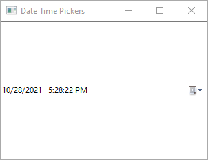 | 

[LibUI](https://github.com/kojix2/LibUI) Original Version:

```ruby
require 'libui'

UI = LibUI

UI.init

vbox = UI.new_vertical_box

date_time_picker = UI.new_date_time_picker

time = UI::FFI::TM.malloc

UI.date_time_picker_on_changed(date_time_picker) do
  UI.date_time_picker_time(date_time_picker, time)
  p sec: time.tm_sec,
    min: time.tm_min,
    hour: time.tm_hour,
    mday: time.tm_mday,
    mon: time.tm_mon,
    year: time.tm_year,
    wday: time.tm_wday,
    yday: time.tm_yday,
    isdst: time.tm_isdst
end
UI.box_append(vbox, date_time_picker, 1)

main_window = UI.new_window('Date Time Pickers', 300, 200, 1)
UI.window_on_closing(main_window) do
  puts 'Bye Bye'
  UI.control_destroy(main_window)
  UI.quit
  0
end
UI.window_set_child(main_window, vbox)
UI.control_show(main_window)

UI.main
UI.quit
```

[Glimmer DSL for LibUI](https://rubygems.org/gems/glimmer-dsl-libui) Version (with [data-binding](#data-binding)):

```ruby
require 'glimmer-dsl-libui'

class DateTimePicker
  include Glimmer
  
  attr_accessor :picked_time
  
  def launch
    window('Date Time Pickers', 300, 200) {
      vertical_box {
        date_time_picker {
          time <=> [self, :picked_time, after_write: ->(time) { p time }]
        }
      }
      
      on_closing do
        puts 'Bye Bye'
      end
    }.show
  end
end

DateTimePicker.new.launch
```

[Glimmer DSL for LibUI](https://rubygems.org/gems/glimmer-dsl-libui) Version 2 (without [data-binding](#data-binding)):

```ruby
require 'glimmer-dsl-libui'

include Glimmer

window('Date Time Pickers', 300, 200) {
  vertical_box {
    date_time_picker { |dtp|
      on_changed do
        time = dtp.time
        p time
      end
    }
  }
  
  on_closing do
    puts 'Bye Bye'
  end
}.show
```

#### Form

[examples/form.rb](examples/form.rb)

Run with this command from the root of the project if you cloned the project:

```
ruby -r './lib/glimmer-dsl-libui' examples/form.rb
```

Run with this command if you installed the [Ruby gem](https://rubygems.org/gems/glimmer-dsl-libui):

```
ruby -r glimmer-dsl-libui -e "require 'examples/form'"
```

Mac | Windows | Linux
----|---------|------
  |   |  

New [Glimmer DSL for LibUI](https://rubygems.org/gems/glimmer-dsl-libui) Version (with [data-binding](#data-binding)):

```ruby
require 'glimmer-dsl-libui'

class Form
  include Glimmer
  
  attr_accessor :first_name, :last_name, :phone, :email
  
  def launch
    window('Form') {
      margined true
      
      vertical_box {
        form {
          entry {
            label 'First Name' # label property is available when control is nested under form
            text <=> [self, :first_name] # bidirectional data-binding of entry text property to self first_name attribute
          }
          
          entry {
            label 'Last Name' # label property is available when control is nested under form
            text <=> [self, :last_name]
          }
          
          entry {
            label 'Phone' # label property is available when control is nested under form
            text <=> [self, :phone]
          }
          
          entry {
            label 'Email' # label property is available when control is nested under form
            text <=> [self, :email]
          }
        }
        
        button('Display Info') {
          stretchy false
          
          on_clicked do
            msg_box('Info', "#{first_name} #{last_name} has phone #{phone} and email #{email}")
          end
        }
      }
    }.show
  end
end

Form.new.launch
```

New [Glimmer DSL for LibUI](https://rubygems.org/gems/glimmer-dsl-libui) Version 2 (without [data-binding](#data-binding)):

```ruby
require 'glimmer-dsl-libui'

include Glimmer

window('Form') {
  margined true
  
  vertical_box {
    form {
      @first_name_entry = entry {
        label 'First Name' # label property is available when control is nested under form
      }
      
      @last_name_entry = entry {
        label 'Last Name' # label property is available when control is nested under form
      }
      
      @phone_entry = entry {
        label 'Phone' # label property is available when control is nested under form
      }
      
      @email_entry = entry {
        label 'Email' # label property is available when control is nested under form
      }
    }
    
    button('Display Info') {
      stretchy false
      
      on_clicked do
        msg_box('Info', "#{@first_name_entry.text} #{@last_name_entry.text} has phone #{@phone_entry.text} and email #{@email_entry.text}")
      end
    }
  }
}.show
```

#### Basic Table

[examples/basic_table.rb](examples/basic_table.rb)

Run with this command from the root of the project if you cloned the project:

```
ruby -r './lib/glimmer-dsl-libui' examples/basic_table.rb
```

Run with this command if you installed the [Ruby gem](https://rubygems.org/gems/glimmer-dsl-libui):

```
ruby -r glimmer-dsl-libui -e "require 'examples/basic_table'"
```

Mac | Windows | Linux
----|---------|------
 |  | 

[LibUI](https://github.com/kojix2/LibUI) Original Version:

```ruby
require 'libui'

UI = LibUI

UI.init

main_window = UI.new_window('Animal sounds', 300, 200, 1)

hbox = UI.new_horizontal_box
UI.window_set_child(main_window, hbox)

data = [
  %w[cat meow],
  %w[dog woof],
  %w[checken cock-a-doodle-doo],
  %w[horse neigh],
  %w[cow moo]
]

# Protects BlockCaller objects from garbage collection.
@blockcaller = []
def rbcallback(*args, &block)
  args << [0] if args.size == 1 # Argument types are ommited
  blockcaller = Fiddle::Closure::BlockCaller.new(*args, &block)
  @blockcaller << blockcaller
  blockcaller
end

model_handler = UI::FFI::TableModelHandler.malloc
model_handler.NumColumns   = rbcallback(4) { 2 }
model_handler.ColumnType   = rbcallback(4) { 0 }
model_handler.NumRows      = rbcallback(4) { 5 }
model_handler.CellValue    = rbcallback(1, [1, 1, 4, 4]) do |_, _, row, column|
  UI.new_table_value_string(data[row][column])
end
model_handler.SetCellValue = rbcallback(0, [0]) {}

model = UI.new_table_model(model_handler)

table_params = UI::FFI::TableParams.malloc
table_params.Model = model
table_params.RowBackgroundColorModelColumn = -1

table = UI.new_table(table_params)
UI.table_append_text_column(table, 'Animal', 0, -1)
UI.table_append_text_column(table, 'Description', 1, -1)

UI.box_append(hbox, table, 1)
UI.control_show(main_window)

UI.window_on_closing(main_window) do
  puts 'Bye Bye'
  UI.control_destroy(main_window)
  UI.free_table_model(model)
  UI.quit
  0
end

UI.main
UI.quit
```

[Glimmer DSL for LibUI](https://rubygems.org/gems/glimmer-dsl-libui) Version:

```ruby
require 'glimmer-dsl-libui'

include Glimmer

data = [
  %w[cat meow],
  %w[dog woof],
  %w[chicken cock-a-doodle-doo],
  %w[horse neigh],
  %w[cow moo]
]

window('Animal sounds', 300, 200) {
  horizontal_box {
    table {
      text_column('Animal')
      text_column('Description')

      cell_rows data
    }
  }
  
  on_closing do
    puts 'Bye Bye'
  end
}.show
```

#### Basic Table Image

Note that behavior varies per platform (i.e. how `table` chooses to size images by default).

[examples/basic_table_image.rb](examples/basic_table_image.rb)

Run with this command from the root of the project if you cloned the project:

```
ruby -r './lib/glimmer-dsl-libui' examples/basic_table_image.rb
```

Run with this command if you installed the [Ruby gem](https://rubygems.org/gems/glimmer-dsl-libui):

```
ruby -r glimmer-dsl-libui -e "require 'examples/basic_table_image'"
```

Mac | Windows | Linux
----|---------|------
 |  | 

[LibUI](https://github.com/kojix2/LibUI) Original Version:

```ruby
# NOTE:
# This example displays images that can be freely downloaded from the Studio Ghibli website.

require 'libui'
require 'chunky_png'
require 'open-uri'

UI = LibUI

UI.init

main_window = UI.new_window('The Red Turtle', 310, 350, 0)

hbox = UI.new_horizontal_box
UI.window_set_child(main_window, hbox)

IMAGES = []

50.times do |i|
  url = format('https://www.ghibli.jp/gallery/thumb-redturtle%03d.png', (i + 1))
  puts "Processing Image: #{url}"
  f = URI.open(url)
  canvas = ChunkyPNG::Canvas.from_io(f)
  f.close
  data = canvas.to_rgba_stream
  width = canvas.width
  height = canvas.height
  image = UI.new_image(width, height)
  UI.image_append(image, data, width, height, width * 4)
  IMAGES << image
rescue StandardError => e
  warn url, e.message
end

# Protects BlockCaller objects from garbage collection.
@blockcaller = []
def rbcallback(*args, &block)
  args << [0] if args.size == 1 # Argument types are ommited
  blockcaller = Fiddle::Closure::BlockCaller.new(*args, &block)
  @blockcaller << blockcaller
  blockcaller
end

model_handler = UI::FFI::TableModelHandler.malloc
model_handler.NumColumns   = rbcallback(4) { 1 }
model_handler.ColumnType   = rbcallback(4) { 1 } # Image
model_handler.NumRows      = rbcallback(4) { IMAGES.size }
model_handler.CellValue    = rbcallback(1, [1, 1, 4, 4]) do |_, _, row, _column|
  UI.new_table_value_image(IMAGES[row])
end
model_handler.SetCellValue = rbcallback(0, [0]) {}

model = UI.new_table_model(model_handler)

table_params = UI::FFI::TableParams.malloc
table_params.Model = model
table_params.RowBackgroundColorModelColumn = -1

table = UI.new_table(table_params)
UI.table_append_image_column(table, 'www.ghibli.jp/works/red-turtle', 0)

UI.box_append(hbox, table, 1)
UI.control_show(main_window)

UI.window_on_closing(main_window) do
  puts 'Bye Bye'
  UI.control_destroy(main_window)
  UI.free_table_model(model)
  IMAGES.each { |i| UI.free_image(i) }
  UI.quit
  0
end

UI.main
UI.quit
```

[Glimmer DSL for LibUI](https://rubygems.org/gems/glimmer-dsl-libui) Version (passing file url as image):

```ruby
# frozen_string_literal: true

# NOTE:
# This example displays images that can be freely downloaded from the Studio Ghibli website.

require 'glimmer-dsl-libui'

include Glimmer

IMAGE_ROWS = []

50.times do |i|
  url = format('https://www.ghibli.jp/gallery/thumb-redturtle%03d.png', (i + 1))
  puts "Processing Image: #{url}"; $stdout.flush # for Windows
  IMAGE_ROWS << [url] # array of one column cell
rescue StandardError => e
  warn url, e.message
end

window('The Red Turtle', 310, 350, false) {
  horizontal_box {
    table {
      image_column('www.ghibli.jp/works/red-turtle')
      
      cell_rows IMAGE_ROWS
    }
  }
  
  on_closing do
    puts 'Bye Bye'
  end
}.show
```

[Glimmer DSL for LibUI](https://rubygems.org/gems/glimmer-dsl-libui) Version 2 (automatic construction of `image`):

```ruby
# NOTE:
# This example displays images that can be freely downloaded from the Studio Ghibli website.

require 'glimmer-dsl-libui'

include Glimmer

IMAGE_ROWS = []

50.times do |i|
  url = format('https://www.ghibli.jp/gallery/thumb-redturtle%03d.png', (i + 1))
  puts "Processing Image: #{url}"; $stdout.flush # for Windows
  IMAGE_ROWS << [image(url)] # array of one column cell
rescue StandardError => e
  warn url, e.message
end

window('The Red Turtle', 310, 350, false) {
  horizontal_box {
    table {
      image_column('www.ghibli.jp/works/red-turtle')
      
      cell_rows IMAGE_ROWS
    }
  }
  
  on_closing do
    puts 'Bye Bye'
  end
}.show
```

[Glimmer DSL for LibUI](https://rubygems.org/gems/glimmer-dsl-libui) Version 3 (manual construction of `image` from `image_part`):

```ruby
# NOTE:
# This example displays images that can be freely downloaded from the Studio Ghibli website.

require 'glimmer-dsl-libui'
require 'chunky_png'
require 'open-uri'

include Glimmer

IMAGE_ROWS = []

50.times do |i|
  url = format('https://www.ghibli.jp/gallery/thumb-redturtle%03d.png', (i + 1))
  puts "Processing Image: #{url}"
  f = URI.open(url)
  canvas = ChunkyPNG::Canvas.from_io(f)
  f.close
  data = canvas.to_rgba_stream
  width = canvas.width
  height = canvas.height
  img = image {
    image_part(data, width, height, width * 4)
  }
  IMAGE_ROWS << [img] # array of one column cell
rescue StandardError => e
  warn url, e.message
end

window('The Red Turtle', 310, 350, false) {
  horizontal_box {
    table {
      image_column('www.ghibli.jp/works/red-turtle', 0)
      
      cell_rows IMAGE_ROWS
    }
  }
    
  on_closing do
    puts 'Bye Bye'
  end
}.show
```

#### Basic Table Image Text

Note that behavior varies per platform (i.e. how `table` chooses to size images by default).

[examples/basic_table_image_text.rb](examples/basic_table_image_text.rb)

Run with this command from the root of the project if you cloned the project:

```
ruby -r './lib/glimmer-dsl-libui' examples/basic_table_image_text.rb
```

Run with this command if you installed the [Ruby gem](https://rubygems.org/gems/glimmer-dsl-libui):

```
ruby -r glimmer-dsl-libui -e "require 'examples/basic_table_image_text'"
```

Mac | Windows | Linux
----|---------|------
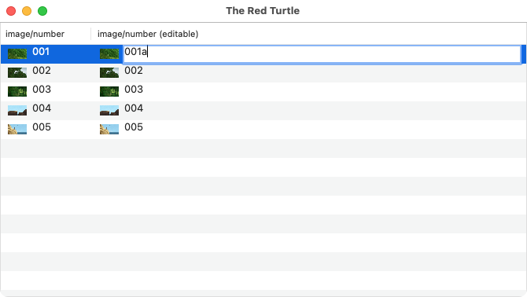 |  | 

New [Glimmer DSL for LibUI](https://rubygems.org/gems/glimmer-dsl-libui) Version (passing file url as image):

```ruby
# frozen_string_literal: true

# NOTE:
# This example displays images that can be freely downloaded from the Studio Ghibli website.

require 'glimmer-dsl-libui'

include Glimmer

IMAGE_ROWS = []

5.times do |i|
  url = format('https://www.ghibli.jp/gallery/thumb-redturtle%03d.png', (i + 1))
  puts "Processing Image: #{url}"; $stdout.flush # for Windows
  text = url.sub('https://www.ghibli.jp/gallery/thumb-redturtle', '').sub('.png', '')
  IMAGE_ROWS << [[url, text], [url, text]] # cell values are dual-element arrays
rescue StandardError => e
  warn url, e.message
end

window('The Red Turtle', 670, 350) {
  horizontal_box {
    table {
      image_text_column('image/number')
      image_text_column('image/number (editable)') {
        editable true
      }
      
      cell_rows IMAGE_ROWS
    }
  }
}.show
```

New [Glimmer DSL for LibUI](https://rubygems.org/gems/glimmer-dsl-libui) Version 2 (automatic construction of `image`):

```ruby
# NOTE:
# This example displays images that can be freely downloaded from the Studio Ghibli website.

require 'glimmer-dsl-libui'

include Glimmer

IMAGE_ROWS = []

5.times do |i|
  url = format('https://www.ghibli.jp/gallery/thumb-redturtle%03d.png', (i + 1))
  puts "Processing Image: #{url}"; $stdout.flush # for Windows
  text = url.sub('https://www.ghibli.jp/gallery/thumb-redturtle', '').sub('.png', '')
  img = image(url)
  IMAGE_ROWS << [[img, text], [img, text]] # cell values are dual-element arrays
rescue StandardError => e
  warn url, e.message
end

window('The Red Turtle', 670, 350) {
  horizontal_box {
    table {
      image_text_column('image/number')
      image_text_column('image/number (editable)') {
        editable true
      }
      
      cell_rows IMAGE_ROWS
    }
  }
}.show
```

New [Glimmer DSL for LibUI](https://rubygems.org/gems/glimmer-dsl-libui) Version 2 (manual construction of `image` from `image_part`):

```ruby
# NOTE:
# This example displays images that can be freely downloaded from the Studio Ghibli website.

require 'glimmer-dsl-libui'
require 'chunky_png'
require 'open-uri'

include Glimmer

IMAGE_ROWS = []

5.times do |i|
  url = format('https://www.ghibli.jp/gallery/thumb-redturtle%03d.png', (i + 1))
  puts "Processing Image: #{url}"
  f = URI.open(url)
  canvas = ChunkyPNG::Canvas.from_io(f)
  f.close
  data = canvas.to_rgba_stream
  width = canvas.width
  height = canvas.height
  img = image {
    image_part(data, width, height, width * 4)
  }
  text = url.sub('https://www.ghibli.jp/gallery/thumb-redturtle', '').sub('.png', '')
  IMAGE_ROWS << [[img, text], [img, text]] # cell values are dual-element arrays
rescue StandardError => e
  warn url, e.message
end

window('The Red Turtle', 670, 350) {
  horizontal_box {
    table {
      image_text_column('image/number')
      image_text_column('image/number (editable)') {
        editable true
      }
      
      cell_rows IMAGE_ROWS
    }
  }
}.show
```

#### Basic Table Button

[examples/basic_table_button.rb](examples/basic_table_button.rb)

Run with this command from the root of the project if you cloned the project:

```
ruby -r './lib/glimmer-dsl-libui' examples/basic_table_button.rb
```

Run with this command if you installed the [Ruby gem](https://rubygems.org/gems/glimmer-dsl-libui):

```
ruby -r glimmer-dsl-libui -e "require 'examples/basic_table_button'"
```

Mac | Windows | Linux
----|---------|------
  |   |  

New [Glimmer DSL for LibUI](https://rubygems.org/gems/glimmer-dsl-libui) Version (with explicit [data-binding](#data-binding)):

```ruby
require 'glimmer-dsl-libui'

class BasicTableButton
  BasicAnimal = Struct.new(:name, :sound)
  
  class Animal < BasicAnimal
    def action
      'delete'
    end
  end
  
  include Glimmer
  
  attr_accessor :animals
  
  def initialize
    @animals = [
      Animal.new('cat', 'meow'),
      Animal.new('dog', 'woof'),
      Animal.new('chicken', 'cock-a-doodle-doo'),
      Animal.new('horse', 'neigh'),
      Animal.new('cow', 'moo'),
    ]
  end
  
  def launch
    window('Animal sounds', 400, 200) {
      horizontal_box {
        table {
          text_column('Animal')
          text_column('Description')
          button_column('Action') {
            on_clicked do |row|
              # Option 1: direct data deletion is the simpler solution
#               @animals.delete_at(row) # automatically deletes actual table row due to explicit data-binding
              
              # Option 2: cloning only to demonstrate table row deletion upon explicit setting of animals attribute (cloning is not recommended beyond demonstrating this point)
              new_animals = @animals.clone
              new_animals.delete_at(row)
              self.animals = new_animals # automatically loses deleted table row due to explicit data-binding
            end
          }
    
          cell_rows <= [self, :animals, column_attributes: {'Animal' => :name, 'Description' => :sound}]
          
          # explicit unidirectional data-binding of table cell_rows to self.animals
          on_changed do |row, type, row_data|
            puts "Row #{row} #{type}: #{row_data}"
            $stdout.flush
          end
        }
      }
    }.show
  end
end

BasicTableButton.new.launch
```

New [Glimmer DSL for LibUI](https://rubygems.org/gems/glimmer-dsl-libui) Version 2 (with implicit [data-binding](#data-binding)):

```ruby
require 'glimmer-dsl-libui'

include Glimmer

data = [
  %w[cat meow delete],
  %w[dog woof delete],
  %w[chicken cock-a-doodle-doo delete],
  %w[horse neigh delete],
  %w[cow moo delete]
]

window('Animal sounds', 300, 200) {
  horizontal_box {
    table {
      text_column('Animal')
      text_column('Description')
      button_column('Action') {
        on_clicked do |row|
          data.delete_at(row) # automatically deletes actual table row due to implicit data-binding
        end
      }

      cell_rows data # implicit data-binding
      
      on_changed do |row, type, row_data|
        puts "Row #{row} #{type}: #{row_data}"
      end
    }
  }
}.show
```

#### Basic Table Checkbox

[examples/basic_table_checkbox.rb](examples/basic_table_checkbox.rb)

Run with this command from the root of the project if you cloned the project:

```
ruby -r './lib/glimmer-dsl-libui' examples/basic_table_checkbox.rb
```

Run with this command if you installed the [Ruby gem](https://rubygems.org/gems/glimmer-dsl-libui):

```
ruby -r glimmer-dsl-libui -e "require 'examples/basic_table_checkbox'"
```

Mac | Windows | Linux
----|---------|------
 |  | 

New [Glimmer DSL for LibUI](https://rubygems.org/gems/glimmer-dsl-libui) Version:

```ruby
require 'glimmer-dsl-libui'

include Glimmer

data = [
  ['cat', 'meow', true],
  ['dog', 'woof', true],
  ['chicken', 'cock-a-doodle-doo', false],
  ['horse', 'neigh', true],
  ['cow', 'moo', true]
]

window('Animal sounds', 300, 200) {
  horizontal_box {
    table {
      text_column('Animal')
      text_column('Description')
      checkbox_column('Mammal')

      cell_rows data
    }
  }
}.show
```

#### Basic Table Checkbox Text

[examples/basic_table_checkbox_text.rb](examples/basic_table_checkbox_text.rb)

Run with this command from the root of the project if you cloned the project:

```
ruby -r './lib/glimmer-dsl-libui' examples/basic_table_checkbox_text.rb
```

Run with this command if you installed the [Ruby gem](https://rubygems.org/gems/glimmer-dsl-libui):

```
ruby -r glimmer-dsl-libui -e "require 'examples/basic_table_checkbox_text'"
```

Mac | Windows | Linux
----|---------|------
 |  | 

New [Glimmer DSL for LibUI](https://rubygems.org/gems/glimmer-dsl-libui) Version:

```ruby
require 'glimmer-dsl-libui'

include Glimmer

data = [
  ['cat', 'meow', [true, 'mammal']],
  ['dog', 'woof', [true, 'mammal']],
  ['chicken', 'cock-a-doodle-doo', [false, 'mammal']],
  ['horse', 'neigh', [true, 'mammal']],
  ['cow', 'moo', [true, 'mammal']]
]

window('Animal sounds', 400, 200) {
  horizontal_box {
    table {
      text_column('Animal')
      text_column('Sound')
      checkbox_text_column('Description')

      cell_rows data
    }
  }
}.show
```

#### Basic Table Progress Bar

[examples/basic_table_progress_bar.rb](examples/basic_table_progress_bar.rb)

Run with this command from the root of the project if you cloned the project:

```
ruby -r './lib/glimmer-dsl-libui' examples/basic_table_progress_bar.rb
```

Run with this command if you installed the [Ruby gem](https://rubygems.org/gems/glimmer-dsl-libui):

```
ruby -r glimmer-dsl-libui -e "require 'examples/basic_table_progress_bar'"
```

Mac | Windows | Linux
----|---------|------
 |  | 

New [Glimmer DSL for LibUI](https://rubygems.org/gems/glimmer-dsl-libui) Version:

```ruby
require 'glimmer-dsl-libui'

include Glimmer

data = [
  ['task 1', 0],
  ['task 2', 15],
  ['task 3', 100],
  ['task 4', 75],
  ['task 5', -1],
]

window('Task Progress', 300, 200) {
  vertical_box {
    table {
      text_column('Task')
      progress_bar_column('Progress')

      cell_rows data # implicit data-binding
    }
    
    button('Mark All As Done') {
      stretchy false
      
      on_clicked do
        data.each_with_index do |row_data, row|
          data[row][1] = 100 # automatically updates table due to implicit data-binding
        end
      end
    }
  }
}.show
```

#### Basic Table Color

[examples/basic_table_color.rb](examples/basic_table_color.rb)

Run with this command from the root of the project if you cloned the project:

```
ruby -r './lib/glimmer-dsl-libui' examples/basic_table_color.rb
```

Run with this command if you installed the [Ruby gem](https://rubygems.org/gems/glimmer-dsl-libui):

```
ruby -r glimmer-dsl-libui -e "require 'examples/basic_table_color'"
```

Mac | Windows | Linux
----|---------|------
 |  | 

New [Glimmer DSL for LibUI](https://rubygems.org/gems/glimmer-dsl-libui) Version (with explicit [data-binding](#data-binding) to model rows using a presenter):

```ruby
require 'glimmer-dsl-libui'

class BasicTableColor
  Animal = Struct.new(:name, :sound, :mammal)
  
  class AnimalPresenter < Animal
    def name_color
      color = case name
      when 'cat'
        :red
      when 'dog'
        :yellow
      when 'chicken'
        :beige
      when 'horse'
        :purple
      when 'cow'
        :gray
      end
      [name, color]
    end
    
    def sound_color
      color = case name
      when 'cat', 'chicken', 'cow'
        :blue
      when 'dog', 'horse'
        {r: 240, g: 32, b: 32}
      end
      [sound, color]
    end
    
    def mammal_description_color
      color = case name
      when 'cat', 'dog', 'horse', 'cow'
        :green
      when 'chicken'
        :red
      end
      [mammal, 'mammal', color]
    end
    
    def image_description_color
      color = case name
      when 'cat', 'dog', 'horse'
        :dark_blue
      when 'chicken'
        :beige
      when 'cow'
        :brown
      end
      [img, 'Glimmer', color]
    end
    
    def img
      # scale image to 24x24 (can be passed as file path String only instead of Array to avoid scaling)
      [File.expand_path('../icons/glimmer.png', __dir__), 24, 24]
    end
    
    def background_color
      case name
      when 'cat'
        {r: 255, g: 120, b: 0, a: 0.5}
      when 'dog'
        :skyblue
      when 'chicken'
        {r: 5, g: 120, b: 110}
      when 'horse'
        '#13a1fb'
      when 'cow'
        0x12ff02
      end
    end
  end
  
  include Glimmer
  
  attr_accessor :animals
  
  def initialize
    @animals = [
      AnimalPresenter.new('cat', 'meow', true),
      AnimalPresenter.new('dog', 'woof', true),
      AnimalPresenter.new('chicken', 'cock-a-doodle-doo', false),
      AnimalPresenter.new('horse', 'neigh', true),
      AnimalPresenter.new('cow', 'moo', true),
    ]
  end
  
  def launch
    window('Animals', 500, 200) {
      horizontal_box {
        table {
          text_color_column('Animal')
          text_color_column('Sound')
          checkbox_text_color_column('Description')
          image_text_color_column('GUI')
          background_color_column # must always be the last column and always expects data-binding model attribute `background_color` when binding to Array of models
    
          cell_rows <= [self, :animals, column_attributes: {'Animal' => :name_color, 'Sound' => :sound_color, 'Description' => :mammal_description_color, 'GUI' => :image_description_color}]
        }
      }
    }.show
  end
end

BasicTableColor.new.launch
```

New [Glimmer DSL for LibUI](https://rubygems.org/gems/glimmer-dsl-libui) Version 2 (with implicit [data-binding](#data-binding) to raw data rows):

```ruby
require 'glimmer-dsl-libui'

include Glimmer

img = [File.expand_path('../icons/glimmer.png', __dir__), 24, 24] # scales image to 24x24 (can be passed as file path String only instead of Array to avoid scaling)

data = [
  [['cat', :red]      , ['meow', :blue]                  , [true, 'mammal', :green], [img, 'Glimmer', :dark_blue], {r: 255, g: 120, b: 0, a: 0.5}],
  [['dog', :yellow]   , ['woof', {r: 240, g: 32, b: 32}] , [true, 'mammal', :green], [img, 'Glimmer', :dark_blue], :skyblue],
  [['chicken', :beige], ['cock-a-doodle-doo', :blue]     , [false, 'mammal', :red] , [img, 'Glimmer', :beige], {r: 5, g: 120, b: 110}],
  [['horse', :purple] , ['neigh', {r: 240, g: 32, b: 32}], [true, 'mammal', :green], [img, 'Glimmer', :dark_blue], '13a1fb'],
  [['cow', :gray]     , ['moo', :blue]                   , [true, 'mammal', :green], [img, 'Glimmer', :brown], 0x12ff02]
]

window('Animals', 500, 200) {
  horizontal_box {
    table {
      text_color_column('Animal')
      text_color_column('Sound')
      checkbox_text_color_column('Description')
      image_text_color_column('GUI')
      background_color_column # must be the last column

      cell_rows data
    }
  }
}.show
```

New [Glimmer DSL for LibUI](https://rubygems.org/gems/glimmer-dsl-libui) Version 3 (with implicit [data-binding](#data-binding) to raw data rows and manual construction of [libui](https://github.com/andlabs/libui) `image` from `image_part`):

```ruby
require 'glimmer-dsl-libui'
require 'chunky_png'

include Glimmer

f = File.open(File.expand_path('../icons/glimmer.png', __dir__))
canvas = ChunkyPNG::Canvas.from_io(f)
f.close
canvas.resample_nearest_neighbor!(24, 24)
data = canvas.to_rgba_stream
width = canvas.width
height = canvas.height
img = image {
  image_part(data, width, height, width * 4)
}

data = [
  [['cat', :red]      , ['meow', :blue]                  , [true, 'mammal', :green], [img, 'Glimmer', :dark_blue], {r: 255, g: 120, b: 0, a: 0.5}],
  [['dog', :yellow]   , ['woof', {r: 240, g: 32, b: 32}] , [true, 'mammal', :green], [img, 'Glimmer', :dark_blue], :skyblue],
  [['chicken', :beige], ['cock-a-doodle-doo', :blue]     , [false, 'mammal', :red] , [img, 'Glimmer', :beige], {r: 5, g: 120, b: 110}],
  [['horse', :purple] , ['neigh', {r: 240, g: 32, b: 32}], [true, 'mammal', :green], [img, 'Glimmer', :dark_blue], '13a1fb'],
  [['cow', :gray]     , ['moo', :blue]                   , [true, 'mammal', :green], [img, 'Glimmer', :brown], 0x12ff02]
]

window('Animals', 500, 200) {
  horizontal_box {
    table {
      text_color_column('Animal')
      text_color_column('Sound')
      checkbox_text_color_column('Description')
      image_text_color_column('GUI')
      background_color_column

      cell_rows data
    }
  }
}.show
```

#### Basic Area

[examples/basic_area.rb](examples/basic_area.rb)

Run with this command from the root of the project if you cloned the project:

```
ruby -r './lib/glimmer-dsl-libui' examples/basic_area.rb
```

Run with this command if you installed the [Ruby gem](https://rubygems.org/gems/glimmer-dsl-libui):

```
ruby -r glimmer-dsl-libui -e "require 'examples/basic_area'"
```

Mac | Windows | Linux
----|---------|------
 |  | 

[LibUI](https://github.com/kojix2/LibUI) Original Version:

```ruby
require 'libui'

UI = LibUI

UI.init

handler = UI::FFI::AreaHandler.malloc
area    = UI.new_area(handler)
brush   = UI::FFI::DrawBrush.malloc

handler_draw_event = Fiddle::Closure::BlockCaller.new(0, [1, 1, 1]) do |_, _, area_draw_params|
  path = UI.draw_new_path(0)
  UI.draw_path_add_rectangle(path, 0, 0, 400, 400)
  UI.draw_path_end(path)
  brush.Type = 0
  brush.R = 0.4
  brush.G = 0.4
  brush.B = 0.8
  brush.A = 1.0
  area_draw_params = UI::FFI::AreaDrawParams.new(area_draw_params)
  UI.draw_fill(area_draw_params.Context, path, brush.to_ptr)
  UI.draw_free_path(path)
end

handler.Draw         = handler_draw_event
handler.MouseEvent   = Fiddle::Closure::BlockCaller.new(0, [0]) {}
handler.MouseCrossed = Fiddle::Closure::BlockCaller.new(0, [0]) {}
handler.DragBroken   = Fiddle::Closure::BlockCaller.new(0, [0]) {}
handler.KeyEvent     = Fiddle::Closure::BlockCaller.new(0, [0]) {}

box = UI.new_vertical_box
UI.box_set_padded(box, 1)
UI.box_append(box, area, 1)

main_window = UI.new_window('Basic Area', 400, 400, 1)
UI.window_set_margined(main_window, 1)
UI.window_set_child(main_window, box)

UI.window_on_closing(main_window) do
  UI.control_destroy(main_window)
  UI.quit
  0
end
UI.control_show(main_window)

UI.main
UI.quit
```

[Glimmer DSL for LibUI](https://rubygems.org/gems/glimmer-dsl-libui) Version:

```ruby
require 'glimmer-dsl-libui'

include Glimmer

window('Basic Area', 400, 400) {
  margined true
  
  vertical_box {
    area {
      path { # a stable path is added declaratively
        rectangle(0, 0, 400, 400)
        
        fill r: 102, g: 102, b: 204, a: 1.0
      }
    }
  }
}.show
```

[Glimmer DSL for LibUI](https://rubygems.org/gems/glimmer-dsl-libui) Version 2 (semi-declarative `on_draw` dynamic `path` approach):

```ruby
require 'glimmer-dsl-libui'

include Glimmer

window('Basic Area', 400, 400) {
  margined true
  
  vertical_box {
    area {
      on_draw do |area_draw_params|
        path { # a dynamic path is added semi-declaratively inside on_draw block
          rectangle(0, 0, 400, 400)
          
          fill r: 102, g: 102, b: 204, a: 1.0
        }
      end
    }
  }
}.show
```

#### Basic Scrolling Area

[examples/basic_scrolling_area.rb](examples/basic_scrolling_area.rb)

Run with this command from the root of the project if you cloned the project:

```
ruby -r './lib/glimmer-dsl-libui' examples/basic_scrolling_area.rb
```

Run with this command if you installed the [Ruby gem](https://rubygems.org/gems/glimmer-dsl-libui):

```
ruby -r glimmer-dsl-libui -e "require 'examples/basic_scrolling_area'"
```

Mac | Windows | Linux
----|---------|------
  |   |  

New [Glimmer DSL for LibUI](https://rubygems.org/gems/glimmer-dsl-libui) Version:

```ruby
require 'glimmer-dsl-libui'

class BasicScrollingArea
  include Glimmer
  
  SCROLLING_AREA_WIDTH = 800
  SCROLLING_AREA_HEIGHT = 400
  SCROLLING_AREA_PADDING_X = 20
  SCROLLING_AREA_PADDING_Y = 20
  
  def initialize
    @x = SCROLLING_AREA_PADDING_X
    @y = SCROLLING_AREA_HEIGHT - SCROLLING_AREA_PADDING_Y
    create_gui
    Glimmer::LibUI.timer(0.01) do
      @x += SCROLLING_AREA_PADDING_X
      @y = [[@y + rand(SCROLLING_AREA_PADDING_Y*4)*(rand(2) == 0 ? -1 : 1), SCROLLING_AREA_PADDING_Y].max, SCROLLING_AREA_HEIGHT - SCROLLING_AREA_PADDING_Y].min
      @graph.content { # re-open @graph's content and add a line
        line(@x, @y)
      }
      # if there is a need to enlarge scrolling area, call `@scrolling_area.set_size(new_width, new_height)`
      @scrolling_area.scroll_to(@x - (SCROLLING_AREA_WIDTH/2), @y) # 3rd and 4th arguments for width and height are assumed as those of main window by default if not supplied
      # return false to stop timer once @x exceeds scrolling area width - padding
      false if @x >= (SCROLLING_AREA_WIDTH - SCROLLING_AREA_PADDING_X*2)
    end
  end
  
  def launch
    @main_window.show
  end
  
  def x_axis
    polyline(SCROLLING_AREA_PADDING_X, SCROLLING_AREA_HEIGHT - SCROLLING_AREA_PADDING_Y, SCROLLING_AREA_WIDTH - SCROLLING_AREA_PADDING_X*2, SCROLLING_AREA_HEIGHT - SCROLLING_AREA_PADDING_Y) {
      stroke :black, thickness: 3
    }
    
    ((SCROLLING_AREA_WIDTH - SCROLLING_AREA_PADDING_X*4) / SCROLLING_AREA_PADDING_X).times do |x_multiplier|
      x = x_multiplier*SCROLLING_AREA_PADDING_X + SCROLLING_AREA_PADDING_X*2
      y = SCROLLING_AREA_HEIGHT - SCROLLING_AREA_PADDING_Y
      
      polyline(x, y, x, y + SCROLLING_AREA_PADDING_Y/2) {
        stroke :black, thickness: 2
      }
    end
  end
  
  def y_axis
    polyline(SCROLLING_AREA_PADDING_X, SCROLLING_AREA_PADDING_Y, SCROLLING_AREA_PADDING_X, SCROLLING_AREA_HEIGHT - SCROLLING_AREA_PADDING_Y) {
      stroke :black, thickness: 3
    }
    
    ((SCROLLING_AREA_HEIGHT - SCROLLING_AREA_PADDING_Y*3) / SCROLLING_AREA_PADDING_Y).times do |y_multiplier|
      x = SCROLLING_AREA_PADDING_X
      y = y_multiplier*SCROLLING_AREA_PADDING_Y + SCROLLING_AREA_PADDING_Y*2
      
      polyline(x, y, x - SCROLLING_AREA_PADDING_X/2, y) {
        stroke :black, thickness: 2
      }
    end
  end
  
  def create_gui
    @main_window = window('Basic Scrolling Area', SCROLLING_AREA_WIDTH / 2, SCROLLING_AREA_HEIGHT) {
      resizable false
      
      @scrolling_area = scrolling_area(SCROLLING_AREA_WIDTH, SCROLLING_AREA_HEIGHT) {
        x_axis
        y_axis
        
        @graph = figure(SCROLLING_AREA_PADDING_X, SCROLLING_AREA_HEIGHT - SCROLLING_AREA_PADDING_Y) {
          stroke :blue, thickness: 2
        }
      }
    }
  end
end

BasicScrollingArea.new.launch
```

#### Basic Image

Please note the caveats of [Area Image](#area-image) **(Alpha Feature)** with regards to this example.

[examples/basic_image.rb](examples/basic_image.rb)

Run with this command from the root of the project if you cloned the project:

```
ruby -r './lib/glimmer-dsl-libui' examples/basic_image.rb
```

Run with this command if you installed the [Ruby gem](https://rubygems.org/gems/glimmer-dsl-libui):

```
ruby -r glimmer-dsl-libui -e "require 'examples/basic_image'"
```

Mac | Windows | Linux
----|---------|------
 |  | 

New [Glimmer DSL for LibUI](https://rubygems.org/gems/glimmer-dsl-libui) Version:

```ruby
require 'glimmer-dsl-libui'

include Glimmer

window('Basic Image', 96, 96) {
  area {
    # image is not a real LibUI control. It is built in Glimmer as a custom control that renders
    # tiny pixels/lines as rectangle paths. As such, it does not have good performance, but can
    # be used in exceptional circumstances where an image control is really needed.
    #
    # Furthermore, adding image directly under area is even slower due to taking up more memory for every
    # image pixel rendered. Check basic_image2.rb for a faster alternative using on_draw manually.
    #
    # It is recommended to pass width/height args to shrink image and achieve faster performance.
    image(File.expand_path('../icons/glimmer.png', __dir__), height: 96) # width is automatically calculated from height while preserving original aspect ratio
#     image(File.expand_path('../icons/glimmer.png', __dir__), width: 96, height: 96) # you can specify both width, height options as alternative
#     image(File.expand_path('../icons/glimmer.png', __dir__), 96, 96) # you can specify width, height args as alternative
#     image(File.expand_path('../icons/glimmer.png', __dir__), 0, 0, 96, 96) # you can specify x, y, width, height args as alternative
#     image(File.expand_path('../icons/glimmer.png', __dir__), x: 0, y: 0, width: 96, height: 96) # you can specify x, y, width, height options as alternative
  }
}.show
```

New [Glimmer DSL for LibUI](https://rubygems.org/gems/glimmer-dsl-libui) Version 2 (better performance via `on_draw`):

```ruby
require 'glimmer-dsl-libui'

include Glimmer

window('Basic Image', 96, 96) {
  area {
    on_draw do |area_draw_params|
      image(File.expand_path('../icons/glimmer.png', __dir__), height: 96)
    end
  }
}.show
```

New [Glimmer DSL for LibUI](https://rubygems.org/gems/glimmer-dsl-libui) Version 3 (explicit properties):

```ruby
require 'glimmer-dsl-libui'

include Glimmer

window('Basic Image', 96, 96) {
  area {
    # image is not a real LibUI control. It is built in Glimmer as a custom control that renders
    # tiny pixels/lines as rectangle paths. As such, it does not have good performance, but can
    # be used in exceptional circumstances where an image control is really needed.
    #
    # Furthermore, adding image directly under area is even slower due to taking up more memory for every
    # image pixel rendered. Check basic_image4.rb for a faster alternative using on_draw manually.
    #
    # It is recommended to pass width/height args to shrink image and achieve faster performance.
    image {
      file File.expand_path('../icons/glimmer.png', __dir__)
#       x 0 # default
#       y 0 # default
#       width 96 # gets calculated from height while preserving original aspect ratio of 512x512
      height 96
    }
  }
}.show
```

New [Glimmer DSL for LibUI](https://rubygems.org/gems/glimmer-dsl-libui) Version 4 (better performance with `on_draw` when setting explicit properties):

```ruby
require 'glimmer-dsl-libui'

include Glimmer

window('Basic Image', 96, 96) {
  area {
    on_draw do |area_draw_params|
      image {
        file File.expand_path('../icons/glimmer.png', __dir__)
        height 96
      }
    end
  }
}.show
```

New [Glimmer DSL for LibUI](https://rubygems.org/gems/glimmer-dsl-libui) Version 5 (fully manual pixel-by-pixel rendering):

```ruby
# frozen_string_literal: true

# This is the manual way of rendering an image unto an area control.
# It could come in handy in special situations.
# Otherwise, it is recommended to simply utilize the `image` control that
# can be nested under area or area on_draw listener to automate all this work.

require 'glimmer-dsl-libui'
require 'chunky_png'

include Glimmer

puts 'Parsing image...'; $stdout.flush

f = File.open(File.expand_path('../icons/glimmer.png', __dir__))
canvas = ChunkyPNG::Canvas.from_io(f)
f.close
canvas.resample_nearest_neighbor!(96, 96)
data = canvas.to_rgba_stream
width = canvas.width
height = canvas.height
puts "Image width: #{width}"
puts "Image height: #{height}"

puts 'Parsing colors...'; $stdout.flush

color_maps = height.times.map do |y|
  width.times.map do |x|
    r = data[(y*width + x)*4].ord
    g = data[(y*width + x)*4 + 1].ord
    b = data[(y*width + x)*4 + 2].ord
    a = data[(y*width + x)*4 + 3].ord
    {x: x, y: y, color: {r: r, g: g, b: b, a: a}}
  end
end.flatten
puts "#{color_maps.size} pixels to render..."; $stdout.flush

puts 'Parsing shapes...'; $stdout.flush

shape_maps = []
original_color_maps = color_maps.dup
indexed_original_color_maps = Hash[original_color_maps.each_with_index.to_a]
color_maps.each do |color_map|
  index = indexed_original_color_maps[color_map]
  @rectangle_start_x ||= color_map[:x]
  @rectangle_width ||= 1
  if color_map[:x] < width - 1 && color_map[:color] == original_color_maps[index + 1][:color]
    @rectangle_width += 1
  else
    if color_map[:x] > 0 && color_map[:color] == original_color_maps[index - 1][:color]
      shape_maps << {x: @rectangle_start_x, y: color_map[:y], width: @rectangle_width, height: 1, color: color_map[:color]}
    else
      shape_maps << {x: color_map[:x], y: color_map[:y], width: 1, height: 1, color: color_map[:color]}
    end
    @rectangle_width = 1
    @rectangle_start_x = color_map[:x] == width - 1 ? 0 : color_map[:x] + 1
  end
end
puts "#{shape_maps.size} shapes to render..."; $stdout.flush

puts 'Rendering image...'; $stdout.flush

window('Basic Image', 96, 96) {
  area {
    on_draw do |area_draw_params|
      shape_maps.each do |shape_map|
        path {
          rectangle(shape_map[:x], shape_map[:y], shape_map[:width], shape_map[:height])

          fill shape_map[:color]
        }
      end
    end
  }
}.show
```

#### Basic Transform

[examples/basic_transform.rb](examples/basic_transform.rb)

Run with this command from the root of the project if you cloned the project:

```
ruby -r './lib/glimmer-dsl-libui' examples/basic_transform.rb
```

Run with this command if you installed the [Ruby gem](https://rubygems.org/gems/glimmer-dsl-libui):

```
ruby -r glimmer-dsl-libui -e "require 'examples/basic_transform'"
```

Mac | Windows | Linux
----|---------|------
 |  | 

New [Glimmer DSL for LibUI](https://rubygems.org/gems/glimmer-dsl-libui) Version:

```ruby
require 'glimmer-dsl-libui'

include Glimmer

window('Basic Transform', 350, 350) {
  area {
    square(0, 0, 350) {
      fill r: 255, g: 255, b: 0
    }
    40.times do |n|
      square(0, 0, 100) {
        fill r: [255 - n*5, 0].max, g: [n*5, 255].min, b: 0, a: 0.5
        stroke :black, thickness: 2
        
        transform {
          unless OS.windows?
            skew 0.15, 0.15
            translate 50, 50
          end
          rotate 100, 100, -9 * n
          scale 1.1, 1.1
          if OS.windows?
            skew 0.15, 0.15
            translate 50, 50
          end
        }
      }
    end
  }
}.show
```

New [Glimmer DSL for LibUI](https://rubygems.org/gems/glimmer-dsl-libui) Version 2:

```ruby
require 'glimmer-dsl-libui'

include Glimmer

window('Basic Transform', 350, 350) {
  area {
    path {
      square(0, 0, 350)
      
      fill r: 255, g: 255, b: 0
    }
    40.times do |n|
      path {
        square(0, 0, 100)
        
        fill r: [255 - n*5, 0].max, g: [n*5, 255].min, b: 0, a: 0.5
        stroke :black, thickness: 2
        
        transform {
          unless OS.windows?
            skew 0.15, 0.15
            translate 50, 50
          end
          rotate 100, 100, -9 * n
          scale 1.1, 1.1
          if OS.windows?
            skew 0.15, 0.15
            translate 50, 50
          end
        }
      }
    end
  }
}.show
```

#### Basic Draw Text

[examples/basic_draw_text.rb](examples/basic_draw_text.rb)

Run with this command from the root of the project if you cloned the project:

```
ruby -r './lib/glimmer-dsl-libui' examples/basic_draw_text.rb
```

Run with this command if you installed the [Ruby gem](https://rubygems.org/gems/glimmer-dsl-libui):

```
ruby -r glimmer-dsl-libui -e "require 'examples/basic_draw_text'"
```

Mac | Windows | Linux
----|---------|------
 |  | 

[LibUI](https://github.com/kojix2/LibUI) Original Version:

```ruby
require 'libui'

UI = LibUI

UI.init

handler = UI::FFI::AreaHandler.malloc
area    = UI.new_area(handler)

# Michael Ende (1929-1995)
# The Neverending Story is a fantasy novel by German writer Michael Ende,
# The English version, translated by Ralph Manheim, was published in 1983.

TITLE = 'Michael Ende (1929-1995) The Neverending Story'

str1 = \
  '  At last Ygramul sensed that something was coming toward ' \
  'her. With the speed of lightning, she turned about, confronting ' \
  'Atreyu with an enormous steel-blue face. Her single eye had a ' \
  'vertical pupil, which stared at Atreyu with inconceivable malignancy. '

str2 = \
  '  A cry of fear escaped Bastian. '

str3 = \
  '  A cry of terror passed through the ravine and echoed from ' \
  'side to side. Ygramul turned her eye to left and right, to see if ' \
  'someone else had arrived, for that sound could not have been ' \
  'made by the boy who stood there as though paralyzed with ' \
  'horror. '

str4 = \
  '  Could she have heard my cry? Bastion wondered in alarm. ' \
  "But that's not possible. "

str5 = \
  '  And then Atreyu heard Ygramuls voice. It was very high ' \
  'and slightly hoarse, not at all the right kind of voice for that ' \
  'enormous face. Her lips did not move as she spoke. It was the ' \
  'buzzing of a great swarm of hornets that shaped itself into ' \
  'words. '

str = ''
attr_str = UI.new_attributed_string(str)

def attr_str.append(what, color)
  case color
  when :red
    color_attribute = UI.new_color_attribute(0.0, 0.5, 0.0, 0.7)
  when :green
    color_attribute = UI.new_color_attribute(0.5, 0.0, 0.25, 0.7)
  end
  start = UI.attributed_string_len(self)
  UI.attributed_string_append_unattributed(self, what)
  UI.attributed_string_set_attribute(self, color_attribute, start, start + what.size)
  UI.attributed_string_append_unattributed(self, "\n\n")
end

attr_str.append(str1, :green)
attr_str.append(str2, :red)
attr_str.append(str3, :green)
attr_str.append(str4, :red)
attr_str.append(str5, :green)

Georgia = 'Georgia'

handler_draw_event = Fiddle::Closure::BlockCaller.new(0, [1, 1, 1]) do |_, _, adp|
  area_draw_params = UI::FFI::AreaDrawParams.new(adp)
  default_font = UI::FFI::FontDescriptor.malloc
  default_font.Family = Georgia
  default_font.Size = 13
  default_font.Weight = 500
  default_font.Italic = 0
  default_font.Stretch = 4
  params = UI::FFI::DrawTextLayoutParams.malloc

  # UI.font_button_font(font_button, default_font)
  params.String = attr_str
  params.DefaultFont = default_font
  params.Width = area_draw_params.AreaWidth
  params.Align = 0
  text_layout = UI.draw_new_text_layout(params)
  UI.draw_text(area_draw_params.Context, text_layout, 0, 0)
  UI.draw_free_text_layout(text_layout)
end

handler.Draw         = handler_draw_event
# Assigning to local variables
# This is intended to protect Fiddle::Closure from garbage collection.
handler.MouseEvent   = (c1 = Fiddle::Closure::BlockCaller.new(0, [0]) {})
handler.MouseCrossed = (c2 = Fiddle::Closure::BlockCaller.new(0, [0]) {})
handler.DragBroken   = (c3 = Fiddle::Closure::BlockCaller.new(0, [0]) {})
handler.KeyEvent     = (c4 = Fiddle::Closure::BlockCaller.new(0, [0]) {})

box = UI.new_vertical_box
UI.box_set_padded(box, 1)
UI.box_append(box, area, 1)

main_window = UI.new_window(TITLE, 600, 400, 1)
UI.window_set_margined(main_window, 1)
UI.window_set_child(main_window, box)

UI.window_on_closing(main_window) do
  UI.control_destroy(main_window)
  UI.quit
  0
end
UI.control_show(main_window)

UI.main
UI.quit
```

[Glimmer DSL for LibUI](https://rubygems.org/gems/glimmer-dsl-libui) Version:

```ruby
require 'glimmer-dsl-libui'

# Michael Ende (1929-1995)
# The Neverending Story is a fantasy novel by German writer Michael Ende,
# The English version, translated by Ralph Manheim, was published in 1983.
class BasicDrawText
  include Glimmer
  
  def alternating_color_string(initial: false, &block)
    @index = 0 if initial
    @index += 1
    string {
      if @index.odd?
        color r: 0.5, g: 0, b: 0.25, a: 0.7
      else
        color r: 0, g: 0.5, b: 0, a: 0.7
      end
      
      block.call + "\n\n"
    }
  end
  
  def launch
    window('Michael Ende (1929-1995) The Neverending Story', 600, 400) {
      margined true
      
      area {
        text { # default arguments for x, y, and width are (0, 0, area_draw_params[:area_width])
          # align :left # default alignment
          default_font family: 'Georgia', size: 13, weight: :medium, italic: :normal, stretch: :normal
            
          alternating_color_string(initial: true) {
            '  At last Ygramul sensed that something was coming toward ' \
            'her. With the speed of lightning, she turned about, confronting ' \
            'Atreyu with an enormous steel-blue face. Her single eye had a ' \
            'vertical pupil, which stared at Atreyu with inconceivable malignancy. '
          }
          alternating_color_string {
            '  A cry of fear escaped Bastian. '
          }
          alternating_color_string {
            '  A cry of terror passed through the ravine and echoed from ' \
            'side to side. Ygramul turned her eye to left and right, to see if ' \
            'someone else had arrived, for that sound could not have been ' \
            'made by the boy who stood there as though paralyzed with ' \
            'horror. '
          }
          alternating_color_string {
            '  Could she have heard my cry? Bastion wondered in alarm. ' \
            "But that's not possible. "
          }
          alternating_color_string {
            '  And then Atreyu heard Ygramuls voice. It was very high ' \
            'and slightly hoarse, not at all the right kind of voice for that ' \
            'enormous face. Her lips did not move as she spoke. It was the ' \
            'buzzing of a great swarm of hornets that shaped itself into ' \
            'words. '
          }
        }
      }
    }.show
  end
end

BasicDrawText.new.launch
```

[Glimmer DSL for LibUI](https://rubygems.org/gems/glimmer-dsl-libui) Version 2:

```ruby
require 'glimmer-dsl-libui'

# Michael Ende (1929-1995)
# The Neverending Story is a fantasy novel by German writer Michael Ende,
# The English version, translated by Ralph Manheim, was published in 1983.
class BasicDrawText
  include Glimmer
  
  def alternating_color_string(initial: false, &block)
    @index = 0 if initial
    @index += 1
    string {
      if @index.odd?
        color r: 0.5, g: 0, b: 0.25, a: 0.7
      else
        color r: 0, g: 0.5, b: 0, a: 0.7
      end
      
      block.call + "\n\n"
    }
  end
  
  def launch
    window('Michael Ende (1929-1995) The Neverending Story', 600, 400) {
      margined true
      
      area {
        on_draw do |area_draw_params|
          text { # default arguments for x, y, and width are (0, 0, area_draw_params[:area_width])
            # align :left # default alignment
            default_font family: 'Georgia', size: 13, weight: :medium, italic: :normal, stretch: :normal
              
            alternating_color_string(initial: true) {
              '  At last Ygramul sensed that something was coming toward ' \
              'her. With the speed of lightning, she turned about, confronting ' \
              'Atreyu with an enormous steel-blue face. Her single eye had a ' \
              'vertical pupil, which stared at Atreyu with inconceivable malignancy. '
            }
            alternating_color_string {
              '  A cry of fear escaped Bastian. '
            }
            alternating_color_string {
              '  A cry of terror passed through the ravine and echoed from ' \
              'side to side. Ygramul turned her eye to left and right, to see if ' \
              'someone else had arrived, for that sound could not have been ' \
              'made by the boy who stood there as though paralyzed with ' \
              'horror. '
            }
            alternating_color_string {
              '  Could she have heard my cry? Bastion wondered in alarm. ' \
              "But that's not possible. "
            }
            alternating_color_string {
              '  And then Atreyu heard Ygramuls voice. It was very high ' \
              'and slightly hoarse, not at all the right kind of voice for that ' \
              'enormous face. Her lips did not move as she spoke. It was the ' \
              'buzzing of a great swarm of hornets that shaped itself into ' \
              'words. '
            }
          }
        end
      }
    }.show
  end
end

BasicDrawText.new.launch
```

#### Basic Code Area

[examples/basic_code_area.rb](examples/basic_code_area.rb)

Run with this command from the root of the project if you cloned the project:

```
ruby -r './lib/glimmer-dsl-libui' examples/basic_code_area.rb
```

Run with this command if you installed the [Ruby gem](https://rubygems.org/gems/glimmer-dsl-libui):

```
ruby -r glimmer-dsl-libui -e "require 'examples/basic_code_area'"
```

Mac | Windows | Linux
----|---------|------
 |  | 

New [Glimmer DSL for LibUI](https://rubygems.org/gems/glimmer-dsl-libui) Version:

```ruby
require 'glimmer-dsl-libui'

class BasicCodeArea
  include Glimmer::LibUI::Application
  
  before_body do
    @code = <<~CODE
      # Greets target with greeting
      def greet(greeting: 'Hello', target: 'World')
        
        puts "\#{greeting}, \#{target}!"
      end
      
      greet
      greet(target: 'Robert')
      greet(greeting: 'Aloha')
      greet(greeting: 'Aloha', target: 'Nancy')
      greet(greeting: 'Howdy', target: 'Doodle')
    CODE
  end
  
  body {
    window('Basic Code Area', 400, 300) {
      margined true
      
      code_area(language: 'ruby', code: @code)
    }
  }
end

BasicCodeArea.launch
```

### Advanced Examples

#### Area Gallery

[examples/area_gallery.rb](examples/area_gallery.rb)

Run with this command from the root of the project if you cloned the project:

```
ruby -r './lib/glimmer-dsl-libui' examples/area_gallery.rb
```

Run with this command if you installed the [Ruby gem](https://rubygems.org/gems/glimmer-dsl-libui):

```
ruby -r glimmer-dsl-libui -e "require 'examples/area_gallery'"
```

Mac | Windows | Linux
----|---------|------
 |  | 

New [Glimmer DSL for LibUI](https://rubygems.org/gems/glimmer-dsl-libui) Version:

```ruby
require 'glimmer-dsl-libui'

include Glimmer

window('Area Gallery', 400, 400) {
  area {
    path { # declarative stable path (explicit path syntax for multiple shapes sharing attributes)
      square(0, 0, 100)
      square(100, 100, 400)
      
      fill r: 102, g: 102, b: 204
    }
    
    path { # declarative stable path (explicit path syntax for multiple shapes sharing attributes)
      rectangle(0, 100, 100, 400)
      rectangle(100, 0, 400, 100)
      
      # linear gradient (has x0, y0, x1, y1, and stops)
      fill x0: 10, y0: 10, x1: 350, y1: 350, stops: [{pos: 0.25, r: 204, g: 102, b: 204}, {pos: 0.75, r: 102, g: 102, b: 204}]
    }
    
    polygon(100, 100, 100, 400, 400, 100, 400, 400) { # declarative stable path (implicit path syntax for a single shape nested directly under area)
      fill r: 202, g: 102, b: 104, a: 0.5
      stroke r: 0, g: 0, b: 0
    }
    
    polybezier(0, 0,
               200, 100, 100, 200, 400, 100,
               300, 100, 100, 300, 100, 400,
               100, 300, 300, 100, 400, 400) { # declarative stable path (implicit path syntax for a single shape nested directly under area)
      fill r: 202, g: 102, b: 204, a: 0.5
      stroke r: 0, g: 0, b: 0, thickness: 2, dashes: [50, 10, 10, 10], dash_phase: -50.0
    }
    
    polyline(100, 100, 400, 100, 100, 400, 400, 400, 0, 0) { # declarative stable path (implicit path syntax for a single shape nested directly under area)
      stroke r: 0, g: 0, b: 0, thickness: 2
    }
    
    arc(404, 216, 190, 90, 90, false) { # declarative stable path (implicit path syntax for a single shape nested directly under area)
      # radial gradient (has an outer_radius in addition to x0, y0, x1, y1, and stops)
      fill outer_radius: 90, x0: 0, y0: 0, x1: 500, y1: 500, stops: [{pos: 0.25, r: 102, g: 102, b: 204, a: 0.5}, {pos: 0.75, r: 204, g: 102, b: 204}]
      stroke r: 0, g: 0, b: 0, thickness: 2, dashes: [50, 10, 10, 10], dash_phase: -50.0
    }
    
    circle(200, 200, 90) { # declarative stable path (implicit path syntax for a single shape nested directly under area)
      fill r: 202, g: 102, b: 204, a: 0.5
      stroke r: 0, g: 0, b: 0, thickness: 2
    }
    
    text(161, 40, 100) { # declarative stable text
      string('Area Gallery') {
        font family: 'Arial', size: (OS.mac? ? 14 : 11)
        color :black
      }
    }
    
    on_mouse_event do |area_mouse_event|
      p area_mouse_event
    end
    
    on_mouse_moved do |area_mouse_event|
      puts 'moved'
    end
    
    on_mouse_down do |area_mouse_event|
      puts 'mouse down'
    end
    
    on_mouse_up do |area_mouse_event|
      puts 'mouse up'
    end
    
    on_mouse_drag_started do |area_mouse_event|
      puts 'drag started'
    end
    
    on_mouse_dragged do |area_mouse_event|
      puts 'dragged'
    end
    
    on_mouse_dropped do |area_mouse_event|
      puts 'dropped'
    end
    
    on_mouse_entered do
      puts 'entered'
    end
    
    on_mouse_exited do
      puts 'exited'
    end
    
    on_key_event do |area_key_event|
      p area_key_event
    end
    
    on_key_up do |area_key_event|
      puts 'key up'
    end
    
    on_key_down do |area_key_event|
      puts 'key down'
    end
  }
}.show
```

New [Glimmer DSL for LibUI](https://rubygems.org/gems/glimmer-dsl-libui) Version 2 (setting shape properties instead of arguments):

```ruby
require 'glimmer-dsl-libui'

include Glimmer

window('Area Gallery', 400, 400) {
  area {
    path { # declarative stable path with explicit attributes (explicit path syntax for multiple shapes sharing attributes)
      square {
        x 0
        y 0
        length 100
      }
      
      square {
        x 100
        y 100
        length 400
      }
      
      fill r: 102, g: 102, b: 204
    }
    
    path { # declarative stable path with explicit attributes (explicit path syntax for multiple shapes sharing attributes)
      rectangle {
        x 0
        y 100
        width 100
        height 400
      }
      
      rectangle {
        x 100
        y 0
        width 400
        height 100
      }
      
      # linear gradient (has x0, y0, x1, y1, and stops)
      fill x0: 10, y0: 10, x1: 350, y1: 350, stops: [{pos: 0.25, r: 204, g: 102, b: 204}, {pos: 0.75, r: 102, g: 102, b: 204}]
    }
    
    figure { # declarative stable path with explicit attributes (implicit path syntax for a single shape nested directly under area)
      x 100
      y 100
      
      line {
        x 100
        y 400
      }
      
      line {
        x 400
        y 100
      }
      
      line {
        x 400
        y 400
      }

      closed true # polygon figure is closed (last point forms a line with first point)
      fill r: 202, g: 102, b: 104, a: 0.5
      stroke r: 0, g: 0, b: 0
    }
    
    figure { # declarative stable path with explicit attributes (implicit path syntax for a single shape nested directly under area)
      x 0
      y 0
      
      bezier {
        c1_x 200
        c1_y 100
        c2_x 100
        c2_y 200
        end_x 400
        end_y 100
      }
      
      bezier {
        c1_x 300
        c1_y 100
        c2_x 100
        c2_y 300
        end_x 100
        end_y 400
      }
      
      bezier {
        c1_x 100
        c1_y 300
        c2_x 300
        c2_y 100
        end_x 400
        end_y 400
      }
      
      fill r: 202, g: 102, b: 204, a: 0.5
      stroke r: 0, g: 0, b: 0, thickness: 2, dashes: [50, 10, 10, 10], dash_phase: -50.0
    }
    
    figure { # declarative stable path with explicit attributes (implicit path syntax for a single shape nested directly under area)
      x 100
      y 100
      
      line {
        x 400
        y 100
      }
      
      line {
        x 100
        y 400
      }
      
      line {
        x 400
        y 400
      }
      
      line {
        x 0
        y 0
      }
      
      stroke r: 0, g: 0, b: 0, thickness: 2
    }
    
    arc { # declarative stable path with explicit attributes (implicit path syntax for a single shape nested directly under area)
      x_center 404
      y_center 216
      radius 190
      start_angle 90
      sweep 90
      is_negative false
      # radial gradient (has an outer_radius in addition to x0, y0, x1, y1, and stops)
      fill outer_radius: 90, x0: 0, y0: 0, x1: 500, y1: 500, stops: [{pos: 0.25, r: 102, g: 102, b: 204, a: 0.5}, {pos: 0.75, r: 204, g: 102, b: 204}]
      stroke r: 0, g: 0, b: 0, thickness: 2, dashes: [50, 10, 10, 10], dash_phase: -50.0
    }
    
    circle { # declarative stable path with explicit attributes (implicit path syntax for a single shape nested directly under area)
      x_center 200
      y_center 200
      radius 90
      fill r: 202, g: 102, b: 204, a: 0.5
      stroke r: 0, g: 0, b: 0, thickness: 2
    }
    
    text { # declarative stable text with explicit attributes
      x 161
      y 40
      width 100
      
      string {
        font family: 'Arial', size: (OS.mac? ? 14 : 11)
        color :black
        
        'Area Gallery'
      }
    }
    
    on_mouse_event do |area_mouse_event|
      p area_mouse_event
    end
    
    on_mouse_moved do |area_mouse_event|
      puts 'moved'
    end
    
    on_mouse_down do |area_mouse_event|
      puts 'mouse down'
    end
    
    on_mouse_up do |area_mouse_event|
      puts 'mouse up'
    end
    
    on_mouse_drag_started do |area_mouse_event|
      puts 'drag started'
    end
    
    on_mouse_dragged do |area_mouse_event|
      puts 'dragged'
    end
    
    on_mouse_dropped do |area_mouse_event|
      puts 'dropped'
    end
    
    on_mouse_entered do
      puts 'entered'
    end
    
    on_mouse_exited do
      puts 'exited'
    end
    
    on_key_event do |area_key_event|
      p area_key_event
    end
    
    on_key_up do |area_key_event|
      puts 'key up'
    end
    
    on_key_down do |area_key_event|
      puts 'key down'
    end
  }
}.show
```

New [Glimmer DSL for LibUI](https://rubygems.org/gems/glimmer-dsl-libui) Version 3 (semi-declarative `on_draw` dynamic `path` approach):

```ruby
require 'glimmer-dsl-libui'

include Glimmer

window('Area Gallery', 400, 400) {
  area {
    on_draw do |area_draw_params|
      path { # dynamic path, added semi-declaratively inside on_draw block
        square(0, 0, 100)
        square(100, 100, 400)
        
        fill r: 102, g: 102, b: 204
      }
      
      path { # dynamic path, added semi-declaratively inside on_draw block
        rectangle(0, 100, 100, 400)
        rectangle(100, 0, 400, 100)
        
        # linear gradient (has x0, y0, x1, y1, and stops)
        fill x0: 10, y0: 10, x1: 350, y1: 350, stops: [{pos: 0.25, r: 204, g: 102, b: 204}, {pos: 0.75, r: 102, g: 102, b: 204}]
      }
      
      polygon(100, 100, 100, 400, 400, 100, 400, 400) { # dynamic path, added semi-declaratively inside on_draw block
        fill r: 202, g: 102, b: 104, a: 0.5
        stroke r: 0, g: 0, b: 0
      }
      
      polybezier(0, 0,
                 200, 100, 100, 200, 400, 100,
                 300, 100, 100, 300, 100, 400,
                 100, 300, 300, 100, 400, 400) { # dynamic path, added semi-declaratively inside on_draw block
        fill r: 202, g: 102, b: 204, a: 0.5
        stroke r: 0, g: 0, b: 0, thickness: 2, dashes: [50, 10, 10, 10], dash_phase: -50.0
      }
      
      polyline(100, 100, 400, 100, 100, 400, 400, 400, 0, 0) { # dynamic path, added semi-declaratively inside on_draw block
        stroke r: 0, g: 0, b: 0, thickness: 2
      }
      
      arc(404, 216, 190, 90, 90, false) { # dynamic path, added semi-declaratively inside on_draw block
        # radial gradient (has an outer_radius in addition to x0, y0, x1, y1, and stops)
        fill outer_radius: 90, x0: 0, y0: 0, x1: 500, y1: 500, stops: [{pos: 0.25, r: 102, g: 102, b: 204, a: 0.5}, {pos: 0.75, r: 204, g: 102, b: 204}]
        stroke r: 0, g: 0, b: 0, thickness: 2, dashes: [50, 10, 10, 10], dash_phase: -50.0
      }
      
      circle(200, 200, 90) { # dynamic path, added semi-declaratively inside on_draw block
        fill r: 202, g: 102, b: 204, a: 0.5
        stroke r: 0, g: 0, b: 0, thickness: 2
      }
      
      text(161, 40, 100) { # dynamic text added semi-declaratively inside on_draw block
        string('Area Gallery') {
          font family: 'Arial', size: (OS.mac? ? 14 : 11)
          color :black
        }
      }
    end
    
    on_mouse_event do |area_mouse_event|
      p area_mouse_event
    end
    
    on_mouse_moved do |area_mouse_event|
      puts 'moved'
    end
    
    on_mouse_down do |area_mouse_event|
      puts 'mouse down'
    end
    
    on_mouse_up do |area_mouse_event|
      puts 'mouse up'
    end
    
    on_mouse_drag_started do |area_mouse_event|
      puts 'drag started'
    end
    
    on_mouse_dragged do |area_mouse_event|
      puts 'dragged'
    end
    
    on_mouse_dropped do |area_mouse_event|
      puts 'dropped'
    end
    
    on_mouse_entered do
      puts 'entered'
    end
    
    on_mouse_exited do
      puts 'exited'
    end
    
    on_key_event do |area_key_event|
      p area_key_event
    end
    
    on_key_up do |area_key_event|
      puts 'key up'
    end
    
    on_key_down do |area_key_event|
      puts 'key down'
    end
  }
}.show
```

New [Glimmer DSL for LibUI](https://rubygems.org/gems/glimmer-dsl-libui) Version 4 (setting shape properties instead of arguments with semi-declarative `on_draw` dynamic `path` approach):

```ruby
require 'glimmer-dsl-libui'

include Glimmer

window('Area Gallery', 400, 400) {
  area {
    on_draw do |area_draw_params|
      path { # dynamic path, added semi-declaratively inside on_draw block
        square {
          x 0
          y 0
          length 100
        }
        
        square {
          x 100
          y 100
          length 400
        }
        
        fill r: 102, g: 102, b: 204
      }
      
      path { # dynamic path, added semi-declaratively inside on_draw block
        rectangle {
          x 0
          y 100
          width 100
          height 400
        }
        
        rectangle {
          x 100
          y 0
          width 400
          height 100
        }
        
        # linear gradient (has x0, y0, x1, y1, and stops)
        fill x0: 10, y0: 10, x1: 350, y1: 350, stops: [{pos: 0.25, r: 204, g: 102, b: 204}, {pos: 0.75, r: 102, g: 102, b: 204}]
      }
      
      figure { # dynamic path, added semi-declaratively inside on_draw block
        x 100
        y 100
        
        line {
          x 100
          y 400
        }
        
        line {
          x 400
          y 100
        }
        
        line {
          x 400
          y 400
        }
  
        closed true # polygon figure is closed (last point forms a line with first point)
        fill r: 202, g: 102, b: 104, a: 0.5
        stroke r: 0, g: 0, b: 0
      }
      
      figure { # dynamic path, added semi-declaratively inside on_draw block
        x 0
        y 0
        
        bezier {
          c1_x 200
          c1_y 100
          c2_x 100
          c2_y 200
          end_x 400
          end_y 100
        }
        
        bezier {
          c1_x 300
          c1_y 100
          c2_x 100
          c2_y 300
          end_x 100
          end_y 400
        }
        
        bezier {
          c1_x 100
          c1_y 300
          c2_x 300
          c2_y 100
          end_x 400
          end_y 400
        }
        
        fill r: 202, g: 102, b: 204, a: 0.5
        stroke r: 0, g: 0, b: 0, thickness: 2, dashes: [50, 10, 10, 10], dash_phase: -50.0
      }
      
      figure { # dynamic path, added semi-declaratively inside on_draw block
        x 100
        y 100
        
        line {
          x 400
          y 100
        }
        
        line {
          x 100
          y 400
        }
        
        line {
          x 400
          y 400
        }
        
        line {
          x 0
          y 0
        }
        
        stroke r: 0, g: 0, b: 0, thickness: 2
      }
      
      arc { # dynamic path, added semi-declaratively inside on_draw block
        x_center 404
        y_center 216
        radius 190
        start_angle 90
        sweep 90
        is_negative false
        # radial gradient (has an outer_radius in addition to x0, y0, x1, y1, and stops)
        fill outer_radius: 90, x0: 0, y0: 0, x1: 500, y1: 500, stops: [{pos: 0.25, r: 102, g: 102, b: 204, a: 0.5}, {pos: 0.75, r: 204, g: 102, b: 204}]
        stroke r: 0, g: 0, b: 0, thickness: 2, dashes: [50, 10, 10, 10], dash_phase: -50.0
      }
      
      circle { # dynamic path, added semi-declaratively inside on_draw block
        x_center 200
        y_center 200
        radius 90
        fill r: 202, g: 102, b: 204, a: 0.5
        stroke r: 0, g: 0, b: 0, thickness: 2
      }
      
      text { # dynamic path, added semi-declaratively inside on_draw block
        x 161
        y 40
        width 100
        
        string {
          font family: 'Arial', size: (OS.mac? ? 14 : 11)
          color :black
          
          'Area Gallery'
        }
      }
    end
    
    on_mouse_event do |area_mouse_event|
      p area_mouse_event
    end
    
    on_mouse_moved do |area_mouse_event|
      puts 'moved'
    end
    
    on_mouse_down do |area_mouse_event|
      puts 'mouse down'
    end
    
    on_mouse_up do |area_mouse_event|
      puts 'mouse up'
    end
    
    on_mouse_drag_started do |area_mouse_event|
      puts 'drag started'
    end
    
    on_mouse_dragged do |area_mouse_event|
      puts 'dragged'
    end
    
    on_mouse_dropped do |area_mouse_event|
      puts 'dropped'
    end
    
    on_mouse_entered do
      puts 'entered'
    end
    
    on_mouse_exited do
      puts 'exited'
    end
    
    on_key_event do |area_key_event|
      p area_key_event
    end
    
    on_key_up do |area_key_event|
      puts 'key up'
    end
    
    on_key_down do |area_key_event|
      puts 'key down'
    end
  }
}.show
```

#### Button Counter

[examples/button_counter.rb](examples/button_counter.rb)

Run with this command from the root of the project if you cloned the project:

```
ruby -r './lib/glimmer-dsl-libui' examples/button_counter.rb
```

Run with this command if you installed the [Ruby gem](https://rubygems.org/gems/glimmer-dsl-libui):

```
ruby -r glimmer-dsl-libui -e "require 'examples/button_counter'"
```

Mac | Windows | Linux
----|---------|------
 |  | 

New [Glimmer DSL for LibUI](https://rubygems.org/gems/glimmer-dsl-libui) Version:

```ruby
require 'glimmer-dsl-libui'

class ButtonCounter
  include Glimmer

  attr_accessor :count

  def initialize
    @count = 0
  end

  def launch
    window('Hello, Button!') {
      button {
        # data-bind button text to self count, converting to string on read.
        text <= [self, :count, on_read: ->(count) {"Count: #{count}"}]
        
        on_clicked do
          self.count += 1
        end
      }
    }.show
  end
end

ButtonCounter.new.launch
```

#### Color The Circles

[examples/color_the_circles.rb](examples/color_the_circles.rb)

Run with this command from the root of the project if you cloned the project:

```
ruby -r './lib/glimmer-dsl-libui' examples/color_the_circles.rb
```

Run with this command if you installed the [Ruby gem](https://rubygems.org/gems/glimmer-dsl-libui):

```
ruby -r glimmer-dsl-libui -e "require 'examples/color_the_circles'"
```

Mac | Windows | Linux
----|---------|------
   |    |   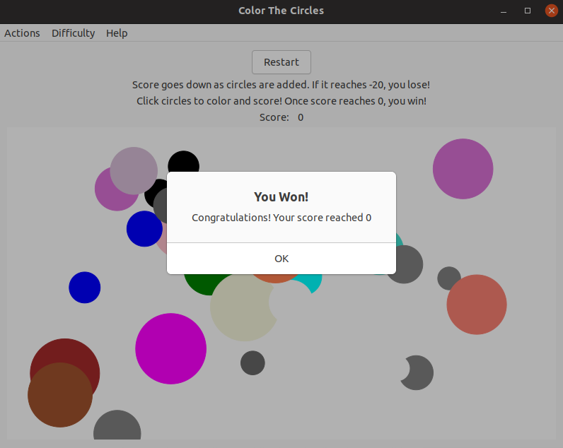

New [Glimmer DSL for LibUI](https://rubygems.org/gems/glimmer-dsl-libui) Version:

```ruby
require 'glimmer-dsl-libui'

class ColorTheCircles
  include Glimmer
  
  WINDOW_WIDTH = 800
  WINDOW_HEIGHT = 600
  SHAPE_MIN_SIZE = 15
  SHAPE_MAX_SIZE = 75
  MARGIN_WIDTH = 55
  MARGIN_HEIGHT = 155
  TIME_MAX_EASY = 4
  TIME_MAX_MEDIUM = 3
  TIME_MAX_HARD = 2
  TIME_MAX_INSANE = 1
  
  attr_accessor :score
  
  def initialize
    @circles_data = []
    @score = 0
    @time_max = TIME_MAX_HARD
    @game_over = false
    register_observers
    setup_circle_factory
  end
  
  def register_observers
    # observe automatically enhances self to become Glimmer::DataBinding::ObservableModel and notify observer block of score attribute changes
    observe(self, :score) do |new_score|
      Glimmer::LibUI.queue_main do
        @score_label.text = new_score.to_s
        if new_score == -20
          @game_over = true
          msg_box('You Lost!', 'Sorry! Your score reached -20')
          restart_game
        elsif new_score == 0
          @game_over = true
          msg_box('You Won!', 'Congratulations! Your score reached 0')
          restart_game
        end
      end
    end
  end
  
  def setup_circle_factory
    consumer = Proc.new do
      unless @game_over
        if @circles_data.empty?
          # start with 3 circles to make more challenging
          add_circle until @circles_data.size > 3
        else
          add_circle
        end
      end
      delay = rand * @time_max
      Glimmer::LibUI.timer(delay, repeat: false, &consumer)
    end
    Glimmer::LibUI.queue_main(&consumer)
  end
  
  def add_circle
    circle_x = rand * (WINDOW_WIDTH - MARGIN_WIDTH - SHAPE_MAX_SIZE) + SHAPE_MAX_SIZE
    circle_y = rand * (WINDOW_HEIGHT - MARGIN_HEIGHT - SHAPE_MAX_SIZE) + SHAPE_MAX_SIZE
    circle_size = rand * (SHAPE_MAX_SIZE - SHAPE_MIN_SIZE) + SHAPE_MIN_SIZE
    stroke_color = Glimmer::LibUI.x11_colors.sample
    @circles_data << {
      args: [circle_x, circle_y, circle_size],
      fill: nil,
      stroke: stroke_color
    }
    @area.queue_redraw_all
    self.score -= 1 # notifies score observers automatically of change
  end
  
  def restart_game
    @score = 0 # update variable directly to avoid notifying observers
    @circles_data.clear
    @game_over = false
  end
  
  def color_circle(x, y)
    clicked_circle_data = @circles_data.find do |circle_data|
      circle_data[:fill].nil? && circle_data[:circle]&.contain?(x, y)
    end
    if clicked_circle_data
      clicked_circle_data[:fill] = clicked_circle_data[:stroke]
      push_colored_circle_behind_uncolored_circles(clicked_circle_data)
      @area.queue_redraw_all
      self.score += 1 # notifies score observers automatically of change
    end
  end
  
  def push_colored_circle_behind_uncolored_circles(colored_circle_data)
    removed_colored_circle_data = @circles_data.delete(colored_circle_data)
    last_colored_circle_data = @circles_data.select {|cd| cd[:fill]}.last
    last_colored_circle_data_index = @circles_data.index(last_colored_circle_data) || -1
    @circles_data.insert(last_colored_circle_data_index + 1, removed_colored_circle_data)
  end

  def launch
    menu('Actions') {
      menu_item('Restart') {
        on_clicked do
          restart_game
        end
      }
      
      quit_menu_item
    }
    
    menu('Difficulty') {
      radio_menu_item('Easy') {
        on_clicked do
          @time_max = TIME_MAX_EASY
        end
      }
      
      radio_menu_item('Medium') {
        on_clicked do
          @time_max = TIME_MAX_MEDIUM
        end
      }
      
      radio_menu_item('Hard') {
        checked true
        
        on_clicked do
          @time_max = TIME_MAX_HARD
        end
      }
      
      radio_menu_item('Insane') {
        on_clicked do
          @time_max = TIME_MAX_INSANE
        end
      }
    }
    
    menu('Help') {
      menu_item('Instructions') {
        on_clicked do
          msg_box('Instructions', "Score goes down as circles are added.\nIf it reaches -20, you lose!\n\nClick circles to color and score!\nOnce score reaches 0, you win!\n\nBeware of concealed light-colored circles!\nThey are revealed once darker circles intersect them.\n\nThere are four levels of difficulty.\nChange via difficulty menu if the game gets too tough.")
        end
      }
    }
    
    window('Color The Circles', WINDOW_WIDTH, WINDOW_HEIGHT) {
      margined true
      
      grid {
        button('Restart') {
          left 0
          top 0
          halign :center
          
          on_clicked do
            restart_game
          end
        }
        
        label('Score goes down as circles are added. If it reaches -20, you lose!') {
          left 0
          top 1
          halign :center
        }
        
        label('Click circles to color and score! Once score reaches 0, you win!') {
          left 0
          top 2
          halign :center
        }
        
        horizontal_box {
          left 0
          top 3
          halign :center
          
          label('Score:') {
            stretchy false
          }
          
          @score_label = label(@score.to_s) {
            stretchy false
          }
        }
        
        @area = area {
          left 0
          top 4
          hexpand true
          vexpand true
          halign :fill
          valign :fill

          on_draw do |area_draw_params|
            path {
              rectangle(0, 0, WINDOW_WIDTH, WINDOW_HEIGHT)

              fill :white
            }

            @circles_data.each do |circle_data|
              circle_data[:circle] = circle(*circle_data[:args]) {
                fill circle_data[:fill]
                stroke circle_data[:stroke]
              }
            end
          end

          on_mouse_down do |area_mouse_event|
            color_circle(area_mouse_event[:x], area_mouse_event[:y])
          end
        }
      }
    }.show
  end
end

ColorTheCircles.new.launch
```

#### Control Gallery

[examples/control_gallery.rb](examples/control_gallery.rb)

Run with this command from the root of the project if you cloned the project:

```
ruby -r './lib/glimmer-dsl-libui' examples/control_gallery.rb
```

Run with this command if you installed the [Ruby gem](https://rubygems.org/gems/glimmer-dsl-libui):

```
ruby -r glimmer-dsl-libui -e "require 'examples/control_gallery'"
```

Mac | Windows | Linux
----|---------|------
 |  | 

[LibUI](https://github.com/kojix2/LibUI) Original Version:

```ruby
require 'libui'
UI = LibUI

UI.init

should_quit = proc do
  puts 'Bye Bye'
  UI.control_destroy(MAIN_WINDOW)
  UI.quit
  0
end

# File menu
menu = UI.new_menu('File')
open_menu_item = UI.menu_append_item(menu, 'Open')
UI.menu_item_on_clicked(open_menu_item) do
  pt = UI.open_file(MAIN_WINDOW)
  puts pt unless pt.null?
end
save_menu_item = UI.menu_append_item(menu, 'Save')
UI.menu_item_on_clicked(save_menu_item) do
  pt = UI.save_file(MAIN_WINDOW)
  puts pt unless pt.null?
end

UI.menu_append_quit_item(menu)
UI.on_should_quit(should_quit)

# Edit menu
edit_menu = UI.new_menu('Edit')
UI.menu_append_check_item(edit_menu, 'Checkable Item_')
UI.menu_append_separator(edit_menu)
disabled_item = UI.menu_append_item(edit_menu, 'Disabled Item_')
UI.menu_item_disable(disabled_item)

preferences = UI.menu_append_preferences_item(menu)

# Help menu
help_menu = UI.new_menu('Help')
UI.menu_append_item(help_menu, 'Help')
UI.menu_append_about_item(help_menu)

# Main Window
MAIN_WINDOW = UI.new_window('Control Gallery', 600, 500, 1)
UI.window_set_margined(MAIN_WINDOW, 1)
UI.window_on_closing(MAIN_WINDOW, should_quit)

vbox = UI.new_vertical_box
UI.window_set_child(MAIN_WINDOW, vbox)
hbox = UI.new_horizontal_box
UI.box_set_padded(vbox, 1)
UI.box_set_padded(hbox, 1)

UI.box_append(vbox, hbox, 1)

# Group - Basic Controls
group = UI.new_group('Basic Controls')
UI.group_set_margined(group, 1)
UI.box_append(hbox, group, 1) # OSX bug?

inner = UI.new_vertical_box
UI.box_set_padded(inner, 1)
UI.group_set_child(group, inner)

# Button
button = UI.new_button('Button')
UI.button_on_clicked(button) do
  UI.msg_box(MAIN_WINDOW, 'Information', 'You clicked the button')
end
UI.box_append(inner, button, 0)

# Checkbox
checkbox = UI.new_checkbox('Checkbox')
UI.checkbox_on_toggled(checkbox) do |ptr|
  checked = UI.checkbox_checked(ptr) == 1
  UI.window_set_title(MAIN_WINDOW, "Checkbox is #{checked}")
  UI.checkbox_set_text(ptr, "I am the checkbox (#{checked})")
end
UI.box_append(inner, checkbox, 0)

# Label
UI.box_append(inner, UI.new_label('Label'), 0)

# Separator
UI.box_append(inner, UI.new_horizontal_separator, 0)

# Date Picker
UI.box_append(inner, UI.new_date_picker, 0)

# Time Picker
UI.box_append(inner, UI.new_time_picker, 0)

# Date Time Picker
UI.box_append(inner, UI.new_date_time_picker, 0)

# Font Button
UI.box_append(inner, UI.new_font_button, 0)

# Color Button
UI.box_append(inner, UI.new_color_button, 0)

inner2 = UI.new_vertical_box
UI.box_set_padded(inner2, 1)
UI.box_append(hbox, inner2, 1)

# Group - Numbers
group = UI.new_group('Numbers')
UI.group_set_margined(group, 1)
UI.box_append(inner2, group, 0)

inner = UI.new_vertical_box
UI.box_set_padded(inner, 1)
UI.group_set_child(group, inner)

# Spinbox
spinbox = UI.new_spinbox(0, 100)
UI.spinbox_set_value(spinbox, 42)
UI.spinbox_on_changed(spinbox) do |ptr|
  puts "New Spinbox value: #{UI.spinbox_value(ptr)}"
end
UI.box_append(inner, spinbox, 0)

# Slider
slider = UI.new_slider(0, 100)
UI.box_append(inner, slider, 0)

# Progressbar
progressbar = UI.new_progress_bar
UI.box_append(inner, progressbar, 0)

UI.slider_on_changed(slider) do |ptr|
  v = UI.slider_value(ptr)
  puts "New Slider value: #{v}"
  UI.progress_bar_set_value(progressbar, v)
end

# Group - Lists
group = UI.new_group('Lists')
UI.group_set_margined(group, 1)
UI.box_append(inner2, group, 0)

inner = UI.new_vertical_box
UI.box_set_padded(inner, 1)
UI.group_set_child(group, inner)

# Combobox
cbox = UI.new_combobox
UI.combobox_append(cbox, 'combobox Item 1')
UI.combobox_append(cbox, 'combobox Item 2')
UI.combobox_append(cbox, 'combobox Item 3')
UI.box_append(inner, cbox, 0)
UI.combobox_on_selected(cbox) do |ptr|
  puts "New combobox selection: #{UI.combobox_selected(ptr)}"
end

# Editable Combobox
ebox = UI.new_editable_combobox
UI.editable_combobox_append(ebox, 'Editable Item 1')
UI.editable_combobox_append(ebox, 'Editable Item 2')
UI.editable_combobox_append(ebox, 'Editable Item 3')
UI.box_append(inner, ebox, 0)

# Radio Buttons
rb = UI.new_radio_buttons
UI.radio_buttons_append(rb, 'Radio Button 1')
UI.radio_buttons_append(rb, 'Radio Button 2')
UI.radio_buttons_append(rb, 'Radio Button 3')
UI.box_append(inner, rb, 1)

# Tab
tab = UI.new_tab
hbox1 = UI.new_horizontal_box
hbox2 = UI.new_horizontal_box
UI.tab_append(tab, 'Page 1', hbox1)
UI.tab_append(tab, 'Page 2', hbox2)
UI.tab_append(tab, 'Page 3', UI.new_horizontal_box)
UI.box_append(inner2, tab, 1)

# Text Entry
text_entry = UI.new_entry
UI.entry_set_text text_entry, 'Please enter your feelings'
UI.entry_on_changed(text_entry) do |ptr|
  puts "Current textbox data: '#{UI.entry_text(ptr)}'"
end
UI.box_append(hbox1, text_entry, 1)

UI.control_show(MAIN_WINDOW)

UI.main
UI.quit
```

[Glimmer DSL for LibUI](https://rubygems.org/gems/glimmer-dsl-libui) Version:

```ruby
require 'glimmer-dsl-libui'

include Glimmer

menu('File') {
  menu_item('Open') {
    on_clicked do
      file = open_file
      puts file unless file.nil?
    end
  }

  menu_item('Save') {
    on_clicked do
      file = save_file
      puts file unless file.nil?
    end
  }
  
  quit_menu_item {
    on_clicked do
      puts 'Bye Bye'
    end
  }
  
  preferences_menu_item # Can optionally contain an on_clicked listener
}

menu('Edit') {
  check_menu_item('Checkable Item_')
  separator_menu_item
  menu_item('Disabled Item_') {
    enabled false
  }
}

menu('Help') {
  menu_item('Help')
  
  about_menu_item # Can optionally contain an on_clicked listener
}

MAIN_WINDOW = window('Control Gallery', 600, 500) {
  margined true
  
  on_closing do
    puts 'Bye Bye'
  end
  
  vertical_box {
    horizontal_box {
      group('Basic Controls') {
        vertical_box {
          button('Button') {
            stretchy false

            on_clicked do
              msg_box('Information', 'You clicked the button')
            end
          }

          checkbox('Checkbox') {
            stretchy false

            on_toggled do |c|
              checked = c.checked?
              MAIN_WINDOW.title = "Checkbox is #{checked}"
              c.text = "I am the checkbox (#{checked})"
            end
          }

          label('Label') { stretchy false }

          horizontal_separator { stretchy false }

          date_picker { stretchy false }

          time_picker { stretchy false }

          date_time_picker { stretchy false }

          font_button { stretchy false }

          color_button { stretchy false }
        }
      }

      vertical_box {
        group('Numbers') {
          stretchy false

          vertical_box {
            spinbox(0, 100) {
              stretchy false
              value 42

              on_changed do |s|
                puts "New Spinbox value: #{s.value}"
              end
            }

            slider(0, 100) {
              stretchy false

              on_changed do |s|
                v = s.value
                puts "New Slider value: #{v}"
                @progress_bar.value = v
              end
            }

            @progress_bar = progress_bar { stretchy false }
          }
        }

        group('Lists') {
          stretchy false

          vertical_box {
            combobox {
              stretchy false
              items 'combobox Item 1', 'combobox Item 2', 'combobox Item 3' # also accepts a single array argument

              on_selected do |c|
                puts "New combobox selection: #{c.selected}"
              end
            }

            editable_combobox {
              stretchy false
              items 'Editable Item 1', 'Editable Item 2', 'Editable Item 3' # also accepts a single array argument
            }

            radio_buttons {
              items 'Radio Button 1', 'Radio Button 2', 'Radio Button 3' # also accepts a single array argument
            }
          }
        }

        tab {
          tab_item('Page 1') {
            horizontal_box {
              entry {
                text 'Please enter your feelings'

                on_changed do |e|
                  puts "Current textbox data: '#{e.text}'"
                end
              }
            }
          }
          
          tab_item('Page 2') {
            horizontal_box
          }
          
          tab_item('Page 3') {
            horizontal_box
          }
        }
      }
    }
  }
}

MAIN_WINDOW.show
```

#### CPU Percentage

This example shows CPU usage percentage second by second.

Note that it is highly dependent on low-level OS terminal commands, so if anything changes in their output formatting, the code could break. Please report any issues you might encounter.

[examples/cpu_percentage.rb](examples/cpu_percentage.rb)

Run with this command from the root of the project if you cloned the project:

```
ruby -r './lib/glimmer-dsl-libui' examples/cpu_percentage.rb
```

Run with this command if you installed the [Ruby gem](https://rubygems.org/gems/glimmer-dsl-libui):

```
ruby -r glimmer-dsl-libui -e "require 'examples/cpu_percentage'"
```

Mac | Windows | Linux
----|---------|------
 |  | 

New [Glimmer DSL for LibUI](https://rubygems.org/gems/glimmer-dsl-libui) Version:

```ruby
require 'glimmer-dsl-libui'
require 'bigdecimal'

include Glimmer

data = [
  ['CPU', '0%', 0],
]

Glimmer::LibUI.timer(1) do
  cpu_percentage_value = nil
  if OS.windows?
    cpu_percentage_raw_value = `wmic cpu get loadpercentage`
    cpu_percentage_value = cpu_percentage_raw_value.split("\n").map(&:strip).find {|l| l.match(/^\d+$/)}.to_i
  elsif OS.mac?
    cpu_percentage_value = `ps -A -o %cpu | awk '{s+=$1} END {print s}'`.to_i
  elsif OS.linux?
    stats = `top -n 1`
    idle_percentage = stats.split("\n")[2].match(/ni,.* (.*) .*id/)[1]
    cpu_percentage_value = (BigDecimal(100) - BigDecimal(idle_percentage)).to_i
  end
  data[0][1] = "#{cpu_percentage_value}%"
  data[0][2] = cpu_percentage_value
end

window('CPU Percentage', 400, 50) {
  vertical_box {
    table {
      text_column('Name')
      text_column('Value')
      progress_bar_column('Percentage')

      cell_rows data # implicit data-binding
    }
  }
}.show
```

#### Custom Draw Text

[examples/custom_draw_text.rb](examples/custom_draw_text.rb)

Run with this command from the root of the project if you cloned the project:

```
ruby -r './lib/glimmer-dsl-libui' examples/custom_draw_text.rb
```

Run with this command if you installed the [Ruby gem](https://rubygems.org/gems/glimmer-dsl-libui):

```
ruby -r glimmer-dsl-libui -e "require 'examples/custom_draw_text'"
```

Mac | Windows | Linux
----|---------|------
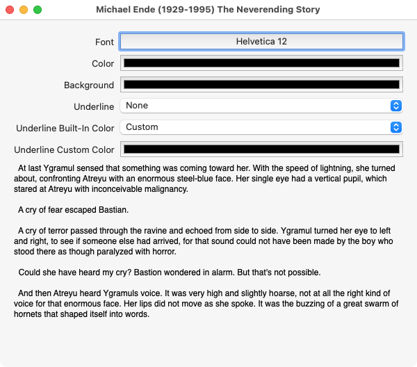  | 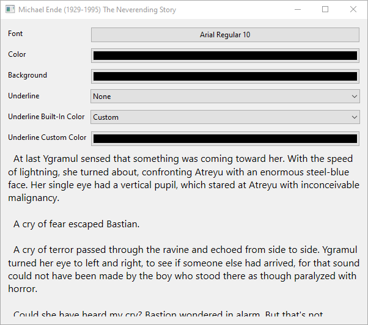  | 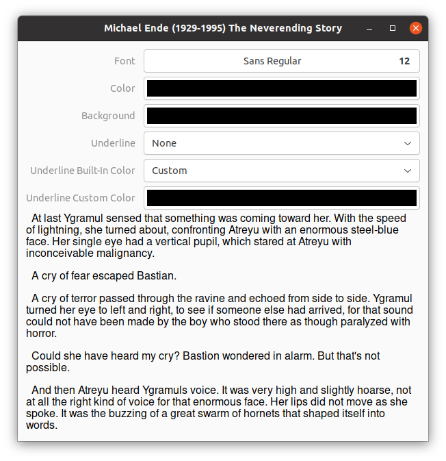 

New [Glimmer DSL for LibUI](https://rubygems.org/gems/glimmer-dsl-libui) Version:

```ruby
require 'glimmer-dsl-libui'

# Michael Ende (1929-1995)
# The Neverending Story is a fantasy novel by German writer Michael Ende,
# The English version, translated by Ralph Manheim, was published in 1983.
class CustomDrawText
  include Glimmer
  
  def launch
    window('Michael Ende (1929-1995) The Neverending Story', 600, 500) {
      margined true
      
      vertical_box {
        form {
          stretchy false
          
          font_button { |fb|
            label 'Font'
            
            on_changed do
              @string.font = fb.font
            end
          }

          color_button { |cb|
            label 'Color'
            
            on_changed do
              @string.color = cb.color
            end
          }

          unless OS.windows?
            color_button { |cb|
              label 'Background'
              
              on_changed do
                @string.background = cb.color
              end
            }
          end

          combobox { |c|
            label 'Underline'
            items Glimmer::LibUI.enum_symbols(:underline).map(&:to_s).map {|word| word.split('_').map(&:capitalize).join(' ')}
            selected 'None'
            
            on_selected do
              @string.underline = c.selected_item.underscore
            end
          }

          combobox { |c|
            label 'Underline Built-In Color'
            items Glimmer::LibUI.enum_symbols(:underline_color).map(&:to_s).map(&:capitalize)
            selected 'Custom'
            
            on_selected do
              @underline_custom_color_button.enabled = c.selected_item == 'Custom'
              if c.selected_item == 'Custom'
                @string.underline_color = @underline_custom_color_button.color
              else
                @string.underline_color = c.selected_item.underscore
                @underline_custom_color_button.color = :black
              end
            end
          }

          @underline_custom_color_button = color_button {
            label 'Underline Custom Color'
            
            on_changed do
              @string.underline_color = @underline_custom_color_button.color
            end
          }
        }
        
        area {
          text { # default arguments for x, y, and width are (0, 0, area_draw_params[:area_width] - 2*x)
            # align :left # default alignment
            
            @string = string {
              '  At last Ygramul sensed that something was coming toward ' \
              'her. With the speed of lightning, she turned about, confronting ' \
              'Atreyu with an enormous steel-blue face. Her single eye had a ' \
              'vertical pupil, which stared at Atreyu with inconceivable malignancy. ' \
              "\n\n" \
              '  A cry of fear escaped Bastian. ' \
              "\n\n" \
              '  A cry of terror passed through the ravine and echoed from ' \
              'side to side. Ygramul turned her eye to left and right, to see if ' \
              'someone else had arrived, for that sound could not have been ' \
              'made by the boy who stood there as though paralyzed with ' \
              'horror. ' \
              "\n\n" \
              '  Could she have heard my cry? Bastion wondered in alarm. ' \
              "But that's not possible. " \
              "\n\n" \
              '  And then Atreyu heard Ygramuls voice. It was very high ' \
              'and slightly hoarse, not at all the right kind of voice for that ' \
              'enormous face. Her lips did not move as she spoke. It was the ' \
              'buzzing of a great swarm of hornets that shaped itself into ' \
              'words. ' \
              "\n\n"
            }
          }
        }
      }
    }.show
  end
end

CustomDrawText.new.launch
```

New [Glimmer DSL for LibUI](https://rubygems.org/gems/glimmer-dsl-libui) Version 2:

```ruby
require 'glimmer-dsl-libui'

# Michael Ende (1929-1995)
# The Neverending Story is a fantasy novel by German writer Michael Ende,
# The English version, translated by Ralph Manheim, was published in 1983.
class CustomDrawText
  include Glimmer

  def launch
    window('Michael Ende (1929-1995) The Neverending Story', 600, 500) {
      margined true

      vertical_box {
        form {
          stretchy false

          font_button { |fb|
            label 'Font'

            on_changed do
              @font = fb.font
              @area.queue_redraw_all
            end
          }

          color_button { |cb|
            label 'Color'

            on_changed do
              @color = cb.color
              @area.queue_redraw_all
            end
          }

          unless OS.windows?
            color_button { |cb|
              label 'Background'

              on_changed do
                @background = cb.color
                @area.queue_redraw_all
              end
            }
          end

          combobox { |c|
            label 'Underline'
            items Glimmer::LibUI.enum_symbols(:underline).map(&:to_s).map {|word| word.split('_').map(&:capitalize).join(' ')}
            selected 'None'

            on_selected do
              @underline = c.selected_item.underscore
              @area.queue_redraw_all
            end
          }

          combobox { |c|
            label 'Underline Built-In Color'
            items Glimmer::LibUI.enum_symbols(:underline_color).map(&:to_s).map(&:capitalize)
            selected 'Custom'

            on_selected do
              @underline_custom_color_button.enabled = c.selected_item == 'Custom'
              if c.selected_item == 'Custom'
                @underline_color = @underline_custom_color_button.color
              else
                @underline_color = c.selected_item.underscore
                @underline_custom_color_button.color = :black
              end
              @area.queue_redraw_all
            end
          }

          @underline_custom_color_button = color_button {
            label 'Underline Custom Color'

            on_changed do
              @underline_color = @underline_custom_color_button.color
              @area.queue_redraw_all
            end
          }
        }

        @area = area {
          on_draw do |area_draw_params|
            text { # default arguments for x, y, and width are (0, 0, area_draw_params[:area_width] - 2*x)
              # align :left # default alignment

              string {
                font @font
                color @color
                background @background
                underline @underline
                underline_color @underline_color

                '  At last Ygramul sensed that something was coming toward ' \
                'her. With the speed of lightning, she turned about, confronting ' \
                'Atreyu with an enormous steel-blue face. Her single eye had a ' \
                'vertical pupil, which stared at Atreyu with inconceivable malignancy. ' \
                "\n\n" \
                '  A cry of fear escaped Bastian. ' \
                "\n\n" \
                '  A cry of terror passed through the ravine and echoed from ' \
                'side to side. Ygramul turned her eye to left and right, to see if ' \
                'someone else had arrived, for that sound could not have been ' \
                'made by the boy who stood there as though paralyzed with ' \
                'horror. ' \
                "\n\n" \
                '  Could she have heard my cry? Bastion wondered in alarm. ' \
                "But that's not possible. " \
                "\n\n" \
                '  And then Atreyu heard Ygramuls voice. It was very high ' \
                'and slightly hoarse, not at all the right kind of voice for that ' \
                'enormous face. Her lips did not move as she spoke. It was the ' \
                'buzzing of a great swarm of hornets that shaped itself into ' \
                'words. ' \
                "\n\n"
              }
            }
          end
        }
      }
    }.show
  end
end

CustomDrawText.new.launch
```

#### Dynamic Area

[examples/dynamic_area.rb](examples/dynamic_area.rb)

Run with this command from the root of the project if you cloned the project:

```
ruby -r './lib/glimmer-dsl-libui' examples/dynamic_area.rb
```

Run with this command if you installed the [Ruby gem](https://rubygems.org/gems/glimmer-dsl-libui):

```
ruby -r glimmer-dsl-libui -e "require 'examples/dynamic_area'"
```

Mac | Windows | Linux
----|---------|------
  |   |  

New [Glimmer DSL for LibUI](https://rubygems.org/gems/glimmer-dsl-libui) Version (with [data-binding](#data-binding)):

```ruby
require 'glimmer-dsl-libui'

class DynamicArea
  include Glimmer
  
  attr_accessor :rectangle_x, :rectangle_y, :rectangle_width, :rectangle_height, :rectangle_red, :rectangle_green, :rectangle_blue, :rectangle_alpha
  
  def initialize
    @rectangle_x = 25
    @rectangle_y = 25
    @rectangle_width = 150
    @rectangle_height = 150
    @rectangle_red = 102
    @rectangle_green = 102
    @rectangle_blue = 204
    @rectangle_alpha = 100
  end
  
  def launch
    window('Dynamic Area', 240, 600) {
      margined true
      
      vertical_box {
        label('Rectangle Properties') {
          stretchy false
        }
        
        form {
          stretchy false
          
          spinbox(0, 1000) {
            label 'x'
            value <=> [self, :rectangle_x, after_write: -> {@area.queue_redraw_all}]
          }
          
          spinbox(0, 1000) {
            label 'y'
            value <=> [self, :rectangle_y, after_write: -> {@area.queue_redraw_all}]
          }
          
          spinbox(0, 1000) {
            label 'width'
            value <=> [self, :rectangle_width, after_write: -> {@area.queue_redraw_all}]
          }
          
          spinbox(0, 1000) {
            label 'height'
            value <=> [self, :rectangle_height, after_write: -> {@area.queue_redraw_all}]
          }
          
          spinbox(0, 255) {
            label 'red'
            value <=> [self, :rectangle_red, after_write: -> {@area.queue_redraw_all}]
          }
          
          spinbox(0, 255) {
            label 'green'
            value <=> [self, :rectangle_green, after_write: -> {@area.queue_redraw_all}]
          }
          
          spinbox(0, 255) {
            label 'blue'
            value <=> [self, :rectangle_blue, after_write: -> {@area.queue_redraw_all}]
          }
          
          spinbox(0, 100) {
            label 'alpha'
            value <=> [self, :rectangle_alpha, after_write: -> {@area.queue_redraw_all}]
          }
        }
        
        @area = area {
          on_draw do |area_draw_params|
            rectangle(rectangle_x, rectangle_y, rectangle_width, rectangle_height) { # a dynamic path is added semi-declaratively inside on_draw block
              fill r: rectangle_red, g: rectangle_green, b: rectangle_blue, a: rectangle_alpha / 100.0
            }
          end
        }
      }
    }.show
  end
end

DynamicArea.new.launch
```

New [Glimmer DSL for LibUI](https://rubygems.org/gems/glimmer-dsl-libui) Version 2 (without [data-binding](#data-binding)):

```ruby
require 'glimmer-dsl-libui'

include Glimmer

window('Dynamic Area', 240, 600) {
  margined true
  
  vertical_box {
    label('Rectangle Properties') {
      stretchy false
    }
    
    form {
      stretchy false
      
      @x_spinbox = spinbox(0, 1000) {
        label 'x'
        value 25
        
        on_changed do
          @area.queue_redraw_all
        end
      }
      
      @y_spinbox = spinbox(0, 1000) {
        label 'y'
        value 25
        
        on_changed do
          @area.queue_redraw_all
        end
      }
      
      @width_spinbox = spinbox(0, 1000) {
        label 'width'
        value 150
        
        on_changed do
          @area.queue_redraw_all
        end
      }
      
      @height_spinbox = spinbox(0, 1000) {
        label 'height'
        value 150
        
        on_changed do
          @area.queue_redraw_all
        end
      }
      
      @red_spinbox = spinbox(0, 255) {
        label 'red'
        value 102
        
        on_changed do
          @area.queue_redraw_all
        end
      }
      
      @green_spinbox = spinbox(0, 255) {
        label 'green'
        value 102
        
        on_changed do
          @area.queue_redraw_all
        end
      }
      
      @blue_spinbox = spinbox(0, 255) {
        label 'blue'
        value 204
        
        on_changed do
          @area.queue_redraw_all
        end
      }
      
      @alpha_spinbox = spinbox(0, 100) {
        label 'alpha'
        value 100
        
        on_changed do
          @area.queue_redraw_all
        end
      }
    }
    
    @area = area {
      on_draw do |area_draw_params|
        rectangle(@x_spinbox.value, @y_spinbox.value, @width_spinbox.value, @height_spinbox.value) { # a dynamic path is added semi-declaratively inside on_draw block
          fill r: @red_spinbox.value, g: @green_spinbox.value, b: @blue_spinbox.value, a: @alpha_spinbox.value / 100.0
        }
      end
    }
  }
}.show
```

New [Glimmer DSL for LibUI](https://rubygems.org/gems/glimmer-dsl-libui) Version 3 (declarative stable `path` approach with [data-binding](#data-binding)):

```ruby
require 'glimmer-dsl-libui'

class DynamicArea
  include Glimmer
  
  attr_accessor :rectangle_x, :rectangle_y, :rectangle_width, :rectangle_height, :rectangle_red, :rectangle_green, :rectangle_blue, :rectangle_alpha
  
  def initialize
    @rectangle_x = 25
    @rectangle_y = 25
    @rectangle_width = 150
    @rectangle_height = 150
    @rectangle_red = 102
    @rectangle_green = 102
    @rectangle_blue = 204
    @rectangle_alpha = 100
  end
  
  def rectangle_fill
    { r: rectangle_red, g: rectangle_green, b: rectangle_blue, a: rectangle_alpha / 100.0 }
  end
  
  def launch
    window('Dynamic Area', 240, 600) {
      margined true
      
      vertical_box {
        label('Rectangle Properties') {
          stretchy false
        }
        
        form {
          stretchy false
          
          @x_spinbox = spinbox(0, 1000) {
            label 'x'
            value <=> [self, :rectangle_x]
          }
          
          @y_spinbox = spinbox(0, 1000) {
            label 'y'
            value <=> [self, :rectangle_y]
          }
          
          @width_spinbox = spinbox(0, 1000) {
            label 'width'
            value <=> [self, :rectangle_width]
          }
          
          @height_spinbox = spinbox(0, 1000) {
            label 'height'
            value <=> [self, :rectangle_height]
          }
          
          @red_spinbox = spinbox(0, 255) {
            label 'red'
            value <=> [self, :rectangle_red]
          }
          
          @green_spinbox = spinbox(0, 255) {
            label 'green'
            value <=> [self, :rectangle_green]
          }
          
          @blue_spinbox = spinbox(0, 255) {
            label 'blue'
            value <=> [self, :rectangle_blue]
          }
          
          @alpha_spinbox = spinbox(0, 100) {
            label 'alpha'
            value <=> [self, :rectangle_alpha]
          }
        }
        
        area {
          @rectangle = rectangle { # stable implicit path shape
            x      <= [self, :rectangle_x]
            y      <= [self, :rectangle_y]
            width  <= [self, :rectangle_width]
            height <= [self, :rectangle_height]
            fill   <= [self, :rectangle_fill, computed_by: [:rectangle_red, :rectangle_green, :rectangle_blue, :rectangle_alpha]]
          }
        }
      }
    }.show
  end
end

DynamicArea.new.launch
```

New [Glimmer DSL for LibUI](https://rubygems.org/gems/glimmer-dsl-libui) Version 4 (declarative stable `path` approach without [data-binding](#data-binding)):

```ruby
require 'glimmer-dsl-libui'

include Glimmer

window('Dynamic Area', 240, 600) {
  margined true
  
  vertical_box {
    label('Rectangle Properties') {
      stretchy false
    }
    
    form {
      stretchy false
      
      @x_spinbox = spinbox(0, 1000) {
        label 'x'
        value 25
        
        on_changed do
          @rectangle.x = @x_spinbox.value # updating properties automatically triggers area.queue_redraw_all
        end
      }
      
      @y_spinbox = spinbox(0, 1000) {
        label 'y'
        value 25
        
        on_changed do
          @rectangle.y = @y_spinbox.value # updating properties automatically triggers area.queue_redraw_all
        end
      }
      
      @width_spinbox = spinbox(0, 1000) {
        label 'width'
        value 150
        
        on_changed do
          @rectangle.width = @width_spinbox.value # updating properties automatically triggers area.queue_redraw_all
        end
      }
      
      @height_spinbox = spinbox(0, 1000) {
        label 'height'
        value 150
        
        on_changed do
          @rectangle.height = @height_spinbox.value # updating properties automatically triggers area.queue_redraw_all
        end
      }
      
      @red_spinbox = spinbox(0, 255) {
        label 'red'
        value 102
        
        on_changed do
          @rectangle.fill[:r] = @red_spinbox.value # updating hash properties automatically triggers area.queue_redraw_all
        end
      }
      
      @green_spinbox = spinbox(0, 255) {
        label 'green'
        value 102
        
        on_changed do
          @rectangle.fill[:g] = @green_spinbox.value # updating hash properties automatically triggers area.queue_redraw_all
        end
      }
      
      @blue_spinbox = spinbox(0, 255) {
        label 'blue'
        value 204
        
        on_changed do
          @rectangle.fill[:b] = @blue_spinbox.value # updating hash properties automatically triggers area.queue_redraw_all
        end
      }
      
      @alpha_spinbox = spinbox(0, 100) {
        label 'alpha'
        value 100
        
        on_changed do
          @rectangle.fill[:a] = @alpha_spinbox.value / 100.0 # updating hash properties automatically triggers area.queue_redraw_all
        end
      }
    }
    
    area {
      @rectangle = rectangle(@x_spinbox.value, @y_spinbox.value, @width_spinbox.value, @height_spinbox.value) { # stable implicit path shape
        fill r: @red_spinbox.value, g: @green_spinbox.value, b: @blue_spinbox.value, a: @alpha_spinbox.value / 100.0
      }
    }
  }
}.show
```

#### Editable Column Table

[examples/editable_column_table.rb](examples/editable_column_table.rb)

Run with this command from the root of the project if you cloned the project:

```
ruby -r './lib/glimmer-dsl-libui' examples/editable_column_table.rb
```

Run with this command if you installed the [Ruby gem](https://rubygems.org/gems/glimmer-dsl-libui):

```
ruby -r glimmer-dsl-libui -e "require 'examples/editable_column_table'"
```

Mac | Windows | Linux
----|---------|------
  |   |  

New [Glimmer DSL for LibUI](https://rubygems.org/gems/glimmer-dsl-libui) Version:

```ruby
require 'glimmer-dsl-libui'

include Glimmer

data = [
  %w[cat calm meow],
  %w[dog loyal woof],
  %w[chicken bird cock-a-doodle-doo],
  %w[horse fast neigh],
  %w[cow slow moo]
]

window('Editable column animal sounds', 400, 200) {
  horizontal_box {
    table {
      text_column('Animal')
      text_column('Description')
      text_column('Sound (Editable)') {
        editable true
      }

      cell_rows data
      
      on_edited do |row, row_data| # only fires on direct table editing
        puts "Row #{row} edited: #{row_data}"
        $stdout.flush
      end
    }
  }
  
  on_closing do
    puts 'Bye Bye'
  end
}.show
```

#### Editable Table

[examples/editable_table.rb](examples/editable_table.rb)

Run with this command from the root of the project if you cloned the project:

```
ruby -r './lib/glimmer-dsl-libui' examples/editable_table.rb
```

Run with this command if you installed the [Ruby gem](https://rubygems.org/gems/glimmer-dsl-libui):

```
ruby -r glimmer-dsl-libui -e "require 'examples/editable_table'"
```

Mac | Windows | Linux
----|---------|------
   |   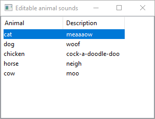 | 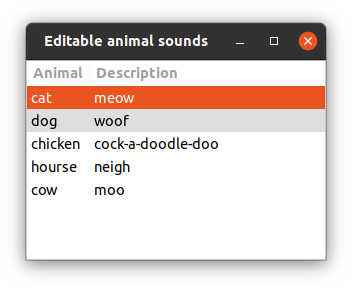  

New [Glimmer DSL for LibUI](https://rubygems.org/gems/glimmer-dsl-libui) Version:

```ruby
require 'glimmer-dsl-libui'

include Glimmer

data = [
  %w[cat meow],
  %w[dog woof],
  %w[chicken cock-a-doodle-doo],
  %w[horse neigh],
  %w[cow moo]
]

window('Editable animal sounds', 300, 200) {
  horizontal_box {
    table {
      text_column('Animal')
      text_column('Description')

      editable true
      cell_rows data
      
      on_changed do |row, type, row_data| # fires on all changes (even ones happening through data array)
        puts "Row #{row} #{type}: #{row_data}"
      end
      
      on_edited do |row, row_data| # only fires on direct table editing
        puts "Row #{row} edited: #{row_data}"
      end
    }
  }
  
  on_closing do
    puts 'Bye Bye'
  end
}.show
```

#### Form Table

[examples/form_table.rb](examples/form_table.rb)

Run with this command from the root of the project if you cloned the project:

```
ruby -r './lib/glimmer-dsl-libui' examples/form_table.rb
```

Run with this command if you installed the [Ruby gem](https://rubygems.org/gems/glimmer-dsl-libui):

```
ruby -r glimmer-dsl-libui -e "require 'examples/form_table'"
```

Mac | Windows | Linux
----|---------|------
   |    |  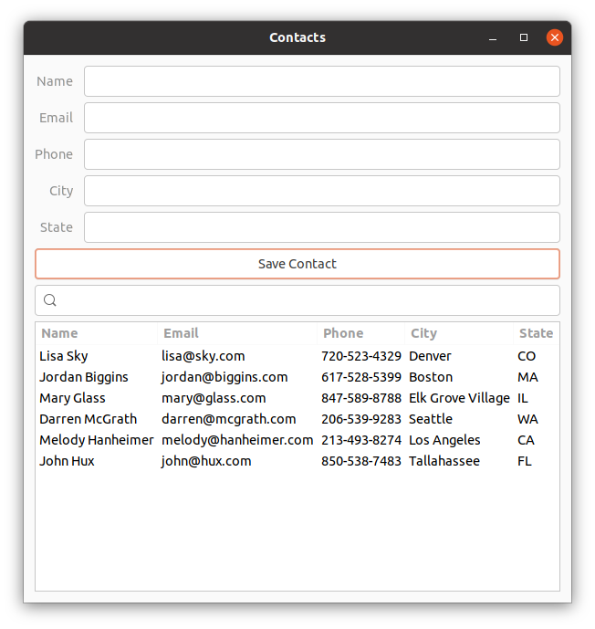 

New [Glimmer DSL for LibUI](https://rubygems.org/gems/glimmer-dsl-libui) Version (with explicit [data-binding](#data-binding)):

```ruby
require 'glimmer-dsl-libui'

class FormTable
  Contact = Struct.new(:name, :email, :phone, :city, :state)
  
  include Glimmer
  
  attr_accessor :contacts, :name, :email, :phone, :city, :state, :filter_value
  
  def initialize
    @contacts = [
      Contact.new('Lisa Sky', 'lisa@sky.com', '720-523-4329', 'Denver', 'CO'),
      Contact.new('Jordan Biggins', 'jordan@biggins.com', '617-528-5399', 'Boston', 'MA'),
      Contact.new('Mary Glass', 'mary@glass.com', '847-589-8788', 'Elk Grove Village', 'IL'),
      Contact.new('Darren McGrath', 'darren@mcgrath.com', '206-539-9283', 'Seattle', 'WA'),
      Contact.new('Melody Hanheimer', 'melody@hanheimer.com', '213-493-8274', 'Los Angeles', 'CA'),
    ]
  end
  
  def launch
    window('Contacts', 600, 600) {
      margined true
      
      vertical_box {
        form {
          stretchy false
          
          entry {
            label 'Name'
            text <=> [self, :name] # bidirectional data-binding between entry text and self.name
          }
          
          entry {
            label 'Email'
            text <=> [self, :email]
          }
          
          entry {
            label 'Phone'
            text <=> [self, :phone]
          }
          
          entry {
            label 'City'
            text <=> [self, :city]
          }
          
          entry {
            label 'State'
            text <=> [self, :state]
          }
        }
        
        button('Save Contact') {
          stretchy false
          
          on_clicked do
            new_row = [name, email, phone, city, state]
            if new_row.map(&:to_s).include?('')
              msg_box_error('Validation Error!', 'All fields are required! Please make sure to enter a value for all fields.')
            else
              @contacts << Contact.new(*new_row) # automatically inserts a row into the table due to explicit data-binding
              @unfiltered_contacts = @contacts.dup
              self.name = '' # automatically clears name entry through explicit data-binding
              self.email = ''
              self.phone = ''
              self.city = ''
              self.state = ''
            end
          end
        }
        
        search_entry {
          stretchy false
          # bidirectional data-binding of text to self.filter_value with after_write option
          text <=> [self, :filter_value,
            after_write: ->(filter_value) { # execute after write to self.filter_value
              @unfiltered_contacts ||= @contacts.dup
              # Unfilter first to remove any previous filters
              self.contacts = @unfiltered_contacts.dup # affects table indirectly through explicit data-binding
              # Now, apply filter if entered
              unless filter_value.empty?
                self.contacts = @contacts.filter do |contact| # affects table indirectly through explicit data-binding
                  contact.members.any? do |attribute|
                    contact[attribute].to_s.downcase.include?(filter_value.downcase)
                  end
                end
              end
            }
          ]
        }
        
        table {
          text_column('Name')
          text_column('Email')
          text_column('Phone')
          text_column('City')
          text_column('State')
    
          editable true
          cell_rows <=> [self, :contacts] # explicit data-binding to self.contacts Model Array, auto-inferring model attribute names from underscored table column names by convention
          
          on_changed do |row, type, row_data|
            puts "Row #{row} #{type}: #{row_data}"
            $stdout.flush # for Windows
          end
          
          on_edited do |row, row_data| # only fires on direct table editing
            puts "Row #{row} edited: #{row_data}"
            $stdout.flush # for Windows
          end
        }
      }
    }.show
  end
end

FormTable.new.launch
```

New [Glimmer DSL for LibUI](https://rubygems.org/gems/glimmer-dsl-libui) Version 2 (with explicit [data-binding](#data-binding)):

```ruby
require 'glimmer-dsl-libui'

class FormTable
  Contact = Struct.new(:name, :email, :phone, :city, :state_province)
  
  include Glimmer
  
  attr_accessor :contacts, :name, :email, :phone, :city, :state, :filter_value
  
  def initialize
    @contacts = [
      Contact.new('Lisa Sky', 'lisa@sky.com', '720-523-4329', 'Denver', 'CO'),
      Contact.new('Jordan Biggins', 'jordan@biggins.com', '617-528-5399', 'Boston', 'MA'),
      Contact.new('Mary Glass', 'mary@glass.com', '847-589-8788', 'Elk Grove Village', 'IL'),
      Contact.new('Darren McGrath', 'darren@mcgrath.com', '206-539-9283', 'Seattle', 'WA'),
      Contact.new('Melody Hanheimer', 'melody@hanheimer.com', '213-493-8274', 'Los Angeles', 'CA'),
    ]
  end
  
  def launch
    window('Contacts', 600, 600) {
      margined true
      
      vertical_box {
        form {
          stretchy false
          
          entry {
            label 'Name'
            text <=> [self, :name] # bidirectional data-binding between entry text and self.name
          }
          
          entry {
            label 'Email'
            text <=> [self, :email]
          }
          
          entry {
            label 'Phone'
            text <=> [self, :phone]
          }
          
          entry {
            label 'City'
            text <=> [self, :city]
          }
          
          entry {
            label 'State'
            text <=> [self, :state]
          }
        }
        
        button('Save Contact') {
          stretchy false
          
          on_clicked do
            new_row = [name, email, phone, city, state]
            if new_row.map(&:to_s).include?('')
              msg_box_error('Validation Error!', 'All fields are required! Please make sure to enter a value for all fields.')
            else
              @contacts << Contact.new(*new_row) # automatically inserts a row into the table due to implicit data-binding
              @unfiltered_contacts = @contacts.dup
              self.name = '' # automatically clears name entry through explicit data-binding
              self.email = ''
              self.phone = ''
              self.city = ''
              self.state = ''
            end
          end
        }
        
        search_entry {
          stretchy false
          # bidirectional data-binding of text to self.filter_value with after_write option
          text <=> [self, :filter_value,
            after_write: ->(filter_value) { # execute after write to self.filter_value
              @unfiltered_contacts ||= @contacts.dup
              # Unfilter first to remove any previous filters
              self.contacts = @unfiltered_contacts.dup # affects table indirectly through explicit data-binding
              # Now, apply filter if entered
              unless filter_value.empty?
                self.contacts = @contacts.filter do |contact| # affects table indirectly through explicit data-binding
                  contact.members.any? do |attribute|
                    contact[attribute].to_s.downcase.include?(filter_value.downcase)
                  end
                end
              end
            }
          ]
        }
        
        table {
          text_column('Name')
          text_column('Email')
          text_column('Phone')
          text_column('City')
          text_column('State')
    
          editable true
          cell_rows <=> [self, :contacts, column_attributes: {'State' => :state_province}] # explicit data-binding to Model Array with column_attributes mapping for a specific column
          
          on_changed do |row, type, row_data|
            puts "Row #{row} #{type}: #{row_data}"
            $stdout.flush # for Windows
          end
          
          on_edited do |row, row_data| # only fires on direct table editing
            puts "Row #{row} edited: #{row_data}"
            $stdout.flush # for Windows
          end
        }
      }
    }.show
  end
end

FormTable.new.launch
```

New [Glimmer DSL for LibUI](https://rubygems.org/gems/glimmer-dsl-libui) Version 3 (with explicit [data-binding](#data-binding)):

```ruby

require 'glimmer-dsl-libui'

class FormTable
  Contact = Struct.new(:full_name, :email_address, :phone_number, :city_or_town, :state_or_province)
  
  include Glimmer
  
  attr_accessor :contacts, :name, :email, :phone, :city, :state, :filter_value
  
  def initialize
    @contacts = [
      Contact.new('Lisa Sky', 'lisa@sky.com', '720-523-4329', 'Denver', 'CO'),
      Contact.new('Jordan Biggins', 'jordan@biggins.com', '617-528-5399', 'Boston', 'MA'),
      Contact.new('Mary Glass', 'mary@glass.com', '847-589-8788', 'Elk Grove Village', 'IL'),
      Contact.new('Darren McGrath', 'darren@mcgrath.com', '206-539-9283', 'Seattle', 'WA'),
      Contact.new('Melody Hanheimer', 'melody@hanheimer.com', '213-493-8274', 'Los Angeles', 'CA'),
    ]
  end
  
  def launch
    window('Contacts', 600, 600) {
      margined true
      
      vertical_box {
        form {
          stretchy false
          
          entry {
            label 'Name'
            text <=> [self, :name] # bidirectional data-binding between entry text and self.name
          }
          
          entry {
            label 'Email'
            text <=> [self, :email]
          }
          
          entry {
            label 'Phone'
            text <=> [self, :phone]
          }
          
          entry {
            label 'City'
            text <=> [self, :city]
          }
          
          entry {
            label 'State'
            text <=> [self, :state]
          }
        }
        
        button('Save Contact') {
          stretchy false
          
          on_clicked do
            new_row = [name, email, phone, city, state]
            if new_row.map(&:to_s).include?('')
              msg_box_error('Validation Error!', 'All fields are required! Please make sure to enter a value for all fields.')
            else
              @contacts << Contact.new(*new_row) # automatically inserts a row into the table due to implicit data-binding
              @unfiltered_contacts = @contacts.dup
              self.name = '' # automatically clears name entry through explicit data-binding
              self.email = ''
              self.phone = ''
              self.city = ''
              self.state = ''
            end
          end
        }
        
        search_entry {
          stretchy false
          # bidirectional data-binding of text to self.filter_value with after_write option
          text <=> [self, :filter_value,
            after_write: ->(filter_value) { # execute after write to self.filter_value
              @unfiltered_contacts ||= @contacts.dup
              # Unfilter first to remove any previous filters
              self.contacts = @unfiltered_contacts.dup # affects table indirectly through explicit data-binding
              # Now, apply filter if entered
              unless filter_value.empty?
                self.contacts = @contacts.filter do |contact| # affects table indirectly through explicit data-binding
                  contact.members.any? do |attribute|
                    contact[attribute].to_s.downcase.include?(filter_value.downcase)
                  end
                end
              end
            }
          ]
        }
        
        table {
          text_column('Name')
          text_column('Email')
          text_column('Phone')
          text_column('City')
          text_column('State')
    
          editable true
          cell_rows <=> [self, :contacts, column_attributes: [:full_name, :email_address, :phone_number, :city_or_town, :state_or_province]] # explicit data-binding to Model Array with column_attributes mapping for all columns
          
          on_changed do |row, type, row_data|
            puts "Row #{row} #{type}: #{row_data}"
            $stdout.flush # for Windows
          end
          
          on_edited do |row, row_data| # only fires on direct table editing
            puts "Row #{row} edited: #{row_data}"
            $stdout.flush # for Windows
          end
        }
      }
    }.show
  end
end

FormTable.new.launch
```

New [Glimmer DSL for LibUI](https://rubygems.org/gems/glimmer-dsl-libui) Version 4 (with explicit [data-binding](#data-binding) to raw data):

```ruby
require 'glimmer-dsl-libui'

class FormTable
  include Glimmer
  
  attr_accessor :data, :name, :email, :phone, :city, :state, :filter_value
  
  def initialize
    @data = [
      ['Lisa Sky', 'lisa@sky.com', '720-523-4329', 'Denver', 'CO'],
      ['Jordan Biggins', 'jordan@biggins.com', '617-528-5399', 'Boston', 'MA'],
      ['Mary Glass', 'mary@glass.com', '847-589-8788', 'Elk Grove Village', 'IL'],
      ['Darren McGrath', 'darren@mcgrath.com', '206-539-9283', 'Seattle', 'WA'],
      ['Melody Hanheimer', 'melody@hanheimer.com', '213-493-8274', 'Los Angeles', 'CA'],
    ]
  end
  
  def launch
    window('Contacts', 600, 600) {
      margined true
      
      vertical_box {
        form {
          stretchy false
          
          entry {
            label 'Name'
            text <=> [self, :name] # bidirectional data-binding between entry text and self.name
          }
          
          entry {
            label 'Email'
            text <=> [self, :email]
          }
          
          entry {
            label 'Phone'
            text <=> [self, :phone]
          }
          
          entry {
            label 'City'
            text <=> [self, :city]
          }
          
          entry {
            label 'State'
            text <=> [self, :state]
          }
        }
        
        button('Save Contact') {
          stretchy false
          
          on_clicked do
            new_row = [name, email, phone, city, state]
            if new_row.map(&:to_s).include?('')
              msg_box_error('Validation Error!', 'All fields are required! Please make sure to enter a value for all fields.')
            else
              data << new_row # automatically inserts a row into the table due to implicit data-binding
              @unfiltered_data = data.dup
              self.name = '' # automatically clears name entry through explicit data-binding
              self.email = ''
              self.phone = ''
              self.city = ''
              self.state = ''
            end
          end
        }
        
        search_entry {
          stretchy false
          # bidirectional data-binding of text to self.filter_value with after_write option
          text <=> [self, :filter_value,
            after_write: ->(filter_value) { # execute after write to self.filter_value
              @unfiltered_data ||= data.dup
              # Unfilter first to remove any previous filters
              data.replace(@unfiltered_data) # affects table indirectly through implicit data-binding
              # Now, apply filter if entered
              unless filter_value.empty?
                data.filter! do |row_data| # affects table indirectly through implicit data-binding
                  row_data.any? do |cell|
                    cell.to_s.downcase.include?(filter_value.downcase)
                  end
                end
              end
            }
          ]
        }
        
        table {
          text_column('Name')
          text_column('Email')
          text_column('Phone')
          text_column('City')
          text_column('State')
          
          editable true
          cell_rows <=> [self, :data] # explicit data-binding to raw data Array of Arrays
          
          on_changed do |row, type, row_data|
            puts "Row #{row} #{type}: #{row_data}"
            $stdout.flush # for Windows
          end
          
          on_edited do |row, row_data| # only fires on direct table editing
            puts "Row #{row} edited: #{row_data}"
            $stdout.flush # for Windows
          end
        }
      }
    }.show
  end
end

FormTable.new.launch
```

New [Glimmer DSL for LibUI](https://rubygems.org/gems/glimmer-dsl-libui) Version 5 (with implicit [data-binding](#data-binding)):

```ruby
require 'glimmer-dsl-libui'

include Glimmer

data = [
  ['Lisa Sky', 'lisa@sky.com', '720-523-4329', 'Denver', 'CO'],
  ['Jordan Biggins', 'jordan@biggins.com', '617-528-5399', 'Boston', 'MA'],
  ['Mary Glass', 'mary@glass.com', '847-589-8788', 'Elk Grove Village', 'IL'],
  ['Darren McGrath', 'darren@mcgrath.com', '206-539-9283', 'Seattle', 'WA'],
  ['Melody Hanheimer', 'melody@hanheimer.com', '213-493-8274', 'Los Angeles', 'CA'],
]

window('Contacts', 600, 600) {
  margined true
  
  vertical_box {
    form {
      stretchy false
      
      @name_entry = entry {
        label 'Name'
      }
      
      @email_entry = entry {
        label 'Email'
      }
      
      @phone_entry = entry {
        label 'Phone'
      }
      
      @city_entry = entry {
        label 'City'
      }
      
      @state_entry = entry {
        label 'State'
      }
    }
    
    button('Save Contact') {
      stretchy false
      
      on_clicked do
        new_row = [@name_entry.text, @email_entry.text, @phone_entry.text, @city_entry.text, @state_entry.text]
        if new_row.map(&:to_s).include?('')
          msg_box_error('Validation Error!', 'All fields are required! Please make sure to enter a value for all fields.')
        else
          data << new_row # automatically inserts a row into the table due to implicit data-binding
          @unfiltered_data = data.dup
          @name_entry.text = ''
          @email_entry.text = ''
          @phone_entry.text = ''
          @city_entry.text = ''
          @state_entry.text = ''
        end
      end
    }
    
    search_entry { |se|
      stretchy false
      
      on_changed do
        filter_value = se.text
        @unfiltered_data ||= data.dup
        # Unfilter first to remove any previous filters
        data.replace(@unfiltered_data) # affects table indirectly through implicit data-binding
        # Now, apply filter if entered
        unless filter_value.empty?
          data.filter! do |row_data| # affects table indirectly through implicit data-binding
            row_data.any? do |cell|
              cell.to_s.downcase.include?(filter_value.downcase)
            end
          end
        end
      end
    }
    
    table {
      text_column('Name')
      text_column('Email')
      text_column('Phone')
      text_column('City')
      text_column('State')

      editable true
      cell_rows data # implicit data-binding to raw data Array of Arrays
      
      on_changed do |row, type, row_data|
        puts "Row #{row} #{type}: #{row_data}"
        $stdout.flush # for Windows
      end
      
      on_edited do |row, row_data| # only fires on direct table editing
        puts "Row #{row} edited: #{row_data}"
        $stdout.flush # for Windows
      end
    }
  }
}.show
```

#### Paginated Refined Table

[examples/paginated_refined_table.rb](examples/paginated_refined_table.rb)

Run with this command from the root of the project if you cloned the project:

```
ruby -r './lib/glimmer-dsl-libui' examples/paginated_refined_table.rb
```

Run with this command if you installed the [Ruby gem](https://rubygems.org/gems/glimmer-dsl-libui):

```
ruby -r glimmer-dsl-libui -e "require 'examples/paginated_refined_table'"
```

Mac | Windows | Linux
----|---------|------
| | 

New [Glimmer DSL for LibUI](https://rubygems.org/gems/glimmer-dsl-libui) Version:

```ruby
require 'glimmer-dsl-libui'

class PaginatedRefinedTable
  Contact = Struct.new(:name, :email, :phone, :city, :state)
  
  include Glimmer::LibUI::Application
  
  NAMES_FIRST = %w[
    Liam Noah William James Oliver Benjamin Elijah Lucas Mason Logan Alexander Ethan Jacob Michael Daniel Henry Jackson Sebastian
    Aiden Matthew Samuel David Joseph Carter Owen Wyatt John Jack Luke Jayden Dylan Grayson Levi Isaac Gabriel Julian Mateo
    Anthony Jaxon Lincoln Joshua Christopher Andrew Theodore Caleb Ryan Asher Nathan Thomas Leo Isaiah Charles Josiah Hudson
    Christian Hunter Connor Eli Ezra Aaron Landon Adrian Jonathan Nolan Jeremiah Easton Elias Colton Cameron Carson Robert Angel
    Maverick Nicholas Dominic Jaxson Greyson Adam Ian Austin Santiago Jordan Cooper Brayden Roman Evan Ezekiel Xaviar Jose Jace
    Jameson Leonardo Axel Everett Kayden Miles Sawyer Jason Emma Olivia Bartholomew Corey Danielle Eva Felicity
  ]
  
  NAMES_LAST = %w[
    Smith Johnson Williams Brown Jones Miller Davis Wilson Anderson Taylor George Harrington Iverson Jackson Korby Levinson
  ]
  
  CITIES = [
    'Bellesville', 'Lombardia', 'Steepleton', 'Deerenstein', 'Schwartz', 'Hollandia', 'Saint Pete', 'Grandville', 'London',
    'Berlin', 'Elktown', 'Paris', 'Garrison', 'Muncy', 'St Louis',
  ]
  
  STATES = [ 'AK', 'AL', 'AR', 'AZ', 'CA', 'CO', 'CT', 'DC', 'DE', 'FL', 'GA',
             'HI', 'IA', 'ID', 'IL', 'IN', 'KS', 'KY', 'LA', 'MA', 'MD', 'ME',
             'MI', 'MN', 'MO', 'MS', 'MT', 'NC', 'ND', 'NE', 'NH', 'NJ', 'NM',
             'NV', 'NY', 'OH', 'OK', 'OR', 'PA', 'RI', 'SC', 'SD', 'TN', 'TX',
             'UT', 'VA', 'VT', 'WA', 'WI', 'WV', 'WY']
             
  attr_accessor :contacts, :name, :email, :phone, :city, :state, :filter_value, :index
  
  before_body do
    @contacts = 50_000.times.map do |n|
      n += 1
      first_name = NAMES_FIRST.sample
      last_name = NAMES_LAST.sample
      city = CITIES.sample
      state = STATES.sample
      Contact.new("#{first_name} #{last_name}", "#{first_name.downcase}#{n}@#{last_name.downcase}.com", '555-555-5555', city, state)
    end
  end
  
  body {
    window("50,000 Paginated Contacts", 600, 700) {
      margined true
      
      vertical_box {
        form {
          stretchy false
          
          entry {
            label 'Name'
            text <=> [self, :name] # bidirectional data-binding between entry text and self.name
          }
          
          entry {
            label 'Email'
            text <=> [self, :email]
          }
          
          entry {
            label 'Phone'
            text <=> [self, :phone]
          }
          
          entry {
            label 'City'
            text <=> [self, :city]
          }
          
          entry {
            label 'State'
            text <=> [self, :state]
          }
        }
        
        button('Save Contact') {
          stretchy false
          
          on_clicked do
            new_row = [name, email, phone, city, state]
            if new_row.map(&:to_s).include?('')
              msg_box_error('Validation Error!', 'All fields are required! Please make sure to enter a value for all fields.')
            else
              @contacts << Contact.new(*new_row) # automatically inserts a row into the table due to explicit data-binding
              @unfiltered_contacts = @contacts.dup
              self.name = '' # automatically clears name entry through explicit data-binding
              self.email = ''
              self.phone = ''
              self.city = ''
              self.state = ''
            end
          end
        }
        
        refined_table(
          model_array: contacts,
          table_columns: {
            'Name'  => {text: {editable: false}},
            'Email' => :text,
            'Phone' => :text,
            'City'  => :text,
            'State' => :text,
          },
          table_editable: true,
          per_page: 20,
          # page: 1, # initial page is 1
          # visible_page_count: true, # page count can be shown if preferred
        )
      }
    }
  }
end

PaginatedRefinedTable.launch
```

#### Grid

[examples/grid.rb](examples/grid.rb)

Run with this command from the root of the project if you cloned the project:

```
ruby -r './lib/glimmer-dsl-libui' examples/grid.rb
```

Run with this command if you installed the [Ruby gem](https://rubygems.org/gems/glimmer-dsl-libui):

```
ruby -r glimmer-dsl-libui -e "require 'examples/grid'"
```

Mac | Windows | Linux
----|---------|------
 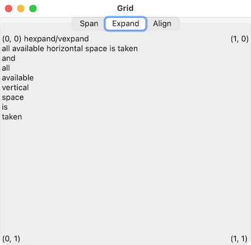 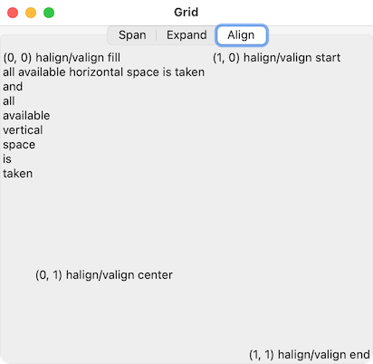 |    |   

New [Glimmer DSL for LibUI](https://rubygems.org/gems/glimmer-dsl-libui) Version:

```ruby
require 'glimmer-dsl-libui'

include Glimmer

window('Grid') {
  tab {
    tab_item('Span') {
      grid {
        4.times do |top_value|
          4.times do |left_value|
            label("(#{left_value}, #{top_value}) xspan1\nyspan1") {
              left left_value
              top top_value
              hexpand true
              vexpand true
            }
          end
        end
        label("(0, 4) xspan2\nyspan1 more text fits horizontally") {
          left 0
          top 4
          xspan 2
        }
        label("(2, 4) xspan2\nyspan1 more text fits horizontally") {
          left 2
          top 4
          xspan 2
        }
        label("(0, 5) xspan1\nyspan2\nmore text\nfits vertically") {
          left 0
          top 5
          yspan 2
        }
        label("(0, 7) xspan1\nyspan2\nmore text\nfits vertically") {
          left 0
          top 7
          yspan 2
        }
        label("(1, 5) xspan3\nyspan4 a lot more text fits horizontally than before\nand\neven\na lot\nmore text\nfits vertically\nthan\nbefore") {
          left 1
          top 5
          xspan 3
          yspan 4
        }
      }
    }
    tab_item('Expand') {
      grid {
        label("(0, 0) hexpand/vexpand\nall available horizontal space is taken\nand\nall\navailable\nvertical\nspace\nis\ntaken") {
          left 0
          top 0
          hexpand true
          vexpand true
        }
        label("(1, 0)") {
          left 1
          top 0
        }
        label("(0, 1)") {
          left 0
          top 1
        }
        label("(1, 1)") {
          left 1
          top 1
        }
      }
    }
    tab_item('Align') {
      grid {
        label("(0, 0) halign/valign fill\nall available horizontal space is taken\nand\nall\navailable\nvertical\nspace\nis\ntaken") {
          left 0
          top 0
          hexpand true unless OS.mac? # on Mac, only the first label is given all space, so avoid expanding
          vexpand true unless OS.mac? # on Mac, only the first label is given all space, so avoid expanding
          halign :fill
          valign :fill
        }
        label("(1, 0) halign/valign start") {
          left 1
          top 0
          hexpand true unless OS.mac? # on Mac, only the first label is given all space, so avoid expanding
          vexpand true unless OS.mac? # on Mac, only the first label is given all space, so avoid expanding
          halign :start
          valign :start
        }
        label("(0, 1) halign/valign center") {
          left 0
          top 1
          hexpand true unless OS.mac? # on Mac, only the first label is given all space, so avoid expanding
          vexpand true unless OS.mac? # on Mac, only the first label is given all space, so avoid expanding
          halign :center
          valign :center
        }
        label("(1, 1) halign/valign end") {
          left 1
          top 1
          hexpand true unless OS.mac? # on Mac, only the first label is given all space, so avoid expanding
          vexpand true unless OS.mac? # on Mac, only the first label is given all space, so avoid expanding
          halign :end
          valign :end
        }
      }
    }
  }
}.show
```

#### Histogram

[examples/histogram.rb](examples/histogram.rb)

Run with this command from the root of the project if you cloned the project:

```
ruby -r './lib/glimmer-dsl-libui' examples/histogram.rb
```

Run with this command if you installed the [Ruby gem](https://rubygems.org/gems/glimmer-dsl-libui):

```
ruby -r glimmer-dsl-libui -e "require 'examples/histogram'"
```

Mac | Windows | Linux
----|---------|------
 |  | 

[LibUI](https://github.com/kojix2/LibUI) Original Version:

```ruby
# https://github.com/jamescook/libui-ruby/blob/master/example/histogram.rb

require 'libui'

UI = LibUI

X_OFF_LEFT   = 20
Y_OFF_TOP    = 20
X_OFF_RIGHT  = 20
Y_OFF_BOTTOM = 20
POINT_RADIUS = 5

init         = UI.init
handler      = UI::FFI::AreaHandler.malloc
histogram    = UI.new_area(handler)
brush        = UI::FFI::DrawBrush.malloc
color_button = UI.new_color_button
blue         = 0x1E90FF
datapoints   = []

def graph_size(area_width, area_height)
  graph_width = area_width - X_OFF_LEFT - X_OFF_RIGHT
  graph_height = area_height - Y_OFF_TOP - Y_OFF_BOTTOM
  [graph_width, graph_height]
end

matrix = UI::FFI::DrawMatrix.malloc

def point_locations(datapoints, width, height)
  xincr = width / 9.0 # 10 - 1 to make the last point be at the end
  yincr = height / 100.0

  data = []
  datapoints.each_with_index do |dp, i|
    val = 100 - UI.spinbox_value(dp)
    data << [xincr * i, yincr * val]
    i += 1
  end

  data
end

def construct_graph(datapoints, width, height, should_extend)
  locations = point_locations(datapoints, width, height)
  path = UI.draw_new_path(0) # winding
  first_location = locations[0] # x and y
  UI.draw_path_new_figure(path, first_location[0], first_location[1])
  locations.each do |loc|
    UI.draw_path_line_to(path, loc[0], loc[1])
  end

  if should_extend
    UI.draw_path_line_to(path, width, height)
    UI.draw_path_line_to(path, 0, height)
    UI.draw_path_close_figure(path)
  end

  UI.draw_path_end(path)

  path
end

handler_draw_event = Fiddle::Closure::BlockCaller.new(
  0, [1, 1, 1]
) do |_area_handler, _area, area_draw_params|
  area_draw_params = UI::FFI::AreaDrawParams.new(area_draw_params)
  path = UI.draw_new_path(0) # winding
  UI.draw_path_add_rectangle(path, 0, 0, area_draw_params.AreaWidth, area_draw_params.AreaHeight)
  UI.draw_path_end(path)
  set_solid_brush(brush, 0xFFFFFF, 1.0) # white
  UI.draw_fill(area_draw_params.Context, path, brush.to_ptr)
  UI.draw_free_path(path)
  dsp = UI::FFI::DrawStrokeParams.malloc
  dsp.Cap = 0 # flat
  dsp.Join = 0 # miter
  dsp.Thickness = 2
  dsp.MiterLimit = 10 # DEFAULT_MITER_LIMIT
  dashes = Fiddle::Pointer.malloc(8)
  dsp.Dashes = dashes
  dsp.NumDashes = 0
  dsp.DashPhase = 0

  # draw axes
  set_solid_brush(brush, 0x000000, 1.0) # black
  graph_width, graph_height = *graph_size(area_draw_params.AreaWidth, area_draw_params.AreaHeight)

  path = UI.draw_new_path(0) # winding
  UI.draw_path_new_figure(path, X_OFF_LEFT, Y_OFF_TOP)
  UI.draw_path_line_to(path, X_OFF_LEFT, Y_OFF_TOP + graph_height)
  UI.draw_path_line_to(path, X_OFF_LEFT + graph_width, Y_OFF_TOP + graph_height)
  UI.draw_path_end(path)
  UI.draw_stroke(area_draw_params.Context, path, brush, dsp)
  UI.draw_free_path(path)

  # now transform the coordinate space so (0, 0) is the top-left corner of the graph
  UI.draw_matrix_set_identity(matrix)
  UI.draw_matrix_translate(matrix, X_OFF_LEFT, Y_OFF_TOP)
  UI.draw_transform(area_draw_params.Context, matrix)

  # now get the color for the graph itself and set up the brush
  #  uiColorButtonColor(colorButton, &graphR, &graphG, &graphB, &graphA)
  graph_r = Fiddle::Pointer.malloc(8) # double
  graph_g = Fiddle::Pointer.malloc(8) # double
  graph_b = Fiddle::Pointer.malloc(8) # double
  graph_a = Fiddle::Pointer.malloc(8) # double

  UI.color_button_color(color_button, graph_r, graph_g, graph_b, graph_a)
  brush.Type = 0 # solid
  brush.R = graph_r[0, 8].unpack1('d')
  brush.G = graph_g[0, 8].unpack1('d')
  brush.B = graph_b[0, 8].unpack1('d')

  # now create the fill for the graph below the graph line
  path = construct_graph(datapoints, graph_width, graph_height, true)
  brush.A = graph_a[0, 8].unpack1('d') / 2.0
  UI.draw_fill(area_draw_params.Context, path, brush)
  UI.draw_free_path(path)

  # now draw the histogram line
  path = construct_graph(datapoints, graph_width, graph_height, false)
  brush.A = graph_a[0, 8].unpack1('d')
  UI.draw_stroke(area_draw_params.Context, path, brush, dsp)
  UI.draw_free_path(path)
end

handler.Draw         = handler_draw_event

# Assigning to local variables
# This is intended to protect Fiddle::Closure from garbage collection.
# See https://github.com/kojix2/LibUI/issues/8
handler.MouseEvent   = (c1 = Fiddle::Closure::BlockCaller.new(0, [0]) {})
handler.MouseCrossed = (c2 = Fiddle::Closure::BlockCaller.new(0, [0]) {})
handler.DragBroken   = (c3 = Fiddle::Closure::BlockCaller.new(0, [0]) {})
handler.KeyEvent     = (c4 = Fiddle::Closure::BlockCaller.new(1, [0]) { 0 })

UI.freeInitError(init) unless init.nil?

hbox = UI.new_horizontal_box
UI.box_set_padded(hbox, 1)

vbox = UI.new_vertical_box
UI.box_set_padded(vbox, 1)
UI.box_append(hbox, vbox, 0)
UI.box_append(hbox, histogram, 1)

datapoints = Array.new(10) do
  UI.new_spinbox(0, 100).tap do |datapoint|
    UI.spinbox_set_value(datapoint, Random.new.rand(90))
    UI.spinbox_on_changed(datapoint) do
      UI.area_queue_redraw_all(histogram)
    end
    UI.box_append(vbox, datapoint, 0)
  end
end

def set_solid_brush(brush, color, alpha)
  brush.Type = 0 # solid
  brush.R = ((color >> 16) & 0xFF) / 255.0
  brush.G = ((color >> 8) & 0xFF) / 255.0
  brush.B = (color & 0xFF) / 255.0
  brush.A = alpha
  brush
end

set_solid_brush(brush, blue, 1.0)
UI.color_button_set_color(color_button, brush.R, brush.G, brush.B, brush.A)

UI.color_button_on_changed(color_button) do
  UI.area_queue_redraw_all(histogram)
end

UI.box_append(vbox, color_button, 0)

MAIN_WINDOW = UI.new_window('histogram example', 640, 480, 1)
UI.window_set_margined(MAIN_WINDOW, 1)
UI.window_set_child(MAIN_WINDOW, hbox)

should_quit = proc do |_ptr|
  UI.control_destroy(MAIN_WINDOW)
  UI.quit
  0
end

UI.window_on_closing(MAIN_WINDOW, should_quit)
UI.on_should_quit(should_quit)
UI.control_show(MAIN_WINDOW)

UI.main
UI.quit
```

[Glimmer DSL for LibUI](https://rubygems.org/gems/glimmer-dsl-libui) Version (with [data-binding](#data-binding)):

```ruby
# https://github.com/jamescook/libui-ruby/blob/master/example/histogram.rb

require 'glimmer-dsl-libui'

class Histogram
  include Glimmer
  
  X_OFF_LEFT   = 20
  Y_OFF_TOP    = 20
  X_OFF_RIGHT  = 20
  Y_OFF_BOTTOM = 20
  POINT_RADIUS = 5
  COLOR_BLUE   = Glimmer::LibUI.interpret_color(0x1E90FF)
  
  attr_accessor :datapoints, :histogram_color
  
  def initialize
    @datapoints   = 10.times.map {Random.new.rand(90)}
    @histogram_color        = COLOR_BLUE
  end
  
  def graph_size(area_width, area_height)
    graph_width = area_width - X_OFF_LEFT - X_OFF_RIGHT
    graph_height = area_height - Y_OFF_TOP - Y_OFF_BOTTOM
    [graph_width, graph_height]
  end
  
  def point_locations(width, height)
    xincr = width / 9.0 # 10 - 1 to make the last point be at the end
    yincr = height / 100.0
  
    @datapoints.each_with_index.map do |value, i|
      val = 100 - value
      [xincr * i, yincr * val]
    end
  end
  
  # method-based custom control representing a graph path
  def graph_path(width, height, should_extend, &block)
    locations = point_locations(width, height).flatten
    path {
      if should_extend
        polygon(locations + [width, height, 0, height])
      else
        polyline(locations)
      end
      
      # apply a transform to the coordinate space for this path so (0, 0) is the top-left corner of the graph
      transform {
        translate X_OFF_LEFT, Y_OFF_TOP
      }
      
      block.call
    }
  end
  
  def launch
    window('histogram example', 640, 480) {
      margined true
      
      horizontal_box {
        vertical_box {
          stretchy false
          
          10.times do |i|
            spinbox(0, 100) { |sb|
              stretchy false
              value <=> [self, "datapoints[#{i}]", after_write: -> { @area.queue_redraw_all }]
            }
          end
          
          color_button { |cb|
            stretchy false
            color <=> [self, :histogram_color, after_write: -> { @area.queue_redraw_all }]
          }
        }
        
        @area = area {
          on_draw do |area_draw_params|
            rectangle(0, 0, area_draw_params[:area_width], area_draw_params[:area_height]) {
              fill 0xFFFFFF
            }
            
            graph_width, graph_height = *graph_size(area_draw_params[:area_width], area_draw_params[:area_height])
          
            figure(X_OFF_LEFT, Y_OFF_TOP) {
              line(X_OFF_LEFT, Y_OFF_TOP + graph_height)
              line(X_OFF_LEFT + graph_width, Y_OFF_TOP + graph_height)
              
              stroke 0x000000, thickness: 2, miter_limit: 10
            }
          
            # now create the fill for the graph below the graph line
            graph_path(graph_width, graph_height, true) {
              fill @histogram_color.merge(a: 0.5)
            }
            
            # now draw the histogram line
            graph_path(graph_width, graph_height, false) {
              stroke @histogram_color.merge(thickness: 2, miter_limit: 10)
            }
          end
        }
      }
    }.show
  end
end

Histogram.new.launch
```

[Glimmer DSL for LibUI](https://rubygems.org/gems/glimmer-dsl-libui) Version 2 (without [data-binding](#data-binding)):

```ruby
# https://github.com/jamescook/libui-ruby/blob/master/example/histogram.rb

require 'glimmer-dsl-libui'

include Glimmer

X_OFF_LEFT   = 20
Y_OFF_TOP    = 20
X_OFF_RIGHT  = 20
Y_OFF_BOTTOM = 20
POINT_RADIUS = 5
COLOR_BLUE   = Glimmer::LibUI.interpret_color(0x1E90FF)

@datapoints   = 10.times.map {Random.new.rand(90)}
@color        = COLOR_BLUE

def graph_size(area_width, area_height)
  graph_width = area_width - X_OFF_LEFT - X_OFF_RIGHT
  graph_height = area_height - Y_OFF_TOP - Y_OFF_BOTTOM
  [graph_width, graph_height]
end

def point_locations(width, height)
  xincr = width / 9.0 # 10 - 1 to make the last point be at the end
  yincr = height / 100.0

  @datapoints.each_with_index.map do |value, i|
    val = 100 - value
    [xincr * i, yincr * val]
  end
end

# method-based custom control representing a graph path
def graph_path(width, height, should_extend, &block)
  locations = point_locations(width, height).flatten
  path {
    if should_extend
      polygon(locations + [width, height, 0, height])
    else
      polyline(locations)
    end
    
    # apply a transform to the coordinate space for this path so (0, 0) is the top-left corner of the graph
    transform {
      translate X_OFF_LEFT, Y_OFF_TOP
    }
    
    block.call
  }
end

window('histogram example', 640, 480) {
  margined true
  
  horizontal_box {
    vertical_box {
      stretchy false
      
      10.times do |i|
        spinbox(0, 100) { |sb|
          stretchy false
          value @datapoints[i]
          
          on_changed do
            @datapoints[i] = sb.value
            @area.queue_redraw_all
          end
        }
      end
      
      color_button { |cb|
        stretchy false
        color COLOR_BLUE
        
        on_changed do
          @color = cb.color
          @area.queue_redraw_all
        end
      }
    }
    
    @area = area {
      on_draw do |area_draw_params|
        rectangle(0, 0, area_draw_params[:area_width], area_draw_params[:area_height]) {
          fill 0xFFFFFF
        }
        
        graph_width, graph_height = *graph_size(area_draw_params[:area_width], area_draw_params[:area_height])
      
        figure(X_OFF_LEFT, Y_OFF_TOP) {
          line(X_OFF_LEFT, Y_OFF_TOP + graph_height)
          line(X_OFF_LEFT + graph_width, Y_OFF_TOP + graph_height)
          
          stroke 0x000000, thickness: 2, miter_limit: 10
        }
      
        # now create the fill for the graph below the graph line
        graph_path(graph_width, graph_height, true) {
          fill @color.merge(a: 0.5)
        }
        
        # now draw the histogram line
        graph_path(graph_width, graph_height, false) {
          stroke @color.merge(thickness: 2, miter_limit: 10)
        }
      end
    }
  }
}.show
```

#### Login

[examples/login.rb](examples/login.rb)

Run with this command from the root of the project if you cloned the project:

```
ruby -r './lib/glimmer-dsl-libui' examples/login.rb
```

Run with this command if you installed the [Ruby gem](https://rubygems.org/gems/glimmer-dsl-libui):

```
ruby -r glimmer-dsl-libui -e "require 'examples/login'"
```

Mac | Windows | Linux
----|---------|------
  |   | 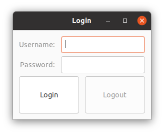 

New [Glimmer DSL for LibUI](https://rubygems.org/gems/glimmer-dsl-libui) Version (with [data-binding](#data-binding)):

```ruby
require 'glimmer-dsl-libui'

class Login
  include Glimmer
  
  attr_accessor :username, :password, :logged_in
  
  def launch
    window('Login') {
      margined true
      
      vertical_box {
        form {
          entry {
            label 'Username:'
            text <=> [self, :username]
            enabled <= [self, :logged_in, on_read: :!]
          }
          
          password_entry {
            label 'Password:'
            text <=> [self, :password]
            enabled <= [self, :logged_in, on_read: :!]
          }
        }
        
        horizontal_box {
          button('Login') {
            enabled <= [self, :logged_in, on_read: :!]
            
            on_clicked do
              self.logged_in = true
            end
          }
          
          button('Logout') {
            enabled <= [self, :logged_in]
            
            on_clicked do
              self.logged_in = false
              self.username = ''
              self.password = ''
            end
          }
        }
      }
    }.show
  end
end

Login.new.launch
```

New [Glimmer DSL for LibUI](https://rubygems.org/gems/glimmer-dsl-libui) Version 2 (with [data-binding](#data-binding)):

```ruby
require 'glimmer-dsl-libui'

class Login
  include Glimmer
  
  attr_accessor :username, :password, :logged_in
  
  def logged_out
    !logged_in
  end
  
  def launch
    window('Login') {
      margined true
      
      vertical_box {
        form {
          entry {
            label 'Username:'
            text <=> [self, :username]
            enabled <= [self, :logged_out, computed_by: :logged_in] # computed_by option ensures being notified of changes to logged_in
          }
          
          password_entry {
            label 'Password:'
            text <=> [self, :password]
            enabled <= [self, :logged_out, computed_by: :logged_in]
          }
        }
        
        horizontal_box {
          button('Login') {
            enabled <= [self, :logged_out, computed_by: :logged_in]
            
            on_clicked do
              self.logged_in = true
            end
          }
          
          button('Logout') {
            enabled <= [self, :logged_in]
            
            on_clicked do
              self.logged_in = false
              self.username = ''
              self.password = ''
            end
          }
        }
      }
    }.show
  end
end

Login.new.launch
```

New [Glimmer DSL for LibUI](https://rubygems.org/gems/glimmer-dsl-libui) Version 3 (with [data-binding](#data-binding)):

```ruby
require 'glimmer-dsl-libui'

class Login
  include Glimmer
  
  attr_accessor :username, :password
  attr_reader :logged_in
  
  def logged_in=(value)
    @logged_in = value
    self.logged_out = !value # calling logged_out= method notifies logged_out observers
  end
  
  def logged_out=(value)
    self.logged_in = !value unless logged_in == !value
  end
  
  def logged_out
    !logged_in
  end
  
  def launch
    window('Login') {
      margined true
      
      vertical_box {
        form {
          entry {
            label 'Username:'
            text <=> [self, :username]
            enabled <= [self, :logged_out]
          }
          
          password_entry {
            label 'Password:'
            text <=> [self, :password]
            enabled <= [self, :logged_out]
          }
        }
        
        horizontal_box {
          button('Login') {
            enabled <= [self, :logged_out]
            
            on_clicked do
              self.logged_in = true
            end
          }
          
          button('Logout') {
            enabled <= [self, :logged_in]
            
            on_clicked do
              self.logged_in = false
              self.username = ''
              self.password = ''
            end
          }
        }
      }
    }.show
  end
end

Login.new.launch
```

New [Glimmer DSL for LibUI](https://rubygems.org/gems/glimmer-dsl-libui) Version 4 (with [data-binding](#data-binding)):

```ruby
require 'glimmer-dsl-libui'

class Login
  include Glimmer
  
  attr_accessor :username, :password
  attr_reader :logged_in
  
  def logged_in=(value)
    @logged_in = value
    notify_observers(:logged_out) # manually notify observers of logged_out upon logged_in changes; this method comes automatically from enhancement as Glimmer::DataBinding::ObservableModel via data-binding
  end
  
  def logged_out
    !logged_in
  end
  
  def launch
    window('Login') {
      margined true
      
      vertical_box {
        form {
          entry {
            label 'Username:'
            text <=> [self, :username]
            enabled <= [self, :logged_out]
          }
          
          password_entry {
            label 'Password:'
            text <=> [self, :password]
            enabled <= [self, :logged_out]
          }
        }
        
        horizontal_box {
          button('Login') {
            enabled <= [self, :logged_out]
            
            on_clicked do
              self.logged_in = true
            end
          }
          
          button('Logout') {
            enabled <= [self, :logged_in]
            
            on_clicked do
              self.logged_in = false
              self.username = ''
              self.password = ''
            end
          }
        }
      }
    }.show
  end
end

Login.new.launch
```

New [Glimmer DSL for LibUI](https://rubygems.org/gems/glimmer-dsl-libui) Version 5 (without [data-binding](#data-binding)):

```ruby
require 'glimmer-dsl-libui'

include Glimmer

window('Login') {
  margined true
  
  vertical_box {
    form {
      @username_entry = entry {
        label 'Username:'
      }
      
      @password_entry = password_entry {
        label 'Password:'
      }
    }
    
    horizontal_box {
      @login_button = button('Login') {
        on_clicked do
          @username_entry.enabled = false
          @password_entry.enabled = false
          @login_button.enabled = false
          @logout_button.enabled = true
        end
      }
      
      @logout_button = button('Logout') {
        enabled false
        
        on_clicked do
          @username_entry.text = ''
          @password_entry.text = ''
          @username_entry.enabled = true
          @password_entry.enabled = true
          @login_button.enabled = true
          @logout_button.enabled = false
        end
      }
    }
  }
}.show
```

#### Method-Based Custom Controls

[Custom keywords](#custom-keywords) can be defined to represent custom controls (components) that provide new features or act as composites of existing controls that need to be reused multiple times in an application or across multiple applications. Custom keywords save a lot of development time, improving productivity and maintainability immensely.
  
This example defines `form_field`, `address_form`, `label_pair`, and `address` as custom controls (keywords).

The custom keywords are defined via methods (thus are "method-based").

[examples/method_based_custom_controls.rb](examples/method_based_custom_controls.rb)

Run with this command from the root of the project if you cloned the project:

```
ruby -r './lib/glimmer-dsl-libui' examples/method_based_custom_controls.rb
```

Run with this command if you installed the [Ruby gem](https://rubygems.org/gems/glimmer-dsl-libui):

```
ruby -r glimmer-dsl-libui -e "require 'examples/method_based_custom_controls'"
```

Mac | Windows | Linux
----|---------|------
 |  | 

New [Glimmer DSL for LibUI](https://rubygems.org/gems/glimmer-dsl-libui) Version (with [data-binding](#data-binding)):

```ruby
require 'glimmer-dsl-libui'
require 'facets'

include Glimmer

Address = Struct.new(:street, :p_o_box, :city, :state, :zip_code)

def form_field(model, attribute)
  attribute = attribute.to_s
  entry { |e|
    label attribute.underscore.split('_').map(&:capitalize).join(' ')
    text <=> [model, attribute]
  }
end

def address_form(address_model)
  form {
    form_field(address_model, :street)
    form_field(address_model, :p_o_box)
    form_field(address_model, :city)
    form_field(address_model, :state)
    form_field(address_model, :zip_code)
  }
end

def label_pair(model, attribute, value)
  horizontal_box {
    label(attribute.to_s.underscore.split('_').map(&:capitalize).join(' '))
    label(value.to_s) {
      text <= [model, attribute]
    }
  }
end

def address_view(address_model)
  vertical_box {
    address_model.each_pair do |attribute, value|
      label_pair(address_model, attribute, value)
    end
  }
end

address1 = Address.new('123 Main St', '23923', 'Denver', 'Colorado', '80014')
address2 = Address.new('2038 Park Ave', '83272', 'Boston', 'Massachusetts', '02101')

window('Method-Based Custom Controls') {
  margined true
  
  horizontal_box {
    vertical_box {
      label('Address 1') {
        stretchy false
      }
      
      address_form(address1)
      
      horizontal_separator {
        stretchy false
      }
      
      label('Address 1 (Saved)') {
        stretchy false
      }
      
      address_view(address1)
    }
    
    vertical_separator {
      stretchy false
    }
    
    vertical_box {
      label('Address 2') {
        stretchy false
      }
      
      address_form(address2)
      
      horizontal_separator {
        stretchy false
      }
      
      label('Address 2 (Saved)') {
        stretchy false
      }
      
      address_view(address2)
    }
  }
}.show
```

New [Glimmer DSL for LibUI](https://rubygems.org/gems/glimmer-dsl-libui) Version 2 (without [data-binding](#data-binding)):

```ruby
require 'glimmer-dsl-libui'
require 'facets'

include Glimmer

Address = Struct.new(:street, :p_o_box, :city, :state, :zip_code)

def form_field(model, property)
  property = property.to_s
  entry { |e|
    label property.underscore.split('_').map(&:capitalize).join(' ')
    text model.send(property).to_s

    on_changed do
      model.send("#{property}=", e.text)
    end
  }
end

def address_form(address_model)
  form {
    form_field(address_model, :street)
    form_field(address_model, :p_o_box)
    form_field(address_model, :city)
    form_field(address_model, :state)
    form_field(address_model, :zip_code)
  }
end

def label_pair(model, attribute, value)
  name_label = nil
  value_label = nil
  horizontal_box {
    name_label = label(attribute.to_s.underscore.split('_').map(&:capitalize).join(' '))
    value_label = label(value.to_s)
  }
  observe(model, attribute) do
    value_label.text = model.send(attribute)
  end
end

def address_view(address_model)
  vertical_box {
    address_model.each_pair do |attribute, value|
      label_pair(address_model, attribute, value)
    end
  }
end

address1 = Address.new('123 Main St', '23923', 'Denver', 'Colorado', '80014')
address2 = Address.new('2038 Park Ave', '83272', 'Boston', 'Massachusetts', '02101')

window('Method-Based Custom Controls') {
  margined true
  
  horizontal_box {
    vertical_box {
      label('Address 1') {
        stretchy false
      }
      
      address_form(address1)
      
      horizontal_separator {
        stretchy false
      }
      
      label('Address 1 (Saved)') {
        stretchy false
      }
      
      address_view(address1)
    }
    
    vertical_separator {
      stretchy false
    }
    
    vertical_box {
      label('Address 2') {
        stretchy false
      }
      
      address_form(address2)
      
      horizontal_separator {
        stretchy false
      }
      
      label('Address 2 (Saved)') {
        stretchy false
      }
      
      address_view(address2)
    }
  }
}.show
```

#### Class-Based Custom Controls

[Custom keywords](#custom-keywords) can be defined to represent custom controls (components) that provide new features or act as composites of existing controls that need to be reused multiple times in an application or across multiple applications. Custom keywords save a lot of development time, improving productivity and maintainability immensely.
  
This example defines `form_field`, `address_form`, `label_pair`, and `address` as custom controls (keywords).

The custom keywords are defined via classes that include `Glimmer::LibUI::CustomControl` (thus are "class-based"), thus enabling offloading each custom control into its own file when needed for better code organization.

[examples/class_based_custom_controls.rb](examples/class_based_custom_controls.rb)

Run with this command from the root of the project if you cloned the project:

```
ruby -r './lib/glimmer-dsl-libui' examples/class_based_custom_controls.rb
```

Run with this command if you installed the [Ruby gem](https://rubygems.org/gems/glimmer-dsl-libui):

```
ruby -r glimmer-dsl-libui -e "require 'examples/class_based_custom_controls'"
```

Mac | Windows | Linux
----|---------|------
 |  | 

New [Glimmer DSL for LibUI](https://rubygems.org/gems/glimmer-dsl-libui) Version (with [data-binding](#data-binding)):

```ruby
require 'glimmer-dsl-libui'
require 'facets'

Address = Struct.new(:street, :p_o_box, :city, :state, :zip_code)

class FormField
  include Glimmer::LibUI::CustomControl
  
  options :model, :attribute
  
  body {
    entry { |e|
      label attribute.to_s.underscore.split('_').map(&:capitalize).join(' ')
      text <=> [model, attribute]
    }
  }
end

class AddressForm
  include Glimmer::LibUI::CustomControl
  
  options :address
  
  body {
    form {
      form_field(model: address, attribute: :street)
      form_field(model: address, attribute: :p_o_box)
      form_field(model: address, attribute: :city)
      form_field(model: address, attribute: :state)
      form_field(model: address, attribute: :zip_code)
    }
  }
end

class LabelPair
  include Glimmer::LibUI::CustomControl
  
  options :model, :attribute, :value
  
  body {
    horizontal_box {
      label(attribute.to_s.underscore.split('_').map(&:capitalize).join(' '))
      label(value.to_s) {
        text <= [model, attribute]
      }
    }
  }
end

class AddressView
  include Glimmer::LibUI::CustomControl
  
  options :address
  
  body {
    vertical_box {
      address.each_pair do |attribute, value|
        label_pair(model: address, attribute: attribute, value: value)
      end
    }
  }
end

class ClassBasedCustomControls
  include Glimmer::LibUI::Application # alias: Glimmer::LibUI::CustomWindow
  
  before_body do
    @address1 = Address.new('123 Main St', '23923', 'Denver', 'Colorado', '80014')
    @address2 = Address.new('2038 Park Ave', '83272', 'Boston', 'Massachusetts', '02101')
  end
  
  body {
    window('Class-Based Custom Keyword') {
      margined true
      
      horizontal_box {
        vertical_box {
          label('Address 1') {
            stretchy false
          }
          
          address_form(address: @address1)
          
          horizontal_separator {
            stretchy false
          }
          
          label('Address 1 (Saved)') {
            stretchy false
          }
          
          address_view(address: @address1)
        }
        
        vertical_separator {
          stretchy false
        }
        
        vertical_box {
          label('Address 2') {
            stretchy false
          }
          
          address_form(address: @address2)
          
          horizontal_separator {
            stretchy false
          }
          
          label('Address 2 (Saved)') {
            stretchy false
          }
          
          address_view(address: @address2)
        }
      }
    }
  }
end

ClassBasedCustomControls.launch
```

#### Area-Based Custom Controls

[Custom keywords](#custom-keywords) can be defined for graphical custom controls (components) built completely from scratch as vector-graphics on top of the [`area`](#area-api) control while leveraging keyboard and mouse listeners.

This example defines `text_label` and `push_button` as [`area`](#area-api)-based graphical custom controls that can have width, height, font, fill, stroke, border, and custom text location.
      
[examples/area_based_custom_controls.rb](examples/area_based_custom_controls.rb)

Run with this command from the root of the project if you cloned the project:

```
ruby -r './lib/glimmer-dsl-libui' examples/area_based_custom_controls.rb
```

Run with this command if you installed the [Ruby gem](https://rubygems.org/gems/glimmer-dsl-libui):

```
ruby -r glimmer-dsl-libui -e "require 'examples/area_based_custom_controls'"
```

Mac | Windows | Linux
----|---------|------
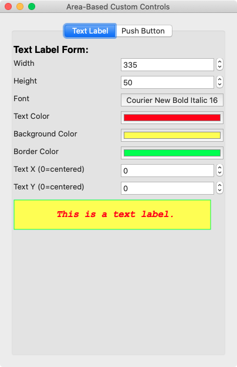 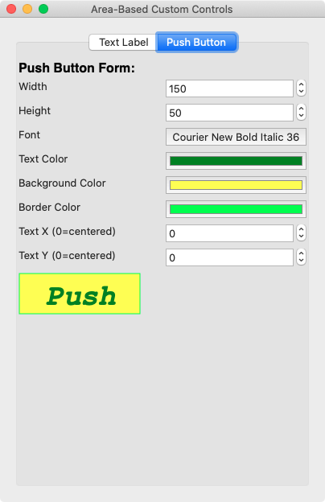  |    |   

New [Glimmer DSL for LibUI](https://rubygems.org/gems/glimmer-dsl-libui) Version:

```ruby
require 'glimmer-dsl-libui'

class AreaBasedCustomControls
  include Glimmer
  
  attr_accessor :label_width, :label_height, :label_font_descriptor,
                :label_text_color, :label_background_fill, :label_border_stroke,
                :label_text_x, :label_text_y,
                :button_width, :button_height, :button_font_descriptor,
                :button_text_color, :button_background_fill, :button_border_stroke,
                :button_text_x, :button_text_y
  
  def initialize
    self.label_width = 335
    self.label_height = 50
    self.label_font_descriptor = {family: OS.linux? ? 'Monospace Bold Italic' : 'Courier New', size: 16, weight: :bold, italic: :italic}
    self.label_text_color = :red
    self.label_background_fill = :yellow
    self.label_border_stroke = :limegreen
    
    self.button_width = 150
    self.button_height = 50
    self.button_font_descriptor = {family: OS.linux? ? 'Monospace Bold Italic' : 'Courier New', size: 36, weight: OS.linux? ? :normal : :bold, italic: :italic}
    self.button_text_color = :green
    self.button_background_fill = :yellow
    self.button_border_stroke = :limegreen
  end
  
  def rebuild_text_label
    @text_label.destroy
    @text_label_vertical_box.content { # re-open vertical box content and shove in a new label
      @text_label = text_label('This is a text label.',
                               width: label_width, height: label_height, font_descriptor: label_font_descriptor,
                               background_fill: label_background_fill, text_color: label_text_color, border_stroke: label_border_stroke,
                               text_x: label_text_x, text_y: label_text_y)
    }
  end
  
  def rebuild_push_button
    @push_button.destroy
    @push_button_vertical_box.content { # re-open vertical box content and shove in a new button
      @push_button = push_button('Push',
                                 width: button_width, height: button_height, font_descriptor: button_font_descriptor,
                                 background_fill: button_background_fill, text_color: button_text_color, border_stroke: button_border_stroke,
                                 text_x: button_text_x, text_y: button_text_y) {
        on_mouse_up do
          message_box('Button Pushed', 'Thank you for pushing the button!')
        end
      }
    }
  end
  
  def launch
    window('Area-Based Custom Controls', 385, 385) { |w|
      margined true
      
      tab {
        tab_item('Text Label') {
          @text_label_vertical_box = vertical_box {
            vertical_box {
              text_label('Text Label Form:', width: 385, height: 30, background_fill: OS.windows? ? :white : {a: 0}, border_stroke: OS.windows? ? :white : {a: 0}, font_descriptor: {size: 16, weight: :bold}, text_x: 0, text_y: OS.windows? ? 0 : 5)

              horizontal_box {
                label('Width')
                spinbox(1, 1000) {
                  value <=> [self, :label_width, after_write: method(:rebuild_text_label)]
                }
              }
              
              horizontal_box {
                label('Height')
                spinbox(1, 1000) {
                  value <=> [self, :label_height, after_write: method(:rebuild_text_label)]
                }
              }
              
              horizontal_box {
                label('Font')
                font_button {
                  font <=> [self, :label_font_descriptor, after_write: method(:rebuild_text_label)]
                }
              }
              
              horizontal_box {
                label('Text Color')
                color_button {
                  color <=> [self, :label_text_color, after_write: method(:rebuild_text_label)]
                }
              }
              
              horizontal_box {
                label('Background Color')
                color_button {
                  color <=> [self, :label_background_fill, after_write: method(:rebuild_text_label)]
                }
              }
              
              horizontal_box {
                label('Border Color')
                color_button {
                  color <=> [self, :label_border_stroke, after_write: method(:rebuild_text_label)]
                }
              }
              
              horizontal_box {
                label('Text X (0=centered)')
                spinbox(0, 1000) {
                  value <=> [self, :label_text_x, on_read: ->(x) {x.nil? ? 0 : x}, on_write: ->(x) {x == 0 ? nil : x}, after_write: method(:rebuild_text_label)]
                }
              }
              
              horizontal_box {
                label('Text Y (0=centered)')
                spinbox(0, 1000) {
                  value <=> [self, :label_text_y, on_read: ->(y) {y.nil? ? 0 : y}, on_write: ->(y) {y == 0 ? nil : y}, after_write: method(:rebuild_text_label)]
                }
              }
            }
            
            @text_label = text_label('This is a text label.',
                                     width: label_width, height: label_height, font_descriptor: label_font_descriptor,
                                     background_fill: label_background_fill, text_color: label_text_color, border_stroke: label_border_stroke,
                                     text_x: label_text_x, text_y: label_text_y)
          }
        }
        
        tab_item('Push Button') {
          @push_button_vertical_box = vertical_box {
            vertical_box {
              text_label('Push Button Form:', width: 385, height: 30, background_fill: OS.windows? ? :white : {a: 0}, border_stroke: OS.windows? ? :white : {a: 0}, font_descriptor: {size: 16, weight: :bold}, text_x: 0, text_y: OS.windows? ? 0 : 5)
              
              horizontal_box {
                label('Width')
                spinbox(1, 1000) {
                  value <=> [self, :button_width, after_write: method(:rebuild_push_button)]
                }
              }
              
              horizontal_box {
                label('Height')
                spinbox(1, 1000) {
                  value <=> [self, :button_height, after_write: method(:rebuild_push_button)]
                }
              }
              
              horizontal_box {
                label('Font')
                font_button {
                  font <=> [self, :button_font_descriptor, after_write: method(:rebuild_push_button)]
                }
              }
              
              horizontal_box {
                label('Text Color')
                color_button {
                  color <=> [self, :button_text_color, after_write: method(:rebuild_push_button)]
                }
              }
              
              horizontal_box {
                label('Background Color')
                color_button {
                  color <=> [self, :button_background_fill, after_write: method(:rebuild_push_button)]
                }
              }
              
              horizontal_box {
                label('Border Color')
                color_button {
                  color <=> [self, :button_border_stroke, after_write: method(:rebuild_push_button)]
                }
              }
              
              horizontal_box {
                label('Text X (0=centered)')
                spinbox(0, 1000) {
                  value <=> [self, :button_text_x, on_read: ->(x) {x.nil? ? 0 : x}, on_write: ->(x) {x == 0 ? nil : x}, after_write: method(:rebuild_push_button)]
                }
              }
              
              horizontal_box {
                label('Text Y (0=centered)')
                spinbox(0, 1000) {
                  value <=> [self, :button_text_y, on_read: ->(y) {y.nil? ? 0 : y}, on_write: ->(y) {y == 0 ? nil : y}, after_write: method(:rebuild_push_button)]
                }
              }
            }
            
            @push_button = push_button('Push',
                                       width: button_width, height: button_height, font_descriptor: button_font_descriptor,
                                       background_fill: button_background_fill, text_color: button_text_color, border_stroke: button_border_stroke,
                                       text_x: button_text_x, text_y: button_text_y) {
              on_mouse_up do
                message_box('Button Pushed', 'Thank you for pushing the button!')
              end
            }
          }
        }
      }
    }.show
  end
    
  # text label (area-based custom control) built with vector graphics on top of area.
  #
  # background_fill is transparent by default.
  # background_fill can accept a single color or gradient stops just as per `fill` property in README.
  # border_stroke is transparent by default.
  # border_stroke can accept thickness and dashes in addition to color just as per `stroke` property in README.
  # text_x and text_y are the offset of the label text in relation to its top-left corner.
  # When text_x, text_y are left nil, the text is automatically centered in the label area.
  # Sometimes, the centering calculation is not perfect due to using a custom font, so
  # in that case, pass in text_x, and text_y manually.
  def text_label(label_text,
                  width: 80, height: 30, font_descriptor: {},
                  background_fill: {a: 0}, text_color: :black, border_stroke: {a: 0},
                  text_x: nil, text_y: nil,
                  &content)
    area { |the_area|
      rectangle(1, 1, width, height) {
        fill background_fill
      }
      rectangle(1, 1, width, height) {
        stroke border_stroke
      }
      
      text_height = (font_descriptor[:size] || 12) * (OS.mac? ? 0.75 : 1.35)
      text_width = (text_height * label_text.size) * (OS.mac? ? 0.75 : 0.60)
      text_x ||= (width - text_width) / 2.0
      text_y ||= (height - 4 - text_height) / 2.0
      text(text_x, text_y, width) {
        string(label_text) {
          color text_color
          font font_descriptor
        }
      }
      
      content&.call(the_area)
    }
  end
  
  # push button (area-based custom control) built with vector graphics on top of area.
  #
  # background_fill is white by default.
  # background_fill can accept a single color or gradient stops just as per `fill` property in README.
  # border_stroke is black by default.
  # border_stroke can accept thickness and dashes in addition to color just as per `stroke` property in README.
  # text_x and text_y are the offset of the button text in relation to its top-left corner.
  # When text_x, text_y are left nil, the text is automatically centered in the button area.
  # Sometimes, the centering calculation is not perfect due to using a custom font, so
  # in that case, pass in text_x, and text_y manually.
  #
  # reuses the text_label custom control
  def push_button(button_text,
                  width: 80, height: 30, font_descriptor: {},
                  background_fill: :white, text_color: :black, border_stroke: {r: 201, g: 201, b: 201},
                  text_x: nil, text_y: nil,
                  &content)
    text_label(button_text,
                  width: width, height: height, font_descriptor: font_descriptor,
                  background_fill: background_fill, text_color: text_color, border_stroke: border_stroke,
                  text_x: text_x, text_y: text_y) { |the_area|
      
      # dig into the_area content and grab elements to modify in mouse listeners below
      background_rectangle = the_area.children[0]
      button_string = the_area.children[2].children[0]
      
      on_mouse_down do
        background_rectangle.fill = {x0: 0, y0: 0, x1: 0, y1: height, stops: [{pos: 0, r: 72, g: 146, b: 247}, {pos: 1, r: 12, g: 85, b: 214}]}
        button_string.color = :white
      end
      
      on_mouse_up do
        background_rectangle.fill = background_fill
        button_string.color = text_color
      end
      
      content&.call(the_area)
    }
  end
end

AreaBasedCustomControls.new.launch
```

#### Midi Player

To run this example, install [TiMidity](http://timidity.sourceforge.net) and ensure `timidity` command is in `PATH` (can be installed via [Homebrew](https://brew.sh) on Mac or [apt-get](https://help.ubuntu.com/community/AptGet/Howto) on Linux).

[examples/midi_player.rb](examples/midi_player.rb)

Run with this command from the root of the project if you cloned the project:

```
ruby -r './lib/glimmer-dsl-libui' examples/midi_player.rb
```

Run with this command if you installed the [Ruby gem](https://rubygems.org/gems/glimmer-dsl-libui):

```
ruby -r glimmer-dsl-libui -e "require 'examples/midi_player'"
```

Mac | Windows | Linux
----|---------|------
  |   |  

[LibUI](https://github.com/kojix2/LibUI) Original Version:

```ruby
require 'libui'
UI = LibUI

class TinyMidiPlayer
  VERSION = '0.0.1'

  def initialize
    UI.init
    @pid = nil
    @music_directory = File.expand_path(ARGV[0] || '~/Music/')
    @midi_files      = Dir.glob(File.join(@music_directory, '**/*.mid'))
                          .sort_by { |path| File.basename(path) }
    at_exit { stop_midi }
    create_gui
  end

  def stop_midi
    if @pid
      Process.kill(:SIGKILL, @pid) if @th.alive?
      @pid = nil
    end
  end

  def play_midi
    stop_midi
    if @pid.nil? && @selected_file
      begin
        @pid = spawn "timidity #{@selected_file}"
        @th = Process.detach @pid
      rescue Errno::ENOENT
        warn 'Timidty++ not found. Please install Timidity++.'
        warn 'https://sourceforge.net/projects/timidity/'
      end
    end
  end

  def show_version(main_window)
    UI.msg_box(main_window,
               'Tiny Midi Player',
               "Written in Ruby\n" \
               "https://github.com/kojix2/libui\n" \
               "Version #{VERSION}")
  end

  def create_gui
    # loop_menu = UI.new_menu('Repeat')
    # items = %w[Off One].map do |item_name|
    #   item = UI.menu_append_check_item(loop_menu, item_name)
    # end
    # items.each_with_index do |item, idx|
    #   UI.menu_item_on_clicked(item) do
    #     @repeat = idx
    #     (items - [item]).each do |i|
    #       UI.menu_item_set_checked(i, 0)
    #     end
    #     0
    #   end
    # end

    help_menu = UI.new_menu('Help')
    version_item = UI.menu_append_item(help_menu, 'Version')

    UI.new_window('Tiny Midi Player', 200, 50, 1).tap do |main_window|
      UI.menu_item_on_clicked(version_item) { show_version(main_window) }

      UI.window_on_closing(main_window) do
        UI.control_destroy(main_window)
        UI.quit
        0
      end

      UI.new_horizontal_box.tap do |hbox|
        UI.new_vertical_box.tap do |vbox|
          UI.new_button('').tap do |button1|
            UI.button_on_clicked(button1) { play_midi }
            UI.box_append(vbox, button1, 1)
          end
          UI.new_button('').tap do |button2|
            UI.button_on_clicked(button2) { stop_midi }
            UI.box_append(vbox, button2, 1)
          end
          UI.box_append(hbox, vbox, 0)
        end
        UI.window_set_child(main_window, hbox)

        UI.new_combobox.tap do |cbox|
          @midi_files.each do |path|
            name = File.basename(path)
            UI.combobox_append(cbox, name)
          end
          UI.combobox_on_selected(cbox) do |ptr|
            @selected_file = @midi_files[UI.combobox_selected(ptr)]
            play_midi if @th&.alive?
            0
          end
          UI.box_append(hbox, cbox, 1)
        end
      end
      UI.control_show(main_window)
    end
    UI.main
    UI.quit
  end
end

TinyMidiPlayer.new
```

[Glimmer DSL for LibUI](https://rubygems.org/gems/glimmer-dsl-libui) Version (with [data-binding](#data-binding)):

```ruby
# frozen_string_literal: true

require 'glimmer-dsl-libui'

class TinyMidiPlayer
  include Glimmer
  
  VERSION = '0.0.1'
  
  attr_accessor :selected_file

  def initialize
    @pid = nil
    @music_directory = File.expand_path('../sounds', __dir__)
    @midi_files      = Dir.glob(File.join(@music_directory, '**/*.mid'))
                          .sort_by { |path| File.basename(path) }
    at_exit { stop_midi }
    create_gui
  end

  def stop_midi
    if @pid
      Process.kill(:SIGKILL, @pid) if @th.alive?
      @pid = nil
    end
  end

  def play_midi
    stop_midi
    if @pid.nil? && @selected_file
      begin
        @pid = spawn "timidity #{@selected_file}"
        @th = Process.detach @pid
      rescue Errno::ENOENT
        warn 'Timidty++ not found. Please install Timidity++.'
        warn 'https://sourceforge.net/projects/timidity/'
      end
    end
  end

  def show_version
    msg_box('Tiny Midi Player',
              "Written in Ruby\n" \
                "https://github.com/kojix2/libui\n" \
                "Version #{VERSION}")
  end

  def create_gui
    menu('Help') {
      menu_item('Version') {
        on_clicked do
          show_version
        end
      }
    }
    window('Tiny Midi Player', 200, 50) {
      horizontal_box {
        vertical_box {
          stretchy false
          
          button('') {
            on_clicked do
              play_midi
            end
          }
          button('') {
            on_clicked do
              stop_midi
            end
          }
        }

        combobox {
          items @midi_files.map { |path| File.basename(path) }
          # data-bind selected item (String) to self.selected_file with on-read/on-write converters and after_write operation
          selected_item <=> [self, :selected_file, on_read: ->(f) {File.basename(f.to_s)}, on_write: ->(f) {File.join(@music_directory, f)}, after_write: -> { play_midi if @th&.alive? }]
        }
      }
    }.show
  end
end

TinyMidiPlayer.new
```

[Glimmer DSL for LibUI](https://rubygems.org/gems/glimmer-dsl-libui) Version 2 (with [data-binding](#data-binding)):

```ruby
require 'glimmer-dsl-libui'

class TinyMidiPlayer
  include Glimmer
  
  VERSION = '0.0.1'
  
  attr_accessor :selected_file

  def initialize
    @pid = nil
    @music_directory = File.expand_path('../sounds', __dir__)
    @midi_files      = Dir.glob(File.join(@music_directory, '**/*.mid'))
                          .sort_by { |path| File.basename(path) }
    at_exit { stop_midi }
    create_gui
  end

  def stop_midi
    if @pid
      Process.kill(:SIGKILL, @pid) if @th.alive?
      @pid = nil
    end
  end

  def play_midi
    stop_midi
    if @pid.nil? && @selected_file
      begin
        @pid = spawn "timidity #{@selected_file}"
        @th = Process.detach @pid
      rescue Errno::ENOENT
        warn 'Timidty++ not found. Please install Timidity++.'
        warn 'https://sourceforge.net/projects/timidity/'
      end
    end
  end

  def show_version
    msg_box('Tiny Midi Player',
              "Written in Ruby\n" \
                "https://github.com/kojix2/libui\n" \
                "Version #{VERSION}")
  end

  def create_gui
    menu('Help') {
      menu_item('Version') {
        on_clicked do
          show_version
        end
      }
    }
    window('Tiny Midi Player', 200, 50) {
      horizontal_box {
        vertical_box {
          stretchy false
          
          button('') {
            on_clicked do
              play_midi
            end
          }
          button('') {
            on_clicked do
              stop_midi
            end
          }
        }

        combobox {
          items @midi_files.map { |path| File.basename(path) }
          # data-bind selected index (Integer) to self.selected_file with on-read/on-write converters and after_write operation
          selected <=> [self, :selected_file, on_read: ->(f) {@midi_files.index(f)}, on_write: ->(i) {@midi_files[i]}, after_write: -> { play_midi if @th&.alive? }]
        }
      }
    }.show
  end
end

TinyMidiPlayer.new
```

[Glimmer DSL for LibUI](https://rubygems.org/gems/glimmer-dsl-libui) Version 3 (without [data-binding](#data-binding)):

```ruby
require 'glimmer-dsl-libui'

class TinyMidiPlayer
  include Glimmer
  
  VERSION = '0.0.1'

  def initialize
    @pid = nil
    @music_directory = File.expand_path('../sounds', __dir__)
    @midi_files      = Dir.glob(File.join(@music_directory, '**/*.mid'))
                          .sort_by { |path| File.basename(path) }
    at_exit { stop_midi }
    create_gui
  end

  def stop_midi
    if @pid
      Process.kill(:SIGKILL, @pid) if @th.alive?
      @pid = nil
    end
  end

  def play_midi
    stop_midi
    if @pid.nil? && @selected_file
      begin
        @pid = spawn "timidity #{@selected_file}"
        @th = Process.detach @pid
      rescue Errno::ENOENT
        warn 'Timidty++ not found. Please install Timidity++.'
        warn 'https://sourceforge.net/projects/timidity/'
      end
    end
  end

  def show_version
    msg_box('Tiny Midi Player',
              "Written in Ruby\n" \
                "https://github.com/kojix2/libui\n" \
                "Version #{VERSION}")
  end

  def create_gui
    menu('Help') {
      menu_item('Version') {
        on_clicked do
          show_version
        end
      }
    }
    window('Tiny Midi Player', 200, 50) {
      horizontal_box {
        vertical_box {
          stretchy false
          
          button('') {
            on_clicked do
              play_midi
            end
          }
          button('') {
            on_clicked do
              stop_midi
            end
          }
        }

        combobox { |c|
          items @midi_files.map { |path| File.basename(path) }
          
          on_selected do
            @selected_file = @midi_files[c.selected]
            play_midi if @th&.alive?
          end
        }
      }
    }.show
  end
end

TinyMidiPlayer.new
```

#### Snake

Snake provides an example of building a desktop application [test-first](/spec/examples/snake/model/game_spec.rb) following the MVP ([Model](/examples/snake/model/game.rb) / [View](/examples/snake.rb) / [Presenter](/examples/snake/presenter/grid.rb)) architectural pattern.

Use arrows to move and spacebar to pause/resume.

Note that Snake relies on the new [Ruby Pattern Matching feature](https://docs.ruby-lang.org/en/3.0/doc/syntax/pattern_matching_rdoc.html) available starting in Ruby 2.7 experimentally and in Ruby 3.0 officially.

[examples/snake.rb](examples/snake.rb)

Run with this command from the root of the project if you cloned the project:

```
ruby -r './lib/glimmer-dsl-libui' examples/snake.rb
```

Run with this command if you installed the [Ruby gem](https://rubygems.org/gems/glimmer-dsl-libui):

```
ruby -r glimmer-dsl-libui -e "require 'examples/snake'"
```

Mac | Windows | Linux
----|---------|------
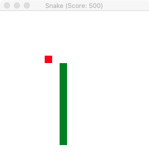 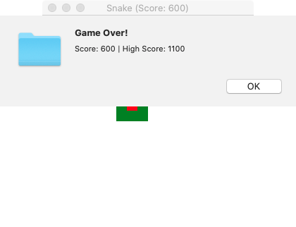 | 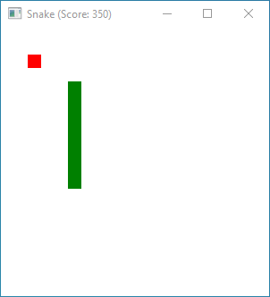 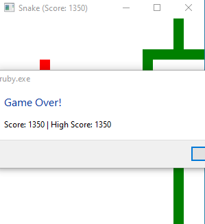 | 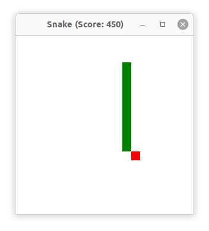 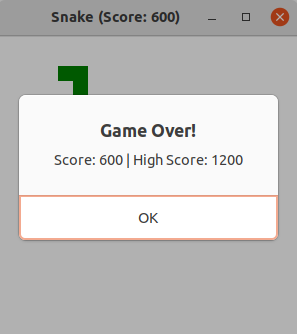

New [Glimmer DSL for LibUI](https://rubygems.org/gems/glimmer-dsl-libui) Version (with [data-binding](#data-binding)):

```ruby
require 'glimmer-dsl-libui'

require_relative 'snake/presenter/grid'

class Snake
  include Glimmer
  
  CELL_SIZE = 15
  SNAKE_MOVE_DELAY = 0.1
  
  def initialize
    @game = Model::Game.new
    @grid = Presenter::Grid.new(@game)
    @game.start
    @keypress_queue = []
    create_gui
    register_observers
  end
  
  def launch
    @main_window.show
  end
  
  def register_observers
    observe(@game, :over) do |game_over|
      Glimmer::LibUI.queue_main do
        if game_over
          msg_box('Game Over!', "Score: #{@game.score} | High Score: #{@game.high_score}")
          @game.start
        end
      end
    end
    
    Glimmer::LibUI.timer(SNAKE_MOVE_DELAY) do
      unless @game.paused? || @game.over?
        process_queued_keypress
        @game.snake.move
      end
    end
  end
  
  def process_queued_keypress
    # key press queue ensures one turn per snake move to avoid a double-turn resulting in instant death (due to snake illogically going back against itself)
    key = @keypress_queue.shift
    case [@game.snake.head.orientation, key]
    in [:north, :right] | [:east, :down] | [:south, :left] | [:west, :up]
      @game.snake.turn_right
    in [:north, :left] | [:west, :down] | [:south, :right] | [:east, :up]
      @game.snake.turn_left
    else
      # No Op
    end
  end
  
  def create_gui
    @main_window = window {
      # data-bind window title to game score, converting it to a title string on read from the model
      title <= [@game, :score, on_read: -> (score) {"Snake (Score: #{@game.score})"}]
      content_size @game.width * CELL_SIZE, @game.height * CELL_SIZE
      resizable false
      
      vertical_box {
        padded false
        
        @game.height.times do |row|
          horizontal_box {
            padded false
            
            @game.width.times do |column|
              area {
                square(0, 0, CELL_SIZE) {
                  fill <= [@grid.cells[row][column], :color] # data-bind square fill to grid cell color
                }
                
                on_key_up do |area_key_event|
                  if area_key_event[:key] == ' '
                    @game.toggle_pause
                  else
                    @keypress_queue << area_key_event[:ext_key]
                  end
                end
              }
            end
          }
        end
      }
    }
  end
end

Snake.new.launch
```

New [Glimmer DSL for LibUI](https://rubygems.org/gems/glimmer-dsl-libui) Version 2 (without [data-binding](#data-binding)):

```ruby
require 'glimmer-dsl-libui'

require_relative 'snake/presenter/grid'

class Snake
  include Glimmer
  
  CELL_SIZE = 15
  SNAKE_MOVE_DELAY = 0.1
  
  def initialize
    @game = Model::Game.new
    @grid = Presenter::Grid.new(@game)
    @game.start
    @keypress_queue = []
    create_gui
    register_observers
  end
  
  def launch
    @main_window.show
  end
  
  def register_observers
    @game.height.times do |row|
      @game.width.times do |column|
        observe(@grid.cells[row][column], :color) do |new_color|
          @cell_grid[row][column].fill = new_color
        end
      end
    end
    
    observe(@game, :over) do |game_over|
      Glimmer::LibUI.queue_main do
        if game_over
          msg_box('Game Over!', "Score: #{@game.score} | High Score: #{@game.high_score}")
          @game.start
        end
      end
    end
    
    Glimmer::LibUI.timer(SNAKE_MOVE_DELAY) do
      unless @game.paused? || @game.over?
        process_queued_keypress
        @game.snake.move
      end
    end
  end
  
  def process_queued_keypress
    # key press queue ensures one turn per snake move to avoid a double-turn resulting in instant death (due to snake illogically going back against itself)
    key = @keypress_queue.shift
    case [@game.snake.head.orientation, key]
    in [:north, :right] | [:east, :down] | [:south, :left] | [:west, :up]
      @game.snake.turn_right
    in [:north, :left] | [:west, :down] | [:south, :right] | [:east, :up]
      @game.snake.turn_left
    else
      # No Op
    end
  end
  
  def create_gui
    @cell_grid = []
    @main_window = window {
      # data-bind window title to game score, converting it to a title string on read from the model
      title <= [@game, :score, on_read: -> (score) {"Snake (Score: #{@game.score})"}]
      content_size @game.width * CELL_SIZE, @game.height * CELL_SIZE
      resizable false
      
      vertical_box {
        padded false
        
        @game.height.times do |row|
          @cell_grid << []
          horizontal_box {
            padded false
            
            @game.width.times do |column|
              area {
                @cell_grid.last << square(0, 0, CELL_SIZE) {
                  fill Presenter::Cell::COLOR_CLEAR
                }
                
                on_key_up do |area_key_event|
                  if area_key_event[:key] == ' '
                    @game.toggle_pause
                  else
                    @keypress_queue << area_key_event[:ext_key]
                  end
                end
              }
            end
          }
        end
      }
    }
  end
end

Snake.new.launch
```

#### Tetris

Glimmer Tetris utilizes many small areas to represent Tetromino blocks because this ensures smaller redraws per tetromino block color change, thus achieving higher performance than redrawing one large area on every little change.

Note that Tetris relies on the new [Ruby Pattern Matching feature](https://docs.ruby-lang.org/en/3.0/doc/syntax/pattern_matching_rdoc.html) available starting in Ruby 2.7 experimentally and in Ruby 3.0 officially.

[examples/tetris.rb](examples/tetris.rb)

Run with this command from the root of the project if you cloned the project:

```
ruby -r './lib/glimmer-dsl-libui' examples/tetris.rb
```

Run with this command if you installed the [Ruby gem](https://rubygems.org/gems/glimmer-dsl-libui):

```
ruby -r glimmer-dsl-libui -e "require 'examples/tetris'"
```

Mac | Windows | Linux
----|---------|------
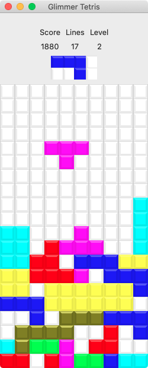 |  | 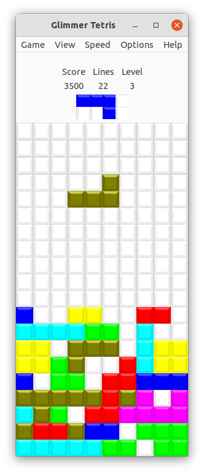

New [Glimmer DSL for LibUI](https://rubygems.org/gems/glimmer-dsl-libui) Version:

```ruby
require 'glimmer-dsl-libui'

require_relative 'tetris/model/game'

class Tetris
  include Glimmer
  
  BLOCK_SIZE = 25
  BEVEL_CONSTANT = 20
  COLOR_GRAY = {r: 192, g: 192, b: 192}
    
  def initialize
    @game = Model::Game.new
  end
  
  def launch
    create_gui
    register_observers
    @game.start!
    @main_window.show
  end
  
  def create_gui
    menu_bar
    
    @main_window = window('Glimmer Tetris') {
      content_size Model::Game::PLAYFIELD_WIDTH * BLOCK_SIZE, Model::Game::PLAYFIELD_HEIGHT * BLOCK_SIZE + 98
      resizable false
      
      vertical_box {
        label { # filler
          stretchy false
        }
        
        score_board(block_size: BLOCK_SIZE) {
          stretchy false
        }
        
        @playfield_blocks = playfield(playfield_width: Model::Game::PLAYFIELD_WIDTH, playfield_height: Model::Game::PLAYFIELD_HEIGHT, block_size: BLOCK_SIZE)
      }
    }
  end
  
  def register_observers
    observe(@game, :game_over) do |game_over|
      if game_over
        @pause_menu_item.enabled = false
        show_game_over_dialog
      else
        @pause_menu_item.enabled = true
        start_moving_tetrominos_down
      end
    end
    
    Model::Game::PLAYFIELD_HEIGHT.times do |row|
      Model::Game::PLAYFIELD_WIDTH.times do |column|
        observe(@game.playfield[row][column], :color) do |new_color|
          Glimmer::LibUI.queue_main do
            color = Glimmer::LibUI.interpret_color(new_color)
            block = @playfield_blocks[row][column]
            block[:background_square].fill = color
            block[:top_bevel_edge].fill = {r: color[:r] + 4*BEVEL_CONSTANT, g: color[:g] + 4*BEVEL_CONSTANT, b: color[:b] + 4*BEVEL_CONSTANT}
            block[:right_bevel_edge].fill = {r: color[:r] - BEVEL_CONSTANT, g: color[:g] - BEVEL_CONSTANT, b: color[:b] - BEVEL_CONSTANT}
            block[:bottom_bevel_edge].fill = {r: color[:r] - BEVEL_CONSTANT, g: color[:g] - BEVEL_CONSTANT, b: color[:b] - BEVEL_CONSTANT}
            block[:left_bevel_edge].fill = {r: color[:r] - BEVEL_CONSTANT, g: color[:g] - BEVEL_CONSTANT, b: color[:b] - BEVEL_CONSTANT}
            block[:border_square].stroke = new_color == Model::Block::COLOR_CLEAR ? COLOR_GRAY : color
          end
        end
      end
    end
    
    Model::Game::PREVIEW_PLAYFIELD_HEIGHT.times do |row|
      Model::Game::PREVIEW_PLAYFIELD_WIDTH.times do |column|
        preview_updater = proc do
          Glimmer::LibUI.queue_main do
            new_color = @game.preview_playfield[row][column].color
            color = Glimmer::LibUI.interpret_color(new_color)
            block = @preview_playfield_blocks[row][column]
            if @game.show_preview_tetromino?
              block[:background_square].fill = color
              block[:top_bevel_edge].fill = {r: color[:r] + 4*BEVEL_CONSTANT, g: color[:g] + 4*BEVEL_CONSTANT, b: color[:b] + 4*BEVEL_CONSTANT}
              block[:right_bevel_edge].fill = {r: color[:r] - BEVEL_CONSTANT, g: color[:g] - BEVEL_CONSTANT, b: color[:b] - BEVEL_CONSTANT}
              block[:bottom_bevel_edge].fill = {r: color[:r] - BEVEL_CONSTANT, g: color[:g] - BEVEL_CONSTANT, b: color[:b] - BEVEL_CONSTANT}
              block[:left_bevel_edge].fill = {r: color[:r] - BEVEL_CONSTANT, g: color[:g] - BEVEL_CONSTANT, b: color[:b] - BEVEL_CONSTANT}
              block[:border_square].stroke = new_color == Model::Block::COLOR_CLEAR ? COLOR_GRAY : color
            else
              transparent_color = {r: 255, g: 255, b: 255, a: 0}
              block[:background_square].fill = transparent_color
              block[:top_bevel_edge].fill = transparent_color
              block[:right_bevel_edge].fill = transparent_color
              block[:bottom_bevel_edge].fill = transparent_color
              block[:left_bevel_edge].fill = transparent_color
              block[:border_square].stroke = transparent_color
            end
          end
        end
        observe(@game.preview_playfield[row][column], :color, &preview_updater)
        observe(@game, :show_preview_tetromino, &preview_updater)
      end
    end

    observe(@game, :score) do |new_score|
      Glimmer::LibUI.queue_main do
        @score_label.text = new_score.to_s
      end
    end

    observe(@game, :lines) do |new_lines|
      Glimmer::LibUI.queue_main do
        @lines_label.text = new_lines.to_s
      end
    end

    observe(@game, :level) do |new_level|
      Glimmer::LibUI.queue_main do
        @level_label.text = new_level.to_s
      end
    end
  end
  
  def menu_bar
    menu('Game') {
      @pause_menu_item = check_menu_item('Pause') {
        enabled false
        checked <=> [@game, :paused]
      }
      
      menu_item('Restart') {
        on_clicked do
          @game.restart!
        end
      }
      
      separator_menu_item
      
      menu_item('Exit') {
        on_clicked do
          exit(0)
        end
      }
      
      quit_menu_item if OS.mac?
    }
    
    menu('View') {
      check_menu_item('Show Next Block Preview') {
        checked <=> [@game, :show_preview_tetromino]
      }
      
      separator_menu_item
      
      menu_item('Show High Scores') {
        on_clicked do
          show_high_scores
        end
      }
      
      menu_item('Clear High Scores') {
        on_clicked {
          @game.clear_high_scores!
        }
      }
      
      separator_menu_item
    }

    menu('Options') {
      radio_menu_item('Instant Down on Up Arrow') {
        checked <=> [@game, :instant_down_on_up]
      }
      
      radio_menu_item('Rotate Right on Up Arrow') {
        checked <=> [@game, :rotate_right_on_up]
      }
      
      radio_menu_item('Rotate Left on Up Arrow') {
        checked <=> [@game, :rotate_left_on_up]
      }
    }

    menu('Help') {
      if OS.mac?
        about_menu_item {
          on_clicked do
            show_about_dialog
          end
        }
      end
      
      menu_item('About') {
        on_clicked do
          show_about_dialog
        end
      }
    }
  end
  
  def playfield(playfield_width: , playfield_height: , block_size: , &extra_content)
    blocks = []
    vertical_box {
      padded false
      
      playfield_height.times.map do |row|
        blocks << []
        horizontal_box {
          padded false
          
          playfield_width.times.map do |column|
            blocks.last << block(row: row, column: column, block_size: block_size)
          end
        }
      end
      
      extra_content&.call
    }
    blocks
  end
  
  def block(row: , column: , block_size: , &extra_content)
    block = {}
    bevel_pixel_size = 0.16 * block_size.to_f
    color = Glimmer::LibUI.interpret_color(Model::Block::COLOR_CLEAR)
    block[:area] = area {
      block[:background_square] = square(0, 0, block_size) {
        fill color
      }
      
      block[:top_bevel_edge] = polygon {
        point_array 0, 0, block_size, 0, block_size - bevel_pixel_size, bevel_pixel_size, bevel_pixel_size, bevel_pixel_size
        fill r: color[:r] + 4*BEVEL_CONSTANT, g: color[:g] + 4*BEVEL_CONSTANT, b: color[:b] + 4*BEVEL_CONSTANT
      }
      
      block[:right_bevel_edge] = polygon {
        point_array block_size, 0, block_size - bevel_pixel_size, bevel_pixel_size, block_size - bevel_pixel_size, block_size - bevel_pixel_size, block_size, block_size
        fill r: color[:r] - BEVEL_CONSTANT, g: color[:g] - BEVEL_CONSTANT, b: color[:b] - BEVEL_CONSTANT
      }
      
      block[:bottom_bevel_edge] = polygon {
        point_array block_size, block_size, 0, block_size, bevel_pixel_size, block_size - bevel_pixel_size, block_size - bevel_pixel_size, block_size - bevel_pixel_size
        fill r: color[:r] - BEVEL_CONSTANT, g: color[:g] - BEVEL_CONSTANT, b: color[:b] - BEVEL_CONSTANT
      }
      
      block[:left_bevel_edge] = polygon {
        point_array 0, 0, 0, block_size, bevel_pixel_size, block_size - bevel_pixel_size, bevel_pixel_size, bevel_pixel_size
        fill r: color[:r] - BEVEL_CONSTANT, g: color[:g] - BEVEL_CONSTANT, b: color[:b] - BEVEL_CONSTANT
      }
      
      block[:border_square] = square(0, 0, block_size) {
        stroke COLOR_GRAY
      }
      
      on_key_down do |key_event|
        case key_event
        in ext_key: :down
          if OS.windows?
            # rate limit downs in Windows as they go too fast when key is held
            @queued_downs ||= 0
            if @queued_downs < 2
              @queued_downs += 1
              Glimmer::LibUI.timer(0.01, repeat: false) do
                @game.down! if @queued_downs < 2
                @queued_downs -= 1
              end
            end
          else
            @game.down!
          end
        in key: ' '
          @game.down!(instant: true)
        in ext_key: :up
          case @game.up_arrow_action
          when :instant_down
            @game.down!(instant: true)
          when :rotate_right
            @game.rotate!(:right)
          when :rotate_left
            @game.rotate!(:left)
          end
        in ext_key: :left
          @game.left!
        in ext_key: :right
          @game.right!
        in modifier: :shift
          @game.rotate!(:right)
        in modifier: :control
          @game.rotate!(:left)
        else
          # Do Nothing
        end
      end
      
      extra_content&.call
    }
    block
  end
  
  def score_board(block_size: , &extra_content)
    vertical_box {
      horizontal_box {
        label # filler
        grid {
          stretchy false
          
          label('Score') {
            left 0
            top 0
            halign :fill
          }
          @score_label = label {
            left 0
            top 1
            halign :center
          }
    
          label('Lines') {
            left 1
            top 0
            halign :fill
          }
          @lines_label = label {
            left 1
            top 1
            halign :center
          }
    
          label('Level') {
            left 2
            top 0
            halign :fill
          }
          @level_label = label {
            left 2
            top 1
            halign :center
          }
        }
        label # filler
      }
      
      horizontal_box {
        label # filler
        @preview_playfield_blocks = playfield(playfield_width: Model::Game::PREVIEW_PLAYFIELD_WIDTH, playfield_height: Model::Game::PREVIEW_PLAYFIELD_HEIGHT, block_size: block_size)
        label # filler
      }
    
      extra_content&.call
    }
  end
  
  def start_moving_tetrominos_down
    unless @tetrominos_start_moving_down
      @tetrominos_start_moving_down = true
      Glimmer::LibUI.timer(@game.delay) do
        @game.down! if !@game.game_over? && !@game.paused?
      end
    end
  end
  
  def show_game_over_dialog
    Glimmer::LibUI.queue_main do
      msg_box('Game Over!', "Score: #{@game.high_scores.first.score}\nLines: #{@game.high_scores.first.lines}\nLevel: #{@game.high_scores.first.level}")
      @game.restart!
    end
  end
  
  def show_high_scores
    Glimmer::LibUI.queue_main do
      game_paused = !!@game.paused
      @game.paused = true
      if @game.high_scores.empty?
        high_scores_string = "No games have been scored yet."
      else
        high_scores_string = @game.high_scores.map do |high_score|
          "#{high_score.name} | Score: #{high_score.score} | Lines: #{high_score.lines} | Level: #{high_score.level}"
        end.join("\n")
      end
      msg_box('High Scores', high_scores_string)
      @game.paused = game_paused
    end
  end
  
  def show_about_dialog
    Glimmer::LibUI.queue_main do
      msg_box('About', 'Glimmer Tetris - Glimmer DSL for LibUI Example - Copyright (c) 2021-2022 Andy Maleh')
    end
  end
end

Tetris.new.launch
```

#### Tic Tac Toe

[examples/tic_tac_toe.rb](examples/tic_tac_toe.rb)

Run with this command from the root of the project if you cloned the project:

```
ruby -r './lib/glimmer-dsl-libui' examples/tic_tac_toe.rb
```

Run with this command if you installed the [Ruby gem](https://rubygems.org/gems/glimmer-dsl-libui):

```
ruby -r glimmer-dsl-libui -e "require 'examples/tic_tac_toe'"
```

Mac | Windows | Linux
----|---------|------
  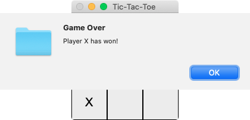  |     |    

New [Glimmer DSL for LibUI](https://rubygems.org/gems/glimmer-dsl-libui) Version (with [data-binding](#data-binding)):

```ruby
require 'glimmer-dsl-libui'

require_relative "tic_tac_toe/board"

class TicTacToe
  include Glimmer

  def initialize
    @tic_tac_toe_board = Board.new
  end
  
  def launch
    create_gui
    register_observers
    @main_window.show
  end
  
  def register_observers
    observe(@tic_tac_toe_board, :game_status) do |game_status|
      display_win_message if game_status == Board::WIN
      display_draw_message if game_status == Board::DRAW
    end
  end

  def create_gui
    @main_window = window('Tic-Tac-Toe', 180, 180) {
      resizable false
      
      vertical_box {
        padded false
        
        3.times.map do |row|
          horizontal_box {
            padded false
            
            3.times.map do |column|
              area {
                square(0, 0, 60) {
                  stroke :black, thickness: 2
                }
                text(23, 19) {
                  string {
                    font family: 'Arial', size: OS.mac? ? 20 : 16
                    # data-bind string property of area text attributed string to tic tac toe board cell sign
                    string <= [@tic_tac_toe_board[row + 1, column + 1], :sign] # board model is 1-based
                  }
                }
                on_mouse_up do
                  @tic_tac_toe_board.mark(row + 1, column + 1) # board model is 1-based
                end
              }
            end
          }
        end
      }
    }
  end

  def display_win_message
    display_game_over_message("Player #{@tic_tac_toe_board.winning_sign} has won!")
  end

  def display_draw_message
    display_game_over_message("Draw!")
  end

  def display_game_over_message(message_text)
    Glimmer::LibUI.queue_main do
      msg_box('Game Over', message_text)
      @tic_tac_toe_board.reset!
    end
  end
end

TicTacToe.new.launch
```

New [Glimmer DSL for LibUI](https://rubygems.org/gems/glimmer-dsl-libui) Version 2 (without [data-binding](#data-binding)):

```ruby

require 'glimmer-dsl-libui'

require_relative "tic_tac_toe/board"

class TicTacToe
  include Glimmer

  def initialize
    @tic_tac_toe_board = Board.new
  end
  
  def launch
    create_gui
    register_observers
    @main_window.show
  end
  
  def register_observers
    observe(@tic_tac_toe_board, :game_status) do |game_status|
      display_win_message if game_status == Board::WIN
      display_draw_message if game_status == Board::DRAW
    end
    
    3.times.map do |row|
      3.times.map do |column|
        observe(@tic_tac_toe_board[row + 1, column + 1], :sign) do |sign| # board model is 1-based
          @cells[row][column].string = sign
        end
      end
    end
  end
  
  def create_gui
    @main_window = window('Tic-Tac-Toe', 180, 180) {
      resizable false
      
      @cells = []
      vertical_box {
        padded false
        
        3.times.map do |row|
          @cells << []
          horizontal_box {
            padded false
            
            3.times.map do |column|
              area {
                square(0, 0, 60) {
                  stroke :black, thickness: 2
                }
                text(23, 19) {
                  @cells[row] << string('') {
                    font family: 'Arial', size: OS.mac? ? 20 : 16
                  }
                }
                on_mouse_up do
                  @tic_tac_toe_board.mark(row + 1, column + 1) # board model is 1-based
                end
              }
            end
          }
        end
      }
    }
  end

  def display_win_message
    display_game_over_message("Player #{@tic_tac_toe_board.winning_sign} has won!")
  end

  def display_draw_message
    display_game_over_message("Draw!")
  end

  def display_game_over_message(message_text)
    Glimmer::LibUI.queue_main do
      msg_box('Game Over', message_text)
      @tic_tac_toe_board.reset!
    end
  end
end

TicTacToe.new.launch
```

#### Timer

To run this example, install [TiMidity](http://timidity.sourceforge.net) and ensure `timidity` command is in `PATH` (can be installed via [Homebrew](https://brew.sh) on Mac or [apt-get](https://help.ubuntu.com/community/AptGet/Howto) on Linux).

[examples/timer.rb](examples/timer.rb)

Run with this command from the root of the project if you cloned the project:

```
ruby -r './lib/glimmer-dsl-libui' examples/timer.rb
```

Run with this command if you installed the [Ruby gem](https://rubygems.org/gems/glimmer-dsl-libui):

```
ruby -r glimmer-dsl-libui -e "require 'examples/timer'"
```

Mac | Windows | Linux
----|---------|------
  |   |  

New [Glimmer DSL for LibUI](https://rubygems.org/gems/glimmer-dsl-libui) Version (with [data-binding](#data-binding)):

```ruby
require 'glimmer-dsl-libui'

class Timer
  include Glimmer
  
  SECOND_MAX = 59
  MINUTE_MAX = 59
  HOUR_MAX = 23
  
  attr_accessor :hour, :min, :sec, :started, :played
  
  def initialize
    @pid = nil
    @alarm_file = File.expand_path('../sounds/AlanWalker-Faded.mid', __dir__)
    @hour = @min = @sec = 0
    at_exit { stop_alarm }
    setup_timer
    create_gui
  end

  def stop_alarm
    if @pid
      Process.kill(:SIGKILL, @pid) if @th.alive?
      @pid = nil
    end
  end

  def play_alarm
    stop_alarm
    if @pid.nil?
      begin
        @pid = spawn "timidity -G 0.0-10.0 #{@alarm_file}"
        @th = Process.detach @pid
      rescue Errno::ENOENT
        warn 'Timidty++ not found. Please install Timidity++.'
        warn 'https://sourceforge.net/projects/timidity/'
      end
    end
  end

  def setup_timer
    unless @setup_timer
      Glimmer::LibUI.timer(1) do
        if @started
          seconds = @sec
          minutes = @min
          hours = @hour
          if seconds > 0
            self.sec = seconds -= 1
          end
          if seconds == 0
            if minutes > 0
              self.min = minutes -= 1
              self.sec = seconds = SECOND_MAX
            end
            if minutes == 0
              if hours > 0
                self.hour = hours -= 1
                self.min = minutes = MINUTE_MAX
                self.sec = seconds = SECOND_MAX
              end
              if hours == 0 && minutes == 0 && seconds == 0
                self.started = false
                unless @played
                  play_alarm
                  msg_box('Alarm', 'Countdown Is Finished!')
                  self.played = true
                end
              end
            end
          end
        end
      end
      @setup_timer = true
    end
  end

  def create_gui
    window('Timer') {
      margined true
      
      group('Countdown') {
        vertical_box {
          horizontal_box {
            spinbox(0, HOUR_MAX) {
              stretchy false
              value <=> [self, :hour]
            }
            label(':') {
              stretchy false
            }
            spinbox(0, MINUTE_MAX) {
              stretchy false
              value <=> [self, :min]
            }
            label(':') {
              stretchy false
            }
            spinbox(0, SECOND_MAX) {
              stretchy false
              value <=> [self, :sec]
            }
          }
          horizontal_box {
            button('Start') {
              enabled <= [self, :started, on_read: :!]
              
              on_clicked do
                self.started = true
                self.played = false
              end
            }
            
            button('Stop') {
              enabled <= [self, :started]
              
              on_clicked do
                self.started = false
              end
            }
          }
        }
      }
    }.show
  end
end

Timer.new
```

New [Glimmer DSL for LibUI](https://rubygems.org/gems/glimmer-dsl-libui) Version 2 (without [data-binding](#data-binding)):

```ruby
require 'glimmer-dsl-libui'

class Timer
  include Glimmer
  
  SECOND_MAX = 59
  MINUTE_MAX = 59
  HOUR_MAX = 23
  
  def initialize
    @pid = nil
    @alarm_file = File.expand_path('../sounds/AlanWalker-Faded.mid', __dir__)
    at_exit { stop_alarm }
    setup_timer
    create_gui
  end

  def stop_alarm
    if @pid
      Process.kill(:SIGKILL, @pid) if @th.alive?
      @pid = nil
    end
  end

  def play_alarm
    stop_alarm
    if @pid.nil?
      begin
        @pid = spawn "timidity -G 0.0-10.0 #{@alarm_file}"
        @th = Process.detach @pid
      rescue Errno::ENOENT
        warn 'Timidty++ not found. Please install Timidity++.'
        warn 'https://sourceforge.net/projects/timidity/'
      end
    end
  end

  def setup_timer
    unless @setup_timer
      Glimmer::LibUI.timer(1) do
        if @started
          seconds = @sec_spinbox.value
          minutes = @min_spinbox.value
          hours = @hour_spinbox.value
          if seconds > 0
            @sec_spinbox.value = seconds -= 1
          end
          if seconds == 0
            if minutes > 0
              @min_spinbox.value = minutes -= 1
              @sec_spinbox.value = seconds = SECOND_MAX
            end
            if minutes == 0
              if hours > 0
                @hour_spinbox.value = hours -= 1
                @min_spinbox.value = minutes = MINUTE_MAX
                @sec_spinbox.value = seconds = SECOND_MAX
              end
              if hours == 0 && minutes == 0 && seconds == 0
                @start_button.enabled = true
                @stop_button.enabled = false
                @started = false
                unless @played
                  play_alarm
                  msg_box('Alarm', 'Countdown Is Finished!')
                  @played = true
                end
              end
            end
          end
        end
      end
      @setup_timer = true
    end
  end

  def create_gui
    window('Timer') {
      margined true
      
      group('Countdown') {
        vertical_box {
          horizontal_box {
            @hour_spinbox = spinbox(0, HOUR_MAX) {
              stretchy false
              value 0
            }
            label(':') {
              stretchy false
            }
            @min_spinbox = spinbox(0, MINUTE_MAX) {
              stretchy false
              value 0
            }
            label(':') {
              stretchy false
            }
            @sec_spinbox = spinbox(0, SECOND_MAX) {
              stretchy false
              value 0
            }
          }
          horizontal_box {
            @start_button = button('Start') {
              on_clicked do
                @start_button.enabled = false
                @stop_button.enabled = true
                @started = true
                @played = false
              end
            }
            
            @stop_button = button('Stop') {
              enabled false
              
              on_clicked do
                @start_button.enabled = true
                @stop_button.enabled = false
                @started = false
              end
            }
          }
        }
      }
    }.show
  end
end

Timer.new
```

#### Shape Coloring

This example demonstrates being able to nest listeners within shapes directly, and [Glimmer DSL for LibUI](https://rubygems.org/gems/glimmer-dsl-libui) will automatically detect when the mouse lands inside the shapes to notify listeners.

This example also demonstrates very basic drag and drop support, implemented manually with shape listeners.

[examples/shape_coloring.rb](examples/shape_coloring.rb)

Run with this command from the root of the project if you cloned the project:

```
ruby -r './lib/glimmer-dsl-libui' examples/shape_coloring.rb
```

Run with this command if you installed the [Ruby gem](https://rubygems.org/gems/glimmer-dsl-libui):

```
ruby -r glimmer-dsl-libui -e "require 'examples/shape_coloring'"
```

Shape Coloring Example

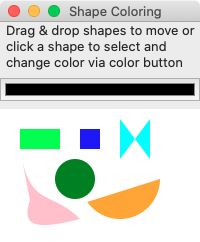


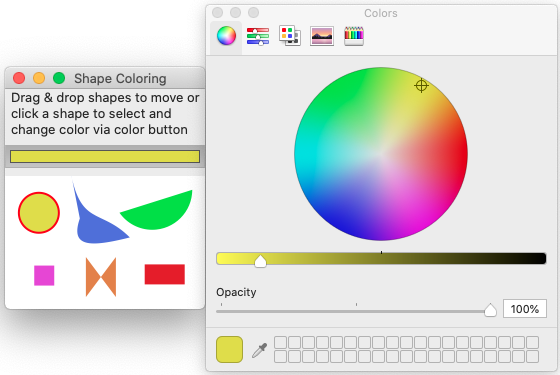

New [Glimmer DSL for LibUI](https://rubygems.org/gems/glimmer-dsl-libui) Version:

```ruby
require 'glimmer-dsl-libui'

class ShapeColoring
  include Glimmer::LibUI::Application
  
  COLOR_SELECTION = Glimmer::LibUI.interpret_color(:red)
  
  before_body {
    @shapes = []
  }
  
  body {
    window('Shape Coloring', 200, 220) {
      margined false
      
      grid {
        label("Drag & drop shapes to move or\nclick a shape to select and\nchange color via color button") {
          left 0
          top 0
          hexpand true
          halign :center
          vexpand false
        }
        
        color_button { |cb|
          left 0
          top 1
          hexpand true
          vexpand false
          
          on_changed do
            @selected_shape&.fill = cb.color
          end
        }
      
        area {
          left 0
          top 2
          hexpand true
          vexpand true
          
          rectangle(0, 0, 600, 400) { # background shape
            fill :white
          }
          
          @shapes << colorable(:rectangle, 20, 20, 40, 20) {
            fill :lime
          }
          
          @shapes << colorable(:square, 80, 20, 20) {
            fill :blue
          }
          
          @shapes << colorable(:circle, 75, 70, 20) {
            fill :green
          }
          
          @shapes << colorable(:arc, 120, 70, 40, 0, 145) {
            fill :orange
          }
          
          @shapes << colorable(:polygon, 120, 10, 120, 50, 150, 10, 150, 50) {
            fill :cyan
          }
          
          @shapes << colorable(:polybezier, 20, 40,
                     30, 100, 50, 80, 80, 110,
                     40, 120, 20, 120, 30, 91) {
            fill :pink
          }
          
          on_mouse_dragged do |area_mouse_event|
            mouse_dragged(area_mouse_event)
          end
          
          on_mouse_dropped do |area_mouse_event|
            mouse_dropped(area_mouse_event)
          end
        }
      }
    }
  }
  
  def colorable(shape_symbol, *args, &content)
    send(shape_symbol, *args) do |shape|
      on_mouse_up do |area_mouse_event|
        unless @dragged_shape
          old_stroke = Glimmer::LibUI.interpret_color(shape.stroke).slice(:r, :g, :b)
          @shapes.each {|sh| sh.stroke = nil}
          @selected_shape = nil
          unless old_stroke == COLOR_SELECTION
            shape.stroke = COLOR_SELECTION.merge(thickness: 2)
            @selected_shape = shape
          end
        end
      end
      
      on_mouse_drag_started do |area_mouse_event|
        mouse_drag_started(shape, area_mouse_event)
      end
      
      on_mouse_dragged do |area_mouse_event|
        mouse_dragged(area_mouse_event)
      end
      
      on_mouse_dropped do |area_mouse_event|
        mouse_dropped(area_mouse_event)
      end
      
      content.call(shape)
    end
  end
  
  def mouse_drag_started(dragged_shape, area_mouse_event)
    @dragged_shape = dragged_shape
    @dragged_shape_x = area_mouse_event[:x]
    @dragged_shape_y = area_mouse_event[:y]
  end
  
  def mouse_dragged(area_mouse_event)
    if @dragged_shape && @dragged_shape_x && @dragged_shape_y
      x_delta = area_mouse_event[:x] - @dragged_shape_x
      y_delta = area_mouse_event[:y] - @dragged_shape_y
      @dragged_shape.move_by(x_delta, y_delta)
      @dragged_shape_x = area_mouse_event[:x]
      @dragged_shape_y = area_mouse_event[:y]
    end
  end
  
  def mouse_dropped(area_mouse_event)
    @dragged_shape = nil
    @dragged_shape_x = nil
    @dragged_shape_y = nil
  end
end

ShapeColoring.launch
```

## Applications

Here are some applications built with [Glimmer DSL for LibUI](https://rubygems.org/gems/glimmer-dsl-libui)

### Manga2PDF

Download and merge manga images into a single pdf file.

https://github.com/PinGunter/manga2pdf


### Befunge98 GUI

Ruby implementation of the Befunge-98 programmming language.

https://github.com/AndyObtiva/befunge98/tree/gui


### i3off Gtk Ruby

https://github.com/iraamaro/i3off-gtk-ruby

### Chess

https://github.com/mikeweber/chess

### RubyCrumbler

NLP (Natural Language Processing) App

https://github.com/joh-ga/RubyCrumbler

MacOS | Windows | Linux
| :---: | :---: | :---:
||

### Rubio-Radio

https://github.com/kojix2/rubio-radio


## Process

[Glimmer Process](https://github.com/AndyObtiva/glimmer/blob/master/PROCESS.md)

## Resources

- [Code Master Blog](https://andymaleh.blogspot.com/search/label/LibUI)
- [LibUI Ruby Bindings](https://github.com/kojix2/LibUI)
- [libui C Library](https://github.com/andlabs/libui)
- [Go UI (Golang LibUI) API Documentation](https://pkg.go.dev/github.com/andlabs/ui)

## Help

### Issues

If you encounter [issues](https://github.com/AndyObtiva/glimmer-dsl-libui/issues) that are not reported, discover missing features that are not mentioned in [TODO.md](TODO.md), or think up better ways to use [libui](https://github.com/andlabs/libui) than what is possible with [Glimmer DSL for LibUI](https://rubygems.org/gems/glimmer-dsl-libui), you may submit an [issue](https://github.com/AndyObtiva/glimmer-dsl-libui/issues/new) or [pull request](https://github.com/AndyObtiva/glimmer-dsl-libui/compare) on [GitHub](https://github.com). In the meantime, you may try older gem versions of [Glimmer DSL for LibUI](https://rubygems.org/gems/glimmer-dsl-libui) till you find one that works.

### Chat

If you need live help, try to [](https://gitter.im/AndyObtiva/glimmer?utm_source=badge&utm_medium=badge&utm_campaign=pr-badge&utm_content=badge)

## Planned Features and Feature Suggestions

These features have been planned or suggested. You might see them in a future version of [Glimmer DSL for LibUI](https://rubygems.org/gems/glimmer-dsl-libui). You are welcome to contribute more feature suggestions.

[TODO.md](TODO.md)

## Change Log

[CHANGELOG.md](CHANGELOG.md)

## Contributing

If you would like to contribute to the project, please adhere to the [Open-Source Etiquette](https://github.com/AndyObtiva/open-source-etiquette) to ensure the best results.

-   Check out the latest master to make sure the feature hasn't been
    implemented or the bug hasn't been fixed yet.
-   Check out the issue tracker to make sure someone already hasn't
    requested it and/or contributed it.
-   Fork the project.
-   Start a feature/bugfix branch.
-   Commit and push until you are happy with your contribution.
-   Make sure to add tests for it. This is important so I don't break it
    in a future version unintentionally.
-   Please try not to mess with the Rakefile, version, or history. If
    you want to have your own version, or is otherwise necessary, that
    is fine, but please isolate to its own commit so I can cherry-pick
    around it.

Note that the latest development sometimes takes place in the [development](https://github.com/AndyObtiva/glimmer-dsl-libui/tree/development) branch (usually deleted once merged back to [master](https://github.com/AndyObtiva/glimmer-dsl-libui)).

## Contributors

* [Andy Maleh](https://github.com/AndyObtiva) (Founder)

[Click here to view contributor commits.](https://github.com/AndyObtiva/glimmer-dsl-libui/graphs/contributors)

## License

[MIT](LICENSE.txt)

Copyright (c) 2021-2022 Andy Maleh

--

[](https://github.com/AndyObtiva/glimmer) Built for [Glimmer](https://github.com/AndyObtiva/glimmer) (DSL Framework).
