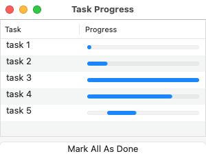
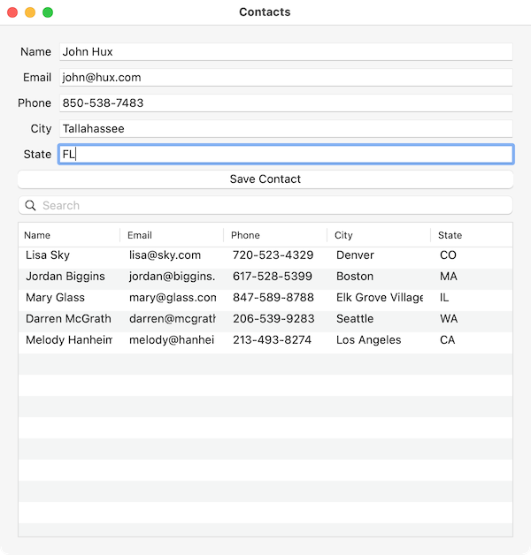
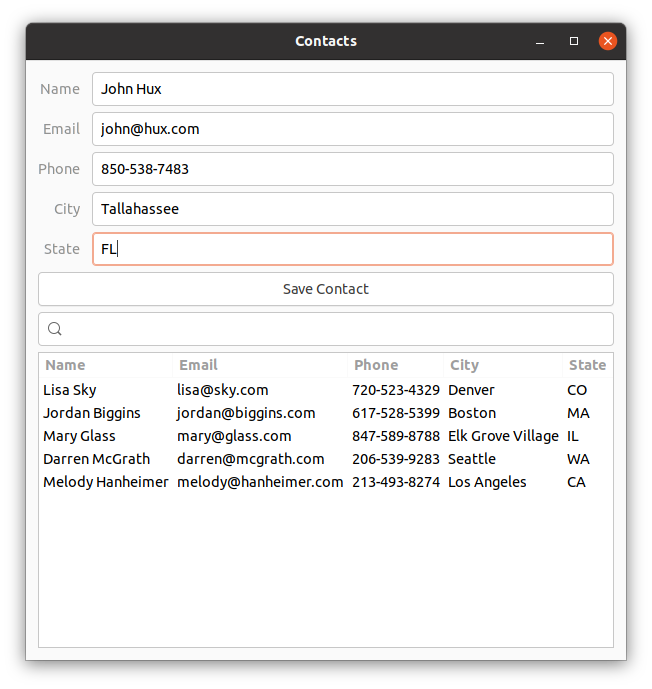
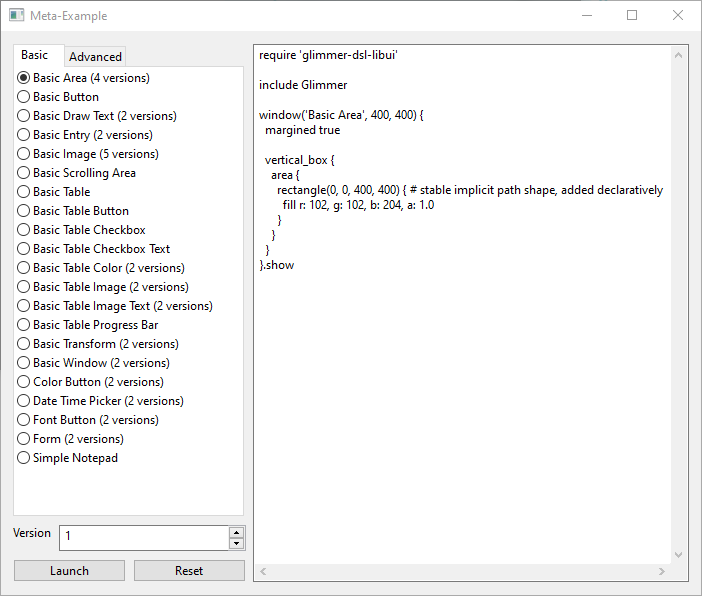
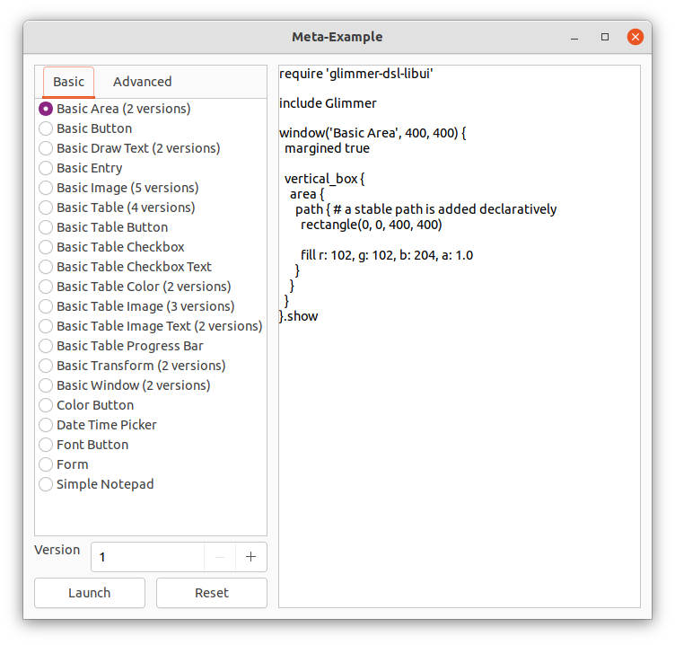
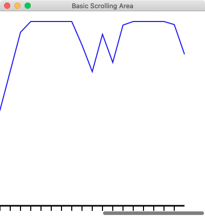

# [](https://github.com/AndyObtiva/glimmer) Glimmer DSL for LibUI 0.6.0.pre.0
## Prerequisite-Free Ruby Desktop Development GUI Library
### The Quickest Way From Zero To GUI
[](http://badge.fury.io/rb/glimmer-dsl-libui)
[](https://gitter.im/AndyObtiva/glimmer?utm_source=badge&utm_medium=badge&utm_campaign=pr-badge&utm_content=badge)

(**[Fukuoka Ruby Award Competition 2022 Special Award Winner](https://andymaleh.blogspot.com/2022/02/glimmer-dsl-for-libui-wins-fukuoka-ruby.html)** [[Award Announcement]](http://www.digitalfukuoka.jp/topics/187?locale=ja))

(**[Presenting ***"Building Native GUI Apps in Ruby"*** at RubyConf 2022](https://andymaleh.blogspot.com/2022/09/rubyconf-2022-building-native-gui-apps.html)**)

[Glimmer](https://github.com/AndyObtiva/glimmer) DSL for [LibUI](https://github.com/kojix2/LibUI) is a prerequisite-free [MRI Ruby](https://www.ruby-lang.org) desktop development GUI (Graphical User Interface) library. No need to pre-install any prerequisites. Just install the [gem](https://rubygems.org/gems/glimmer-dsl-libui) and have platform-independent native GUI that just works!

Mac | Windows | Linux
----|---------|------
 |  | 

[LibUI](https://github.com/kojix2/LibUI) is a thin [Ruby](https://www.ruby-lang.org/en/) wrapper around [libui](https://github.com/andlabs/libui), a relatively new C GUI library that renders native controls on every platform (similar to [SWT](https://www.eclipse.org/swt/), but without the heavy weight of the [Java Virtual Machine](https://www.java.com/en/)).

The main trade-off in using [Glimmer DSL for LibUI](https://rubygems.org/gems/glimmer-dsl-libui) as opposed to [Glimmer DSL for SWT](https://github.com/AndyObtiva/glimmer-dsl-swt) or [Glimmer DSL for Tk](https://github.com/AndyObtiva/glimmer-dsl-tk) is the fact that [SWT](https://www.eclipse.org/swt/) and [Tk](https://www.tcl.tk/) are more mature than mid-alpha [libui](https://github.com/andlabs/libui) as GUI toolkits. Still, if there is only a need to build a small simple application, [Glimmer DSL for LibUI](https://rubygems.org/gems/glimmer-dsl-libui) could be a good convenient choice due to having zero prerequisites beyond the dependencies included in the [Ruby gem](https://rubygems.org/gems/glimmer-dsl-libui). Also, just like [Glimmer DSL for Tk](https://github.com/AndyObtiva/glimmer-dsl-tk), its apps start instantly and have a small memory footprint. [LibUI](https://github.com/kojix2/LibUI) is a promising new GUI toolkit that might prove quite worthy in the future.

[Glimmer DSL for LibUI](https://rubygems.org/gems/glimmer-dsl-libui) aims to provide a DSL similar to the [Glimmer DSL for SWT](https://github.com/AndyObtiva/glimmer-dsl-swt) to enable more productive desktop development in Ruby with:
- [Declarative DSL syntax](#glimmer-gui-dsl-concepts) that visually maps to the GUI control hierarchy
- [Convention over configuration](#smart-defaults-and-conventions) via smart defaults and automation of low-level details
- Requiring the [least amount of syntax](#glimmer-gui-dsl-concepts) possible to build GUI
- [Custom Control](#custom-keywords) support
- [Bidirectional/Unidirectional Data-Binding](#data-binding) to declaratively wire and automatically synchronize GUI Views with Models
- [Far Future Plan] Scaffolding for new custom controls, apps, and gems
- [Far Future Plan] Native-Executable packaging on Mac, Windows, and Linux.

Hello, World!

```ruby
require 'glimmer-dsl-libui'

include Glimmer

window('hello world').show
```

Mac | Windows | Linux
----|---------|------
 |  | 

Basic Table Progress Bar

```ruby
require 'glimmer-dsl-libui'

include Glimmer

data = [
  ['task 1', 0],
  ['task 2', 15],
  ['task 3', 100],
  ['task 4', 75],
  ['task 5', -1],
]

window('Task Progress', 300, 200) {
  vertical_box {
    table {
      text_column('Task')
      progress_bar_column('Progress')

      cell_rows data # implicit data-binding
    }
    
    button('Mark All As Done') {
      stretchy false
      
      on_clicked do
        data.each_with_index do |row_data, row|
          data[row][1] = 100 # automatically updates table due to implicit data-binding
        end
      end
    }
  }
}.show
```

Mac | Windows | Linux
----|---------|------
 |  | 

Form Table

```ruby
require 'glimmer-dsl-libui'

class FormTable
  Contact = Struct.new(:name, :email, :phone, :city, :state)
  
  include Glimmer
  
  attr_accessor :contacts, :name, :email, :phone, :city, :state, :filter_value
  
  def initialize
    @contacts = [
      Contact.new('Lisa Sky', 'lisa@sky.com', '720-523-4329', 'Denver', 'CO'),
      Contact.new('Jordan Biggins', 'jordan@biggins.com', '617-528-5399', 'Boston', 'MA'),
      Contact.new('Mary Glass', 'mary@glass.com', '847-589-8788', 'Elk Grove Village', 'IL'),
      Contact.new('Darren McGrath', 'darren@mcgrath.com', '206-539-9283', 'Seattle', 'WA'),
      Contact.new('Melody Hanheimer', 'melody@hanheimer.com', '213-493-8274', 'Los Angeles', 'CA'),
    ]
  end
  
  def launch
    window('Contacts', 600, 600) {
      margined true
      
      vertical_box {
        form {
          stretchy false
          
          entry {
            label 'Name'
            text <=> [self, :name] # bidirectional data-binding between entry text and self.name
          }
          
          entry {
            label 'Email'
            text <=> [self, :email]
          }
          
          entry {
            label 'Phone'
            text <=> [self, :phone]
          }
          
          entry {
            label 'City'
            text <=> [self, :city]
          }
          
          entry {
            label 'State'
            text <=> [self, :state]
          }
        }
        
        button('Save Contact') {
          stretchy false
          
          on_clicked do
            new_row = [name, email, phone, city, state]
            if new_row.map(&:to_s).include?('')
              msg_box_error('Validation Error!', 'All fields are required! Please make sure to enter a value for all fields.')
            else
              @contacts << Contact.new(*new_row) # automatically inserts a row into the table due to explicit data-binding
              @unfiltered_contacts = @contacts.dup
              self.name = '' # automatically clears name entry through explicit data-binding
              self.email = ''
              self.phone = ''
              self.city = ''
              self.state = ''
            end
          end
        }
        
        search_entry {
          stretchy false
          # bidirectional data-binding of text to self.filter_value with after_write option
          text <=> [self, :filter_value,
            after_write: ->(filter_value) { # execute after write to self.filter_value
              @unfiltered_contacts ||= @contacts.dup
              # Unfilter first to remove any previous filters
              self.contacts = @unfiltered_contacts.dup # affects table indirectly through explicit data-binding
              # Now, apply filter if entered
              unless filter_value.empty?
                self.contacts = @contacts.filter do |contact| # affects table indirectly through explicit data-binding
                  contact.members.any? do |attribute|
                    contact[attribute].to_s.downcase.include?(filter_value.downcase)
                  end
                end
              end
            }
          ]
        }
        
        table {
          text_column('Name')
          text_column('Email')
          text_column('Phone')
          text_column('City')
          text_column('State')
    
          editable true
          cell_rows <=> [self, :contacts] # explicit data-binding to self.contacts Modal Array, auto-inferring model attribute names from underscored table column names by convention
          
          on_changed do |row, type, row_data|
            puts "Row #{row} #{type}: #{row_data}"
            $stdout.flush # for Windows
          end
          
          on_edited do |row, row_data| # only fires on direct table editing
            puts "Row #{row} edited: #{row_data}"
            $stdout.flush # for Windows
          end
        }
      }
    }.show
  end
end

FormTable.new.launch
```

Mac | Windows | Linux
----|---------|------
 |  | 

Area Gallery

```ruby
require 'glimmer-dsl-libui'

include Glimmer

window('Area Gallery', 400, 400) {
  area {
    path { # declarative stable path (explicit path syntax for multiple shapes sharing attributes)
      square(0, 0, 100)
      square(100, 100, 400)
      
      fill r: 102, g: 102, b: 204
    }
    
    path { # declarative stable path (explicit path syntax for multiple shapes sharing attributes)
      rectangle(0, 100, 100, 400)
      rectangle(100, 0, 400, 100)
      
      # linear gradient (has x0, y0, x1, y1, and stops)
      fill x0: 10, y0: 10, x1: 350, y1: 350, stops: [{pos: 0.25, r: 204, g: 102, b: 204}, {pos: 0.75, r: 102, g: 102, b: 204}]
    }
    
    polygon(100, 100, 100, 400, 400, 100, 400, 400) { # declarative stable path (implicit path syntax for a single shape nested directly under area)
      fill r: 202, g: 102, b: 104, a: 0.5
      stroke r: 0, g: 0, b: 0
    }
    
    polybezier(0, 0,
               200, 100, 100, 200, 400, 100,
               300, 100, 100, 300, 100, 400,
               100, 300, 300, 100, 400, 400) { # declarative stable path (implicit path syntax for a single shape nested directly under area)
      fill r: 202, g: 102, b: 204, a: 0.5
      stroke r: 0, g: 0, b: 0, thickness: 2, dashes: [50, 10, 10, 10], dash_phase: -50.0
    }
    
    polyline(100, 100, 400, 100, 100, 400, 400, 400, 0, 0) { # declarative stable path (implicit path syntax for a single shape nested directly under area)
      stroke r: 0, g: 0, b: 0, thickness: 2
    }
    
    arc(404, 216, 190, 90, 90, false) { # declarative stable path (implicit path syntax for a single shape nested directly under area)
      # radial gradient (has an outer_radius in addition to x0, y0, x1, y1, and stops)
      fill outer_radius: 90, x0: 0, y0: 0, x1: 500, y1: 500, stops: [{pos: 0.25, r: 102, g: 102, b: 204, a: 0.5}, {pos: 0.75, r: 204, g: 102, b: 204}]
      stroke r: 0, g: 0, b: 0, thickness: 2, dashes: [50, 10, 10, 10], dash_phase: -50.0
    }
    
    circle(200, 200, 90) { # declarative stable path (implicit path syntax for a single shape nested directly under area)
      fill r: 202, g: 102, b: 204, a: 0.5
      stroke r: 0, g: 0, b: 0, thickness: 2
    }
    
    text(161, 40, 100) { # declarative stable text
      string('Area Gallery') {
        font family: 'Arial', size: (OS.mac? ? 14 : 11)
        color :black
      }
    }
    
    on_mouse_event do |area_mouse_event|
      p area_mouse_event
    end
    
    on_mouse_moved do |area_mouse_event|
      puts 'moved'
    end
    
    on_mouse_down do |area_mouse_event|
      puts 'mouse down'
    end
    
    on_mouse_up do |area_mouse_event|
      puts 'mouse up'
    end
    
    on_mouse_drag_started do |area_mouse_event|
      puts 'drag started'
    end
    
    on_mouse_dragged do |area_mouse_event|
      puts 'dragged'
    end
    
    on_mouse_dropped do |area_mouse_event|
      puts 'dropped'
    end
    
    on_mouse_entered do
      puts 'entered'
    end
    
    on_mouse_exited do
      puts 'exited'
    end
    
    on_key_event do |area_key_event|
      p area_key_event
    end
    
    on_key_up do |area_key_event|
      puts 'key up'
    end
    
    on_key_down do |area_key_event|
      puts 'key down'
    end
  }
}.show
```

Mac | Windows | Linux
----|---------|------
 |  | 

[Check Out Many More Examples Over Here!](#examples)

[](/docs/examples/GLIMMER-DSL-LIBUI-ADVANCED-EXAMPLES.md#snake)

[](/docs/examples/GLIMMER-DSL-LIBUI-ADVANCED-EXAMPLES.md#color-the-circles)

[](/docs/examples/GLIMMER-DSL-LIBUI-ADVANCED-EXAMPLES.md#tetris)

NOTE: [Glimmer DSL for LibUI](https://rubygems.org/gems/glimmer-dsl-libui) is 100% feature-complete with regards to covering the C [libui](https://github.com/andlabs/libui) library API and in beta mode (though the C [libui](https://github.com/andlabs/libui) is still mid-alpha, which is why [Glimmer DSL for LibUI](https://rubygems.org/gems/glimmer-dsl-libui) cannot be declared v1.0.0 yet). Please help make better by contributing, adopting for small or low risk projects, and providing feedback. The more feedback and issues you report the better.

**[Glimmer](https://rubygems.org/gems/glimmer) DSL Comparison Table:**
DSL | Platforms | Native? | Vector Graphics? | Pros | Cons | Prereqs
----|-----------|---------|------------------|------|------|--------
[Glimmer DSL for SWT (JRuby Desktop Development GUI Framework)](https://github.com/AndyObtiva/glimmer-dsl-swt) | Mac / Windows / Linux | Yes | Yes (Canvas Shape DSL) | Very Mature / Scaffolding / Native Executable Packaging / Custom Widgets | Slow JRuby Startup Time / Heavy Memory Footprint | Java / JRuby
[Glimmer DSL for Opal (Pure Ruby Web GUI and Auto-Webifier of Desktop Apps)](https://github.com/AndyObtiva/glimmer-dsl-opal) | All Web Browsers | No | Yes (Canvas Shape DSL) | Simpler than All JavaScript Technologies / Auto-Webify Desktop Apps | Setup Process / Only Rails 5 Support for Now | Rails
[Glimmer DSL for LibUI (Prerequisite-Free Ruby Desktop Development GUI Library)](https://github.com/AndyObtiva/glimmer-dsl-libui) | Mac / Windows / Linux | Yes | Yes (Area API) | Fast Startup Time / Light Memory Footprint | LibUI is an Incomplete Mid-Alpha Only | None Other Than MRI Ruby
[Glimmer DSL for Tk (Ruby Tk Desktop Development GUI Library)](https://github.com/AndyObtiva/glimmer-dsl-tk) | Mac / Windows / Linux | Some Native-Themed Widgets (Not Truly Native) | Yes (Canvas) | Fast Startup Time / Light Memory Footprint | Complicated Setup / Widgets Do Not Look Truly Native, Espcially on Linux | ActiveTcl / MRI Ruby
[Glimmer DSL for GTK (Ruby-GNOME Desktop Development GUI Library)](https://github.com/AndyObtiva/glimmer-dsl-gtk) | Mac / Windows / Linux | Only on Linux | Yes (Cairo) | Complete Access to GNOME Features on Linux (Forte) | Not Native on Mac and Windows | None Other Than MRI Ruby on Linux / Brew Packages on Mac / MSYS & MING Toolchains on Windows / MRI Ruby
[Glimmer DSL for FX (FOX Toolkit Ruby Desktop Development GUI Library)](https://github.com/AndyObtiva/glimmer-dsl-fx) | Mac (requires XQuartz) / Windows / Linux | No | Yes (Canvas) | No Prerequisites on Windows (Forte Since Binaries Are Included Out of The Box) | Widgets Do Not Look Native / Mac Usage Obtrusively Starts XQuartz | None Other Than MRI Ruby on Windows / XQuarts on Mac / MRI Ruby
[Glimmer DSL for JFX (JRuby JavaFX Desktop Development GUI Library)](https://github.com/AndyObtiva/glimmer-dsl-jfx) | Mac / Windows / Linux | No | Yes (javafx.scene.shape and javafx.scene.canvas) | Rich in Custom Widgets | Slow JRuby Startup Time / Heavy Memory Footprint / Widgets Do Not Look Native | Java / JRuby / JavaFX SDK
[Glimmer DSL for Swing (JRuby Swing Desktop Development GUI Library)](https://github.com/AndyObtiva/glimmer-dsl-swing) | Mac / Windows / Linux | No | Yes (Java2D) | Very Mature | Slow JRuby Startup Time / Heavy Memory Footprint / Widgets Do Not Look Native | Java / JRuby
[Glimmer DSL for XML (& HTML)](https://github.com/AndyObtiva/glimmer-dsl-xml) | All Web Browsers | No | Yes (SVG) | Programmable / Lighter-weight Than Actual XML | XML Elements Are Sometimes Not Well-Named (Many Types of Input) | None
[Glimmer DSL for CSS](https://github.com/AndyObtiva/glimmer-dsl-css) | All Web Browsers | No | Yes | Programmable | CSS Is Over-Engineered / Too Many Features To Learn | None

## Table of Contents

- [Glimmer DSL for LibUI](#)
  - [Glimmer GUI DSL Concepts](#glimmer-gui-dsl-concepts)
  - [Usage](#usage)
  - [Girb (Glimmer IRB)](#girb-glimmer-irb)
  - [API](#api)
    - [Supported Keywords](#supported-keywords)
    - [Common Control Properties](#common-control-properties)
    - [Common Control Operations](#common-control-operations)
    - [LibUI Operations](#libui-operations)
    - [Extra Dialogs](#extra-dialogs)
    - [Extra Operations](#extra-operations)
    - [Table API](#table-api)
    - [Area API](#area-api)
      - [Scrolling Area](#scrolling-area)
      - [Area Path Shapes](#area-path-shapes)
      - [Area Text](#area-text)
      - [Area Image](#area-image)
      - [Colors](#colors)
      - [Area Draw Params](#area-draw-params)
      - [Area Listeners](#area-listeners)
      - [Area Methods/Attributes](#area-methods-attributes)
      - [Area Transform Matrix](#area-transform-matrix)
      - [Area Animation](#area-animation)
    - [Smart Defaults and Conventions](#smart-defaults-and-conventions)
    - [Custom Keywords](#custom-keywords)
    - [Observer Pattern](#observer-pattern)
    - [Data-Binding](#data-binding)
      - [Bidirectional (Two-Way) Data-Binding](#bidirectional-two-way-data-binding)
        - [Table Data-Binding](#table-data-binding)
      - [Unidirectional (One-Way) Data-Binding](#unidirectional-one-way-data-binding)
      - [Data-Binding API](#data-binding-api)
      - [Data-Binding Gotchas](#data-binding-gotchas)
    - [API Gotchas](#api-gotchas)
    - [Original API](#original-api)
  - [Packaging](#packaging)
  - [Glimmer Style Guide](#glimmer-style-guide)
  - [Examples](#examples)
    - [Basic Examples](#basic-examples)
    - [Advanced Examples](#advanced-examples)
  - [Applications](#applications)
    - [Manga2PDF](#manga2pdf)
    - [Befunge98 GUI](#befunge98-gui)
    - [i3off Gtk Ruby](#i3off-gtk-ruby)
    - [Chess](#chess)
    - [RubyCrumbler](#rubycrumbler)
    - [Rubio-Radio](#rubio-radio)
    - [PMV Calc](#pmv-calc)
  - [Process](#process)
  - [Resources](#resources)
  - [Help](#help)
    - [Issues](#issues)
    - [Chat](#chat)
  - [Planned Features and Feature Suggestions](#planned-features-and-feature-suggestions)
  - [Change Log](#change-log)
  - [Contributing](#contributing)
  - [Contributors](#contributors)
  - [License](#license)

## Glimmer GUI DSL Concepts

The Glimmer GUI DSL provides object-oriented declarative hierarchical syntax for [LibUI](https://github.com/kojix2/LibUI) that:
- Supports smart defaults (e.g. automatic `on_closing` listener that quits `window`)
- Automates wiring of controls (e.g. `button` is automatically set as child of `window`)
- Hides lower-level details (e.g. `LibUI.main` loop is started automatically when triggering `show` on `window`)
- Nests controls according to their visual hierarchy
- Requires the minimum amount of syntax needed to describe an app's GUI

The Glimmer GUI DSL follows these simple concepts in mapping from [LibUI](https://github.com/kojix2/LibUI) syntax:

**Keyword(args)**: [LibUI](https://github.com/kojix2/LibUI) controls may be declared by lower-case underscored name (aka keyword from list of [supported keywords](#supported-keywords)) (e.g. `window` or `button`). Behind the scenes, they are represented by keyword methods that map to corresponding `LibUI.new_keyword` methods receiving args (e.g. `window('hello world', 300, 200, true)`).

**Content Block** (Properties/Listeners/Controls): Any keyword may be optionally followed by a Ruby curly-brace multi-line content block containing properties (attributes), listeners, and/or nested controls.

Example:

```ruby
window {
  title 'hello world' # property
  
  on_closing do # listener (always has a do; end block to signify logic)
    puts 'Bye'
  end
  
  button('greet') { # nested control
    on_clicked do
      puts 'hello world'
    end
  }
}
```

Content block optionally receives one arg representing the controll

Example:

```ruby
button('greet') { |b|
  on_clicked do
    puts b.text
  end
}
```

**Property**: Control properties may be declared inside keyword blocks with lower-case underscored name followed by property value args (e.g. `title "hello world"` inside `group`). Behind the scenes, properties correspond to `LibUI.control_set_property` methods.

**Listener**: Control listeners may be declared inside keyword blocks with listener lower-case underscored name beginning with `on_` and receiving required block handler (always followed by a `do; end` style block to signify logic).

Example:

```ruby
button('click') {
  on_clicked do
    puts 'clicked'
  end
}
```

Optionally, the listener block can receive an arg representing the control.

```ruby
button('click') {
  on_clicked do |btn|
    puts btn.text
  end
}
```

Behind the scenes, listeners correspond to `LibUI.control_on_event` methods.

**Method**: Controls have methods that invoke certain operations on them. For example, `window` has a `#show` method that shows the window GUI. More methods are mentioned under [API](#api)

Example of an app written in [LibUI](https://github.com/kojix2/LibUI)'s procedural imperative syntax:

```ruby
require 'libui'

UI = LibUI

UI.init

main_window = UI.new_window('hello world', 300, 200, 1)

button = UI.new_button('Button')

UI.button_on_clicked(button) do
  UI.msg_box(main_window, 'Information', 'You clicked the button')
end

UI.window_on_closing(main_window) do
  puts 'Bye Bye'
  UI.control_destroy(main_window)
  UI.quit
  0
end

UI.window_set_child(main_window, button)
UI.control_show(main_window)

UI.main
UI.quit
```

Example of the same app written in [Glimmer](https://github.com/AndyObtiva/glimmer) object-oriented declarative hierarchical syntax:

```ruby
require 'glimmer-dsl-libui'

include Glimmer

window('hello world', 300, 200) {
  button('Button') {
    on_clicked do
      msg_box('Information', 'You clicked the button')
    end
  }
  
  on_closing do
    puts 'Bye Bye'
  end
}.show
```

## Usage

Install [glimmer-dsl-libui](https://rubygems.org/gems/glimmer-dsl-libui) gem directly into a [maintained Ruby version](https://www.ruby-lang.org/en/downloads/):

```
gem install glimmer-dsl-libui
```
 
Or install via Bundler `Gemfile`:

```ruby
gem 'glimmer-dsl-libui', '~> 0.6.0.pre.0'
```

Test that installation worked by running the [Meta-Example](#examples):

```
ruby -r glimmer-dsl-libui -e "require 'examples/meta_example'"
```

Mac | Windows | Linux
----|---------|------
 |  | 

Now to use [glimmer-dsl-libui](https://rubygems.org/gems/glimmer-dsl-libui), add `require 'glimmer-dsl-libui'` at the top.

Afterwards, `include Glimmer` into the top-level main object for testing or into an actual class for serious usage.

Alternatively, `include Glimmer::LibUI::Application` to conveniently declare the GUI `body` and run via the `::launch` method (`Glimmer::LibUI::Application` is an alias for `Glimmer::LibUI::CustomWindow` since that is what it represents).

Example including `Glimmer::LibUI::Application` (you may copy/paste in [`girb`](#girb-glimmer-irb)):

```ruby
require 'glimmer-dsl-libui'

class SomeGlimmerApp
  include Glimmer::LibUI::Application
  
  body {
    window('hello world', 300, 200) {
      button('Button') {
        on_clicked do
          puts 'Button Clicked'
        end
      }
    }
  }
end

SomeGlimmerApp.launch
```

Example including `Glimmer` and manually implementing the `#launch` method (you may copy/paste in [`girb`](#girb-glimmer-irb)):

```ruby
require 'glimmer-dsl-libui'

class SomeGlimmerApp
  include Glimmer
  
  def launch
    window('hello world', 300, 200) {
      button('Button') {
        on_clicked do
          puts 'Button Clicked'
        end
      }
    }.show
  end
end

SomeGlimmerApp.new.launch
```

Example including `Glimmer` at the top-level scope just for some prototyping/demoing/testing (you may copy/paste in [`girb`](#girb-glimmer-irb)):

```ruby
require 'glimmer-dsl-libui'

include Glimmer
  
window('hello world', 300, 200) {
  button('Button') {
    on_clicked do
      puts 'Button Clicked'
    end
  }
}.show
```

If you are new to [Glimmer DSL for LibUI](https://rubygems.org/gems/glimmer-dsl-libui), check out [Girb](#girb-glimmer-irb) and [Examples](#examples) to quickly learn through copy/paste. You may refer to the [API](#api) later on once you have gotten your feet wet with [Glimmer DSL for LibUI](https://rubygems.org/gems/glimmer-dsl-libui) and need more detailed reference information.

## Girb (Glimmer IRB)

You can run the `girb` command (`bin/girb` if you cloned the project locally) to do some quick and dirty experimentation and learning:

```
girb
```

This gives you `irb` with the `glimmer-dsl-libui` gem loaded and the `Glimmer` module mixed into the main object for easy experimentation with GUI.


For a more advanced code editing tool, check out the [Meta-Example (The Example of Examples)](#examples).

Gotcha: On the Mac, when you close a window opened in `girb`, it remains open until you enter `exit` or open another GUI window.

## API

Any control returned by a [Glimmer GUI DSL](#glimmer-gui-dsl-concepts) keyword declaration can be introspected for its properties and updated via object-oriented attributes (standard Ruby `attr`/`attr=` or `set_attr`).

Example (you may copy/paste in [`girb`](#girb-glimmer-irb)):

```ruby
w = window('hello world')
puts w.title # => hello world
w.title = 'howdy'
puts w.title # => howdy
w.set_title 'aloha'
puts w.title # => aloha
```

Controls are wrapped as Ruby proxy objects, having a `#libui` method to obtain the wrapped [LibUI](https://github.com/kojix2/LibUI) Fiddle pointer object. Ruby proxy objects rely on composition (via [Proxy Design Pattern](https://en.wikipedia.org/wiki/Proxy_pattern)) instead of inheritance to shield consumers from having to deal with lower-level details unless absolutely needed. That said, you can invoke any [LibUI operation](#libui-operations) on the Glimmer proxy object directly and it gets proxied automatically to the wrapped Fiddle pointer object (e.g. `window_proxy.title` gets proxied to `LibUI.window_title(window_proxy.libui).to_s` automatically), so you rarely have to refer to the wrapped `#libui` Fiddle pointer object directly.

Example (you may copy/paste in [`girb`](#girb-glimmer-irb)):

```ruby
w = window('hello world') # => #<Glimmer::LibUI::WindowProxy:0x00007fde4ea39fb0
w.libui # => #<Fiddle::Pointer:0x00007fde53997980 ptr=0x00007fde51352a60 size=0 free=0x0000000000000000>
w.title == LibUI.window_title(w.libui).to_s # => true
```

### Supported Keywords

These are all the supported keywords. Note that some keywords do not represent controls. For example, some keywords produce objects that are used as the property values of controls (e.g. `image` can be used as a control under `area` or alternatively build objects to use in `cell_rows` for a `table` with an `image_column`)

Keyword(Args) | Properties | Listeners
------------- | ---------- | ---------
`about_menu_item` | None | `on_clicked`
`area` | `auto_draw_enabled` | `on_draw(area_draw_params)`, `on_mouse_event(area_mouse_event)`, `on_mouse_down(area_mouse_event)`, `on_mouse_up(area_mouse_event)`, `on_mouse_drag_started(area_mouse_event)`, `on_mouse_dragged(area_mouse_event)`, `on_mouse_dropped(area_mouse_event)`, `on_mouse_entered`, `on_mouse_exited`, `on_key_event(area_key_event)`, `on_key_down(area_key_event)`, `on_key_up(area_key_event)`
`arc(x_center as Numeric, y_center as Numeric, radius as Numeric, start_angle as Numeric, sweep as Numeric, is_negative as Boolean)` | `x_center` (`Numeric`), `y_center` (`Numeric`), `radius` (`Numeric`), `start_angle` (`Numeric`), `sweep` (`Numeric`), `is_negative` (Boolean) | None
`background_color_column` | None | None
`bezier(x = nil as Numeric, y = nil as Numeric, c1_x as Numeric, c1_y as Numeric, c2_x as Numeric, c2_y as Numeric, end_x as Numeric, end_y as Numeric)` | `x` (`Numeric`), `y` (`Numeric`), `c1_x` (`Numeric`), `c1_y` (`Numeric`), `c2_x` (`Numeric`), `c2_y` (`Numeric`), `end_x` (`Numeric`), `end_y` (`Numeric`) | None
`button(text as String)` | `text` (`String`) | `on_clicked`
`button_column(name as String)` | `enabled` (Boolean) | None
`checkbox(text as String)` | `checked` (Boolean), `text` (`String`) | `on_toggled`
`checkbox_column(name as String)` | `editable` (Boolean) | None
`checkbox_text_column(name as String)` | `editable` (Boolean), `editable_checkbox` (Boolean), `editable_text` (Boolean) | None
`checkbox_text_color_column(name as String)` | `editable` (Boolean), `editable_checkbox` (Boolean), `editable_text` (Boolean) | None
`check_menu_item(text as String)` | `checked` (Boolean) | `on_clicked`
`code_area` | `language` (String) (default: `'ruby'`), `theme` (String) (default: `'glimmer'`), `code` (String) | None
`combobox` | `items` (`Array` of `String`), `selected` (`Integer`), `selected_item` (`String`) | `on_selected`
`color_button` | `color` (Array of `red` as `Float`, `green` as `Float`, `blue` as `Float`, `alpha` as `Float`), `red` as `Float`, `green` as `Float`, `blue` as `Float`, `alpha` as `Float` | `on_changed`
`date_picker` | `time` (`Hash` of keys: `sec` as `Integer`, `min` as `Integer`, `hour` as `Integer`, `mday` as `Integer`, `mon` as `Integer`, `year` as `Integer`, `wday` as `Integer`, `yday` as `Integer`, `dst` as Boolean) | `on_changed`
`date_time_picker` | `time` (`Hash` of keys: `sec` as `Integer`, `min` as `Integer`, `hour` as `Integer`, `mday` as `Integer`, `mon` as `Integer`, `year` as `Integer`, `wday` as `Integer`, `yday` as `Integer`, `dst` as Boolean) | `on_changed`
`editable_combobox` | `items` (`Array` of `String`), `text` (`String`) | `on_changed`
`entry` | `read_only` (Boolean), `text` (`String`) | `on_changed`
`figure(x=nil as Numeric, y=nil as Numeric)` | `x` (`Numeric`), `y` (`Numeric`), `closed` (Boolean) | None
`font_button` | `font` [read-only] (`Hash` of keys: `:family`, `:size`, `:weight`, `:italic`, `:stretch`), `family` as `String`, `size` as `Float`, `weight` as `Integer`, `italic` as `Integer`, `stretch` as `Integer` | `on_changed`
`form` | `padded` (Boolean) | None
`grid` | `padded` (Boolean) | None
`group(text as String)` | `margined` (Boolean), `title` (`String`) | None
`horizontal_box` | `padded` (Boolean) | None
`horizontal_separator` | None | None
`image(file as String = nil, width as Numeric = nil, height as Numeric = nil)` | `file` (`String` path or URL), `width`, `height` | None
`image_part(pixels as String [encoded image rgba byte array], width as Numeric, height as Numeric, byte_stride as Numeric [usually width*4])` | None | None
`image_column(name as String)` | None | None
`image_text_column(name as String)` | None | None
`image_text_color_column(name as String)` | None | None
`label(text as String)` | `text` (`String`) | None
`line(x as Numeric, y as Numeric, end_x = nil as Numeric, end_y = nil as Numeric)` | `x` (`Numeric`), `y` (`Numeric`), `end_x` (`Numeric`), `end_y` (`Numeric`) | None
`matrix(m11 = nil as Numeric, m12 = nil as Numeric, m21 = nil as Numeric, m22 = nil as Numeric, m31 = nil as Numeric, m32 = nil as Numeric)` | `m11` (`Numeric`), `m12` (`Numeric`), `m21` (`Numeric`), `m22` (`Numeric`), `m31` (`Numeric`), `m32` (`Numeric`) | None
`menu(text as String)` | None | None
`menu_item(text as String)` | None | `on_clicked`
`message_box` (alias for `msg_box`; see for arguments) | None | None
`message_box_error` (alias for `msg_box_error`; see for arguments) | None | None
`multiline_entry` | `read_only` (Boolean), `text` (`String`) | `on_changed`
`msg_box(window = main_window as Glimmer::LibUI::WindowProxy, title as String, description as String)` | None | None
`msg_box_error(window = main_window as Glimmer::LibUI::WindowProxy, title as String, description as String)` | None | None
`non_wrapping_multiline_entry` | `read_only` (Boolean), `text` (`String`) | `on_changed`
`observe(model, property = nil)` | None | None
`password_entry` | `read_only` (Boolean), `text` (`String`) | `on_changed`
`path(draw_fill_mode = :winding)` | `fill` (`Hash` of `:r` as `0`-`255`, `:g` as `0`-`255`, `:b` as `0`-`255`, `:a` as `0.0`-`1.0`, hex, or [X11](https://en.wikipedia.org/wiki/X11_color_names) color), `stroke` (`Hash` of `:r` as `0`-`255`, `:g` as `0`-`255`, `:b` as `0`-`255`, `:a` as `0.0`-`1.0`, hex, or [X11](https://en.wikipedia.org/wiki/X11_color_names) color), `:cap` as (`:round`, `:square`, `:flat`), `:join` as (`:miter`, `:round`, `:bevel`), `:thickness` as `Numeric`, `:miter_limit` as `Numeric`, `:dashes` as `Array` of `Numeric` ) | None
`polygon(point_array as Array of Arrays of Numeric or Array of Numeric)` | `point_array` (`Array of Arrays of Numeric or Array of Numeric`) | None
`polyline(point_array as Array of Arrays of Numeric or Array of Numeric)` | `point_array` (`Array of Arrays of Numeric or Array of Numeric`) | None
`polybezier(point_array as Array of Arrays of Numeric or Array of Numeric)` | `point_array` (`Array of Arrays of Numeric or Array of Numeric`) | None
`preferences_menu_item` | None | `on_clicked`
`progress_bar` | `value` (`Numeric`) | None
`progress_bar_column(name as String)` | None | None
`quit_menu_item` | None | `on_clicked`
`radio_buttons` | `selected` (`Integer`) | `on_selected`
`rectangle(x as Numeric, y as Numeric, width as Numeric, height as Numeric)` |  `x` (`Numeric`), `y` (`Numeric`), `width` (`Numeric`), `height` (`Numeric`) | None
`refined_table` | `model_array` (`Array`), `table_columns` (`Hash`), `table_editable` (Boolean), `per_page` (`Integer`), `page` (`Integer`), `visible_page_count` (Boolean), `filter_query` (`String`), `filter` (Lambda) | (EARLY ALPHA UNSTABLE API / CHECK SOURCE CODE FOR DETAILS)
`scrolling_area(width = main_window.width, height = main_window.height)` | `auto_draw_enabled` (Boolean), `size` (`Array` of `width` (`Numeric`) and `height` (`Numeric`)), `width` (`Numeric`), `height` (`Numeric`) | `on_draw(area_draw_params)`, `on_mouse_event(area_mouse_event)`, `on_mouse_down(area_mouse_event)`, `on_mouse_up(area_mouse_event)`, `on_mouse_drag_started(area_mouse_event)`, `on_mouse_dragged(area_mouse_event)`, `on_mouse_dropped(area_mouse_event)`, `on_mouse_entered`, `on_mouse_exited`, `on_key_event(area_key_event)`, `on_key_down(area_key_event)`, `on_key_up(area_key_event)`
`search_entry` | `read_only` (Boolean), `text` (`String`) | `on_changed`
`separator_menu_item` | None | None
`slider(min as Numeric, max as Numeric)` | `value` (`Numeric`) | `on_changed`
`spinbox(min as Numeric, max as Numeric)` | `value` (`Numeric`) | `on_changed`
`square(x as Numeric, y as Numeric, length as Numeric)` | `x` (`Numeric`), `y` (`Numeric`), `length` (`Numeric`) | None
`string(string = '')` | `font`, `color` (`Hash` of `:r` as `0`-`255`, `:g` as `0`-`255`, `:b` as `0`-`255`, `:a` as `0.0`-`1.0`, hex, or [X11](https://en.wikipedia.org/wiki/X11_color_names) color), `background` (`Hash` of `:r` as `0`-`255`, `:g` as `0`-`255`, `:b` as `0`-`255`, `:a` as `0.0`-`1.0`, hex, or [X11](https://en.wikipedia.org/wiki/X11_color_names) color), `underline`, `underline_color` (`Hash` of `:r` as `0`-`255`, `:g` as `0`-`255`, `:b` as `0`-`255`, `:a` as `0.0`-`1.0`, hex, or [X11](https://en.wikipedia.org/wiki/X11_color_names) color), `open_type_features`, `string` (`String`) | None
`tab` | `margined` (Boolean), `num_pages` (`Integer`) | None
`tab_item(name as String)` | `index` [read-only] (`Integer`), `margined` (Boolean), `name` [read-only] (`String`) | None
`table` | `cell_rows` (`Array` (rows) of `Arrays` (row columns) of cell values (e.g. `String` values for `text_column` cells or `Array` of `image`/`String` for `image_text_column`)), `editable` as Boolean | `on_changed {|row, type, row_data| ...}`, `on_edited {|row, row_data| ...}`
`text(x = 0 as Numeric, y = 0 as Numeric, width = area_width as Numeric)` | `align`, `default_font` | None
`text_column(name as String)` | `editable` (Boolean) | None
`text_color_column(name as String)` | `editable` (Boolean) | None
`time_picker` | `time` (`Hash` of keys: `sec` as `Integer`, `min` as `Integer`, `hour` as `Integer`) | `on_changed`
`vertical_box` | `padded` (Boolean) | None
`vertical_separator` | None | None
`window(title as String, width as Integer, height as Integer, has_menubar as Boolean)` | `borderless` (Boolean), `content_size` (width `Numeric`, height `Numeric`), `width` (`Numeric`), `height` (`Numeric`), `fullscreen` (Boolean), `margined` (Boolean), `title` (`String`), `resizable` (Boolean) | `on_closing`, `on_content_size_changed`, `on_destroy`

### Common Control Properties
- `enabled` (Boolean)
- `libui` (`Fiddle::Pointer`): returns wrapped [LibUI](https://github.com/kojix2/LibUI) object
- `parent_proxy` (`Glimmer::LibUI::ControlProxy` or subclass)
- `parent` (`Fiddle::Pointer`)
- `toplevel` [read-only] (Boolean)
- `visible` (Boolean)
- `stretchy` [dsl-only] (Boolean) [default=`true`]: available in [Glimmer GUI DSL](#glimmer-gui-dsl-concepts) when nested under `horizontal_box`, `vertical_box`, or `form`
- `left` [dsl-only] (`Integer`) [default=`0`]: available in [Glimmer GUI DSL](#glimmer-gui-dsl-concepts) when nested under `grid`
- `top` [dsl-only] (`Integer`) [default=`0`]: available in [Glimmer GUI DSL](#glimmer-gui-dsl-concepts) when nested under `grid`
- `xspan` [dsl-only] (`Integer`) [default=`1`]: available in [Glimmer GUI DSL](#glimmer-gui-dsl-concepts) when nested under `grid`
- `yspan` [dsl-only] (`Integer`) [default=`1`]: available in [Glimmer GUI DSL](#glimmer-gui-dsl-concepts) when nested under `grid`
- `hexpand` [dsl-only] (Boolean) [default=`false`]: available in [Glimmer GUI DSL](#glimmer-gui-dsl-concepts) when nested under `grid`
- `halign` [dsl-only] (`:fill`, `:start`, `:center`, or `:end`) [default=`:fill`]: available in [Glimmer GUI DSL](#glimmer-gui-dsl-concepts) when nested under `grid`
- `vexpand` [dsl-only] (Boolean) [default=`false`]: available in [Glimmer GUI DSL](#glimmer-gui-dsl-concepts) when nested under `grid`
- `valign` [dsl-only] (`:fill`, `:start`, `:center`, or `:end`) [default=`:fill`]: available in [Glimmer GUI DSL](#glimmer-gui-dsl-concepts) when nested under `grid`

### Common Control Operations
- `destroy`
- `disable`
- `enable`
- `hide`
- `show`

### LibUI Operations

All operations that could normally be called on `LibUI` can also be called on `Glimmer::LibUI`, but some have enhancements as detailed below.

- `Glimmer::LibUI::queue_main(&block)`: queues an operation to be run on the main event loop at the earliest opportunity possible
- `Glimmer::LibUI::timer(time_in_seconds=0.1, repeat: true, &block)`: calls block after time_in_seconds has elapsed, repeating indefinitely unless repeat is `false` or an `Integer` for finite number of repeats. Block can return `false` or `true` to override next repetition.

There are additional useful `Glimmer::LibUI` operations that are not found in `LibUI`, which mostly help if you would like to do advanced lower level [LibUI](https://github.com/kojix2/LibUI) programming:
- `Glimmer::LibUI::integer_to_boolean(int, allow_nil: true)`
- `Glimmer::LibUI::boolean_to_integer(int, allow_nil: true)`
- `Glimmer::LibUI::degrees_to_radians(degrees)`
- `Glimmer::LibUI::interpret_color(value)`: interprets a color in any form like `String`, `Symbol`, or hex into an rgb `Hash` (including `0x1f3b5d`, `'0x1f3b5d'`, `'#1f3b5d'`, and 3-char hex-shorthand variations)
- `Glimmer::LibUI::hex_to_rgb(value)`: converts a hex color to an rgb `Hash` (including `0x1f3b5d`, `'0x1f3b5d'`, `'#1f3b5d'`, and 3-char hex-shorthand variations)
- `Glimmer::LibUI::enum_names`: provides all possible enum names to use with `Glimmer::LibUI::enum_symbols(enum_name)`
- `Glimmer::LibUI::enum_symbols(enum_name)`: returns all possible values for an enum. `enum_name` can be:
  - `:draw_brush_type`: `[:solid, :linear_gradient, :radial_gradient, :image]`
  - `:draw_line_cap`: `[:flat, :round, :square]`
  - `:draw_line_join`: `[:miter, :round, :bevel]`
  - `:draw_fill_mode`: `[:winding, :alternate]`
  - `:attribute_type`: attributes for attributed `string`s: `[:family, :size, weight, :italic, :stretch, :color, :background, :underline, :underline_color, :features]`
  - `:text_weight`: `[:minimum, :thin, :ultra_light, :light, :book, :normal, :medium, :semi_bold, :bold, :ultra_bold, :heavy, :ultra_heavy, :maximum]`
  - `:text_italic`: `[:normal, :oblique, :italic]`
  - `:text_stretch`: `[:ultra_condensed, :extra_condensed, :condensed, :semi_condensed, :normal, :semi_expanded, :expanded, :extra_expanded, :ultra_expanded]`
  - `:underline`: `[:none, :single, :double, :suggestion, :color_custom, :color_spelling, :color_grammar, :color_auxiliary]`
  - `:underline_color`: `[:custom, :spelling, :grammar, :auxiliary]`
  - `:draw_text_align`: `[:left, :center, :right]`
  - `:modifier`: `[:ctrl, :alt, :shift, :super]`
  - `:ext_key`: `[:escape, :insert, :delete, :home, :end, :page_up, :page_down, :up, :down, :left, :right, :f1, :f2, :f3, :f4, :f5, :f6, :f7, :f8, :f9, :f10, :f11, :f12, :n0, :n1, :n2, :n3, :n4, :n5, :n6, :n7, :n8, :n9, :n_dot, :n_enter, :n_add, :n_subtract, :n_multiply, :n_divide]`
  - `:at`: for inserting `grid` controls: `[:leading, :top, :trailing, :bottom]`
  - `:align`: `[:fill, :start, :center, :end]`
  - `:table_value_type`: `[:string, :image, :int, :color]`
  - `:table_model_column`: `[:never_editable, :always_editable]`
- `Glimmer::LibUI::enum_symbol_to_value(enum_name, enum_symbol, default_symbol: nil, default_index: 0)`
- `Glimmer::LibUI::enum_value_to_symbol(enum_name, enum_value)`
- `Glimmer::LibUI::x11_colors`: returns all [X11 colors](https://en.wikipedia.org/wiki/X11_color_names): `[:alice_blue, :antique_white, :aqua, :aquamarine, :azure, :beige, :bisque, :rebecca_purple, :becca_purple, :blanched_almond, :blue, :blue_violet, :brown, :burly_wood, :burlywood, :cadet_blue, :carnation, :cayenne, :chartreuse, :chocolate, :coral, :cornflower_blue, :cornsilk, :crimson, :cyan, :dark_blue, :dark_cyan, :dark_golden_rod, :dark_goldenrod, :dark_gray, :dark_grey, :dark_green, :dark_khaki, :dark_magenta, :dark_olive_green, :darkolive_green, :dark_orange, :dark_orchid, :dark_red, :dark_salmon, :darksalmon, :dark_sea_green, :dark_slate_blue, :dark_slate_gray, :dark_slate_grey, :dark_turquoise, :dark_violet, :darkorange, :deep_pink, :deep_sky_blue, :dim_gray, :dim_grey, :dodger_blue, :feldspar, :fire_brick, :firebrick, :floral_white, :forest_green, :fuchsia, :gainsboro, :ghost_white, :gold, :golden_rod, :goldenrod, :gray, :grey, :gray10, :grey10, :gray20, :grey20, :gray30, :grey30, :gray40, :grey40, :gray50, :grey50, :gray60, :grey60, :gray70, :grey70, :gray80, :grey80, :gray90, :grey90, :green, :green_yellow, :honey_dew, :honeydew, :hot_pink, :indian_red, :indigo, :ivory, :khaki, :lavender, :lavender_blush, :lawn_green, :lemon_chiffon, :light_blue, :light_coral, :light_cyan, :light_golden_rod_yellow, :light_goldenrod_yellow, :light_gray, :light_grey, :light_green, :light_pink, :light_salmon, :lightsalmon, :light_sea_green, :light_sky_blue, :light_slate_blue, :light_slate_gray, :light_slate_grey, :light_steel_blue, :lightsteel_blue, :light_yellow, :lime, :lime_green, :linen, :magenta, :maroon, :medium_aqua_marine, :medium_aquamarine, :medium_blue, :medium_orchid, :medium_purple, :medium_sea_green, :medium_slate_blue, :medium_spring_green, :medium_turquoise, :medium_violet_red, :midnight_blue, :mint_cream, :misty_rose, :moccasin, :navajo_white, :navy, :old_lace, :olive, :olive_drab, :olivedrab, :orange, :orange_red, :orchid, :pale_golden_rod, :pale_goldenrod, :pale_green, :pale_turquoise, :pale_violet_red, :papaya_whip, :peach_puff, :peachpuff, :peru, :pink, :plum, :powder_blue, :purple, :red, :rosy_brown, :royal_blue, :saddle_brown, :salmon, :sandy_brown, :sea_green, :sea_shell, :seashell, :sienna, :silver, :sky_blue, :slate_blue, :slate_gray, :slate_grey, :snow, :spring_green, :steel_blue, :tan, :teal, :thistle, :tomato, :turquoise, :violet, :violet_red, :wheat, :white_smoke, :yellow, :yellow_green, :metallic, :white, :black, :gray_scale, :grey_scale]`

### Extra Dialogs

- `open_file(window as Glimmer::LibUI::WindowProxy = ControlProxy::main_window_proxy)`: returns selected file (`String`) or `nil` if cancelled
- `open_folder(window as Glimmer::LibUI::WindowProxy = ControlProxy::main_window_proxy)`: returns selected folder/directory (`String`) or `nil` if cancelled
- `save_file(window as Glimmer::LibUI::WindowProxy = ControlProxy::main_window_proxy)`: returns selected file (`String`) or `nil` if cancelled

### Extra Operations

- `ControlProxy::control_proxies`: returns all instantiated control proxies in the application
- `ControlProxy::menu_proxies`: returns all instantiated `menu` proxies in the application
- `ControlProxy::image_proxies`: returns all instantiated `image` proxies in the application
- `ControlProxy::main_window_proxy`: returns the first window proxy instantiated in the application
- `ControlProxy#window_proxy`: returns the window proxy parent for a control
- `ControlProxy#content {...}`: re-opens control's content to add more nested controls or properties

### Table API

The `table` control must first declare its columns via one of these column keywords (mentioned in [Supported Keywords](#supported-keywords)):
  - `background_color_column`: expects color cell values
  - `button_column`: expects `String` cell values
  - `checkbox_column`: expects Boolean cell values
  - `checkbox_text_column`: expects dual-element `Array` of Boolean and `String` cell values
  - `checkbox_text_color_column`: expects triple-element `Array` of Boolean, `String`, and color cell values
  - `image_column`: expects `image` cell values (produced by `image` and `image_part` keywords as per [Supported Keywords](#supported-keywords))
  - `image_text_column`: expects dual-element `Array` of `image` and `String` cell values
  - `image_text_color_column`: expects triple-element `Array` of `image`, `String`, and color cell values
  - `text_column`: expects `String` cell values
  - `text_color_column`: expects dual-element `Array` of `String` and color cell values
  - `progress_bar_column`: expects `Integer` cell values
  
Afterwards, it must declare its `cell_rows` array (`Array` of `Array`s of column cell values) and whether it is `editable` (Boolean) for all its columns.

Note that the `cell_rows` property declaration results in "implicit data-binding" between the `table` control and `Array` of `Arrays` (a new innovation) to provide convenience automatic support for:
- Deleting cell rows: Calling `Array#delete`, `Array#delete_at`, `Array#delete_if`, or any filtering/deletion `Array` method automatically deletes rows in actual `table` control
- Inserting cell rows: Calling `Array#<<`, `Array#push`, `Array#prepend`, or any insertion/addition `Array` method automatically inserts rows in actual `table` control
- Changing cell rows: Calling `Array#[]=`, `Array#map!`, or any update `Array` method automatically updates rows in actual `table` control

([explicit data-binding](#data-binding) supports everything available with implicit data-binding too)

Example (you may copy/paste in [`girb`](#girb-glimmer-irb)):

```ruby
require 'glimmer-dsl-libui'

include Glimmer

data = [
  ['Lisa Sky', 'lisa@sky.com', '720-523-4329', 'Denver', 'CO'],
  ['Jordan Biggins', 'jordan@biggins.com', '617-528-5399', 'Boston', 'MA'],
  ['Mary Glass', 'mary@glass.com', '847-589-8788', 'Elk Grove Village', 'IL'],
  ['Darren McGrath', 'darren@mcgrath.com', '206-539-9283', 'Seattle', 'WA'],
  ['Melody Hanheimer', 'melody@hanheimer.com', '213-493-8274', 'Los Angeles', 'CA'],
]

window('Contacts', 600, 600) {
  margined true
  
  vertical_box {
    form {
      stretchy false
      
      @name_entry = entry {
        label 'Name'
      }
      
      @email_entry = entry {
        label 'Email'
      }
      
      @phone_entry = entry {
        label 'Phone'
      }
      
      @city_entry = entry {
        label 'City'
      }
      
      @state_entry = entry {
        label 'State'
      }
    }
    
    button('Save Contact') {
      stretchy false
      
      on_clicked do
        new_row = [@name_entry.text, @email_entry.text, @phone_entry.text, @city_entry.text, @state_entry.text]
        if new_row.map(&:to_s).include?('')
          msg_box_error('Validation Error!', 'All fields are required! Please make sure to enter a value for all fields.')
        else
          data << new_row # automatically inserts a row into the table due to implicit data-binding
          @unfiltered_data = data.dup
          @name_entry.text = ''
          @email_entry.text = ''
          @phone_entry.text = ''
          @city_entry.text = ''
          @state_entry.text = ''
        end
      end
    }
    
    search_entry { |se|
      stretchy false
      
      on_changed do
        filter_value = se.text
        @unfiltered_data ||= data.dup
        # Unfilter first to remove any previous filters
        data.replace(@unfiltered_data) # affects table indirectly through implicit data-binding
        # Now, apply filter if entered
        unless filter_value.empty?
          data.filter! do |row_data| # affects table indirectly through implicit data-binding
            row_data.any? do |cell|
              cell.to_s.downcase.include?(filter_value.downcase)
            end
          end
        end
      end
    }
    
    table {
      text_column('Name')
      text_column('Email')
      text_column('Phone')
      text_column('City')
      text_column('State')

      editable true
      cell_rows data # implicit data-binding to raw data Array of Arrays
      
      on_changed do |row, type, row_data|
        puts "Row #{row} #{type}: #{row_data}"
        $stdout.flush # for Windows
      end
      
      on_edited do |row, row_data| # only fires on direct table editing
        puts "Row #{row} edited: #{row_data}"
        $stdout.flush # for Windows
      end
    }
  }
}.show
```

Mac | Windows | Linux
----|---------|------
 |  | 

Learn more by checking out [examples](#examples).

#### Refined Table

[EARLY ALPHA FEATURE]

`refined_table` is a custom control provided exclusively by [Glimmer DSL for LibUI](https://rubygems.org/gems/glimmer-dsl-libui)
that includes filtering and pagination support out of the box and can handle very large amounts of data (e.g. 50,000 rows).

It is currently an early alpha feature, so please test-drive and report issues if you encounter any.
And, please keep in mind that the API might undergo big changes.

Options (passed as kwargs hash):

- `model_array` (`Array`): array of models for which attributes map to table columns
- `filter_query` (`String`): query term to filter table by; AND-matching multiple words against all columns (e.g. `John Illinois` returns John Doe from Illinois, USA), a double-quoted exact term match against all columns (e.g. `"Urbana Champaign"` returns only results from the town of "Urbana Champaign"), or a match against specific columns (e.g. `first_name:John`, `"first name":John`, `first_name:"John Doe"`, or `"first name":"john doe"`). You may mix and match different types of filter queries. All matches are case-insensitive. To customize filtering differently, you may set the `filter` option explained below.
- `table_columns` (`Hash`): this maps column types to symbols (e.g. `text_column` becomes `:text`) with hash options per column
- `table_editable` (Boolean) [default: `false`]: this indicates if all table columns are editable or not.
- `per_page` (`Integer`)
- `page` (`Integer`)
- `visible_page_count` (Boolean) [default: `false`]: shows "of PAGE_COUNT pages" after page `entry` field
- `filter` (Lambda) [default: `Glimmer::LibUI::CustomControl::RefinedTable::FILTER_DEFAULT`]: enables setting custom filter that accepts `row_hash` (mapping table column names to row values) and `query` string as arguments, and it is supposed to return `true` or `false` for whether to show a row or filter it out.

API:

- `refined_model_array` (`Array`): `model_array` with filtering and pagination applied (useful to grab a table row model by index).
- `filtered_model_array` (`Array`): `model_array` with filtering applied, but without pagination
- `table_proxy`: control proxy object for the `table` contained in the `refined_table` custom control

If the initial `model_array` has no more than a single page of data, then pagination buttons are hidden (but, the filter field remains).

Example code:

```ruby
refined_table(
  model_array: contacts,
  table_columns: {
    'Name'  => {button: {on_clicked: ->(row) {puts row}}},
    'Colored Email' => :text_color,
    'Phone' => {text: {editable: true}},
    'City'  => :text,
    'State' => :text,
  },
  table_editable: true, # default value is false
  per_page: 20, # row count per page
  # page: 1, # initial page is 1
  # visible_page_count: true, # page count can be shown if preferred
)
```

Mac | Windows | Linux
----|---------|------
| | 

Learn more in the [Paginated Refined Table](/docs/examples/GLIMMER-DSL-LIBUI-ADVANCED-EXAMPLES.md#paginated-refined-table) example.

### Area API

The `area` control is a canvas-like control for drawing paths that can be used in one of two ways:
- Declaratively via stable paths: useful for stable paths that will not change often later on. Simply nest `path` and figures like `rectangle` and all drawing logic is generated automatically. Path proxy objects are preserved across redraws assuming there would be relatively few stable paths (mostly for decorative reasons).
- Semi-declaratively via on_draw listener dynamic paths: useful for more dynamic paths that will definitely change very often. Open an `on_draw` listener block that receives an [`area_draw_params`](#area-draw-params) argument and nest `path` and figures like `rectangle` and all drawing logic is generated automatically. Path proxy objects are destroyed (thrown-away) at the end of drawing, thus having less memory overhead for drawing thousands of dynamic paths.

Note that when nesting an `area` directly underneath `window` (without a layout control like `vertical_box`), it is automatically reparented with `vertical_box` in between the `window` and `area` since it would not show up on Linux otherwise.

Here is an example of a declarative `area` with a stable path (you may copy/paste in [`girb`](#girb-glimmer-irb)):

```ruby
require 'glimmer-dsl-libui'

include Glimmer

window('Basic Area', 400, 400) {
  margined true
  
  vertical_box {
    area {
      path { # a stable path is added declaratively
        rectangle(0, 0, 400, 400)
        
        fill r: 102, g: 102, b: 204, a: 1.0
      }
    }
  }
}.show
```

Mac | Windows | Linux
----|---------|------
 |  | 

Here is the same example using a semi-declarative `area` with `on_draw` listener that receives a [`area_draw_params`](#area-draw-params) argument and a dynamic path (you may copy/paste in [`girb`](#girb-glimmer-irb)):

```ruby
require 'glimmer-dsl-libui'

include Glimmer

window('Basic Area', 400, 400) {
  margined true
  
  vertical_box {
    area {
      on_draw do |area_draw_params|
        path { # a dynamic path is added semi-declaratively inside on_draw block
          rectangle(0, 0, 400, 400)
          
          fill r: 102, g: 102, b: 204, a: 1.0
        }
      end
    }
  }
}.show
```

Check [examples/dynamic_area.rb](/docs/examples/GLIMMER-DSL-LIBUI-ADVANCED-EXAMPLES.md#dynamic-area) for a more detailed semi-declarative example.

#### Scrolling Area

`scrolling_area(width as Numeric = main_window.width, height as Numeric = main_window.height)` is similar to `area`, but has the following additional methods:
- `scroll_to(x as Numeric, y as Numeric, width as Numeric = main_window.width, height as Numeric = main_window.height)`: scrolls to `x`/`y` location with `width` and `height` viewport size.
- `set_size(width as Numeric, height as Numeric)`: set size of scrolling area, which must must exceed that of visible viewport in order for scrolling to be enabled.

Mac | Windows | Linux
----|---------|------
  |   |  

Check [examples/basic_scrolling_area.rb](/docs/examples/GLIMMER-DSL-LIBUI-BASIC-EXAMPLES.md#basic-scrolling-area) for a more detailed example.

#### Area Path Shapes

`area` can have geometric shapes drawn by adding `path` elements.

To add `path` shapes under an `area`, you can do so:
- Explicitly: by adding `path` under `area` and nesting shapes (e.g. `rectangle`) underneath that share the same `fill`/`stroke`/`transform` properties
- Implicitly: by adding shapes directly under `area` when the shapes have unique `fill`/`stroke`/`transform` properties ([Glimmer DSL for LibUI](https://rubygems.org/gems/glimmer-dsl-libui) automatically constructs `path`s as intermediary parents for shapes directly added under `area`)

`path` can receive a `draw_fill_mode` argument that can accept values `:winding` or `:alternate` and defaults to `:winding`.

Available `path` shapes (that can be nested explicitly under `path` or implicitly under `area` directly):
- `rectangle(x as Numeric, y as Numeric, width as Numeric, height as Numeric)`
- `square(x as Numeric, y as Numeric, length as Numeric)`
- `arc(x_center as Numeric, y_center as Numeric, radius as Numeric, start_angle as Numeric, sweep as Numeric, is_negative as Boolean)`
- `circle(x_center as Numeric, y_center as Numeric, radius as Numeric)`
- `line(x as Numeric, y as Numeric, end_x = nil as Numeric, end_y = nil as Numeric)`: must be placed in a `figure` if only `x`/`y` are specified or have `end_x`/`end_y` otherwise if outside of `figure` (check `polyline`/`polygon` alternatives that do not require a `figure`)
- `bezier(x = nil as Numeric, y = nil as Numeric, c1_x as Numeric, c1_y as Numeric, c2_x as Numeric, c2_y as Numeric, end_x as Numeric, end_y as Numeric)`: must be placed in a `figure` if `x`/`y` are not specified or have `x`/`y` as start point otherwise if outside of `figure` (check `polybezier` alternative that does not require a `figure`)
- `polygon(point_array as Array of Arrays of Numeric or Array of Numeric)`: shortcut for a closed figure of lines; can receive points as [[x1, y1], [x2, y2], ...] or [x1, y1, x2, y2, ...]
- `polyline(point_array as Array of Arrays of Numeric or Array of Numeric)`: shortcut for an open figure of lines; can receive points as [[x1, y1], [x2, y2], ...] or [x1, y1, x2, y2, ...]
- `polybezier(point_array as Array of Arrays of Numeric or Array of Numeric)`: shortcut for an open figure of beziers; can receive points as [[start_x1, start_y1], [c1_x2, c1_y2, c2_x2, c2_y2, end_x2, end_y2], [c1_x3, c1_y3, c2_x3, c2_y3, end_x3, end_y3], ...] or [start_x1, start_y1, c1_x2, c1_y2, c2_x2, c2_y2, end_x2, end_y2, c1_x3, c1_y3, c2_x3, c2_y3, end_x3, end_y3, ...]
- `figure(x=nil as Numeric, y=nil as Numeric)` (composite that can contain other shapes) (can set `closed true` to connect last point to first point automatically)

Check [examples/area_gallery.rb](/docs/examples/GLIMMER-DSL-LIBUI-ADVANCED-EXAMPLES.md#area-gallery) for an overiew of all `path` shapes.

Mac | Windows | Linux
----|---------|------
 |  | 

##### Area Path Shape Methods

- `::parameters`: returns parameters of a shape class
- `#bounding_box`: returns `Array` containing `[min_x, min_y, width, height]`
- `#contain?(*point, outline: false, distance_tolerance: 0)`: Returns if point (`[x, y]` `Array` or args) is inside the shape when `outline` is `false` or on the outline when `outline` is `true`. `distance_tolerance` is used when `outline` is `true` as a fuzz factor for declaring a point on the outline of the shape (e.g. helps users select a shape from its outline more easily).
- `#include?(*point)`: Returns if point (`[x, y]` `Array` or args) is inside the shape when filled (having `fill` value) or on the outline when stroked (not having `fill` value yet `stroke` value only)
- `#perfect_shape`: returns [PerfectShape](https://github.com/AndyObtiva/perfect-shape) object matching the [libui](https://github.com/andlabs/libui) shape.
- `#move_by(x_delta, y_delta)` (alias: `translate`): moves (translates) shape by x,y delta
- `#move(x, y)`: moves (translates) shape to x,y coordinates (in the top-left x,y corner of the shape)
- `#min_x`: minimum x coordinate of shape (of top-left corner)
- `#min_y`: minimum y coordinate of shape (of top-left corner)
- `#max_x`: maximum x coordinate of shape (of bottom-right corner)
- `#max_y`: maximum y coordinate of shape (of bottom-right corner)
- `#center_point` (`Array` of x,y): center point of shape
- `#center_x`: center x coordinate of shape
- `#center_y`: center y coordinate of shape

#### Area Text

To draw `text` in an `area`, you simply nest a `text(x, y, width)` control directly under `area` or inside a `on_draw` listener, and then nest attributed `string {[attributes]; string_value}` controls underneath it returning an actual `String` (think of them as the `<span>` or `<p>` element in html, which contains a string of text). Alternatively, you can nest attributed `string(string_value) {[attributes]}` if `string_value` is a short single-line string. An attributed `string` value can be changed dynamically via its `string` property.

`text` has the following properties:
- `default_font`:
- `align`: `:left` (default), `:center`, or `:right` (`align` currently seems not to work on the Mac)
- `x`: x coordinate in relation to parent `area` top-left corner
- `y`: y coordinate in relation to parent `area` top-left corner
- `width` (default: area width - x*2): width of text to display

`string` has the following properties:
- `font`: font descriptor hash consisting of `:family`, `:size`, `:weight` (`[:minimum, :thin, :ultra_light, :light, :book, :normal, :medium, :semi_bold, :bold, :ultra_bold, :heavy, :ultra_heavy, :maximum]`), `:italic` (`[:normal, :oblique, :italic]`), and `:stretch` (`[:ultra_condensed, :extra_condensed, :condensed, :semi_condensed, :normal, :semi_expanded, :expanded, :extra_expanded, :ultra_expanded]`) key values
- `color`: rgba, hex, or [X11](https://en.wikipedia.org/wiki/X11_color_names) color
- `background`: rgba, hex, or [X11](https://en.wikipedia.org/wiki/X11_color_names) color
- `underline`: one of `:none`, `:single`, `:double`, `:suggestion`, `:color_custom`, `:color_spelling`, `:color_grammar`, `:color_auxiliary`
- `underline_color`: one of `:spelling`, `:grammar`, `:auxiliary`, rgba, hex, or [X11](https://en.wikipedia.org/wiki/X11_color_names) color
- `open_type_features`: Open Type Features (https://www.microsoft.com/typography/otspec/featuretags.htm) consist of `open_type_tag`s nested in content block, which accept (`a`, `b`, `c`, `d`, `Integer`) arguments.
- `string`: string value (`String`)

Example (you may copy/paste in [`girb`](#girb-glimmer-irb)):

```ruby
require 'glimmer-dsl-libui'

include Glimmer

window('area text drawing') {
  area {
    text {
      default_font family: 'Helvetica', size: 12, weight: :normal, italic: :normal, stretch: :normal
        
      string('This ') {
        font size: 20, weight: :bold, italic: :normal, stretch: :normal
        color r: 128, g: 0, b: 0, a: 1
      }
        
      string('is ') {
        font size: 20, weight: :bold, italic: :normal, stretch: :normal
        color r: 0, g: 128, b: 0, a: 1
      }
        
      string('a ') {
        font size: 20, weight: :bold, italic: :normal, stretch: :normal
        color r: 0, g: 0, b: 128, a: 1
      }
        
      string('short ') {
        font size: 20, weight: :bold, italic: :italic, stretch: :normal
        color r: 128, g: 128, b: 0, a: 1
      }
        
      string('attributed ') {
        font size: 20, weight: :bold, italic: :normal, stretch: :normal
        color r: 0, g: 128, b: 128, a: 1
      }
        
      string("string \n\n") {
        font size: 20, weight: :bold, italic: :normal, stretch: :normal
        color r: 128, g: 0, b: 128, a: 1
      }
        
      string {
        font family: 'Georgia', size: 13, weight: :medium, italic: :normal, stretch: :normal
        color r: 0, g: 128, b: 255, a: 1
        background r: 255, g: 255, b: 0, a: 0.5
        underline :single
        underline_color :spelling
        open_type_features {
          open_type_tag 'l', 'i', 'g', 'a', 0
          open_type_tag 'l', 'i', 'g', 'a', 1
        }
        
        "This is a demonstration\n" \
        "of a very long\n" \
        "attributed string\n" \
        "spanning multiple lines\n\n"
      }
    }
  }
}.show
```


You may checkout [examples/basic_draw_text.rb](/docs/examples/GLIMMER-DSL-LIBUI-BASIC-EXAMPLES.md#basic-draw-text) and [examples/custom_draw_text.rb](/docs/examples/GLIMMER-DSL-LIBUI-ADVANCED-EXAMPLES.md#custom-draw-text) for examples of using `text` inside `area`.

Mac | Windows | Linux
----|---------|------
 |  | 

#### Area Image

**(ALPHA FEATURE)**

[libui](https://github.com/andlabs/libui) does not support `image` rendering outside of `table` yet.
However, [Glimmer DSL for LibUI](https://rubygems.org/gems/glimmer-dsl-libui) adds a special `image(file as String path or web URL, width as Numeric, height as Numeric)` custom control that renders an image unto an `area` pixel by pixel (and when possible to optimize, line by line).

Given that it is very new and is not a [libui](https://github.com/andlabs/libui)-native control, please keep these notes in mind:
- It only supports the `.png` file format.
- [libui](https://github.com/andlabs/libui) pixel-by-pixel rendering performance is slow.
- Including an `image` inside an `area` `on_draw` listener improves performance due to not retaining pixel/line data in memory.
- Supplying `width` and `height` options greatly improves performance when shrinking image (e.g. `image('somefile.png', width: 24, height: 24)`). You can also supply one of the two dimensions, and the other one gets calculated automatically while preserving original aspect ratio (e.g. `image('somefile.png', height: 24)`)
- [Glimmer DSL for LibUI](https://rubygems.org/gems/glimmer-dsl-libui) lets you optionally specify `x` and `y` in addition to `file`, `width` and `height` (5 arguments total) to offset image location.

Currently, it is recommended to use `image` with very small `width` and `height` values only (e.g. 24x24).

Setting a [`transform` `matrix`](#area-transform-matrix) is supported under `image` just like it is under `path` and `text` inside `area`.

Example of using `image` declaratively (you may copy/paste in [`girb`](#girb-glimmer-irb)):

Mac | Windows | Linux
----|---------|------
 |  | 

```ruby
require 'glimmer-dsl-libui'

include Glimmer

window('Basic Image', 96, 96) {
  area {
    image(File.expand_path('icons/glimmer.png', __dir__), height: 96) # width is automatically calculated from height while preserving original aspect ratio
#     image(File.expand_path('icons/glimmer.png', __dir__), width: 96, height: 96) # you can specify both width and height options
#     image(File.expand_path('icons/glimmer.png', __dir__), 96, 96) # you can specify width, height as args
#     image(File.expand_path('../icons/glimmer.png', __dir__), 0, 0, 96, 96) # you can specify x, y, width, height args as alternative
#     image(File.expand_path('../icons/glimmer.png', __dir__), x: 0, y: 0, width: 96, height: 96) # you can specify x, y, width, height options as alternative
  }
}.show
```

Example of better performance via `on_draw` (you may copy/paste in [`girb`](#girb-glimmer-irb)):

```ruby
require 'glimmer-dsl-libui'

include Glimmer

window('Basic Image', 96, 96) {
  area {
    on_draw do |area_draw_params|
      image(File.expand_path('icons/glimmer.png', __dir__), 96, 96)
    end
  }
}.show
```

Example of using `image` declaratively with explicit properties (you may copy/paste in [`girb`](#girb-glimmer-irb)):

```ruby
require 'glimmer-dsl-libui'

include Glimmer

window('Basic Image', 96, 96) {
  area {
    image {
      file File.expand_path('icons/glimmer.png', __dir__)
#       x 0 # default
#       y 0 # default
      width 96
      height 96
    }
  }
}.show
```

Example of better performance via `on_draw` with explicit properties (you may copy/paste in [`girb`](#girb-glimmer-irb)):

```ruby
require 'glimmer-dsl-libui'

include Glimmer

window('Basic Image', 96, 96) {
  area {
    on_draw do |area_draw_params|
      image {
        file File.expand_path('icons/glimmer.png', __dir__)
        width 96
        height 96
      }
    end
  }
}.show
```

If you need to render an image pixel by pixel (e.g. to support a format other than `.png`) for very exceptional scenarios, you may use this example as a guide, including a line-merge optimization for neighboring horizontal pixels with the same color:

```ruby
# This is the manual way of rendering an image unto an area control.
# It could come in handy in special situations.
# Otherwise, it is recommended to simply utilize the `image` control that
# can be nested under area or area on_draw listener to automate all this work.

require 'glimmer-dsl-libui'
require 'chunky_png'

include Glimmer

puts 'Parsing image...'; $stdout.flush

f = File.open(File.expand_path('icons/glimmer.png', __dir__))
canvas = ChunkyPNG::Canvas.from_io(f)
f.close
canvas.resample_nearest_neighbor!(96, 96)
data = canvas.to_rgba_stream
width = canvas.width
height = canvas.height
puts "Image width: #{width}"
puts "Image height: #{height}"

puts 'Parsing colors...'; $stdout.flush

color_maps = height.times.map do |y|
  width.times.map do |x|
    r = data[(y*width + x)*4].ord
    g = data[(y*width + x)*4 + 1].ord
    b = data[(y*width + x)*4 + 2].ord
    a = data[(y*width + x)*4 + 3].ord
    {x: x, y: y, color: {r: r, g: g, b: b, a: a}}
  end
end.flatten
puts "#{color_maps.size} pixels to render..."; $stdout.flush

puts 'Parsing shapes...'; $stdout.flush

shape_maps = []
original_color_maps = color_maps.dup
indexed_original_color_maps = Hash[original_color_maps.each_with_index.to_a]
color_maps.each do |color_map|
  index = indexed_original_color_maps[color_map]
  @rectangle_start_x ||= color_map[:x]
  @rectangle_width ||= 1
  if color_map[:x] < width - 1 && color_map[:color] == original_color_maps[index + 1][:color]
    @rectangle_width += 1
  else
    if color_map[:x] > 0 && color_map[:color] == original_color_maps[index - 1][:color]
      shape_maps << {x: @rectangle_start_x, y: color_map[:y], width: @rectangle_width, height: 1, color: color_map[:color]}
    else
      shape_maps << {x: color_map[:x], y: color_map[:y], width: 1, height: 1, color: color_map[:color]}
    end
    @rectangle_width = 1
    @rectangle_start_x = color_map[:x] == width - 1 ? 0 : color_map[:x] + 1
  end
end
puts "#{shape_maps.size} shapes to render..."; $stdout.flush

puts 'Rendering image...'; $stdout.flush

window('Basic Image', 96, 96) {
  area {
    on_draw do |area_draw_params|
      shape_maps.each do |shape_map|
        path {
          rectangle(shape_map[:x], shape_map[:y], shape_map[:width], shape_map[:height])

          fill shape_map[:color]
        }
      end
    end
  }
}.show
```

One final note is that in Linux, table images grow and shrink with the image size unlike on the Mac where table row heights are constant regardless of image sizes. As such, you may be able to repurpose a table with a single image column and a single row as an image control with more native libui rendering if you are only targeting Linux with your app.


Check out [examples/basic_image.rb](/docs/examples/GLIMMER-DSL-LIBUI-BASIC-EXAMPLES.md#basic-image) (all versions) for examples of using `image` Glimmer custom control.

#### Colors

`fill` and `stroke` accept [X11](https://en.wikipedia.org/wiki/X11_color_names) color `Symbol`s/`String`s like `:skyblue` and `'sandybrown'` or 6-char hex or 3-char hex-shorthand (as `Integer` or `String` with or without `0x` prefix)

Available [X11 colors](https://en.wikipedia.org/wiki/X11_color_names) can be obtained through `Glimmer::LibUI.x11_colors` method.

Check [Basic Transform](/docs/examples/GLIMMER-DSL-LIBUI-BASIC-EXAMPLES.md#basic-transform) example for use of [X11](https://en.wikipedia.org/wiki/X11_color_names) colors.

Check [Histogram](/docs/examples/GLIMMER-DSL-LIBUI-ADVANCED-EXAMPLES.md#histogram) example for use of hex colors.

#### Area Draw Params

The `area_draw_params` `Hash` argument for `on_draw` block is a hash consisting of the following keys:
- `:context`: the drawing context object
- `:area_width`: area width
- `:area_height`: area height
- `:clip_x`: clip region top-left x coordinate
- `:clip_y`: clip region top-left y coordinate
- `:clip_width`: clip region width
- `:clip_height`: clip region height

In general, it is recommended to use declarative stable paths whenever feasible since they require less code and simpler maintenance. But, in more advanced cases, semi-declarative dynamic paths could be used instead, especially if there are thousands of dynamic paths that need maximum performance and low memory footprint.

#### Area Listeners

`area` supports a number of keyboard and mouse listeners to enable observing the control for user interaction to execute some logic.

The same listeners can be nested directly under `area` shapes like `rectangle` and `circle`, and [Glimmer DSL for LibUI](https://rubygems.org/gems/glimmer-dsl-libui) will automatically detect when the mouse lands within those shapes to constrain triggering the listeners by the shape regions.

`area` supported listeners are:
- `on_key_event {|area_key_event| ...}`: general catch-all key event (recommend using fine-grained key events below instead)
- `on_key_down {|area_key_event| ...}`
- `on_key_up {|area_key_event| ...}`
- `on_mouse_event {|area_mouse_event| ...}`: general catch-all mouse event (recommend using fine-grained mouse events below instead)
- `on_mouse_down {|area_mouse_event| ...}`
- `on_mouse_up {|area_mouse_event| ...}`
- `on_mouse_drag_started {|area_mouse_event| ...}`
- `on_mouse_dragged {|area_mouse_event| ...}`
- `on_mouse_dropped {|area_mouse_event| ...}`
- `on_mouse_entered {...}`
- `on_mouse_exited {...}`
- `on_mouse_crossed {|left| ...}` (NOT RECOMMENDED; it does what `on_mouse_entered` and `on_mouse_exited` do by returning a `left` argument indicating if mouse left `area`)
- `on_drag_broken {...}` (NOT RECOMMENDED; varies per platforms; use `on_mouse_dropped` instead)

The `area_mouse_event` `Hash` argument for mouse events that receive it (e.g. `on_mouse_up`, `on_mouse_dragged`) consist of the following hash keys:
- `:x`: mouse x location in relation to area's top-left-corner
- `:y`: mouse y location in relation to area's top-left-corner
- `:area_width`: area current width
- `:area_height`: area current height
- `:down`: mouse pressed button (e.g. `1` is left button, `3` is right button)
- `:up`: mouse depressed button (e.g. `1` is left button, `3` is right button)
- `:count`: count of mouse clicks (e.g. `2` for double-click, `1` for single-click)
- `:modifers`: `Array` of `Symbol`s from one of the following: `[:command, :shift, :alt, :control]`
- `:held`: mouse held button during dragging (e.g. `1` is left button, `4` is right button)

The `area_key_event` `Hash` argument for keyboard events that receive it (e.g. `on_key_up`, `on_key_down`) consist of the following hash keys:
- `:key`: key character (`String`)
- `:key_value` (alias: `:key_code`): key code value (`Integer`). Useful in rare cases for numeric processing of keys instead of dealing with as `:key` character `String`
- `:ext_key`: non-character extra key (`Symbol`) from `Glimmer::LibUI.enum_symbols(:ext_key)` such as `:left`, `:right`, `:escape`, `:insert`
- `:ext_key_value`: non-character extra key value (`Integer`). Useful in rare cases for numeric processing of extra keys instead of dealing with as `:ext_key` `Symbol`
- `:modifier`: modifier key pressed alone (e.g. `:shift` or `:control`)
- `:modifiers`: modifier keys pressed simultaneously with `:key`, `:ext_key`, or `:modifier`
- `:up`: indicates if key has been released or not (Boolean)

#### Area Methods/Attributes

To redraw an `area`, you may call the `#queue_redraw_all` method, or simply `#redraw`.

`area` has the following Glimmer-added API methods/attributes:
- `request_auto_redraw`: requests auto redraw upon changes to nested stable `path` or shapes
- `pause_auto_redraw`: pause auto redraw upon changes to nested stable `path` or shapes (useful to avoid too many micro-change redraws, to group all redraws as one after many micro-changes)
- `resume_auto_redraw`: resume auto redraw upon changes to nested stable `path` or shapes
- `auto_redraw_enabled`/`auto_redraw_enabled?`/`auto_redraw_enabled=`: an attribute to disable/enable auto redraw on an `area` upon changes to nested stable `path` or shapes

#### Area Transform Matrix

A transform `matrix` can be set on a path by building a `matrix(m11 = nil, m12 = nil, m21 = nil, m22 = nil, m31 = nil, m32 = nil) {operations}` proxy object and then setting via `transform` property, or alternatively by building and setting the matrix in one call to `transform(m11 = nil, m12 = nil, m21 = nil, m22 = nil, m31 = nil, m32 = nil) {operations}` passing it the matrix arguments and/or content operations.

When instantiating a `matrix` object, it always starts with identity matrix.

Here are the following operations that can be performed in a `matrix` body:
- `identity` [alias: `set_identity`]: resets matrix to identity matrix
- `translate(x as Numeric, y as Numeric)`
- `scale(x_center = 0 as Numeric, y_center = 0 as Numeric, x as Numeric, y as Numeric)`
- `skew(x = 0 as Numeric, y = 0 as Numeric, x_amount as Numeric, y_amount as Numeric)`
- `rotate(x = 0 as Numeric, y = 0 as Numeric, degrees as Numeric)`

Example of using transform matrix (you may copy/paste in [`girb`](#girb-glimmer-irb)):

```ruby
require 'glimmer-dsl-libui'

include Glimmer

window('Basic Transform', 350, 350) {
  area {
    path {
      square(0, 0, 350)
      
      fill r: 255, g: 255, b: 0
    }
    40.times do |n|
      path {
        square(0, 0, 100)
        
        fill r: [255 - n*5, 0].max, g: [n*5, 255].min, b: 0, a: 0.5
        stroke :black, thickness: 2
        transform {
          skew 0.15, 0.15
          translate 50, 50
          rotate 100, 100, -9 * n
          scale 1.1, 1.1
        }
      }
    end
  }
}.show
```

Keep in mind that this part could be written differently when there is a need to reuse the matrix:

```ruby
transform {
  translate 100, 100
  rotate 100, 100, -9 * n
}
```

Alternatively:

```ruby
m1 = matrix {
  translate 100, 100
  rotate 100, 100, -9 * n
}
transform m1
# and then reuse m1 elsewhere too
```

You can set a `matrix`/`transform` on `area` directly to conveniently apply to all nested `path`s too.

Note that `area`, `path`, and nested shapes are all truly declarative, meaning they do not care about the ordering of calls to `fill`, `stroke`, and `transform`. Furthermore, any transform that is applied is reversed at the end of the block, so you never have to worry about the ordering of `transform` calls among different paths. You simply set a transform on the `path`s that need it and it is guaranteed to be called before all its content is drawn, and then undone afterwards to avoid affecting later paths. Matrix `transform` can be set on an entire `area` too, applying to all nested `path`s.

#### Area Animation

If you need to animate `area` vector graphics, you just have to use the [`Glimmer::LibUI::timer`](#libui-operations) method along with making changes to shape attributes.

Spinner example that has a fully customizable method-based custom control called `spinner`, which is destroyed if you click on it (you may copy/paste in [`girb`](#girb-glimmer-irb)):

```ruby
require 'glimmer-dsl-libui'

class SpinnerExample
  include Glimmer
  
  SIZE = 120
  
  def initialize
    create_gui
  end
  
  def launch
    @main_window.show
  end
  
  def create_gui
    @main_window = window {
      title 'Spinner'
      content_size SIZE*2, SIZE*2
      
      horizontal_box {
        padded false
        
        vertical_box {
          padded false
          
          spinner(size: SIZE)
          spinner(size: SIZE, fill_color: [42, 153, 214])
        }
        
        vertical_box {
          padded false
          
          spinner(size: SIZE/2.0, fill_color: :orange)
          spinner(size: SIZE/2.0, fill_color: {x0: 0, y0: 0, x1: SIZE/2.0, y1: SIZE/2.0, stops: [{pos: 0.25, r: 204, g: 102, b: 204}, {pos: 1, r: 2, g: 2, b: 254}]})
          spinner(size: SIZE/2.0, fill_color: :green, unfilled_color: :yellow)
          spinner(size: SIZE/2.0, fill_color: :white, unfilled_color: :gray, background_color: :black)
        }
      }
    }
  end
  
  def spinner(size: 40.0, fill_color: :gray, background_color: :white, unfilled_color: {r: 243, g: 243, b: 243}, donut_percentage: 0.25)
    arc1 = arc2 = nil
    area { |the_area|
      rectangle(0, 0, size, size) {
        fill background_color
      }
      circle(size/2.0, size/2.0, size/2.0) {
        fill fill_color
      }
      arc1 = arc(size/2.0, size/2.0, size/2.0, 0, 180) {
        fill unfilled_color
      }
      arc2 = arc(size/2.0, size/2.0, size/2.0, 90, 180) {
        fill unfilled_color
      }
      circle(size/2.0, size/2.0, (size/2.0)*(1.0 - donut_percentage)) {
        fill background_color
      }
      
      on_mouse_up do
        the_area.destroy
      end
    }.tap do
      Glimmer::LibUI.timer(0.05) do
        delta = 10
        arc1.start_angle += delta
        arc2.start_angle += delta
      end
    end
  end
end

SpinnerExample.new.launch
```


### Smart Defaults and Conventions

- `horizontal_box`, `vertical_box`, `grid`, and `form` controls have `padded` as `true` upon instantiation to ensure more user-friendly GUI by default
- `group` controls have `margined` as `true` upon instantiation to ensure more user-friendly GUI by default
- All controls nested under a `horizontal_box`, `vertical_box`, and `form` have `stretchy` property (fill maximum space) as `true` by default (passed to `box_append`/`form_append` method)
- If an event listener is repeated under a control (e.g. two `on_clicked {}` listeners under `button`), it does not overwrite the previous listener, yet it is added to an `Array` of listeners for the event. [Glimmer DSL for LibUI](https://rubygems.org/gems/glimmer-dsl-libui) provides multiple-event-listener support unlike [LibUI](https://github.com/kojix2/LibUI)
- `window` instatiation args can be left off, having the following defaults when unspecified: `title` as `''`, `width` as `190`, `height` as `150`, and `has_menubar` as `true`)
- `window` has an `on_closing` listener by default that quits application upon hitting close button if window is the main window, not a child window (the behavior can be overridden with a manual `on_closing` implementation that returns integer `1`/`true` for closing and `0`/`false` for remaining open).
- `group` has `title` property default to `''` if not specified in instantiation args, so it can be instantiated without args with `title` property specified in nested block (e.g. `group {title 'Address'; ...}`)
- `button`, `checkbox`, and `label` have `text` default to `''` if not specified in instantiation args, so they can be instantiated without args with `text` property specified in nested block (e.g. `button {text 'Greet'; on_clicked {puts 'Hello'}}`)
- `quit_menu_item` has an `on_clicked` listener by default that quits application upon selecting the quit menu item (can be overridden with a manual `on_clicked` implementation that returns integer `0` for success)
- If an `on_closing` listener was defined on `window` and it does not return an integer, default exit behavior is assumed (`window.destroy` is called followed by `LibUI.quit`, returning `0`).
- If multiple `on_closing` listeners were added for `window`, and none return an integer, they are all executed. On the other hand, if one of them returns an integer, it is counted as the final return value and stops the chain of listener execution.
- If an `on_clicked` listener was defined on `quit_menu_item` and it does not return an integer, default exit behavior is assumed (`quit_menu_item.destroy` and `main_window.destroy` are called followed by `LibUI.quit`, returning `0`).
- If multiple `on_clicked` listeners were added for `quit_menu_item`, and none return an integer, they are all executed. On the other hand, if one of them returns an integer, it is counted as the final return value and stops the chain of listener execution.
- All boolean property readers return `true` or `false` in Ruby instead of the [libui](https://github.com/andlabs/libui) original `0` or `1` in C.
- All boolean property writers accept `true`/`false` in addition to `1`/`0` in Ruby
- All string property readers return a `String` object in Ruby instead of the [libui](https://github.com/andlabs/libui) Fiddle pointer object.
- Automatically allocate font descriptors upon instantiating `font_button` controls and free them when destroying `font_button` controls
- Automatically allocate color value pointers upon instantiating `color_button` controls and free them when destroying `color_button` controls
- On the Mac, if no `menu` items were added, an automatic `quit_menu_item` is added to enable quitting with CTRL+Q
- When destroying a control nested under a `horizontal_box` or `vertical_box`, it is automatically deleted from the box's children
- When destroying a control nested under a `form`, it is automatically deleted from the form's children
- When destroying a control nested under a `window` or `group`, it is automatically unset as their child to allow successful destruction
- When destroying a control that has a data-binding to a model attribute, the data-binding observer registration is automatically deregistered
- For `date_time_picker`, `date_picker`, and `time_picker`, make sure `time` hash values for `mon`, `wday`, and `yday` are 1-based instead of [libui](https://github.com/andlabs/libui) original 0-based values, and return `dst` as Boolean instead of `isdst` as `1`/`0`
- Smart defaults for `grid` child properties are `left` (`0`), `top` (`0`), `xspan` (`1`), `yspan` (`1`), `hexpand` (`false`), `halign` (`:fill`), `vexpand` (`false`), and `valign` (`:fill`)
- The `table` control automatically constructs required `TableModelHandler`, `TableModel`, and `TableParams`, calculating all their arguments from `cell_rows` and `editable` properties (e.g. `NumRows`) as well as nested columns (e.g. `text_column`)
- Table model instances are automatically freed from memory after `window` is destroyed.
- Table `cell_rows` data has implicit data-binding to table cell values for deletion, insertion, and change (done by diffing `cell_rows` value before and after change and auto-informing `table` of deletions [`LibUI.table_model_row_deleted`], insertions [`LibUI.table_model_row_deleted`], and changes [`LibUI.table_model_row_changed`]). When deleting data rows from `cell_rows` array, then actual rows from the `table` are automatically deleted. When inserting data rows into `cell_rows` array, then actual `table` rows are automatically inserted. When updating data rows in `cell_rows` array, then actual `table` rows are automatically updated.
- `image` instances are automatically freed from memory after `window` is destroyed.
- `image` `width` and `height` can be left off if it has one `image_part` only as they default to the same `width` and `height` of the `image_part`
- Automatically provide shifted `:key` characters in `area_key_event` provided in `area` key listeners `on_key_event`, `on_key_down`, and `on_key_up`
- `scrolling_area` `width` and `height` default to main window width and height if not specified.
- `scrolling_area` `#scroll_to` 3rd and 4th arguments (`width` and `height`) default to main window width and height if not specified.
- `area` paths are specified declaratively with shapes/figures underneath (e.g. `rectangle`), and `area` draw listener is automatically generated
- `area` path shapes can be added directly under `area` without declaring `path` explicitly as a convenient shorthand
- `line` and `bezier` automatically start a new figure if placed outside of `figure`
- Observe figure properties (e.g. `rectangle` `width`) for changes and automatically redraw containing area accordingly
- Observe `path` `fill` and `stroke` hashes for changes and automatically redraw containing area accordingly
- Observe `text` and `string` properties for changes and automatically redraw containing area accordingly
- All controls are protected from garbage collection until no longer needed (explicitly destroyed), so there is no need to worry about surprises.
- All resources are freed automatically once no longer needed or left to garbage collection.
- When nesting an `area` directly underneath `window` (without a layout control like `vertical_box`), it is automatically reparented with `vertical_box` in between the `window` and `area` since it would not show up on Linux otherwise.
- Colors may be passed in as a hash of `:r`, `:g`, `:b`, `:a`, or `:red`, `:green`, `:blue`, `:alpha`, or [X11](https://en.wikipedia.org/wiki/X11_color_names) color like `:skyblue`, or 6-char hex or 3-char hex (as `Integer` or `String` with or without `0x` prefix)
- Color alpha value defaults to `1.0` when not specified.

### Custom Keywords

Custom keywords can be defined to represent custom controls (components) that provide new features or act as composites of [existing controls](#supported-keywords) that need to be reused multiple times in an application or across multiple applications. Custom keywords save a lot of development time, improving productivity and maintainability immensely.

For example, you can define a custom `address_view` control as an aggregate of multiple `label` controls to reuse multiple times as a standard address View, displaying street, city, state, and zip code.

There are two ways to define custom keywords:
- Method-Based: simply define a method representing the custom control you want (e.g. `address_view`) with any arguments needed (e.g. `address(address_model)`).
- Class-Based: define a class matching the camelcased name of the custom control by convention (e.g. the `address_view` custom control keyword would have a class called `AddressView`) and `include Glimmer::LibUI::CustomControl`. Classes add the benefit of being able to distribute the custom controls into separate files and reuse externally from multiple places or share via Ruby gems.

It is OK to use the terms "custom keyword" and "custom control" synonymously though "custom keyword" is a broader term that covers things other than controls too like custom shapes (e.g. `cylinder`), custom attributed strings (e.g. `alternating_color_string`), and custom transforms (`isometric_transform`).

Example that defines `form_field`, `address_form`, `label_pair`, and `address_view` keywords (you may copy/paste in [`girb`](#girb-glimmer-irb)):

```ruby
require 'glimmer-dsl-libui'
require 'facets'

include Glimmer

Address = Struct.new(:street, :p_o_box, :city, :state, :zip_code)

def form_field(model, attribute)
  attribute = attribute.to_s
  entry { |e|
    label attribute.underscore.split('_').map(&:capitalize).join(' ')
    text <=> [model, attribute]
  }
end

def address_form(address_model)
  form {
    form_field(address_model, :street)
    form_field(address_model, :p_o_box)
    form_field(address_model, :city)
    form_field(address_model, :state)
    form_field(address_model, :zip_code)
  }
end

def label_pair(model, attribute, value)
  horizontal_box {
    label(attribute.to_s.underscore.split('_').map(&:capitalize).join(' '))
    label(value.to_s) {
      text <= [model, attribute]
    }
  }
end

def address_view(address_model)
  vertical_box {
    address_model.each_pair do |attribute, value|
      label_pair(address_model, attribute, value)
    end
  }
end

address1 = Address.new('123 Main St', '23923', 'Denver', 'Colorado', '80014')
address2 = Address.new('2038 Park Ave', '83272', 'Boston', 'Massachusetts', '02101')

window('Method-Based Custom Keyword') {
  margined true
  
  horizontal_box {
    vertical_box {
      label('Address 1') {
        stretchy false
      }
      
      address_form(address1)
      
      horizontal_separator {
        stretchy false
      }
      
      label('Address 1 (Saved)') {
        stretchy false
      }
      
      address_view(address1)
    }
    
    vertical_separator {
      stretchy false
    }
    
    vertical_box {
      label('Address 2') {
        stretchy false
      }
      
      address_form(address2)
      
      horizontal_separator {
        stretchy false
      }
      
      label('Address 2 (Saved)') {
        stretchy false
      }
      
      address_view(address2)
    }
  }
}.show
```


You can also define Custom Window keywords, that is custom controls with `window` being the body root. These are also known as Applications. To define a Custom Window, you `include Glimmer::LibUI::CustomWindow` or `include Glimmer:LibUI::Application` and then you can invoke the `::launch` method on the class.

Example (you may copy/paste in [`girb`](#girb-glimmer-irb)):

```ruby
require 'glimmer-dsl-libui'
require 'facets'

Address = Struct.new(:street, :p_o_box, :city, :state, :zip_code)

class FormField
  include Glimmer::LibUI::CustomControl
  
  options :model, :attribute
  
  body {
    entry { |e|
      label attribute.to_s.underscore.split('_').map(&:capitalize).join(' ')
      text <=> [model, attribute]
    }
  }
end

class AddressForm
  include Glimmer::LibUI::CustomControl
  
  options :address
  
  body {
    form {
      form_field(model: address, attribute: :street)
      form_field(model: address, attribute: :p_o_box)
      form_field(model: address, attribute: :city)
      form_field(model: address, attribute: :state)
      form_field(model: address, attribute: :zip_code)
    }
  }
end

class LabelPair
  include Glimmer::LibUI::CustomControl
  
  options :model, :attribute, :value
  
  body {
    horizontal_box {
      label(attribute.to_s.underscore.split('_').map(&:capitalize).join(' '))
      label(value.to_s) {
        text <= [model, attribute]
      }
    }
  }
end

class AddressView
  include Glimmer::LibUI::CustomControl
  
  options :address
  
  body {
    vertical_box {
      address.each_pair do |attribute, value|
        label_pair(model: address, attribute: attribute, value: value)
      end
    }
  }
end

class ClassBasedCustomControls
  include Glimmer::LibUI::Application # alias: Glimmer::LibUI::CustomWindow
  
  before_body do
    @address1 = Address.new('123 Main St', '23923', 'Denver', 'Colorado', '80014')
    @address2 = Address.new('2038 Park Ave', '83272', 'Boston', 'Massachusetts', '02101')
  end
  
  body {
    window('Class-Based Custom Keyword') {
      margined true
      
      horizontal_box {
        vertical_box {
          label('Address 1') {
            stretchy false
          }
          
          address_form(address: @address1)
          
          horizontal_separator {
            stretchy false
          }
          
          label('Address 1 (Saved)') {
            stretchy false
          }
          
          address_view(address: @address1)
        }
        
        vertical_separator {
          stretchy false
        }
        
        vertical_box {
          label('Address 2') {
            stretchy false
          }
          
          address_form(address: @address2)
          
          horizontal_separator {
            stretchy false
          }
          
          label('Address 2 (Saved)') {
            stretchy false
          }
          
          address_view(address: @address2)
        }
      }
    }
  }
end

ClassBasedCustomControls.launch
```


The [`area`](#area-api) control can be utilized to build non-native custom controls from scratch by leveraging vector graphics, formattable text, keyboard events, and mouse events. This is demonstrated in the [Area-Based Custom Controls](/docs/examples/GLIMMER-DSL-LIBUI-ADVANCED-EXAMPLES.md#area-based-custom-controls) example.

Defining custom keywords enables unlimited extension of the [Glimmer GUI DSL](#glimmer-gui-dsl). The sky is the limit on what can be done with custom keywords as a result. You can compose new visual vocabulary to build applications in any domain from higher concepts rather than [mere standard controls](#supported-keywords). For example, in a traffic signaling app, you could define `street`, `light_signal`, `traffic_sign`, and `car` as custom keywords and build your application from these concepts directly, saving enormous time and achieving much higher productivity.

Learn more from custom keyword usage in [Method-Based Custom Keyword](/docs/examples/GLIMMER-DSL-LIBUI-ADVANCED-EXAMPLES.md#method-based-custom-keyword), [Area-Based Custom Controls](/docs/examples/GLIMMER-DSL-LIBUI-ADVANCED-EXAMPLES.md#area-based-custom-controls), [Basic Scrolling Area](/docs/examples/GLIMMER-DSL-LIBUI-BASIC-EXAMPLES.md#basic-scrolling-area), [Histogram](/docs/examples/GLIMMER-DSL-LIBUI-ADVANCED-EXAMPLES.md#histogram), and [Tetris](/docs/examples/GLIMMER-DSL-LIBUI-ADVANCED-EXAMPLES.md#tetris) examples.

### Observer Pattern

The [Observer Design Pattern](https://en.wikipedia.org/wiki/Observer_pattern) (a.k.a. Observer Pattern) is fundamental to building GUIs (Graphical User Interfaces) following the [MVC (Model View Controller) Architectural Pattern](https://en.wikipedia.org/wiki/Model%E2%80%93view%E2%80%93controller) or any of its variations like [MVP (Model View Presenter)](https://en.wikipedia.org/wiki/Model%E2%80%93view%E2%80%93presenter). In the original Smalltalk-MVC, the View observes the Model for changes and updates itself accordingly.


[Glimmer DSL for LibUI](https://rubygems.org/gems/glimmer-dsl-libui) supports the [Observer Design Pattern](https://en.wikipedia.org/wiki/Observer_pattern) via the `observe(model, attribute_or_key=nil)` keyword, which can observe `Object` models with attributes, `Hash`es with keys, and `Array`s. It automatically enhances objects as needed to support automatically notifying observers of changes via `observable#notify_observers(attribute_or_key = nil)` method:
- `Object` becomes `Glimmer::DataBinding::ObservableModel`, which supports observing specified `Object` model attributes.
- `Hash` becomes `Glimmer::DataBinding::ObservableHash`, which supports observing all `Hash` keys or a specific `Hash` key
- `Array` becomes `Glimmer::DataBinding::ObservableArray`, which supports observing `Array` changes like those done with `push`, `<<`, `delete`, and `map!` methods (all mutation methods).

Example:

```ruby
  observe(person, :name) do |new_name|
    @name_label.text = new_name
  end
```

That observes a person's name attribute for changes and updates the name `label` `text` property accordingly.

[Learn about Glimmer's Observer Pattern capabilities and options in more detail at the Glimmer project page.](https://github.com/AndyObtiva/glimmer#data-binding-library)

See examples of the `observe` keyword at [Color The Circles](/docs/examples/GLIMMER-DSL-LIBUI-ADVANCED-EXAMPLES.md#color-the-circles), [Method-Based Custom Keyword](/docs/examples/GLIMMER-DSL-LIBUI-ADVANCED-EXAMPLES.md#method-based-custom-keyword), [Snake](/docs/examples/GLIMMER-DSL-LIBUI-ADVANCED-EXAMPLES.md#snake), and [Tetris](/docs/examples/GLIMMER-DSL-LIBUI-ADVANCED-EXAMPLES.md#tetris).

### Data-Binding

[Glimmer DSL for LibUI](https://rubygems.org/gems/glimmer-dsl-libui) supports both bidirectional (two-way) data-binding and unidirectional (one-way) data-binding.

Data-binding enables writing very expressive, terse, and declarative code to synchronize View properties with Model attributes without writing many lines or pages of imperative code doing the same thing, increasing productivity immensely.

Data-binding automatically takes advantage of the [Observer Pattern](#observer-pattern) behind the scenes and is very well suited to declaring View property data sources piecemeal. On the other hand, explicit use of the [Observer Pattern](#observer-pattern) is sometimes more suitable when needing to make multiple View updates upon a single Model attribute change.

Data-binding supports utilizing the [MVP (Model View Presenter)](https://en.wikipedia.org/wiki/Model%E2%80%93view%E2%80%93presenter) flavor of [MVC](https://en.wikipedia.org/wiki/Model%E2%80%93view%E2%80%93controller) by observing both the View and a Presenter for changes and updating the opposite side upon encountering them. This enables writing more decoupled cleaner code that keeps View code and Model code disentangled and highly maintainable. For example, check out the Snake game presenters for [Grid](/examples/snake/presenter/grid.rb) and [Cell](/examples/snake/presenter/cell.rb), which act as proxies for the actual Snake game models [Snake](/examples/snake/model/snake.rb) and [Apple](/examples/snake/model/apple.rb), mediating synchronization of data between them and the [Snake View GUI](/examples/snake.rb).


#### Bidirectional (Two-Way) Data-Binding

[Glimmer DSL for LibUI](https://rubygems.org/gems/glimmer-dsl-libui) supports bidirectional (two-way) data-binding of the following controls/properties via the `<=>` operator (indicating data is moving in both directions between View and Model):
- `checkbox`: `checked`
- `check_menu_item`: `checked`
- `color_button`: `color`
- `combobox`: `selected`, `selected_item`
- `date_picker`: `time`
- `date_time_picker`: `time`
- `editable_combobox`: `text`
- `entry`: `text`
- `font_button`: `font`
- `multiline_entry`: `text`
- `non_wrapping_multiline_entry`: `text`
- `radio_buttons`: `selected`
- `radio_menu_item`: `checked`
- `search_entry`: `text`
- `slider`: `value`
- `spinbox`: `value`
- `table`: `cell_rows` (explicit data-binding by using `<=>` and [implicit data-binding](#table-api) by assigning value directly)
- `time_picker`: `time`

Example of bidirectional data-binding:

```ruby
entry {
  text <=> [contract, :legal_text]
}
```

That is data-binding a contract's legal text to an `entry` `text` property.

Another example of bidirectional data-binding with an option:

```ruby
entry {
  text <=> [self, :entered_text, after_write: ->(text) {puts text}]
}
```

That is data-binding `entered_text` attribute on `self` to `entry` `text` property and printing text after write to the model.

##### Table Data-Binding

One note about `table` `cell_rows` data-binding is that it works with either:
- Raw data `Array` (rows) of `Array`s (column cells)
- Model `Array` (rows) of objects having attributes (column cells) matching the underscored names of `table` columns by convention. Model attribute names can be overridden when needed by passing an `Array` enumerating all mapped model attributes in the order of `table` columns or alternatively a `Hash` mapping only the column names that have model attribute names different from their table column underscored version.

Example of `table` implicit data-binding of `cell_rows` to raw data `Array` of `Array`s (you may copy/paste in [`girb`](#girb-glimmer-irb)):

```ruby
require 'glimmer-dsl-libui'

include Glimmer

data = [
  ['Lisa Sky', 'lisa@sky.com', '720-523-4329', 'Denver', 'CO'],
  ['Jordan Biggins', 'jordan@biggins.com', '617-528-5399', 'Boston', 'MA'],
  ['Mary Glass', 'mary@glass.com', '847-589-8788', 'Elk Grove Village', 'IL'],
  ['Darren McGrath', 'darren@mcgrath.com', '206-539-9283', 'Seattle', 'WA'],
  ['Melody Hanheimer', 'melody@hanheimer.com', '213-493-8274', 'Los Angeles', 'CA'],
]

window('Contacts', 600, 600) {
  table {
    text_column('Name')
    text_column('Email')
    text_column('Phone')
    text_column('City')
    text_column('State')
  
    cell_rows data
  }
}.show
```

Example of `table` explicit data-binding of `cell_rows` to Model `Array` (you may copy/paste in [`girb`](#girb-glimmer-irb)):

```ruby
require 'glimmer-dsl-libui'

class SomeTable
  Contact = Struct.new(:name, :email, :phone, :city, :state)
  
  include Glimmer
  
  attr_accessor :contacts
  
  def initialize
    @contacts = [
      Contact.new('Lisa Sky', 'lisa@sky.com', '720-523-4329', 'Denver', 'CO'),
      Contact.new('Jordan Biggins', 'jordan@biggins.com', '617-528-5399', 'Boston', 'MA'),
      Contact.new('Mary Glass', 'mary@glass.com', '847-589-8788', 'Elk Grove Village', 'IL'),
      Contact.new('Darren McGrath', 'darren@mcgrath.com', '206-539-9283', 'Seattle', 'WA'),
      Contact.new('Melody Hanheimer', 'melody@hanheimer.com', '213-493-8274', 'Los Angeles', 'CA'),
    ]
  end
  
  def launch
    window('Contacts', 600, 200) {
      table {
        text_column('Name')
        text_column('Email')
        text_column('Phone')
        text_column('City')
        text_column('State')
  
        cell_rows <=> [self, :contacts] # explicit data-binding to self.contacts Model Array, auto-inferring model attribute names from underscored table column names by convention
      }
    }.show
  end
end

SomeTable.new.launch
```

Example of `table` explicit data-binding of `cell_rows` to Model `Array` with `column_attributes` `Hash` mapping for custom column names (you may copy/paste in [`girb`](#girb-glimmer-irb)):

```ruby
require 'glimmer-dsl-libui'

class SomeTable
  Contact = Struct.new(:name, :email, :phone, :city, :state)
  
  include Glimmer
  
  attr_accessor :contacts
  
  def initialize
    @contacts = [
      Contact.new('Lisa Sky', 'lisa@sky.com', '720-523-4329', 'Denver', 'CO'),
      Contact.new('Jordan Biggins', 'jordan@biggins.com', '617-528-5399', 'Boston', 'MA'),
      Contact.new('Mary Glass', 'mary@glass.com', '847-589-8788', 'Elk Grove Village', 'IL'),
      Contact.new('Darren McGrath', 'darren@mcgrath.com', '206-539-9283', 'Seattle', 'WA'),
      Contact.new('Melody Hanheimer', 'melody@hanheimer.com', '213-493-8274', 'Los Angeles', 'CA'),
    ]
  end
  
  def launch
    window('Contacts', 600, 200) {
      table {
        text_column('Name')
        text_column('Email')
        text_column('Phone')
        text_column('City/Town')
        text_column('State/Province')
  
        cell_rows <=> [self, :contacts, column_attributes: {'City/Town' => :city, 'State/Province' => :state}]
      }
    }.show
  end
end

SomeTable.new.launch
```

Example of `table` explicit data-binding of `cell_rows` to Model `Array` with complete `column_attributes` `Array` mapping (you may copy/paste in [`girb`](#girb-glimmer-irb)):

```ruby
require 'glimmer-dsl-libui'

class SomeTable
  Contact = Struct.new(:name, :email, :phone, :city, :state)
  
  include Glimmer
  
  attr_accessor :contacts
  
  def initialize
    @contacts = [
      Contact.new('Lisa Sky', 'lisa@sky.com', '720-523-4329', 'Denver', 'CO'),
      Contact.new('Jordan Biggins', 'jordan@biggins.com', '617-528-5399', 'Boston', 'MA'),
      Contact.new('Mary Glass', 'mary@glass.com', '847-589-8788', 'Elk Grove Village', 'IL'),
      Contact.new('Darren McGrath', 'darren@mcgrath.com', '206-539-9283', 'Seattle', 'WA'),
      Contact.new('Melody Hanheimer', 'melody@hanheimer.com', '213-493-8274', 'Los Angeles', 'CA'),
    ]
  end
  
  def launch
    window('Contacts', 600, 200) {
      table {
        text_column('Full Name')
        text_column('Email Address')
        text_column('Phone Number')
        text_column('City or Town')
        text_column('State or Province')
  
        cell_rows <=> [self, :contacts, column_attributes: [:name, :email, :phone, :city, :state]]
      }
    }.show
  end
end

SomeTable.new.launch
```

#### Unidirectional (One-Way) Data-Binding

[Glimmer DSL for LibUI](https://rubygems.org/gems/glimmer-dsl-libui) supports unidirectional (one-way) data-binding of any control/shape/attributed-string property via the `<=` operator (indicating data is moving from the right side, which is the Model, to the left side, which is the GUI View object).

Example of unidirectional data-binding:

```ruby
square(0, 0, CELL_SIZE) {
  fill <= [@grid.cells[row][column], :color]
}
```

That is data-binding a grid cell color to a `square` shape's `fill` property. That means if the `color` attribute of the grid cell is updated, the `fill` property of the `square` shape is automatically updated accordingly.

Another Example of unidirectional data-binding with an option:

```ruby
window {
  title <= [@game, :score, on_read: -> (score) {"Glimmer Snake (Score: #{@game.score})"}]
}
```

That is data-binding the `window` `title` property to the `score` attribute of a `@game`, but converting on read from the Model to a `String`.

#### Data-Binding API

To summarize the data-binding API:
- `view_property <=> [model, attribute, *read_or_write_options]`: Bidirectional (two-way) data-binding to Model attribute accessor
- `view_property <= [model, attribute, *read_only_options]`: Unidirectional (one-way) data-binding to Model attribute reader

This is also known as the [Glimmer Shine](https://github.com/AndyObtiva/glimmer-dsl-swt/blob/master/docs/reference/GLIMMER_GUI_DSL_SYNTAX.md#shine) syntax for data-binding, a [Glimmer](https://github.com/AndyObtiva/glimmer)-only unique innovation that takes advantage of [Ruby](https://www.ruby-lang.org/en/)'s highly expressive syntax and malleable DSL support.

Data-bound model attribute can be:
- **Direct:** `Symbol` representing attribute reader/writer (e.g. `[person, :name`])
- **Nested:** `String` representing nested attribute path (e.g. `[company, 'address.street']`). That results in "nested data-binding"
- **Indexed:** `String` containing array attribute index (e.g. `[customer, 'addresses[0].street']`). That results in "indexed data-binding"
- **Keyed:** `String` containing hash attribute key (e.g. `[customer, 'addresses[:main].street']`). That results in "keyed data-binding"

Data-binding options include:
- `before_read {|value| ...}`: performs an operation before reading data from Model to update View.
- `on_read {|value| ...}`: converts value read from Model to update the View.
- `after_read {|converted_value| ...}`: performs an operation after read from Model to update View.
- `before_write {|value| ...}`: performs an operation before writing data to Model from View.
- `on_write {|value| ...}`: converts value read from View to update the Model.
- `after_write {|converted_value| ...}`: performs an operation after writing to Model from View.
- `computed_by attribute` or `computed_by [attribute1, attribute2, ...]`: indicates model attribute is computed from specified attribute(s), thus updated when they are updated (see in [Login example version 2](/examples/login2.rb)). That is known as "computed data-binding".

Note that with both `on_read` and `on_write` converters, you could pass a `Symbol` representing the name of a method on the value object to invoke.

Example:

```ruby
entry {
  text <=> [product, :price, on_read: :to_s, on_write: :to_i]
}
```

Learn more from data-binding usage in [Login](/docs/examples/GLIMMER-DSL-LIBUI-ADVANCED-EXAMPLES.md#login) (4 data-binding versions), [Basic Entry](/docs/examples/GLIMMER-DSL-LIBUI-BASIC-EXAMPLES.md#basic-entry), [Form](/docs/examples/GLIMMER-DSL-LIBUI-ADVANCED-EXAMPLES.md#form), [Form Table](/docs/examples/GLIMMER-DSL-LIBUI-ADVANCED-EXAMPLES.md#form-table) (5 data-binding versions), [Method-Based Custom Keyword](/docs/examples/GLIMMER-DSL-LIBUI-ADVANCED-EXAMPLES.md#method-based-custom-keyword), [Snake](/docs/examples/GLIMMER-DSL-LIBUI-ADVANCED-EXAMPLES.md#snake) and [Tic Tac Toe](/docs/examples/GLIMMER-DSL-LIBUI-ADVANCED-EXAMPLES.md#tic_tac_toe) examples.

#### Data-Binding Gotchas

- Never data-bind a control property to an attribute on the same view object with the same exact name (e.g. binding `entry` `text` property to `self` `text` attribute) as it would conflict with it. Instead, data-bind view property to an attribute with a different name on the view object or with the same name, but on a presenter or model object (e.g. data-bind `entry` `text` to `self` `legal_text` attribute or to `contract` model `text` attribute)
- Data-binding a property utilizes the control's listener associated with the property (e.g. `on_changed` for `entry` `text`), so although you can add another listener if you want ([Glimmer DSL for LibUI](https://rubygems.org/gems/glimmer-dsl-libui) will happily add your listener to the list of listeners that will get notified by a certain event), sometimes it is recommended that you add an `after_read: ->(val) {}` or `after_write: ->(val) {}` block instead to perform something after data-binding reads from or writes to the Model attribute.
- Data-binding a View control to another View control directly is not a good practice as it causes tight-coupling. Instead, data-bind both View controls to the same Presenter/Model attribute, and that keeps them in sync while keeping the code decoupled.

### API Gotchas

- There is no proper way to destroy `grid` children due to [libui](https://github.com/andlabs/libui) not offering any API for deleting them from `grid` (no `grid_delete` similar to `box_delete` for `horizontal_box` and `vertical_box`).
- `table` `checkbox_column` checkbox editing only works on Linux and Windows (not Mac) due to a current limitation in [libui](https://github.com/andlabs/ui/issues/357).
- `table` `checkbox_text_column` checkbox editing only works on Linux (not Mac or Windows) due to a current limitation in [libui](https://github.com/andlabs/ui/issues/357).
- `text` `align` property seems not to work on the Mac ([libui](https://github.com/andlabs/libui) has an [issue](https://github.com/andlabs/libui/pull/407) about it)
- `text` `string` `background` does not work on Windows due to an [issue in libui](https://github.com/andlabs/libui/issues/347).
- `table` `progress_bar` column on Windows cannot be updated with a positive value if it started initially with `-1` (it ignores update to avoid crashing due to an issue in [libui](https://github.com/andlabs/libui) on Windows.
- `radio_buttons` on Linux has an issue where it always selects the first item even if you did not set its `selected` value or set it to `-1` (meaning unselected). It works correctly on Mac and Windows.
- It seems that [libui](https://github.com/andlabs/libui) does not support nesting multiple `area` controls under a `grid` as only the first one shows up in that scenario. To workaround that limitation, use a `vertical_box` with nested `horizontal_box`s instead to include multiple `area`s in a GUI.
- As per the code of [examples/basic_transform.rb](/docs/examples/GLIMMER-DSL-LIBUI-BASIC-EXAMPLES.md#basic-transform), Windows requires different ordering of transforms than Mac and Linux.
- `scrolling_area#scroll_to` does not seem to work on Windows and Linux, but works fine on Mac

### Original API

Here are all the lower-level [LibUI](https://github.com/kojix2/LibUI) API methods utilized by [Glimmer DSL for LibUI](https://rubygems.org/gems/glimmer-dsl-libui):
`alloc_control`, `append_features`, `area_begin_user_window_move`, `area_begin_user_window_resize`, `area_queue_redraw_all`, `area_scroll_to`, `area_set_size`, `attribute_color`, `attribute_family`, `attribute_features`, `attribute_get_type`, `attribute_italic`, `attribute_size`, `attribute_stretch`, `attribute_underline`, `attribute_underline_color`, `attribute_weight`, `attributed_string_append_unattributed`, `attributed_string_byte_index_to_grapheme`, `attributed_string_delete`, `attributed_string_for_each_attribute`, `attributed_string_grapheme_to_byte_index`, `attributed_string_insert_at_unattributed`, `attributed_string_len`, `attributed_string_num_graphemes`, `attributed_string_set_attribute`, `attributed_string_string`, `box_append`, `box_delete`, `box_padded`, `box_set_padded`, `button_on_clicked`, `button_set_text`, `button_text`, `checkbox_checked`, `checkbox_on_toggled`, `checkbox_set_checked`, `checkbox_set_text`, `checkbox_text`, `color_button_color`, `color_button_on_changed`, `color_button_set_color`, `combobox_append`, `combobox_on_selected`, `combobox_selected`, `combobox_set_selected`, `control_destroy`, `control_disable`, `control_enable`, `control_enabled`, `control_enabled_to_user`, `control_handle`, `control_hide`, `control_parent`, `control_set_parent`, `control_show`, `control_toplevel`, `control_verify_set_parent`, `control_visible`, `date_time_picker_on_changed`, `date_time_picker_set_time`, `date_time_picker_time`, `draw_clip`, `draw_fill`, `draw_free_path`, `draw_free_text_layout`, `draw_matrix_invert`, `draw_matrix_invertible`, `draw_matrix_multiply`, `draw_matrix_rotate`, `draw_matrix_scale`, `draw_matrix_set_identity`, `draw_matrix_skew`, `draw_matrix_transform_point`, `draw_matrix_transform_size`, `draw_matrix_translate`, `draw_new_path`, `draw_new_text_layout`, `draw_path_add_rectangle`, `draw_path_arc_to`, `draw_path_bezier_to`, `draw_path_close_figure`, `draw_path_end`, `draw_path_line_to`, `draw_path_new_figure`, `draw_path_new_figure_with_arc`, `draw_restore`, `draw_save`, `draw_stroke`, `draw_text`, `draw_text_layout_extents`, `draw_transform`, `editable_combobox_append`, `editable_combobox_on_changed`, `editable_combobox_set_text`, `editable_combobox_text`, `entry_on_changed`, `entry_read_only`, `entry_set_read_only`, `entry_set_text`, `entry_text`, `ffi_lib`, `ffi_lib=`, `font_button_font`, `font_button_on_changed`, `form_append`, `form_delete`, `form_padded`, `form_set_padded`, `free_attribute`, `free_attributed_string`, `free_control`, `free_font_button_font`, `free_image`, `free_init_error`, `free_open_type_features`, `free_table_model`, `free_table_value`, `free_text`, `grid_append`, `grid_insert_at`, `grid_padded`, `grid_set_padded`, `group_margined`, `group_set_child`, `group_set_margined`, `group_set_title`, `group_title`, `image_append`, `init`, `label_set_text`, `label_text`, `main`, `main_step`, `main_steps`, `menu_append_about_item`, `menu_append_check_item`, `menu_append_item`, `menu_append_preferences_item`, `menu_append_quit_item`, `menu_append_separator`, `menu_item_checked`, `menu_item_disable`, `menu_item_enable`, `menu_item_on_clicked`, `menu_item_set_checked`, `msg_box`, `msg_box_error`, `multiline_entry_append`, `multiline_entry_on_changed`, `multiline_entry_read_only`, `multiline_entry_set_read_only`, `multiline_entry_set_text`, `multiline_entry_text`, `new_area`, `new_attributed_string`, `new_background_attribute`, `new_button`, `new_checkbox`, `new_color_attribute`, `new_color_button`, `new_combobox`, `new_date_picker`, `new_date_time_picker`, `new_editable_combobox`, `new_entry`, `new_family_attribute`, `new_features_attribute`, `new_font_button`, `new_form`, `new_grid`, `new_group`, `new_horizontal_box`, `new_horizontal_separator`, `new_image`, `new_italic_attribute`, `new_label`, `new_menu`, `new_multiline_entry`, `new_non_wrapping_multiline_entry`, `new_open_type_features`, `new_password_entry`, `new_progress_bar`, `new_radio_buttons`, `new_scrolling_area`, `new_search_entry`, `new_size_attribute`, `new_slider`, `new_spinbox`, `new_stretch_attribute`, `new_tab`, `new_table`, `new_table_model`, `new_table_value_color`, `new_table_value_image`, `new_table_value_int`, `new_table_value_string`, `new_time_picker`, `new_underline_attribute`, `new_underline_color_attribute`, `new_vertical_box`, `new_vertical_separator`, `new_weight_attribute`, `new_window`, `on_should_quit`, `open_file`, `open_folder`, `open_type_features_add`, `open_type_features_clone`, `open_type_features_for_each`, `open_type_features_get`, `open_type_features_remove`, `progress_bar_set_value`, `progress_bar_value`, `queue_main`, `quit`, `radio_buttons_append`, `radio_buttons_on_selected`, `radio_buttons_selected`, `radio_buttons_set_selected`, `save_file`, `slider_on_changed`, `slider_set_value`, `slider_value`, `spinbox_on_changed`, `spinbox_set_value`, `spinbox_value`, `tab_append`, `tab_delete`, `tab_insert_at`, `tab_margined`, `tab_num_pages`, `tab_set_margined`, `table_append_button_column`, `table_append_checkbox_column`, `table_append_checkbox_text_column`, `table_append_image_column`, `table_append_image_text_column`, `table_append_progress_bar_column`, `table_append_text_column`, `table_model_row_changed`, `table_model_row_deleted`, `table_model_row_inserted`, `table_value_color`, `table_value_get_type`, `table_value_image`, `table_value_int`, `table_value_string`, `timer`, `uninit`, `user_bug_cannot_set_parent_on_toplevel`, `window_borderless`, `window_content_size`, `window_fullscreen`, `window_margined`, `window_on_closing`, `window_on_content_size_changed`, `window_set_borderless`, `window_set_child`, `window_set_content_size`, `window_set_fullscreen`, `window_set_margined`, `window_set_title`, `window_title`

To learn more about the [LibUI](https://github.com/kojix2/LibUI) API exposed through [Glimmer DSL for LibUI](https://rubygems.org/gems/glimmer-dsl-libui):
- Check out [LibUI ffi.rb](https://github.com/kojix2/LibUI/blob/main/lib/libui/ffi.rb)
- Check out the [libui C Headers](https://github.com/andlabs/libui/blob/master/ui.h)
- Check out the [Go UI (Golang LibUI) API Documentation](https://pkg.go.dev/github.com/andlabs/ui) for an alternative well-documented [libui](https://github.com/andlabs/libui) reference.

## Packaging

I am documenting options for packaging, which I have not tried myself, but figured they would still be useful to add to the README.md until I can expand further effort into supporting packaging.

For Windows, the [LibUI](https://github.com/kojix2/LibUI) project recommends [OCRA](https://github.com/larsch/ocra) (One-Click Ruby Application), which builds Windows executables from Ruby source.

For Mac, consider [Platypus](https://github.com/sveinbjornt/Platypus) (builds a native Mac app from a Ruby script)

For Linux, simply package your app as a [Ruby Gem](https://guides.rubygems.org/what-is-a-gem/) and [build rpm package from Ruby Gem](https://www.redpill-linpro.com/sysadvent/2015/12/07/building-rpms-from-gems.html) or [build deb package from Ruby Gem](https://openpreservation.org/blogs/building-debian-package-ruby-program/).

Also, there is a promising project called [ruby-packer](https://github.com/pmq20/ruby-packer) that supports all platforms.

## Glimmer Style Guide

**1 - Control arguments are always wrapped by parentheses.**

Example:

```ruby
label('Name')
```

**2 - Control blocks are always declared with curly braces to clearly visualize hierarchical view code and separate from logic code.**

Example:

```ruby
  group('Basic Controls') {
    vertical_box {
      button('Button') {
      }
    }
  }
```

**3 - Control property declarations always have arguments that are not wrapped inside parentheses and typically do not take a block.**

Example:

```ruby
  stretchy false
  value 42
```

**4 - Control listeners are always declared starting with on_ prefix and affixing listener event method name afterwards in underscored lowercase form. Their multi-line blocks have a `do; end` style.**

Example:

```ruby
  button('Click') {
    on_clicked do
      msg_box('Information', 'You clicked the button')
    end
  }
```

**5 - Iterator multi-line blocks always have `do; end` style to clearly separate logic code from view code.**

Example:

```ruby
  @field_hash.keys.each do |field|
    label(field) {
      stretchy false
    }
    
    entry {
      on_changed do |control|
        @field_hash[field] = control.text
      end
    }
  end
```

**6 - In a widget's content block, attributes are declared first, with layout management attributes on top (e.g. `stretchy false`); an empty line separates attributes from nested widgets and listeners following afterwards.**

Example:

```ruby
  group('Numbers') {
    stretchy false

    vertical_box {
      spinbox(0, 100) {
        stretchy false
        value 42

        on_changed do |s|
          puts "New Spinbox value: #{s.value}"
          $stdout.flush # for Windows
        end
      }
    }
  }
```

**7 - Unlike attributes, nested widgets with a content block and listeners are always separated from each other by an empty line to make readability easier except where it helps to group two widgets together (e.g. label and described entry).**

Example:

```ruby
  area {
    path { # needs an empty line afterwards
      square(0, 0, 100) # does not have a content block, so no empty line is needed
      square(100, 100, 400) # does not have a content block, so no empty line is needed
      
      fill r: 102, g: 102, b: 204
    }
    
    path { # needs an empty line afterwards
      rectangle(0, 100, 100, 400) # does not have a content block, so no empty line is needed
      rectangle(100, 0, 400, 100) # does not have a content block, so no empty line is needed
      
      fill x0: 10, y0: 10, x1: 350, y1: 350, stops: [{pos: 0.25, r: 204, g: 102, b: 204}, {pos: 0.75, r: 102, g: 102, b: 204}]
    }
    
    polygon(100, 100, 100, 400, 400, 100, 400, 400) { # needs an empty line afterwards
      fill r: 202, g: 102, b: 104, a: 0.5 # attributes do not need an empty line separator
      stroke r: 0, g: 0, b: 0 # attributes do not need an empty line separator
    }
    
    on_mouse_up do |area_mouse_event| # needs an empty line afterwards
      puts 'mouse up'
    end

    on_key_up do |area_key_event| # needs an empty line afterwards
      puts 'key up'
    end
  }
```

## Examples

The following [basic](/docs/examples/GLIMMER-DSL-LIBUI-BASIC-EXAMPLES.md) and [advanced](/docs/examples/GLIMMER-DSL-LIBUI-ADVANCED-EXAMPLES.md) examples include reimplementions of the examples in the [LibUI](https://github.com/kojix2/LibUI) project utilizing the [Glimmer GUI DSL](#glimmer-gui-dsl-concepts) (with and without [data-binding](#data-binding)) as well as brand new examples.

To browse all examples, simply launch the [Meta-Example](examples/meta_example.rb), which lists all examples and displays each example's code when selected. It also enables code editing to facilitate experimentation and learning.

[examples/meta_example.rb](examples/meta_example.rb)

Run with this command from the root of the project if you cloned the project:

```
ruby -r './lib/glimmer-dsl-libui' examples/meta_example.rb
```

Run with this command if you installed the [Ruby gem](https://rubygems.org/gems/glimmer-dsl-libui):

```
ruby -r glimmer-dsl-libui -e "require 'examples/meta_example'"
```

Mac | Windows | Linux
----|---------|------
 |  | 

New [Glimmer DSL for LibUI](https://rubygems.org/gems/glimmer-dsl-libui) Version:

```ruby
require 'glimmer-dsl-libui'
require 'facets'
require 'fileutils'

class MetaExample
  include Glimmer
  
  ADDITIONAL_BASIC_EXAMPLES = ['Color Button', 'Font Button', 'Form', 'Date Time Picker', 'Simple Notepad']
  
  attr_accessor :code_text
  
  def initialize
    @selected_example_index = examples_with_versions.index(basic_examples_with_versions.first)
    @code_text = File.read(file_path_for(selected_example))
  end
  
  def examples
    if @examples.nil?
      example_files = Dir.glob(File.join(File.expand_path('.', __dir__), '*.rb'))
      example_file_names = example_files.map { |f| File.basename(f, '.rb') }
      example_file_names = example_file_names.reject { |f| f == 'meta_example' || f.match(/\d$/) }
      @examples = example_file_names.map { |f| f.underscore.titlecase }
    end
    @examples
  end
  
  def examples_with_versions
    examples.map do |example|
      version_count_for(example) > 1 ? "#{example} (#{version_count_for(example)} versions)" : example
    end
  end
  
  def basic_examples_with_versions
    examples_with_versions.select {|example| example.start_with?('Basic') || ADDITIONAL_BASIC_EXAMPLES.include?(example) }
  end
  
  def advanced_examples_with_versions
    examples_with_versions - basic_examples_with_versions
  end
  
  def file_path_for(example)
    File.join(File.expand_path('.', __dir__), "#{example.underscore}.rb")
  end
  
  def version_count_for(example)
    Dir.glob(File.join(File.expand_path('.', __dir__), "#{example.underscore}*.rb")).select {|file| file.match(/#{example.underscore}\d\.rb$/)}.count + 1
  end
  
  def glimmer_dsl_libui_file
    File.expand_path('../lib/glimmer-dsl-libui', __dir__)
  end
  
  def selected_example
    examples[@selected_example_index]
  end
  
  def run_example(example)
    Thread.new do
      command = "#{RbConfig.ruby} -r #{glimmer_dsl_libui_file} #{example} 2>&1"
      result = ''
      IO.popen(command) do |f|
        sleep(0.0001) # yield to main thread
        f.each_line do |line|
          result << line
          puts line
          $stdout.flush # for Windows
          sleep(0.0001) # yield to main thread
        end
      end
      Glimmer::LibUI.queue_main { msg_box('Error Running Example', result) } if result.downcase.include?('error')
    end
  end
  
  def launch
    window('Meta-Example', 700, 500) {
      margined true
      
      horizontal_box {
        vertical_box {
          stretchy false
          
          tab {
            stretchy false
            
            tab_item('Basic') {
              vertical_box {
                @basic_example_radio_buttons = radio_buttons {
                  stretchy false
                  items basic_examples_with_versions
                  selected basic_examples_with_versions.index(examples_with_versions[@selected_example_index])
                  
                  on_selected do
                    @selected_example_index = examples_with_versions.index(basic_examples_with_versions[@basic_example_radio_buttons.selected])
                    example = selected_example
                    self.code_text = File.read(file_path_for(example))
                    @version_spinbox.value = 1
                  end
                }
                
                label # filler
                label # filler
              }
            }
            
            tab_item('Advanced') {
              vertical_box {
                @advanced_example_radio_buttons = radio_buttons {
                  stretchy false
                  items advanced_examples_with_versions
                  
                  on_selected do
                    @selected_example_index = examples_with_versions.index(advanced_examples_with_versions[@advanced_example_radio_buttons.selected])
                    example = selected_example
                    self.code_text = File.read(file_path_for(example))
                    @version_spinbox.value = 1
                  end
                }
                
                label # filler
                label # filler
              }
            }
          }
          
          horizontal_box {
            label('Version') {
              stretchy false
            }
            
            @version_spinbox = spinbox(1, 100) {
              value 1
              
              on_changed do
                example = selected_example
                if @version_spinbox.value > version_count_for(example)
                  @version_spinbox.value -= 1
                else
                  version_number = @version_spinbox.value == 1 ? '' : @version_spinbox.value
                  example = "#{selected_example}#{version_number}"
                  self.code_text = File.read(file_path_for(example))
                end
              end
            }
          }
          
          horizontal_box {
            stretchy false
            
            button('Launch') {
              on_clicked do
                begin
                  parent_dir = File.join(Dir.home, '.glimmer-dsl-libui', 'examples')
                  FileUtils.mkdir_p(parent_dir)
                  example_file = File.join(parent_dir, "#{selected_example.underscore}.rb")
                  File.write(example_file, code_text)
                  example_supporting_directory = File.expand_path(selected_example.underscore, __dir__)
                  FileUtils.cp_r(example_supporting_directory, parent_dir) if Dir.exist?(example_supporting_directory)
                  FileUtils.cp_r(File.expand_path('../icons', __dir__), File.dirname(parent_dir))
                  FileUtils.cp_r(File.expand_path('../sounds', __dir__), File.dirname(parent_dir))
                  run_example(example_file)
                rescue => e
                  puts e.full_message
                  puts 'Unable to write code changes! Running original example...'
                  run_example(file_path_for(selected_example))
                end
              end
            }
            button('Reset') {
              on_clicked do
                self.code_text = File.read(file_path_for(selected_example))
              end
            }
          }
        }
        
        @code_entry = non_wrapping_multiline_entry {
          text <=> [self, :code_text]
        }
      }
    }.show
  end
end

MetaExample.new.launch
```

### Basic Examples

[docs/examples/GLIMMER-DSL-LIBUI-BASIC-EXAMPLES.md](/docs/examples/GLIMMER-DSL-LIBUI-BASIC-EXAMPLES.md)

Mac | Windows | Linux
----|---------|------
 |  | 

### Advanced Examples

[docs/examples/GLIMMER-DSL-LIBUI-ADVANCED-EXAMPLES.md](/docs/examples/GLIMMER-DSL-LIBUI-ADVANCED-EXAMPLES.md)

Mac | Windows | Linux
----|---------|------
 |  | 

## Applications

Here are some applications built with [Glimmer DSL for LibUI](https://rubygems.org/gems/glimmer-dsl-libui)

### Manga2PDF

Download and merge manga images into a single pdf file.

https://github.com/PinGunter/manga2pdf


### Befunge98 GUI

Ruby implementation of the Befunge-98 programmming language.

https://github.com/AndyObtiva/befunge98/tree/gui


### i3off Gtk Ruby

https://github.com/iraamaro/i3off-gtk-ruby

### Chess

https://github.com/mikeweber/chess

### RubyCrumbler

NLP (Natural Language Processing) App

https://github.com/joh-ga/RubyCrumbler


### Rubio-Radio

https://github.com/kojix2/rubio-radio


### PMV Calc

https://github.com/bzanchet/pmv-calc


### Suika Box

https://github.com/kojix2/suikabox


### HTS Grid

https://github.com/kojix2/htsgrid


## Process

[Glimmer Process](https://github.com/AndyObtiva/glimmer/blob/master/PROCESS.md)

## Resources

- [Code Master Blog](https://andymaleh.blogspot.com/search/label/LibUI)
- [LibUI Ruby Bindings](https://github.com/kojix2/LibUI)
- [libui C Library](https://github.com/andlabs/libui)
- [Go UI (Golang LibUI) API Documentation](https://pkg.go.dev/github.com/andlabs/ui)

## Help

### Issues

If you encounter [issues](https://github.com/AndyObtiva/glimmer-dsl-libui/issues) that are not reported, discover missing features that are not mentioned in [TODO.md](TODO.md), or think up better ways to use [libui](https://github.com/andlabs/libui) than what is possible with [Glimmer DSL for LibUI](https://rubygems.org/gems/glimmer-dsl-libui), you may submit an [issue](https://github.com/AndyObtiva/glimmer-dsl-libui/issues/new) or [pull request](https://github.com/AndyObtiva/glimmer-dsl-libui/compare) on [GitHub](https://github.com). In the meantime, you may try older gem versions of [Glimmer DSL for LibUI](https://rubygems.org/gems/glimmer-dsl-libui) till you find one that works.

### Chat

If you need live help, try to [](https://gitter.im/AndyObtiva/glimmer?utm_source=badge&utm_medium=badge&utm_campaign=pr-badge&utm_content=badge)

## Planned Features and Feature Suggestions

These features have been planned or suggested. You might see them in a future version of [Glimmer DSL for LibUI](https://rubygems.org/gems/glimmer-dsl-libui). You are welcome to contribute more feature suggestions.

[TODO.md](TODO.md)

## Change Log

[CHANGELOG.md](CHANGELOG.md)

## Contributing

If you would like to contribute to the project, please adhere to the [Open-Source Etiquette](https://github.com/AndyObtiva/open-source-etiquette) to ensure the best results.

-   Check out the latest master to make sure the feature hasn't been
    implemented or the bug hasn't been fixed yet.
-   Check out the issue tracker to make sure someone already hasn't
    requested it and/or contributed it.
-   Fork the project.
-   Start a feature/bugfix branch.
-   Commit and push until you are happy with your contribution.
-   Make sure to add tests for it. This is important so I don't break it
    in a future version unintentionally.
-   Please try not to mess with the Rakefile, version, or history. If
    you want to have your own version, or is otherwise necessary, that
    is fine, but please isolate to its own commit so I can cherry-pick
    around it.

Note that the latest development sometimes takes place in the [development](https://github.com/AndyObtiva/glimmer-dsl-libui/tree/development) branch (usually deleted once merged back to [master](https://github.com/AndyObtiva/glimmer-dsl-libui)).

## Contributors

* [Andy Maleh](https://github.com/AndyObtiva) (Founder)

[Click here to view contributor commits.](https://github.com/AndyObtiva/glimmer-dsl-libui/graphs/contributors)

## License

[MIT](LICENSE.txt)

Copyright (c) 2021-2022 Andy Maleh

--

[](https://github.com/AndyObtiva/glimmer) Built for [Glimmer](https://github.com/AndyObtiva/glimmer) (DSL Framework).
