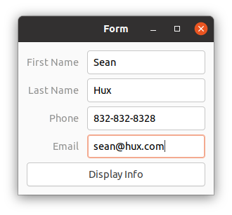
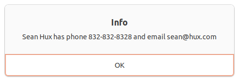

# [](https://github.com/AndyObtiva/glimmer) Glimmer DSL for LibUI 0.0.15
## Prerequisite-Free Ruby Desktop Development GUI Library
[](http://badge.fury.io/rb/glimmer-dsl-libui)
[](https://codeclimate.com/github/AndyObtiva/glimmer-dsl-libui/maintainability)
[](https://gitter.im/AndyObtiva/glimmer?utm_source=badge&utm_medium=badge&utm_campaign=pr-badge&utm_content=badge)

[Glimmer](https://github.com/AndyObtiva/glimmer) DSL for [LibUI](https://github.com/kojix2/LibUI) is a prerequisite-free Ruby desktop development GUI library. No need to pre-install any prerequisites. Just install the gem and have platform-independent native GUI that just works!

[LibUI](https://github.com/kojix2/LibUI) is a thin [Ruby](https://www.ruby-lang.org/en/) wrapper around [libui](https://github.com/andlabs/libui), a relatively new C GUI library that renders native controls on every platform (similar to [SWT](https://www.eclipse.org/swt/), but without the heavy weight of the [Java Virtual Machine](https://www.java.com/en/)).

The main trade-off in using [Glimmer DSL for LibUI](https://rubygems.org/gems/glimmer-dsl-libui) as opposed to [Glimmer DSL for SWT](https://github.com/AndyObtiva/glimmer-dsl-swt) or [Glimmer DSL for Tk](https://github.com/AndyObtiva/glimmer-dsl-tk) is the fact that [SWT](https://www.eclipse.org/swt/) and [Tk](https://www.tcl.tk/) are more mature than mid-alpha [libui](https://github.com/andlabs/libui) as GUI toolkits. Still, if there is only a need to build a small simple application, [Glimmer DSL for LibUI](https://rubygems.org/gems/glimmer-dsl-libui) could be a good convenient choice due to having zero prerequisites beyond the dependencies included in the [Ruby gem](https://rubygems.org/gems/glimmer-dsl-libui). Also, just like [Glimmer DSL for Tk](https://github.com/AndyObtiva/glimmer-dsl-tk), its apps start instantly and have a small memory footprint. [LibUI](https://github.com/kojix2/LibUI) is a promising new GUI toolkit that might prove quite worthy in the future.

[Glimmer DSL for LibUI](https://rubygems.org/gems/glimmer-dsl-libui) aims to provide a DSL similar to the [Glimmer DSL for SWT](https://github.com/AndyObtiva/glimmer-dsl-swt) to enable more productive desktop development in Ruby with:
- Declarative DSL syntax that visually maps to the GUI control hierarchy
- Convention over configuration via smart defaults and automation of low-level details
- Requiring the least amount of syntax possible to build GUI
- Bidirectional Data-Binding to declaratively wire and automatically synchronize GUI with Business Models
- Custom Control support
- Scaffolding for new custom controls, apps, and gems
- Native-Executable packaging on Mac, Windows, and Linux.

Example:

```ruby
require 'glimmer-dsl-libui'

include Glimmer

window('hello world').show
```


NOTE: [Glimmer DSL for LibUI](https://rubygems.org/gems/glimmer-dsl-libui) is in early alpha mode (only supports included [examples](#examples)). Please help make better by contributing, adopting for small or low risk projects, and providing feedback. It is still an early alpha, so the more feedback and issues you report the better.

Other [Glimmer](https://rubygems.org/gems/glimmer) DSL gems you might be interested in:
- [glimmer-dsl-swt](https://github.com/AndyObtiva/glimmer-dsl-swt): Glimmer DSL for SWT (JRuby Desktop Development GUI Framework)
- [glimmer-dsl-opal](https://github.com/AndyObtiva/glimmer-dsl-opal): Glimmer DSL for Opal (Pure Ruby Web GUI and Auto-Webifier of Desktop Apps)
- [glimmer-dsl-xml](https://github.com/AndyObtiva/glimmer-dsl-xml): Glimmer DSL for XML (& HTML)
- [glimmer-dsl-css](https://github.com/AndyObtiva/glimmer-dsl-css): Glimmer DSL for CSS
- [glimmer-dsl-tk](https://github.com/AndyObtiva/glimmer-dsl-tk): Glimmer DSL for Tk (MRI Ruby Desktop Development GUI Library)

## Table of Contents

- [Glimmer DSL for LibUI 0.0.15](#-glimmer-dsl-for-libui-0015)
  - [Glimmer GUI DSL Concepts](#glimmer-gui-dsl-concepts)
  - [Usage](#usage)
  - [API](#api)
    - [Supported Controls](#supported-controls)
    - [Common Control Properties](#common-control-properties)
    - [Common Control Operations](#common-control-operations)
    - [Extra Dialogs](#extra-dialogs)
    - [Extra Operations](#extra-operations)
    - [Smart Defaults and Conventions](#smart-defaults-and-conventions)
    - [API Gotchas](#api-gotchas)
    - [Original API](#original-api)
  - [Glimmer Style Guide](#glimmer-style-guide)
  - [Girb (Glimmer IRB)](#girb-glimmer-irb)
  - [Examples](#examples)
    - [Basic Window](#basic-window)
    - [Basic Button](#basic-button)
    - [Basic Entry](#basic-entry)
    - [Simple Notepad](#simple-notepad)
    - [Midi Player](#midi-player)
    - [Control Gallery](#control-gallery)
    - [Font Button](#font-button)
    - [Color Button](#color-button)
    - [Date Time Picker](#date-time-picker)
    - [Grid](#grid)
    - [Form](#form)
  - [Contributing to glimmer-dsl-libui](#contributing-to-glimmer-dsl-libui)
  - [Help](#help)
    - [Issues](#issues)
    - [Chat](#chat)
  - [Process](#process)
  - [Planned Features and Feature Suggestions](#planned-features-and-feature-suggestions)
  - [Change Log](#change-log)
  - [Contributors](#contributors)
  - [License](#license)

## Glimmer GUI DSL Concepts

The Glimmer GUI DSL provides object-oriented declarative hierarchical syntax for [LibUI](https://github.com/kojix2/LibUI) that:
- Supports smart defaults (e.g. automatic `on_closing` listener that quits `window`)
- Automates wiring of controls (e.g. `button` is automatically set as child of `window`)
- Hides lower-level details (e.g. `LibUI.main` loop is started automatically when triggering `show` on `window`)
- Nests controls according to their visual hierarchy
- Requires the minimum amount of syntax needed to describe an app's GUI

The Glimmer GUI DSL follows these simple concepts in mapping from [LibUI](https://github.com/kojix2/LibUI) syntax:
- **Control**: [LibUI](https://github.com/kojix2/LibUI) controls may be declared by lower-case underscored name (aka keyword) (e.g. `window` or `button`). Behind the scenes, they are represented by keyword methods that map to corresponding `LibUI.new_keyword` methods receiving args (e.g. `window('hello world', 300, 200, true)`).
- **Content/Properties/Listeners Block**: Any keyword may be optionally followed by a Ruby curly-brace multi-line-block containing nested controls (content) and/or properties (attributes) (e.g. `window('hello world', 300, 200, true) {button('greet')}`). It optionally receives one arg representing the control (e.g. `button('greet') {|b| on_clicked { puts b.text}}`)
- **Property**: Control properties may be declared inside keyword blocks with lower-case underscored name followed by property value args (e.g. `title "hello world"` inside `group`). Behind the scenes, properties correspond to `control_set_property` methods.
- **Listener**: Control listeners may be declared inside keyword blocks with listener lower-case underscored name beginning with `on_` and receiving required block handler (e.g. `on_clicked {puts 'clicked'}` inside `button`). Behind the scenes, listeners correspond to `control_on_event` methods.

Example of an app written in [LibUI](https://github.com/kojix2/LibUI)'s procedural imperative syntax:

```ruby
require 'libui'

UI = LibUI

UI.init

main_window = UI.new_window('hello world', 300, 200, 1)

button = UI.new_button('Button')

UI.button_on_clicked(button) do
  UI.msg_box(main_window, 'Information', 'You clicked the button')
end

UI.window_on_closing(main_window) do
  puts 'Bye Bye'
  UI.control_destroy(main_window)
  UI.quit
  0
end

UI.window_set_child(main_window, button)
UI.control_show(main_window)

UI.main
UI.quit
```

Example of the same app written in [Glimmer](https://github.com/AndyObtiva/glimmer) object-oriented declarative hierarchical syntax:

```ruby
require 'glimmer-dsl-libui'

include Glimmer

window('hello world', 300, 200) { |w|
  button('Button') {
    on_clicked do
      msg_box(w, 'Information', 'You clicked the button')
    end
  }
  
  on_closing do
    puts 'Bye Bye'
  end
}.show
```

## Usage

Install [glimmer-dsl-libui](https://rubygems.org/gems/glimmer-dsl-libui) gem directly:

```
gem install glimmer-dsl-libui
```
 
Or install via Bundler `Gemfile`:

```ruby
gem 'glimmer-dsl-libui', '~> 0.0.15'
```

Add `require 'glimmer-dsl-libui'` at the top, and then `include Glimmer` into the top-level main object for testing or into an actual class for serious usage.

Example (you may copy/paste in [`girb`](#girb-glimmer-irb)):

```ruby
require 'glimmer-dsl-libui'

class Application
  include Glimmer
  
  def launch
    window('hello world', 300, 200) {
      button('Button') {
        on_clicked do
          puts 'Button Clicked'
        end
      }
    }.show
  end
end

Application.new.launch
```

## API

Any control returned by a [Glimmer GUI DSL](#glimmer-gui-dsl-concepts) keyword declaration can be introspected for its properties and updated via object-oriented attributes (standard Ruby `attr`/`attr=` or `set_attr`).

Example (you may copy/paste in [`girb`](#girb-glimmer-irb)):

```ruby
w = window('hello world')
puts w.title # => hello world
w.title = 'howdy'
puts w.title # => howdy
w.set_title 'aloha'
puts w.title # => aloha
```

Controls are wrapped as Ruby proxy objects, having a `#libui` method to obtain the wrapped Fiddle pointer object. Ruby proxy objects rely on composition (via [Proxy Design Pattern](https://en.wikipedia.org/wiki/Proxy_pattern)) instead of inheritance to shield consumers from having to deal with lower-level details unless absolutely needed.

Example (you may copy/paste in [`girb`](#girb-glimmer-irb)):

```ruby
w = window('hello world') # => #<Glimmer::LibUI::WindowProxy:0x00007fde4ea39fb0
w.libui # => #<Fiddle::Pointer:0x00007fde53997980 ptr=0x00007fde51352a60 size=0 free=0x0000000000000000>
```

### Supported Controls

Control(Args) | Properties | Listeners
------------- | ---------- | ---------
`about_menu_item` | None | `on_clicked`
`button(text as String)` | `text` (`String`) | `on_clicked`
`checkbox(text as String)` | `checked` (Boolean), `text` (`String`) | `on_toggled`
`combobox` | `items` (`Array` of `String`), `selected` (`Integer`) | `on_selected`
`color_button` | `color` (Array of `red` as `Float`, `green` as `Float`, `blue` as `Float`, `alpha` as `Float`), `red` as `Float`, `green` as `Float`, `blue` as `Float`, `alpha` as `Float` | `on_changed`
`date_picker` | `time` (`Hash` of keys: `sec` as `Integer`, `min` as `Integer`, `hour` as `Integer`, `mday` as `Integer`, `mon` as `Integer`, `year` as `Integer`, `wday` as `Integer`, `yday` as `Integer`, `dst` as Boolean) | `on_changed`
`date_time_picker` | `time` (`Hash` of keys: `sec` as `Integer`, `min` as `Integer`, `hour` as `Integer`, `mday` as `Integer`, `mon` as `Integer`, `year` as `Integer`, `wday` as `Integer`, `yday` as `Integer`, `dst` as Boolean) | `on_changed`
`editable_combobox` | `items` (`Array` of `String`), `text` (`String`) | `on_changed`
`entry` | `read_only` (Boolean), `text` (`String`) | `on_changed`
`font_button` | `font` [read-only] (`Hash` of keys: `:family`, `:size`, `:weight`, `:italic`, `:stretch`), `family` as `String`, `size` as `Float`, `weight` as `Integer`, `italic` as `Integer`, `stretch` as `Integer` | `on_changed`
`form` | `padded` (Boolean) | None
`grid` | `padded` (Boolean) | None
`group(text as String)` | `margined` (Boolean), `title` (`String`) | None
`horizontal_box` | `padded` (Boolean) | None
`horizontal_separator` | None | None
`label(text as String)` | `text` (`String`) | None
`menu(text as String)` | None | None
`menu_item(text as String)` | `checked` (Boolean) | `on_clicked`
`multiline_entry` | `read_only` (Boolean), `text` (`String`) | `on_changed`
`msg_box(window as Glimmer::LibUI::WindowProxy, title as String, description as String)` | None | None
`msg_box_error(window as Glimmer::LibUI::WindowProxy, title as String, description as String)` | None | None
`non_wrapping_multiline_entry` | `read_only` (Boolean), `text` (`String`) | `on_changed`
`preferences_menu_item` | None | `on_clicked`
`progress_bar` | `value` (`Numeric`) | None
`quit_menu_item` | None | `on_clicked`
`radio_buttons` | `selected` (`Integer`) | `on_selected`
`slider(min as Numeric, max as Numeric)` | `value` (`Numeric`) | `on_changed`
`spinbox(min as Numeric, max as Numeric)` | `value` (`Numeric`) | `on_changed`
`tab` | `margined` (Boolean), `num_pages` (`Integer`) | None
`tab_item(name as String)` | `index` [read-only] (`Integer`), `margined` (Boolean), `name` [read-only] (`String`) | None
`time_picker` | `time` (`Hash` of keys: `sec` as `Integer`, `min` as `Integer`, `hour` as `Integer`, `mday` as `Integer`, `mon` as `Integer`, `year` as `Integer`, `wday` as `Integer`, `yday` as `Integer`, `dst` as Boolean) | `on_changed`
`vertical_box` | `padded` (Boolean) | None
`window(title as String, width as Integer, height as Integer, has_menubar as Boolean)` | `borderless` (Boolean), `content_size` (width `Numeric`, height `Numeric`), `fullscreen` (Boolean), `margined` (Boolean), `title` (`String`) | `on_closing`, `on_content_size_changed`

### Common Control Properties
- `enabled` (Boolean)
- `libui` (`Fiddle::Pointer`): returns wrapped [LibUI](https://github.com/kojix2/LibUI) object
- `parent_proxy` (`Glimmer::LibUI::ControlProxy` or subclass)
- `parent` (`Fiddle::Pointer`)
- `toplevel` [read-only] (Boolean)
- `visible` (Boolean)
- `stretchy` [dsl-only] (Boolean) [default=`true`]: available in [Glimmer GUI DSL](#glimmer-gui-dsl-concepts) when nested under `horizontal_box`, `vertical_box`, or `form`
- `left` [dsl-only] (`Integer`) [default=`0`]: available in [Glimmer GUI DSL](#glimmer-gui-dsl-concepts) when nested under `grid`
- `top` [dsl-only] (`Integer`) [default=`0`]: available in [Glimmer GUI DSL](#glimmer-gui-dsl-concepts) when nested under `grid`
- `xspan` [dsl-only] (`Integer`) [default=`1`]: available in [Glimmer GUI DSL](#glimmer-gui-dsl-concepts) when nested under `grid`
- `yspan` [dsl-only] (`Integer`) [default=`1`]: available in [Glimmer GUI DSL](#glimmer-gui-dsl-concepts) when nested under `grid`
- `hexpand` [dsl-only] (Boolean) [default=`false`]: available in [Glimmer GUI DSL](#glimmer-gui-dsl-concepts) when nested under `grid`
- `halign` [dsl-only] (`Integer`) [default=`0`]: available in [Glimmer GUI DSL](#glimmer-gui-dsl-concepts) when nested under `grid`
- `vexpand` [dsl-only] (Boolean) [default=`false`]: available in [Glimmer GUI DSL](#glimmer-gui-dsl-concepts) when nested under `grid`
- `valign` [dsl-only] (`Integer`) [default=`0`]: available in [Glimmer GUI DSL](#glimmer-gui-dsl-concepts) when nested under `grid`

### Common Control Operations
- `destroy`
- `disable`
- `enable`
- `hide`
- `show`

### Extra Dialogs

- `open_file(window as Glimmer::LibUI::WindowProxy)`: returns selected file (`String`) or `nil` if cancelled
- `save_file(window as Glimmer::LibUI::WindowProxy)`: returns selected file (`String`) or `nil` if cancelled

### Extra Operations

- `ControlProxy::all_control_proxies`: returns all instantiated control proxies in the application
- `ControlProxy::main_window_proxy`: returns the first window proxy instantiated in the application
- `ControlProxy#window_proxy`: returns the window proxy parent for a control

### Smart Defaults and Conventions

- `horizontal_box`, `vertical_box`, `grid`, and `form` controls have `padded` as `true` upon instantiation to ensure more user-friendly GUI by default
- `group` controls have `margined` as `true` upon instantiation to ensure more user-friendly GUI by default
- All controls nested under a `horizontal_box`, `vertical_box`, and `form` have `stretchy` property (fill maximum space) as `true` by default (passed to `box_append`/`form_append` method)
- `window` constructor args can be left off and have the following defaults when unspecified: `title` as `'Glimmer'`, `width` as `150`, `height` as `150`, and `has_menubar` as `true`)
- `window` has an `on_closing` listener by default that quits application upon hitting the close button (can be overridden with a manual `on_closing` implementation that returns integer `0` for success)
- `quit_menu_item` has an `on_clicked` listener by default that quits application upon selecting the quit menu item (can be overridden with a manual `on_clicked` implementation that returns integer `0` for success)
- If an `on_closing` listener was defined on `window` and it does not return an integer, default exit behavior is assumed (`window.destroy` is called followed by `LibUI.quit`, returning `0`).
- If an `on_clicked` listener was defined on `quit_menu_item` and it does not return an integer, default exit behavior is assumed (`main_window.destroy` is called followed by `LibUI.quit`, returning `0`).
- All boolean property readers return `true` or `false` in Ruby instead of the [libui](https://github.com/andlabs/libui) original `0` or `1` in C.
- All boolean property writers accept `true`/`false` in addition to `1`/`0` in Ruby
- All string property readers return a `String` object in Ruby instead of the [libui](https://github.com/andlabs/libui) Fiddle pointer object.
- Automatically allocate font descriptors upon instantiating `font_button` controls and free them when destorying `font_button` controls
- Automatically allocate color value pointers upon instantiating `color_button` controls and free them when destorying `color_button` controls
- On the Mac, if no `menu` items were added, an automatic `quit_menu_item` is added to enable quitting with CTRL+Q
- When destroying a control nested under a `horizontal_box` or `vertical_box`, it is automatically deleted from the box's children
- When destroying a control nested under a `form`, it is automatically deleted from the form's children
- When destroying a control nested under a `window` or `group`, it is automatically unset as their child to allow successful destruction
- For `date_time_picker`, `date_picker`, and `time_picker`, make sure `time` hash values for `mon`, `wday`, and `yday` are 1-based instead of [libui](https://github.com/andlabs/libui) original 0-based values, and return `dst` as Boolean instead of `isdst` as `1`/`0`
- Smart defaults for `grid` child attributes are `left` (`0`), `top` (`0`), `xspan` (`1`), `yspan` (`1`), `hexpand` (`false`), `halign` (`0`), `vexpand` (`false`), and `valign` (`0`)

### API Gotchas

There is no proper way to destroy `grid` children due to [libui](https://github.com/andlabs/libui) not offering any API for deleting them from `grid` (no `grid_delete` similar to `box_delete` for `horizontal_box` and `vertical_box`)

### Original API

To learn more about the [LibUI](https://github.com/kojix2/LibUI) API exposed through [Glimmer DSL for LibUI](https://rubygems.org/gems/glimmer-dsl-libui),
check out the [libui C headers](https://github.com/andlabs/libui/blob/master/ui.h)

## Glimmer Style Guide

- Control arguments are always wrapped by parentheses
- Control blocks are always declared with curly braces to clearly visualize hierarchical view code and separate from logic code
- Control property declarations always have arguments and never take a block
- Control property arguments are never wrapped inside parentheses
- Control listeners are always declared starting with on_ prefix and affixing listener event method name afterwards in underscored lowercase form. Their multi-line blocks have a `do; end` style.
- Pure logic multi-line blocks that do not constitute GUI DSL view elements have `do; end` style to clearly separate logic code from view code.

## Girb (Glimmer IRB)

You can run the `girb` command (`bin/girb` if you cloned the project locally):

```
girb
```

This gives you `irb` with the `glimmer-dsl-libui` gem loaded and the `Glimmer` module mixed into the main object for easy experimentation with GUI.

Gotcha: On the Mac, when you close a window opened in `girb`, it remains open until you enter `exit` or open another GUI window.

## Examples

These examples include reimplementions of the examples in the [LibUI](https://github.com/kojix2/LibUI) project utilizing the [Glimmer GUI DSL](#glimmer-gui-dsl-concepts) as well as brand new examples.

To browse all examples, simply launch the [Meta-Example](examples/meta_example.rb), which lists all examples and displays each example's code when selected. It also enables code editing to facilitate experimentation and learning.

[examples/meta_example.rb](examples/meta_example.rb)

Run with this command from the root of the project if you cloned the project:

```
ruby -r './lib/glimmer-dsl-libui' examples/meta_example.rb
```

Run with this command if you installed the [Ruby gem](https://rubygems.org/gems/glimmer-dsl-libui):

```
ruby -r glimmer-dsl-libui -e "require 'examples/meta_example'"
```

Mac


Linux


New [Glimmer DSL for LibUI](https://rubygems.org/gems/glimmer-dsl-libui) Version:

```ruby
require 'glimmer-dsl-libui'
require 'facets'

class MetaExample
  include Glimmer
  
  def examples
    if @examples.nil?
      example_files = Dir.glob(File.join(File.expand_path('.', __dir__), '**', '*.rb'))
      example_file_names = example_files.map { |f| File.basename(f, '.rb') }
      example_file_names = example_file_names.reject { |f| f == 'meta_example' }
      @examples = example_file_names.map { |f| f.underscore.titlecase }
    end
    @examples
  end
  
  def file_path_for(example)
    File.join(File.expand_path('.', __dir__), "#{example.underscore}.rb")
  end
  
  def glimmer_dsl_libui_file
    File.expand_path('../lib/glimmer-dsl-libui', __dir__)
  end
  
  def launch
    window('Meta-Example', 700, 500) { |w|
      margined true
      
      horizontal_box {
        vertical_box {
          @rbs = radio_buttons {
            stretchy false
            items examples
            selected 0
            
            on_selected do
              @nwme.text = File.read(file_path_for(@examples[@rbs.selected]))
            end
          }
          button('Launch') {
            stretchy false
            
            on_clicked do
              begin
                meta_example_file = File.join(Dir.home, '.meta_example.rb')
                File.write(meta_example_file, @nwme.text)
                result = `ruby -r #{glimmer_dsl_libui_file} #{meta_example_file} 2>&1`
                msg_box(w, 'Error Running Example', result) if result.include?('error')
              rescue => e
                puts 'Unable to write code changes! Running original example...'
                system "ruby -r #{glimmer_dsl_libui_file} #{file_path_for(@examples[@rbs.selected])}"
              end
            end
          }
        }
        vertical_box {
          @nwme = non_wrapping_multiline_entry {
            text File.read(file_path_for(@examples[@rbs.selected]))
          }
        }
      }
    }.show
  end
end

MetaExample.new.launch
```


### Basic Window

[examples/basic_window.rb](examples/basic_window.rb)

Run with this command from the root of the project if you cloned the project:

```
ruby -r './lib/glimmer-dsl-libui' examples/basic_window.rb
```

Run with this command if you installed the [Ruby gem](https://rubygems.org/gems/glimmer-dsl-libui):

```
ruby -r glimmer-dsl-libui -e "require 'examples/basic_window'"
```

Mac


Linux


[LibUI](https://github.com/kojix2/LibUI) Original Version:

```ruby
require 'libui'

UI = LibUI

UI.init

main_window = UI.new_window('hello world', 300, 200, 1)

UI.control_show(main_window)

UI.window_on_closing(main_window) do
  puts 'Bye Bye'
  UI.control_destroy(main_window)
  UI.quit
  0
end

UI.main
UI.quit
```

[Glimmer DSL for LibUI](https://rubygems.org/gems/glimmer-dsl-libui) Version:

```ruby
require 'glimmer-dsl-libui'

include Glimmer

window('hello world', 300, 200, true) {
  on_closing do
    puts 'Bye Bye'
  end
}.show
```

### Basic Button

[examples/basic_button.rb](examples/basic_button.rb)

Run with this command from the root of the project if you cloned the project:

```
ruby -r './lib/glimmer-dsl-libui' examples/basic_button.rb
```

Run with this command if you installed the [Ruby gem](https://rubygems.org/gems/glimmer-dsl-libui):

```
ruby -r glimmer-dsl-libui -e "require 'examples/basic_button'"
```

Mac


Linux


[LibUI](https://github.com/kojix2/LibUI) Original Version:

```ruby
require 'libui'

UI = LibUI

UI.init

main_window = UI.new_window('hello world', 300, 200, 1)

button = UI.new_button('Button')

UI.button_on_clicked(button) do
  UI.msg_box(main_window, 'Information', 'You clicked the button')
end

UI.window_on_closing(main_window) do
  puts 'Bye Bye'
  UI.control_destroy(main_window)
  UI.quit
  0
end

UI.window_set_child(main_window, button)
UI.control_show(main_window)

UI.main
UI.quit
```

[Glimmer DSL for LibUI](https://rubygems.org/gems/glimmer-dsl-libui) Version:

```ruby
require 'glimmer-dsl-libui'

include Glimmer

window('hello world', 300, 200, true) { |w|
  button('Button') {
    on_clicked do
      msg_box(w, 'Information', 'You clicked the button')
    end
  }
  
  on_closing do
    puts 'Bye Bye'
  end
}.show
```

[Glimmer DSL for LibUI](https://rubygems.org/gems/glimmer-dsl-libui) Version 2:

```ruby
require 'glimmer-dsl-libui'

include Glimmer

window { # first 3 args can be set via properties with 4th arg has_menubar=true by default
  title 'hello world'
  content_size 300, 200
  
  on_closing do
    puts 'Bye Bye'
  end
}.show
```

### Basic Entry

[examples/basic_entry.rb](examples/basic_entry.rb)

Run with this command from the root of the project if you cloned the project:

```
ruby -r './lib/glimmer-dsl-libui' examples/basic_entry.rb
```

Run with this command if you installed the [Ruby gem](https://rubygems.org/gems/glimmer-dsl-libui):

```
ruby -r glimmer-dsl-libui -e "require 'examples/basic_entry'"
```

Mac


Linux


[LibUI](https://github.com/kojix2/LibUI) Original Version:

```ruby
require 'libui'

UI = LibUI

UI.init

main_window = UI.new_window('Basic Entry', 300, 50, 1)
UI.window_on_closing(main_window) do
  puts 'Bye Bye'
  UI.control_destroy(main_window)
  UI.quit
  0
end

hbox = UI.new_horizontal_box
UI.window_set_child(main_window, hbox)

entry = UI.new_entry
UI.entry_on_changed(entry) do
  puts UI.entry_text(entry).to_s
  $stdout.flush # For Windows
end
UI.box_append(hbox, entry, 1)

button = UI.new_button('Button')
UI.button_on_clicked(button) do
  text = UI.entry_text(entry).to_s
  UI.msg_box(main_window, 'You entered', text)
  0
end

UI.box_append(hbox, button, 0)

UI.control_show(main_window)
UI.main
UI.quit
```

[Glimmer DSL for LibUI](https://rubygems.org/gems/glimmer-dsl-libui) Version:

```ruby
require 'glimmer-dsl-libui'

include Glimmer

window('Basic Entry', 300, 50) { |w|
  horizontal_box {
    e = entry {
      # stretchy true # Smart default option for appending to horizontal_box
    
      on_changed do
        puts e.text
        $stdout.flush # For Windows
      end
    }
    
    button('Button') {
      stretchy false # stretchy property is available when control is nested under horizontal_box
      
      on_clicked do
        text = e.text
        msg_box(w, 'You entered', text)
      end
    }
  }
  
  on_closing do
    puts 'Bye Bye'
  end
}.show
```

### Simple Notepad

[examples/simple_notepad.rb](examples/simple_notepad.rb)

Run with this command from the root of the project if you cloned the project:

```
ruby -r './lib/glimmer-dsl-libui' examples/simple_notepad.rb
```

Run with this command if you installed the [Ruby gem](https://rubygems.org/gems/glimmer-dsl-libui):

```
ruby -r glimmer-dsl-libui -e "require 'examples/simple_notepad'"
```

Mac


Linux


[LibUI](https://github.com/kojix2/LibUI) Original Version:

```ruby
require 'libui'

UI = LibUI

UI.init

main_window = UI.new_window('Notepad', 500, 300, 1)
UI.window_on_closing(main_window) do
  puts 'Bye Bye'
  UI.control_destroy(main_window)
  UI.quit
  0
end

vbox = UI.new_vertical_box
UI.window_set_child(main_window, vbox)

entry = UI.new_non_wrapping_multiline_entry
UI.box_append(vbox, entry, 1)

UI.control_show(main_window)
UI.main
UI.quit
```

[Glimmer DSL for LibUI](https://rubygems.org/gems/glimmer-dsl-libui) Version:

```ruby
require 'glimmer-dsl-libui'

include Glimmer

window('Notepad', 500, 300) {
  on_closing do
    puts 'Bye Bye'
  end
  
  vertical_box {
    non_wrapping_multiline_entry
  }
}.show
```

### Midi Player

This example has prerequisites:
- Install [TiMidity](http://timidity.sourceforge.net) and ensure `timidity` command is in `PATH` (can be installed via [Homebrew](https://brew.sh) on Mac or [apt-get](https://help.ubuntu.com/community/AptGet/Howto) on Linux).
- Add `*.mid` files to `~/Music` directory (you may copy the ones included in [sounds](sounds) directory)

[examples/midi_player.rb](examples/midi_player.rb)

Run with this command from the root of the project if you cloned the project:

```
ruby -r './lib/glimmer-dsl-libui' examples/midi_player.rb
```

Run with this command if you installed the [Ruby gem](https://rubygems.org/gems/glimmer-dsl-libui):

```
ruby -r glimmer-dsl-libui -e "require 'examples/midi_player'"
```

Mac


Linux


[LibUI](https://github.com/kojix2/LibUI) Original Version:

```ruby
require 'libui'
UI = LibUI

class TinyMidiPlayer
  VERSION = '0.0.1'

  def initialize
    UI.init
    @pid = nil
    @music_directory = File.expand_path(ARGV[0] || '~/Music/')
    @midi_files      = Dir.glob(File.join(@music_directory, '**/*.mid'))
                          .sort_by { |path| File.basename(path) }
    at_exit { stop_midi }
    create_gui
  end

  def stop_midi
    if @pid
      if @th.alive?
        Process.kill(:SIGKILL, @pid)
        @pid = nil
      else
        @pid = nil
      end
    end
  end

  def play_midi
    stop_midi
    if @pid.nil? && @selected_file
      begin
        @pid = spawn "timidity #{@selected_file}"
        @th = Process.detach @pid
      rescue Errno::ENOENT
        warn 'Timidty++ not found. Please install Timidity++.'
        warn 'https://sourceforge.net/projects/timidity/'
      end
    end
  end

  def show_version(main_window)
    UI.msg_box(main_window,
               'Tiny Midi Player',
               "Written in Ruby\n" \
               "https://github.com/kojix2/libui\n" \
               "Version #{VERSION}")
  end

  def create_gui
    help_menu = UI.new_menu('Help')
    version_item = UI.menu_append_item(help_menu, 'Version')

    UI.new_window('Tiny Midi Player', 200, 50, 1).tap do |main_window|
      UI.menu_item_on_clicked(version_item) { show_version(main_window) }

      UI.window_on_closing(main_window) do
        UI.control_destroy(main_window)
        UI.quit
        0
      end

      UI.new_horizontal_box.tap do |hbox|
        UI.new_vertical_box.tap do |vbox|
          UI.new_button('▶').tap do |button1|
            UI.button_on_clicked(button1) { play_midi }
            UI.box_append(vbox, button1, 1)
          end
          UI.new_button('■').tap do |button2|
            UI.button_on_clicked(button2) { stop_midi }
            UI.box_append(vbox, button2, 1)
          end
          UI.box_append(hbox, vbox, 0)
        end
        UI.window_set_child(main_window, hbox)

        UI.new_combobox.tap do |cbox|
          @midi_files.each do |path|
            name = File.basename(path)
            UI.combobox_append(cbox, name)
          end
          UI.combobox_on_selected(cbox) do |ptr|
            @selected_file = @midi_files[UI.combobox_selected(ptr)]
            play_midi if @th&.alive?
            0
          end
          UI.box_append(hbox, cbox, 1)
        end
      end
      UI.control_show(main_window)
    end
    UI.main
    UI.quit
  end
end

TinyMidiPlayer.new
```

[Glimmer DSL for LibUI](https://rubygems.org/gems/glimmer-dsl-libui) Version:

```ruby
require 'glimmer-dsl-libui'

class TinyMidiPlayer
  include Glimmer
  
  VERSION = '0.0.1'

  def initialize
    @pid = nil
    @music_directory = File.expand_path(ARGV[0] || '~/Music/')
    @midi_files      = Dir.glob(File.join(@music_directory, '**/*.mid'))
                          .sort_by { |path| File.basename(path) }
    at_exit { stop_midi }
    create_gui
  end

  def stop_midi
    if @pid
      if @th.alive?
        Process.kill(:SIGKILL, @pid)
        @pid = nil
      else
        @pid = nil
      end
    end
  end

  def play_midi
    stop_midi
    if @pid.nil? && @selected_file
      begin
        @pid = spawn "timidity #{@selected_file}"
        @th = Process.detach @pid
      rescue Errno::ENOENT
        warn 'Timidty++ not found. Please install Timidity++.'
        warn 'https://sourceforge.net/projects/timidity/'
      end
    end
  end

  def show_version(main_window)
    msg_box(main_window,
               'Tiny Midi Player',
               "Written in Ruby\n" \
               "https://github.com/kojix2/libui\n" \
               "Version #{VERSION}")
  end

  def create_gui
    menu('Help') { |m|
      menu_item('Version') {
        on_clicked do
          show_version(@main_window)
        end
      }
    }
    @main_window = window('Tiny Midi Player', 200, 50) {
      horizontal_box {
        vertical_box {
          stretchy false
          
          button('▶') {
            on_clicked do
              play_midi
            end
          }
          button('■') {
            on_clicked do
              stop_midi
            end
          }
        }
        
        combobox { |c|
          items @midi_files.map { |path| File.basename(path) }
          
          on_selected do
            @selected_file = @midi_files[c.selected]
            play_midi if @th&.alive?
          end
        }
      }
    }
    @main_window.show
  end
end

TinyMidiPlayer.new
```

### Control Gallery

[examples/control_gallery.rb](examples/control_gallery.rb)

Run with this command from the root of the project if you cloned the project:

```
ruby -r './lib/glimmer-dsl-libui' examples/control_gallery.rb
```

Run with this command if you installed the [Ruby gem](https://rubygems.org/gems/glimmer-dsl-libui):

```
ruby -r glimmer-dsl-libui -e "require 'examples/control_gallery'"
```

Mac


Linux


[LibUI](https://github.com/kojix2/LibUI) Original Version:

```ruby
require 'libui'
UI = LibUI

UI.init

should_quit = proc do
  puts 'Bye Bye'
  UI.control_destroy(MAIN_WINDOW)
  UI.quit
  0
end

# File menu
menu = UI.new_menu('File')
open_menu_item = UI.menu_append_item(menu, 'Open')
UI.menu_item_on_clicked(open_menu_item) do
  pt = UI.open_file(MAIN_WINDOW)
  puts pt unless pt.null?
end
save_menu_item = UI.menu_append_item(menu, 'Save')
UI.menu_item_on_clicked(save_menu_item) do
  pt = UI.save_file(MAIN_WINDOW)
  puts pt unless pt.null?
end

UI.menu_append_quit_item(menu)
UI.on_should_quit(should_quit)

# Edit menu
edit_menu = UI.new_menu('Edit')
UI.menu_append_check_item(edit_menu, 'Checkable Item_')
UI.menu_append_separator(edit_menu)
disabled_item = UI.menu_append_item(edit_menu, 'Disabled Item_')
UI.menu_item_disable(disabled_item)

preferences = UI.menu_append_preferences_item(menu)

# Help menu
help_menu = UI.new_menu('Help')
UI.menu_append_item(help_menu, 'Help')
UI.menu_append_about_item(help_menu)

# Main Window
MAIN_WINDOW = UI.new_window('Control Gallery', 600, 500, 1)
UI.window_set_margined(MAIN_WINDOW, 1)
UI.window_on_closing(MAIN_WINDOW, should_quit)

vbox = UI.new_vertical_box
UI.window_set_child(MAIN_WINDOW, vbox)
hbox = UI.new_horizontal_box
UI.box_set_padded(vbox, 1)
UI.box_set_padded(hbox, 1)

UI.box_append(vbox, hbox, 1)

# Group - Basic Controls
group = UI.new_group('Basic Controls')
UI.group_set_margined(group, 1)
UI.box_append(hbox, group, 1) # OSX bug?

inner = UI.new_vertical_box
UI.box_set_padded(inner, 1)
UI.group_set_child(group, inner)

# Button
button = UI.new_button('Button')
UI.button_on_clicked(button) do
  UI.msg_box(MAIN_WINDOW, 'Information', 'You clicked the button')
end
UI.box_append(inner, button, 0)

# Checkbox
checkbox = UI.new_checkbox('Checkbox')
UI.checkbox_on_toggled(checkbox) do |ptr|
  checked = UI.checkbox_checked(ptr) == 1
  UI.window_set_title(MAIN_WINDOW, "Checkbox is #{checked}")
  UI.checkbox_set_text(ptr, "I am the checkbox (#{checked})")
end
UI.box_append(inner, checkbox, 0)

# Label
UI.box_append(inner, UI.new_label('Label'), 0)

# Separator
UI.box_append(inner, UI.new_horizontal_separator, 0)

# Date Picker
UI.box_append(inner, UI.new_date_picker, 0)

# Time Picker
UI.box_append(inner, UI.new_time_picker, 0)

# Date Time Picker
UI.box_append(inner, UI.new_date_time_picker, 0)

# Font Button
UI.box_append(inner, UI.new_font_button, 0)

# Color Button
UI.box_append(inner, UI.new_color_button, 0)

inner2 = UI.new_vertical_box
UI.box_set_padded(inner2, 1)
UI.box_append(hbox, inner2, 1)

# Group - Numbers
group = UI.new_group('Numbers')
UI.group_set_margined(group, 1)
UI.box_append(inner2, group, 0)

inner = UI.new_vertical_box
UI.box_set_padded(inner, 1)
UI.group_set_child(group, inner)

# Spinbox
spinbox = UI.new_spinbox(0, 100)
UI.spinbox_set_value(spinbox, 42)
UI.spinbox_on_changed(spinbox) do |ptr|
  puts "New Spinbox value: #{UI.spinbox_value(ptr)}"
end
UI.box_append(inner, spinbox, 0)

# Slider
slider = UI.new_slider(0, 100)
UI.box_append(inner, slider, 0)

# Progressbar
progressbar = UI.new_progress_bar
UI.box_append(inner, progressbar, 0)

UI.slider_on_changed(slider) do |ptr|
  v = UI.slider_value(ptr)
  puts "New Slider value: #{v}"
  UI.progress_bar_set_value(progressbar, v)
end

# Group - Lists
group = UI.new_group('Lists')
UI.group_set_margined(group, 1)
UI.box_append(inner2, group, 0)

inner = UI.new_vertical_box
UI.box_set_padded(inner, 1)
UI.group_set_child(group, inner)

# Combobox
cbox = UI.new_combobox
UI.combobox_append(cbox, 'combobox Item 1')
UI.combobox_append(cbox, 'combobox Item 2')
UI.combobox_append(cbox, 'combobox Item 3')
UI.box_append(inner, cbox, 0)
UI.combobox_on_selected(cbox) do |ptr|
  puts "New combobox selection: #{UI.combobox_selected(ptr)}"
end

# Editable Combobox
ebox = UI.new_editable_combobox
UI.editable_combobox_append(ebox, 'Editable Item 1')
UI.editable_combobox_append(ebox, 'Editable Item 2')
UI.editable_combobox_append(ebox, 'Editable Item 3')
UI.box_append(inner, ebox, 0)

# Radio Buttons
rb = UI.new_radio_buttons
UI.radio_buttons_append(rb, 'Radio Button 1')
UI.radio_buttons_append(rb, 'Radio Button 2')
UI.radio_buttons_append(rb, 'Radio Button 3')
UI.box_append(inner, rb, 1)

# Tab
tab = UI.new_tab
hbox1 = UI.new_horizontal_box
hbox2 = UI.new_horizontal_box
UI.tab_append(tab, 'Page 1', hbox1)
UI.tab_append(tab, 'Page 2', hbox2)
UI.tab_append(tab, 'Page 3', UI.new_horizontal_box)
UI.box_append(inner2, tab, 1)

# Text Entry
text_entry = UI.new_entry
UI.entry_set_text text_entry, 'Please enter your feelings'
UI.entry_on_changed(text_entry) do |ptr|
  puts "Current textbox data: '#{UI.entry_text(ptr)}'"
end
UI.box_append(hbox1, text_entry, 1)

UI.control_show(MAIN_WINDOW)

UI.main
UI.quit
```

[Glimmer DSL for LibUI](https://rubygems.org/gems/glimmer-dsl-libui) Version:

```ruby
require 'glimmer-dsl-libui'

include Glimmer

menu('File') {
  menu_item('Open') {
    on_clicked do
      file = open_file(MAIN_WINDOW)
      puts file unless file.nil?
    end
  }

  menu_item('Save') {
    on_clicked do
      file = save_file(MAIN_WINDOW)
      puts file unless file.nil?
    end
  }
  
  quit_menu_item {
    on_clicked do
      puts 'Bye Bye'
    end
  }
  
  preferences_menu_item # Can optionally contain an on_clicked listener
}

menu('Edit') {
  check_menu_item('Checkable Item_')
  separator_menu_item
  menu_item('Disabled Item_') {
    enabled false
  }
}

menu('Help') {
  menu_item('Help')
  
  about_menu_item # Can optionally contain an on_clicked listener
}

MAIN_WINDOW = window('Control Gallery', 600, 500) {
  margined true
  
  on_closing do
    puts 'Bye Bye'
  end
  
  vertical_box {
    horizontal_box {
      group('Basic Controls') {
        vertical_box {
          button('Button') {
            stretchy false

            on_clicked do
              msg_box(MAIN_WINDOW, 'Information', 'You clicked the button')
            end
          }

          checkbox('Checkbox') {
            stretchy false

            on_toggled do |c|
              checked = c.checked == 1
              MAIN_WINDOW.title = "Checkbox is #{checked}"
              c.text = "I am the checkbox (#{checked})"
            end
          }

          label('Label') { stretchy false }

          horizontal_separator { stretchy false }

          date_picker { stretchy false }

          time_picker { stretchy false }

          date_time_picker { stretchy false }

          font_button { stretchy false }

          color_button { stretchy false }
        }
      }

      vertical_box {
        group('Numbers') {
          stretchy false

          vertical_box {
            spinbox(0, 100) {
              stretchy false
              value 42

              on_changed do |s|
                puts "New Spinbox value: #{s.value}"
              end
            }

            slider(0, 100) {
              stretchy false

              on_changed do |s|
                v = s.value
                puts "New Slider value: #{v}"
                @progress_bar.value = v
              end
            }

            @progress_bar = progress_bar { stretchy false }
          }
        }

        group('Lists') {
          stretchy false

          vertical_box {
            combobox {
              stretchy false
              items 'combobox Item 1', 'combobox Item 2', 'combobox Item 3' # also accepts a single array argument

              on_selected do |c|
                puts "New combobox selection: #{c.selected}"
              end
            }

            editable_combobox {
              stretchy false
              items 'Editable Item 1', 'Editable Item 2', 'Editable Item 3' # also accepts a single array argument
            }

            radio_buttons {
              items 'Radio Button 1', 'Radio Button 2', 'Radio Button 3' # also accepts a single array argument
            }
          }
        }

        tab {
          tab_item('Page 1') {
            horizontal_box {
              entry {
                text 'Please enter your feelings'

                on_changed do |e|
                  puts "Current textbox data: '#{e.text}'"
                end
              }
            }
          }
          
          tab_item('Page 2') {
            horizontal_box
          }
          
          tab_item('Page 3') {
            horizontal_box
          }
        }
      }
    }
  }
}

MAIN_WINDOW.show
```

### Font Button

[examples/font_button.rb](examples/font_button.rb)

Run with this command from the root of the project if you cloned the project:

```
ruby -r './lib/glimmer-dsl-libui' examples/font_button.rb
```

Run with this command if you installed the [Ruby gem](https://rubygems.org/gems/glimmer-dsl-libui):

```
ruby -r glimmer-dsl-libui -e "require 'examples/font_button'"
```

Mac


Linux


[LibUI](https://github.com/kojix2/LibUI) Original Version:

```ruby
require 'libui'

UI = LibUI

UI.init

main_window = UI.new_window('hello world', 300, 200, 1)

font_button = UI.new_font_button
font_descriptor = UI::FFI::FontDescriptor.malloc
UI.font_button_on_changed(font_button) do
  UI.font_button_font(font_button, font_descriptor)
  p family: font_descriptor.Family.to_s,
    size: font_descriptor.Size,
    weight: font_descriptor.Weight,
    italic: font_descriptor.Italic,
    stretch: font_descriptor.Stretch
end

UI.window_on_closing(main_window) do
  puts 'Bye Bye'
  UI.control_destroy(main_window)
  UI.quit
  0
end

UI.window_set_child(main_window, font_button)
UI.control_show(main_window)

UI.main
UI.quit

```

[Glimmer DSL for LibUI](https://rubygems.org/gems/glimmer-dsl-libui) Version:

```ruby
require 'glimmer-dsl-libui'

include Glimmer

window('hello world', 300, 200) {
  font_button { |fb|
    on_changed do
      font_descriptor = fb.font
      p font_descriptor
    end
  }
  
  on_closing do
    puts 'Bye Bye'
  end
}.show
```

### Color Button

[examples/color_button.rb](examples/color_button.rb)

Run with this command from the root of the project if you cloned the project:

```
ruby -r './lib/glimmer-dsl-libui' examples/color_button.rb
```

Run with this command if you installed the [Ruby gem](https://rubygems.org/gems/glimmer-dsl-libui):

```
ruby -r glimmer-dsl-libui -e "require 'examples/color_button'"
```

Mac


Linux


New [Glimmer DSL for LibUI](https://rubygems.org/gems/glimmer-dsl-libui) Version:

```ruby
require 'glimmer-dsl-libui'

include Glimmer

window('color button', 230) {
  color_button { |cb|
    on_changed do
      rgba = cb.color
      p rgba
    end
  }
}.show
```

### Date Time Picker

[examples/date_time_picker.rb](examples/date_time_picker.rb)

Run with this command from the root of the project if you cloned the project:

```
ruby -r './lib/glimmer-dsl-libui' examples/date_time_picker.rb
```

Run with this command if you installed the [Ruby gem](https://rubygems.org/gems/glimmer-dsl-libui):

```
ruby -r glimmer-dsl-libui -e "require 'examples/date_time_picker'"
```

Mac


Linux


[LibUI](https://github.com/kojix2/LibUI) Original Version:

```ruby
require 'libui'

UI = LibUI

UI.init

vbox = UI.new_vertical_box

date_time_picker = UI.new_date_time_picker

time = UI::FFI::TM.malloc

UI.date_time_picker_on_changed(date_time_picker) do
  UI.date_time_picker_time(date_time_picker, time)
  p sec: time.tm_sec,
    min: time.tm_min,
    hour: time.tm_hour,
    mday: time.tm_mday,
    mon: time.tm_mon,
    year: time.tm_year,
    wday: time.tm_wday,
    yday: time.tm_yday,
    isdst: time.tm_isdst
end
UI.box_append(vbox, date_time_picker, 1)

main_window = UI.new_window('Date Time Pickers', 300, 200, 1)
UI.window_on_closing(main_window) do
  puts 'Bye Bye'
  UI.control_destroy(main_window)
  UI.quit
  0
end
UI.window_set_child(main_window, vbox)
UI.control_show(main_window)

UI.main
UI.quit
```

[Glimmer DSL for LibUI](https://rubygems.org/gems/glimmer-dsl-libui) Version:

```ruby
require 'glimmer-dsl-libui'

include Glimmer

window('Date Time Pickers', 300, 200) {
  vertical_box {
    date_time_picker { |dtp|
      on_changed do
        time = dtp.time
        p time
      end
    }
  }
  
  on_closing do
    puts 'Bye Bye'
  end
}.show
```

### Grid

[examples/grid.rb](examples/grid.rb)

Run with this command from the root of the project if you cloned the project:

```
ruby -r './lib/glimmer-dsl-libui' examples/grid.rb
```

Run with this command if you installed the [Ruby gem](https://rubygems.org/gems/glimmer-dsl-libui):

```
ruby -r glimmer-dsl-libui -e "require 'examples/grid'"
```

Mac


Linux


New [Glimmer DSL for LibUI](https://rubygems.org/gems/glimmer-dsl-libui) Version:

```ruby
require 'glimmer-dsl-libui'

include Glimmer

window('Grid') {
  tab {
    tab_item('Spanning') {
      grid {
        4.times { |left_value|
          4.times { |top_value|
            label("(#{left_value}, #{top_value}) xspan1\nyspan1") {
              left left_value
              top top_value
              hexpand true
              vexpand true
            }
          }
        }
        label("(0, 4) xspan2\nyspan1 more text fits horizontally") {
          left 0
          top 4
          xspan 2
        }
        label("(2, 4) xspan2\nyspan1 more text fits horizontally") {
          left 2
          top 4
          xspan 2
        }
        label("(0, 5) xspan1\nyspan2\nmore text\nfits vertically") {
          left 0
          top 5
          yspan 2
        }
        label("(0, 7) xspan1\nyspan2\nmore text\nfits vertically") {
          left 0
          top 7
          yspan 2
        }
        label("(1, 5) xspan3\nyspan4 a lot more text fits horizontally than before\nand\neven\na lot\nmore text\nfits vertically\nthan\nbefore") {
          left 1
          top 5
          xspan 3
          yspan 4
        }
      }
    }
    tab_item('Expanding') {
      grid {
        label("(0, 0) hexpand/vexpand\nall available horizontal space is taken\nand\nall\navailable\nvertical\nspace\nis\ntaken") {
          left 0
          top 0
          hexpand true
          vexpand true
        }
        label("(1, 0)") {
          left 1
          top 0
        }
        label("(0, 1)") {
          left 0
          top 1
        }
        label("(1, 1)") {
          left 1
          top 1
        }
      }
    }
  }
}.show
```

### Form

[examples/form.rb](examples/form.rb)

Run with this command from the root of the project if you cloned the project:

```
ruby -r './lib/glimmer-dsl-libui' examples/form.rb
```

Run with this command if you installed the [Ruby gem](https://rubygems.org/gems/glimmer-dsl-libui):

```
ruby -r glimmer-dsl-libui -e "require 'examples/form'"
```

Mac


Linux




New [Glimmer DSL for LibUI](https://rubygems.org/gems/glimmer-dsl-libui) Version:

```ruby
require 'glimmer-dsl-libui'

include Glimmer

window('Form') { |w|
  margined true
  
  vertical_box {
    form {
      @first_name_entry = entry {
        label 'First Name' # label property is available when control is nested under form
      }
      
      @last_name_entry = entry {
        label 'Last Name' # label property is available when control is nested under form
      }
    }
    
    button('Display Name') {
      on_clicked do
        msg_box(w, 'Name', "#{@first_name_entry.text} #{@last_name_entry.text}")
      end
    }
  }
}.show
```

## Contributing to glimmer-dsl-libui

-   Check out the latest master to make sure the feature hasn't been
    implemented or the bug hasn't been fixed yet.
-   Check out the issue tracker to make sure someone already hasn't
    requested it and/or contributed it.
-   Fork the project.
-   Start a feature/bugfix branch.
-   Commit and push until you are happy with your contribution.
-   Make sure to add tests for it. This is important so I don't break it
    in a future version unintentionally.
-   Please try not to mess with the Rakefile, version, or history. If
    you want to have your own version, or is otherwise necessary, that
    is fine, but please isolate to its own commit so I can cherry-pick
    around it.

## Help

### Issues

You may submit [issues](https://github.com/AndyObtiva/glimmer/issues) on [GitHub](https://github.com/AndyObtiva/glimmer/issues).

[Click here to submit an issue.](https://github.com/AndyObtiva/glimmer/issues)

### Chat

If you need live help, try to [](https://gitter.im/AndyObtiva/glimmer?utm_source=badge&utm_medium=badge&utm_campaign=pr-badge&utm_content=badge)

## Process

[Glimmer Process](https://github.com/AndyObtiva/glimmer/blob/master/PROCESS.md)

## Planned Features and Feature Suggestions

These features have been planned or suggested. You might see them in a future version of [Glimmer DSL for LibUI](https://rubygems.org/gems/glimmer-dsl-libui). You are welcome to contribute more feature suggestions.

[TODO.md](TODO.md)

## Change Log

[CHANGELOG.md](CHANGELOG.md)

## Contributors

* [Andy Maleh](https://github.com/AndyObtiva) (Founder)

[Click here to view contributor commits.](https://github.com/AndyObtiva/glimmer-dsl-libui/graphs/contributors)

## License

[MIT](LICENSE.txt)

Copyright (c) 2021 Andy Maleh

--

[](https://github.com/AndyObtiva/glimmer) Built for [Glimmer](https://github.com/AndyObtiva/glimmer) (DSL Framework).
